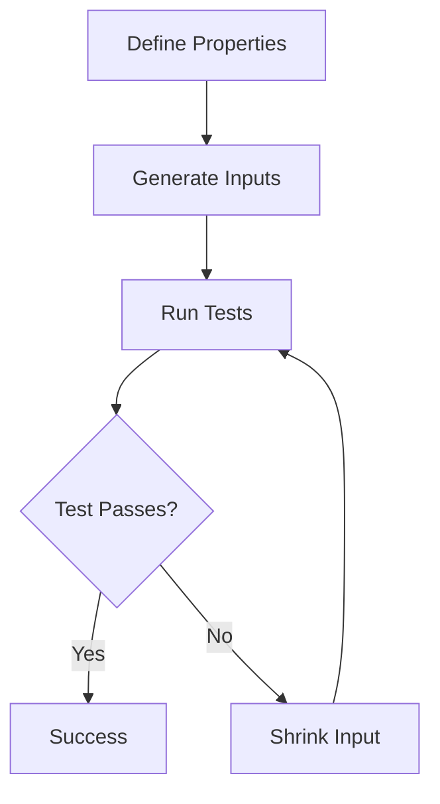

## 12.15 Property-Based Testing with fast-check

In the realm of software testing, ensuring that your code behaves as expected under all circumstances is a challenging yet crucial task. Traditional example-based testing, where specific inputs are tested against expected outputs, often falls short in covering the vast input space. This is where property-based testing comes into play. In this section, we will delve into property-based testing using the fast-check library, exploring its advantages, capabilities, and integration with existing test frameworks.

### What is Property-Based Testing?

Property-based testing is a testing approach where tests are defined based on properties or invariants that should always hold true for a given function or system. Instead of specifying individual test cases, you define general properties and let the testing framework generate a wide range of inputs to verify these properties.

#### Advantages of Property-Based Testing

1. **Comprehensive Coverage**: By generating a wide range of inputs, property-based testing can uncover edge cases that example-based testing might miss.
2. **Reduced Test Maintenance**: Instead of maintaining numerous individual test cases, you define a few properties that cover a broad spectrum of scenarios.
3. **Discovery of Hidden Assumptions**: It helps in identifying implicit assumptions in the code that might not be apparent through example-based testing.
4. **Automatic Test Case Generation**: The testing framework automatically generates test cases, reducing the effort required to write tests.

### Introducing fast-check

[fast-check](https://github.com/dubzzz/fast-check) is a powerful property-based testing library for JavaScript. It allows you to define properties and automatically generates test cases to verify these properties. Fast-check is designed to be easy to integrate with existing test frameworks like Jest, Mocha, and Jasmine.

#### Key Features of fast-check

- **Arbitrary Generation**: Fast-check provides a wide range of arbitraries (random data generators) for generating inputs.
- **Shrinking**: When a test fails, fast-check attempts to minimize the failing input to the simplest form that still causes the failure, aiding in debugging.
- **Custom Arbitraries**: You can define custom arbitraries to generate complex data structures.
- **Integration with Test Frameworks**: Fast-check can be easily integrated with popular test frameworks, allowing you to leverage its capabilities within your existing test suite.

### Defining Properties and Generating Test Cases

Let's explore how to define properties and generate test cases using fast-check.

#### Example: Testing a Sorting Function

Suppose we have a simple sorting function, and we want to test its correctness using property-based testing.

```javascript
// A simple sorting function
function sortArray(arr) {
  return arr.slice().sort((a, b) => a - b);
}
```

To test this function, we can define properties such as:

1. The output array should be sorted.
2. The output array should have the same length as the input array.
3. The output array should contain the same elements as the input array.

Here's how we can implement these properties using fast-check:

```javascript
const fc = require('fast-check');

describe('sortArray', () => {
  it('should return a sorted array', () => {
    fc.assert(
      fc.property(fc.array(fc.integer()), (arr) => {
        const sorted = sortArray(arr);
        // Check if the array is sorted
        for (let i = 0; i < sorted.length - 1; i++) {
          if (sorted[i] > sorted[i + 1]) {
            return false;
          }
        }
        return true;
      })
    );
  });

  it('should return an array of the same length', () => {
    fc.assert(
      fc.property(fc.array(fc.integer()), (arr) => {
        const sorted = sortArray(arr);
        return sorted.length === arr.length;
      })
    );
  });

  it('should return an array with the same elements', () => {
    fc.assert(
      fc.property(fc.array(fc.integer()), (arr) => {
        const sorted = sortArray(arr);
        return arr.every(item => sorted.includes(item)) && sorted.every(item => arr.includes(item));
      })
    );
  });
});
```

### When to Use Property-Based Testing

Property-based testing is particularly useful in scenarios where:

- The input space is large or complex.
- You want to ensure robustness against a wide range of inputs.
- You are dealing with algorithms or functions with well-defined properties.
- You want to uncover edge cases that might not be apparent through example-based testing.

#### Potential Challenges

While property-based testing offers numerous advantages, it also comes with challenges:

- **Defining Properties**: Identifying meaningful properties can be difficult, especially for complex systems.
- **Performance**: Generating a large number of test cases can be computationally expensive.
- **Debugging**: Understanding why a property fails can be challenging, especially with complex inputs.

### Uncovering Edge Cases

One of the significant benefits of property-based testing is its ability to uncover edge cases. By generating a wide range of inputs, fast-check can reveal scenarios that might not be considered during manual test case creation.

#### Example: Edge Case Discovery

Consider a function that calculates the sum of an array. A typical example-based test might not consider edge cases like empty arrays or arrays with negative numbers. Property-based testing can automatically generate such cases.

```javascript
function sumArray(arr) {
  return arr.reduce((sum, num) => sum + num, 0);
}

describe('sumArray', () => {
  it('should handle various edge cases', () => {
    fc.assert(
      fc.property(fc.array(fc.integer()), (arr) => {
        const sum = sumArray(arr);
        // Check if the sum is correct
        return sum === arr.reduce((acc, num) => acc + num, 0);
      })
    );
  });
});
```

### Integration with Existing Test Frameworks

Fast-check can be seamlessly integrated with popular test frameworks like Jest, Mocha, and Jasmine. This allows you to leverage property-based testing within your existing test suite without significant changes.

#### Example: Integrating with Jest

```javascript
const fc = require('fast-check');

test('property-based test with Jest', () => {
  fc.assert(
    fc.property(fc.integer(), fc.integer(), (a, b) => {
      return a + b === b + a; // Commutative property of addition
    })
  );
});
```

### Visualizing Property-Based Testing

To better understand how property-based testing works, let's visualize the process using a flowchart.



**Figure 1**: The flow of property-based testing with fast-check.

### Conclusion

Property-based testing with fast-check offers a powerful approach to testing in JavaScript, enabling you to define properties and automatically generate test cases. This approach can uncover edge cases, reduce test maintenance, and ensure comprehensive coverage. By integrating fast-check with existing test frameworks, you can enhance your testing strategy and improve the robustness of your applications.

### Knowledge Check

To reinforce your understanding of property-based testing with fast-check, try answering the following questions:

## Mastering Property-Based Testing with fast-check



### What is the primary advantage of property-based testing over example-based testing?

- [x] It provides comprehensive coverage by generating a wide range of inputs.
- [ ] It requires fewer resources to execute.
- [ ] It is easier to implement.
- [ ] It eliminates the need for test frameworks.

> **Explanation:** Property-based testing generates a wide range of inputs, providing comprehensive coverage and uncovering edge cases that example-based testing might miss.

### Which library is commonly used for property-based testing in JavaScript?

- [x] fast-check
- [ ] Jest
- [ ] Mocha
- [ ] Jasmine

> **Explanation:** fast-check is a popular library for property-based testing in JavaScript, allowing for automatic test case generation based on defined properties.

### What is the purpose of shrinking in property-based testing?

- [x] To minimize the failing input to the simplest form that still causes the failure.
- [ ] To reduce the number of test cases.
- [ ] To optimize the performance of tests.
- [ ] To eliminate redundant properties.

> **Explanation:** Shrinking helps in debugging by minimizing the failing input to the simplest form that still causes the failure, making it easier to identify the root cause.

### How can fast-check be integrated with existing test frameworks?

- [x] By using its API within the test framework's test functions.
- [ ] By replacing the test framework entirely.
- [ ] By running it as a standalone tool.
- [ ] By converting all tests to property-based tests.

> **Explanation:** fast-check can be integrated with existing test frameworks by using its API within the test framework's test functions, allowing for seamless integration.

### Which of the following is a potential challenge of property-based testing?

- [x] Defining meaningful properties.
- [ ] Generating test reports.
- [ ] Writing test assertions.
- [ ] Setting up the test environment.

> **Explanation:** Defining meaningful properties can be challenging, especially for complex systems, as it requires a deep understanding of the system's behavior.

### What is the role of arbitraries in fast-check?

- [x] They are random data generators used to generate inputs for tests.
- [ ] They are test assertions.
- [ ] They are test reports.
- [ ] They are test frameworks.

> **Explanation:** Arbitraries are random data generators in fast-check used to generate inputs for tests, enabling comprehensive coverage of the input space.

### In which scenarios is property-based testing particularly useful?

- [x] When the input space is large or complex.
- [x] When dealing with algorithms with well-defined properties.
- [ ] When the system is simple and well-understood.
- [ ] When the input space is small and limited.

> **Explanation:** Property-based testing is useful when the input space is large or complex and when dealing with algorithms with well-defined properties, as it ensures robustness against a wide range of inputs.

### What is a key benefit of using fast-check for testing?

- [x] Automatic generation of test cases.
- [ ] Manual test case creation.
- [ ] Simplified test framework setup.
- [ ] Reduced test execution time.

> **Explanation:** fast-check automatically generates test cases based on defined properties, reducing the effort required to write tests and ensuring comprehensive coverage.

### Which of the following is an example of a property that can be tested using fast-check?

- [x] The output array should be sorted.
- [ ] The function should return a specific value for a given input.
- [ ] The test should execute within a certain time limit.
- [ ] The test should not produce any errors.

> **Explanation:** A property such as "the output array should be sorted" can be tested using fast-check, as it defines a general invariant that should hold true for the function.

### True or False: Property-based testing can help uncover hidden assumptions in the code.

- [x] True
- [ ] False

> **Explanation:** True. Property-based testing can help uncover hidden assumptions in the code by generating a wide range of inputs and verifying that properties hold true under all circumstances.



Remember, mastering property-based testing with fast-check is a journey. Keep experimenting, stay curious, and enjoy the process of uncovering new insights about your code!
