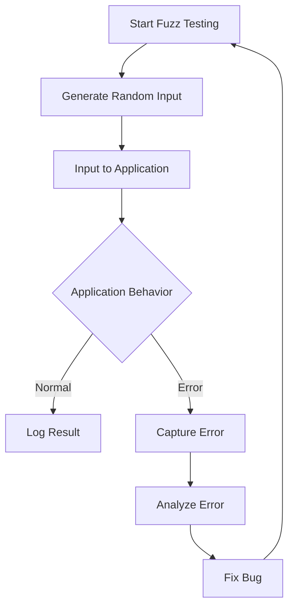

## 12.16 Fuzz Testing Techniques

Fuzz testing, or fuzzing, is a powerful technique used to identify vulnerabilities and unexpected errors in software applications by providing random or semi-random data as input. This method is particularly useful in uncovering edge cases that are not typically covered by traditional testing methods. In this section, we will delve into the intricacies of fuzz testing, its implementation in JavaScript, and the benefits it offers in enhancing the security and robustness of applications.

### What is Fuzz Testing?

Fuzz testing involves automatically generating a large amount of random data and inputting it into a program to find bugs and vulnerabilities. The primary goal is to discover unexpected behavior, crashes, or security loopholes that could be exploited by malicious users. By simulating random user inputs, fuzz testing helps developers identify weaknesses that might not be apparent during regular testing.

### Purpose of Fuzz Testing

The main objectives of fuzz testing are:

- **Uncovering Hidden Bugs**: By providing unexpected inputs, fuzz testing can reveal bugs that are not detected by standard testing techniques.
- **Enhancing Security**: Fuzz testing is particularly effective in identifying security vulnerabilities, such as buffer overflows and injection attacks.
- **Improving Robustness**: Applications become more robust as they are tested against a wide range of inputs, ensuring they handle unexpected scenarios gracefully.

### Tools and Libraries for Fuzz Testing in JavaScript

Several tools and libraries can be used to perform fuzz testing in JavaScript applications. Here are some popular ones:

- **Fuzzilli**: A JavaScript engine fuzzer designed to find bugs in JavaScript engines by generating random JavaScript code.
- **Jest**: While primarily a testing framework, Jest can be extended with plugins to perform fuzz testing.
- **jsfuzz**: A lightweight fuzzing library for JavaScript that allows developers to create fuzz tests with minimal setup.
- **Atheris**: A Python-based fuzzer that can be used with JavaScript through Node.js bindings.

### Implementing Simple Fuzz Tests

Let's explore how to implement a basic fuzz test using the `jsfuzz` library. This example will demonstrate how to test a simple function that processes user input.

```javascript
// Import the jsfuzz library
const jsfuzz = require('jsfuzz');

// A simple function to test
function processInput(input) {
  if (typeof input !== 'string') {
    throw new Error('Invalid input type');
  }
  return input.toUpperCase();
}

// Fuzz test for the processInput function
jsfuzz.fuzz(() => {
  const randomInput = jsfuzz.randomString();
  try {
    processInput(randomInput);
  } catch (error) {
    console.error('Error processing input:', error.message);
  }
});
```

In this example, the `jsfuzz.randomString()` function generates random strings, which are then passed to the `processInput` function. The test checks if the function can handle various unexpected inputs without crashing.

### Benefits of Fuzz Testing

Fuzz testing offers several advantages, particularly in terms of security and robustness:

- **Security Enhancement**: By identifying vulnerabilities early, fuzz testing helps prevent potential exploits and attacks.
- **Increased Code Coverage**: Fuzz testing can cover edge cases that are often missed by manual testing.
- **Automated Testing**: Fuzz testing can be automated, allowing for continuous testing and integration into CI/CD pipelines.

### Considerations for Fuzz Testing

While fuzz testing is a valuable tool, there are several considerations to keep in mind:

- **Test Scope**: Define the scope of fuzz testing clearly to focus on critical areas of the application.
- **Result Analysis**: Analyzing the results of fuzz tests can be challenging due to the large volume of data generated. It's essential to have a strategy for identifying and prioritizing issues.
- **Resource Requirements**: Fuzz testing can be resource-intensive, requiring significant computational power and time.

### Potential Drawbacks

Despite its benefits, fuzz testing has some potential drawbacks:

- **False Positives**: Fuzz testing may produce false positives, where non-issues are flagged as bugs.
- **Complex Setup**: Setting up a fuzz testing environment can be complex, especially for large applications.
- **Limited Context**: Fuzz testing may not provide detailed context about the root cause of a bug, requiring additional investigation.

### Visualizing Fuzz Testing Workflow

To better understand the fuzz testing process, let's visualize the workflow using a Mermaid.js diagram:



**Diagram Description**: This flowchart illustrates the fuzz testing workflow, starting with generating random input, feeding it into the application, and observing the behavior. Errors are captured and analyzed, leading to bug fixes and further testing.

### Try It Yourself

To get hands-on experience with fuzz testing, try modifying the code example provided earlier. Experiment with different types of random data, such as numbers or objects, and observe how the `processInput` function handles them. This exercise will help you understand the importance of handling unexpected inputs gracefully.

### References and Further Reading

- [MDN Web Docs: Fuzz Testing](https://developer.mozilla.org/en-US/docs/Glossary/Fuzz_testing)
- [OWASP: Fuzz Testing](https://owasp.org/www-community/Fuzzing)
- [Jest Documentation](https://jestjs.io/docs/getting-started)
- [jsfuzz GitHub Repository](https://github.com/fuzzitdev/jsfuzz)

### Knowledge Check

To reinforce your understanding of fuzz testing, consider the following questions and exercises:

- What are the primary goals of fuzz testing?
- How does fuzz testing enhance application security?
- Implement a fuzz test for a function that parses JSON data. What challenges do you encounter?
- Analyze the results of a fuzz test and identify potential areas for improvement in your application.

### Embrace the Journey

Remember, fuzz testing is just one tool in your testing arsenal. As you continue to explore different testing techniques, you'll gain a deeper understanding of how to build secure and robust applications. Keep experimenting, stay curious, and enjoy the journey!

## Quiz: Mastering Fuzz Testing Techniques in JavaScript



### What is the primary purpose of fuzz testing?

- [x] To uncover hidden bugs and vulnerabilities
- [ ] To improve application performance
- [ ] To enhance user interface design
- [ ] To optimize database queries

> **Explanation:** Fuzz testing is primarily used to uncover hidden bugs and vulnerabilities by providing random data inputs to the application.

### Which of the following is a popular JavaScript fuzz testing library?

- [x] jsfuzz
- [ ] Mocha
- [ ] Chai
- [ ] Selenium

> **Explanation:** jsfuzz is a lightweight fuzzing library for JavaScript, designed to help developers create fuzz tests.

### What is a potential drawback of fuzz testing?

- [x] It may produce false positives
- [ ] It improves code readability
- [ ] It reduces application size
- [ ] It enhances user experience

> **Explanation:** Fuzz testing may produce false positives, where non-issues are flagged as bugs, requiring further investigation.

### How can fuzz testing enhance application security?

- [x] By identifying vulnerabilities early
- [ ] By optimizing code execution
- [ ] By improving user interface design
- [ ] By reducing server load

> **Explanation:** Fuzz testing enhances application security by identifying vulnerabilities early, preventing potential exploits and attacks.

### What is a key consideration when implementing fuzz testing?

- [x] Defining the test scope clearly
- [ ] Reducing code complexity
- [ ] Enhancing visual design
- [ ] Optimizing database queries

> **Explanation:** Defining the test scope clearly is crucial to focus on critical areas of the application during fuzz testing.

### Which tool can be used for fuzz testing JavaScript engines?

- [x] Fuzzilli
- [ ] Jest
- [ ] Mocha
- [ ] Chai

> **Explanation:** Fuzzilli is a JavaScript engine fuzzer designed to find bugs in JavaScript engines by generating random JavaScript code.

### What is the main challenge in analyzing fuzz test results?

- [x] Identifying and prioritizing issues
- [ ] Enhancing code readability
- [ ] Reducing application size
- [ ] Improving user interface design

> **Explanation:** Analyzing fuzz test results can be challenging due to the large volume of data generated, requiring a strategy for identifying and prioritizing issues.

### What type of input does fuzz testing provide to applications?

- [x] Random or semi-random data
- [ ] Optimized queries
- [ ] User interface enhancements
- [ ] Database schemas

> **Explanation:** Fuzz testing provides random or semi-random data as input to applications to uncover unexpected behavior and vulnerabilities.

### What is a benefit of automating fuzz testing?

- [x] Continuous testing and integration into CI/CD pipelines
- [ ] Improved application aesthetics
- [ ] Reduced server load
- [ ] Enhanced user experience

> **Explanation:** Automating fuzz testing allows for continuous testing and integration into CI/CD pipelines, ensuring ongoing application security and robustness.

### Fuzz testing can help identify edge cases that are often missed by manual testing.

- [x] True
- [ ] False

> **Explanation:** Fuzz testing can cover edge cases that are often missed by manual testing, increasing code coverage and robustness.


