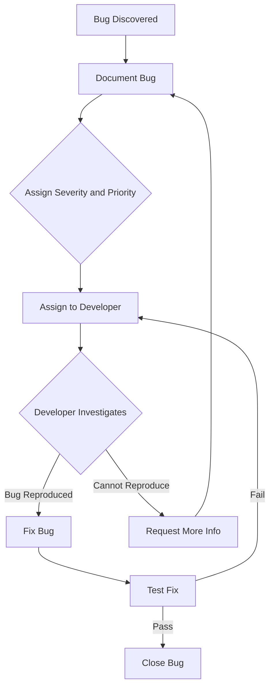

## 12.17 Regression Testing and Bug Tracking

In the fast-paced world of software development, ensuring that new code changes do not inadvertently break existing functionality is crucial. Regression testing and bug tracking are two fundamental practices that help maintain software quality and stability. In this section, we will explore what regression testing is, why it's critical, and how to effectively track and manage bugs.

### Understanding Regression Testing

**Regression Testing** is a type of software testing that ensures that recent code changes have not adversely affected existing features. Its primary goal is to catch bugs that may have been introduced inadvertently when new code is added or existing code is modified.

#### Why Regression Testing is Critical

1. **Preserving Functionality**: As software evolves, maintaining the integrity of existing features is essential. Regression testing helps ensure that new changes do not disrupt the current functionality.

2. **Enhancing Code Quality**: By identifying defects early, regression testing contributes to higher code quality and reduces the risk of defects reaching production.

3. **Facilitating Continuous Integration**: In a CI/CD environment, regression tests are automated to provide quick feedback on code changes, allowing developers to address issues promptly.

4. **Reducing Costs**: Detecting and fixing bugs early in the development cycle is more cost-effective than addressing them after deployment.

### Strategies for Maintaining a Comprehensive Regression Test Suite

To effectively implement regression testing, it's important to maintain a comprehensive test suite that covers all critical aspects of the application.

#### 1. **Identify Critical Test Cases**

Focus on test cases that cover core functionalities, frequently used features, and areas prone to defects. Prioritize tests based on the impact and likelihood of failure.

#### 2. **Automate Regression Tests**

Automating regression tests ensures they are executed consistently and efficiently. Use tools like [Selenium](https://www.selenium.dev/), [Cypress](https://www.cypress.io/), or [TestCafe](https://devexpress.github.io/testcafe/) to automate browser-based tests.

#### 3. **Regularly Update Test Suites**

As the application evolves, update the test suite to reflect changes in functionality. Remove obsolete tests and add new ones to cover recent features.

#### 4. **Integrate with CI/CD Pipelines**

Integrate regression tests into your CI/CD pipeline to automatically run tests on every code commit. This ensures immediate feedback and helps maintain code quality.

#### 5. **Use Version Control for Test Cases**

Store test cases in a version control system like Git to track changes and collaborate effectively with the team.

### Integrating Regression Tests into CI Pipelines

Continuous Integration (CI) is a development practice where developers integrate code into a shared repository frequently. Each integration is verified by an automated build and test process, which includes regression testing.

#### Steps to Integrate Regression Tests into CI Pipelines

1. **Set Up a CI Server**: Use CI servers like [Jenkins](https://www.jenkins.io/), [GitLab CI](https://about.gitlab.com/stages-devops-lifecycle/continuous-integration/), or [CircleCI](https://circleci.com/) to automate the build and test process.

2. **Configure Automated Test Execution**: Define scripts to execute regression tests automatically whenever new code is pushed to the repository.

3. **Monitor Test Results**: Use dashboards and reports to monitor test results and identify failures quickly.

4. **Implement Test Parallelization**: Run tests in parallel to reduce execution time and provide faster feedback.

5. **Set Up Notifications**: Configure notifications to alert developers of test failures, enabling prompt investigation and resolution.

### Documenting Bugs and Fixes

Effective bug tracking involves documenting bugs thoroughly and tracking their resolution. This practice not only helps in fixing current issues but also provides valuable insights for future development.

#### Key Elements of Bug Documentation

1. **Bug Description**: Provide a clear and concise description of the bug, including steps to reproduce, expected behavior, and actual behavior.

2. **Severity and Priority**: Assign severity and priority levels to help the team focus on critical issues first.

3. **Environment Details**: Include information about the environment where the bug was observed, such as browser version, operating system, and device type.

4. **Screenshots and Logs**: Attach screenshots, logs, or any other relevant artifacts to help developers understand the issue better.

5. **Resolution Details**: Document the steps taken to fix the bug and any changes made to the codebase.

### Tools for Bug Tracking

Several tools are available to help teams track and manage bugs effectively. Here are some popular options:

- **[JIRA](https://www.atlassian.com/software/jira)**: A widely used tool for bug tracking and project management, offering features like customizable workflows, dashboards, and reporting.

- **[Bugzilla](https://www.bugzilla.org/)**: An open-source bug tracking system that provides advanced search capabilities, email notifications, and integration with version control systems.

- **[Trello](https://trello.com/)**: A flexible project management tool that can be adapted for bug tracking using boards, lists, and cards.

- **[GitHub Issues](https://github.com/features/issues)**: Integrated with GitHub repositories, it allows developers to track bugs and feature requests directly within the codebase.

### Best Practices for Communication and Resolution Workflows

Effective communication and well-defined workflows are essential for resolving bugs efficiently. Here are some best practices:

1. **Establish Clear Communication Channels**: Use tools like [Slack](https://slack.com/) or [Microsoft Teams](https://www.microsoft.com/en-us/microsoft-teams/group-chat-software) for real-time communication and collaboration.

2. **Define Roles and Responsibilities**: Clearly define roles and responsibilities for team members involved in bug tracking and resolution.

3. **Implement a Prioritization System**: Use a prioritization system to focus on high-impact bugs first, ensuring critical issues are addressed promptly.

4. **Conduct Regular Bug Triage Meetings**: Hold regular meetings to review and prioritize bugs, ensuring alignment among team members.

5. **Encourage Collaboration**: Foster a collaborative environment where developers, testers, and stakeholders work together to resolve issues.

6. **Track Bug Resolution Progress**: Use dashboards and reports to track the progress of bug resolution and identify bottlenecks.

### Code Example: Automating Regression Tests with Cypress

Let's explore a simple example of automating a regression test using Cypress, a popular end-to-end testing framework for web applications.

```javascript
// cypress/integration/sample_spec.js

describe('Regression Test: Login Functionality', () => {
  beforeEach(() => {
    // Visit the login page before each test
    cy.visit('https://example.com/login');
  });

  it('should successfully log in with valid credentials', () => {
    // Enter username
    cy.get('input[name="username"]').type('testuser');

    // Enter password
    cy.get('input[name="password"]').type('password123');

    // Click the login button
    cy.get('button[type="submit"]').click();

    // Verify successful login by checking the URL
    cy.url().should('include', '/dashboard');

    // Verify the presence of a welcome message
    cy.contains('Welcome, testuser').should('be.visible');
  });

  it('should display an error message for invalid credentials', () => {
    // Enter invalid username
    cy.get('input[name="username"]').type('invaliduser');

    // Enter invalid password
    cy.get('input[name="password"]').type('wrongpassword');

    // Click the login button
    cy.get('button[type="submit"]').click();

    // Verify the presence of an error message
    cy.contains('Invalid username or password').should('be.visible');
  });
});
```

**Try It Yourself**: Modify the test to include additional scenarios, such as testing the "Forgot Password" functionality or verifying the presence of specific UI elements on the login page.

### Visualizing the Bug Tracking Workflow

Below is a Mermaid.js diagram illustrating a typical bug tracking workflow, from bug discovery to resolution.



**Diagram Description**: This flowchart represents the typical steps involved in tracking and resolving a bug, from initial discovery to closure.

### Knowledge Check

- What is the primary goal of regression testing?
- Name three tools commonly used for bug tracking.
- Why is it important to integrate regression tests into CI pipelines?
- Describe the key elements of effective bug documentation.
- What are some best practices for communication in bug resolution workflows?

### Summary

Regression testing and bug tracking are essential practices for maintaining software quality and stability. By implementing comprehensive regression test suites, integrating tests into CI pipelines, and using effective bug tracking tools, teams can ensure that new code changes do not introduce regressions and that bugs are resolved efficiently. Remember, this is just the beginning. As you progress, you'll build more robust testing and tracking processes. Keep experimenting, stay curious, and enjoy the journey!

## Mastering Regression Testing and Bug Tracking



### What is the primary goal of regression testing?

- [x] To ensure new code changes do not break existing functionality
- [ ] To test new features only
- [ ] To perform load testing
- [ ] To check for security vulnerabilities

> **Explanation:** Regression testing aims to ensure that recent code changes have not adversely affected existing features.

### Which tool is commonly used for bug tracking?

- [x] JIRA
- [ ] Photoshop
- [ ] Blender
- [ ] Illustrator

> **Explanation:** JIRA is a widely used tool for bug tracking and project management.

### Why is it important to integrate regression tests into CI pipelines?

- [x] To provide immediate feedback on code changes
- [ ] To delay the testing process
- [ ] To increase manual testing efforts
- [ ] To reduce automation

> **Explanation:** Integrating regression tests into CI pipelines ensures immediate feedback on code changes, helping maintain code quality.

### What is a key element of effective bug documentation?

- [x] Clear and concise bug description
- [ ] Vague details
- [ ] Random screenshots
- [ ] Unrelated logs

> **Explanation:** A clear and concise bug description is essential for effective bug documentation.

### Which practice helps in resolving bugs efficiently?

- [x] Regular bug triage meetings
- [ ] Ignoring bugs
- [ ] Random assignments
- [ ] Delaying resolution

> **Explanation:** Regular bug triage meetings help in reviewing and prioritizing bugs, ensuring efficient resolution.

### What is a benefit of automating regression tests?

- [x] Consistent and efficient test execution
- [ ] Increased manual effort
- [ ] Slower feedback
- [ ] Less reliable results

> **Explanation:** Automating regression tests ensures consistent and efficient test execution.

### Which tool can be used for automating browser-based tests?

- [x] Cypress
- [ ] Excel
- [ ] Word
- [ ] PowerPoint

> **Explanation:** Cypress is a popular tool for automating browser-based tests.

### What should be included in bug documentation?

- [x] Steps to reproduce the bug
- [ ] Personal opinions
- [ ] Irrelevant information
- [ ] Random thoughts

> **Explanation:** Steps to reproduce the bug are crucial for effective bug documentation.

### What is a common practice for maintaining a regression test suite?

- [x] Regularly updating test cases
- [ ] Ignoring obsolete tests
- [ ] Avoiding new tests
- [ ] Randomly selecting tests

> **Explanation:** Regularly updating test cases ensures the regression test suite remains comprehensive and relevant.

### True or False: Bug tracking tools are only used by developers.

- [ ] True
- [x] False

> **Explanation:** Bug tracking tools are used by developers, testers, and other stakeholders involved in the software development process.




