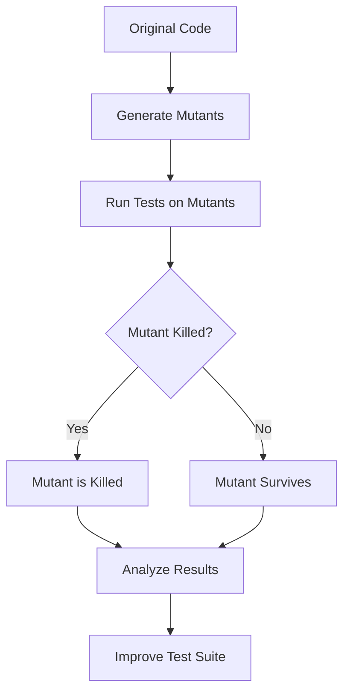

## 12.18 Mutation Testing with Stryker

In the realm of software testing, ensuring the robustness and reliability of your code is paramount. Mutation testing emerges as a powerful technique to assess the effectiveness of your test suites. In this section, we will delve into mutation testing, introduce Stryker—a leading mutation testing framework for JavaScript—and explore how it can be leveraged to enhance your test coverage and effectiveness.

### What is Mutation Testing?

Mutation testing is a method used to evaluate the quality of a test suite. It involves making small, deliberate changes to the code, known as "mutations," and then running the test suite to see if it detects these changes. The primary goal is to identify weaknesses in the test suite by determining if it can catch these intentional errors.

#### How Mutation Testing Works

1. **Mutant Generation**: The process begins by creating mutants, which are variations of the original code. Each mutant contains a small change, such as altering a conditional statement or modifying an arithmetic operator.

2. **Test Execution**: The test suite is executed against each mutant. If a test fails, the mutant is considered "killed," indicating that the test suite successfully detected the change.

3. **Analysis**: If a mutant survives (i.e., the tests pass despite the change), it suggests a potential gap in the test coverage. The surviving mutants highlight areas where the test suite may need improvement.

### Introducing Stryker

Stryker is a mutation testing framework designed specifically for JavaScript and TypeScript. It automates the mutation testing process, providing developers with insights into the effectiveness of their test suites.

#### Key Features of Stryker

- **Automated Mutation Generation**: Stryker automatically generates mutants for your codebase, saving time and effort.
- **Comprehensive Reporting**: It provides detailed reports on which mutants were killed and which survived, helping you pinpoint weaknesses in your tests.
- **Integration with Popular Testing Frameworks**: Stryker integrates seamlessly with testing frameworks like Jest, Mocha, and Jasmine, making it easy to incorporate into existing workflows.
- **Configurable Mutators**: You can customize the types of mutations Stryker applies, tailoring the process to your specific needs.

### Running Mutation Tests with Stryker

Let's walk through the process of setting up and running mutation tests on a JavaScript codebase using Stryker.

#### Step 1: Installation

First, ensure you have Node.js installed, then add Stryker to your project:

```bash
npm install --save-dev @stryker-mutator/core
```

#### Step 2: Configuration

Create a configuration file for Stryker, typically named `stryker.conf.js`. This file specifies the settings for your mutation tests, including the files to mutate and the test framework to use.

```javascript
module.exports = {
  mutate: ["src/**/*.js"],
  testRunner: "jest",
  reporters: ["clear-text", "progress"],
  coverageAnalysis: "off"
};
```

#### Step 3: Running Stryker

Execute Stryker using the following command:

```bash
npx stryker run
```

Stryker will generate mutants, run your test suite against them, and provide a report detailing the results.

### Measuring Test Quality with Mutation Testing

Mutation testing offers a unique perspective on test quality by revealing how well your tests can detect changes in the code. A high mutation score—indicating a high percentage of killed mutants—suggests a robust test suite. Conversely, surviving mutants highlight areas for improvement.

#### Performance Impact

While mutation testing is a powerful tool, it can be resource-intensive. Running tests against numerous mutants may increase execution time, especially for large codebases. Consider running mutation tests as part of a continuous integration pipeline or during off-peak hours to mitigate performance impacts.

#### Interpreting Results

Understanding the results of mutation testing is crucial. Not all surviving mutants indicate a problem; some may be equivalent mutants, meaning they don't affect the program's behavior. Use the insights from Stryker's reports to refine your tests, focusing on areas with genuine gaps in coverage.

### Improving Test Coverage and Effectiveness

Mutation testing with Stryker encourages a proactive approach to test development. By identifying weaknesses, you can enhance your test suite, ensuring it effectively covers edge cases and potential errors.

#### Best Practices

- **Regularly Run Mutation Tests**: Incorporate mutation testing into your regular testing routine to continuously assess and improve test quality.
- **Focus on Critical Code Paths**: Prioritize mutation testing for critical areas of your codebase where reliability is paramount.
- **Iterate and Refine**: Use the feedback from mutation testing to iteratively improve your tests, addressing any identified weaknesses.

### Try It Yourself

Experiment with mutation testing by modifying the configuration or the codebase. Try adding new test cases to kill surviving mutants or adjust the mutators to explore different types of mutations.

### Visualizing the Mutation Testing Process

To better understand the mutation testing workflow, let's visualize the process using a flowchart.



**Figure 1**: The mutation testing process involves generating mutants, running tests, analyzing results, and improving the test suite.

### Conclusion

Mutation testing with Stryker is a powerful technique for enhancing the quality and effectiveness of your JavaScript test suites. By identifying gaps in test coverage, it empowers developers to build more robust and reliable code. Embrace mutation testing as a regular part of your testing strategy to ensure your codebase is well-protected against potential errors.

### Knowledge Check

To reinforce your understanding of mutation testing with Stryker, try answering the following questions:

## Mastering Mutation Testing with Stryker



### What is the primary goal of mutation testing?

- [x] To assess the effectiveness of a test suite
- [ ] To increase code coverage
- [ ] To reduce test execution time
- [ ] To simplify code

> **Explanation:** Mutation testing aims to evaluate how well a test suite can detect changes in the code, highlighting areas for improvement.

### What does a "killed" mutant indicate?

- [x] The test suite detected the change
- [ ] The test suite missed the change
- [ ] The code is error-free
- [ ] The mutation was invalid

> **Explanation:** A "killed" mutant means the test suite successfully identified the change, indicating effective test coverage.

### Which tool is commonly used for mutation testing in JavaScript?

- [x] Stryker
- [ ] Mocha
- [ ] Jasmine
- [ ] ESLint

> **Explanation:** Stryker is a popular mutation testing framework for JavaScript, providing automated mutation generation and analysis.

### What is a potential drawback of mutation testing?

- [x] Increased test execution time
- [ ] Reduced code quality
- [ ] Incomplete test coverage
- [ ] Lack of integration with CI/CD pipelines

> **Explanation:** Mutation testing can be resource-intensive, leading to longer test execution times, especially for large codebases.

### How can mutation testing improve test suites?

- [x] By identifying gaps in test coverage
- [ ] By reducing the number of test cases
- [ ] By simplifying test logic
- [ ] By automating test writing

> **Explanation:** Mutation testing highlights areas where the test suite may be lacking, allowing developers to enhance coverage and effectiveness.

### What is an "equivalent mutant"?

- [x] A mutant that does not affect program behavior
- [ ] A mutant that is always killed
- [ ] A mutant that causes a test failure
- [ ] A mutant that survives all tests

> **Explanation:** An equivalent mutant is one that does not change the program's behavior, making it indistinguishable from the original code.

### Which of the following is a key feature of Stryker?

- [x] Automated mutation generation
- [ ] Manual test case creation
- [ ] Code refactoring
- [ ] Performance optimization

> **Explanation:** Stryker automates the generation of mutants, streamlining the mutation testing process.

### What should you do if a mutant survives?

- [x] Investigate and improve the test suite
- [ ] Ignore it as a false positive
- [ ] Remove the mutant manually
- [ ] Increase code complexity

> **Explanation:** Surviving mutants indicate potential gaps in the test suite, prompting further investigation and improvement.

### How does mutation testing differ from traditional code coverage?

- [x] It evaluates test effectiveness, not just coverage
- [ ] It focuses on line coverage
- [ ] It reduces the number of tests needed
- [ ] It simplifies test execution

> **Explanation:** Unlike traditional code coverage, mutation testing assesses how well tests detect changes, providing deeper insights into test quality.

### True or False: Mutation testing can be used to automate test writing.

- [ ] True
- [x] False

> **Explanation:** Mutation testing does not automate test writing; it evaluates the effectiveness of existing tests by introducing changes to the code.



Remember, this is just the beginning. As you progress, you'll build more complex and interactive test suites. Keep experimenting, stay curious, and enjoy the journey!
