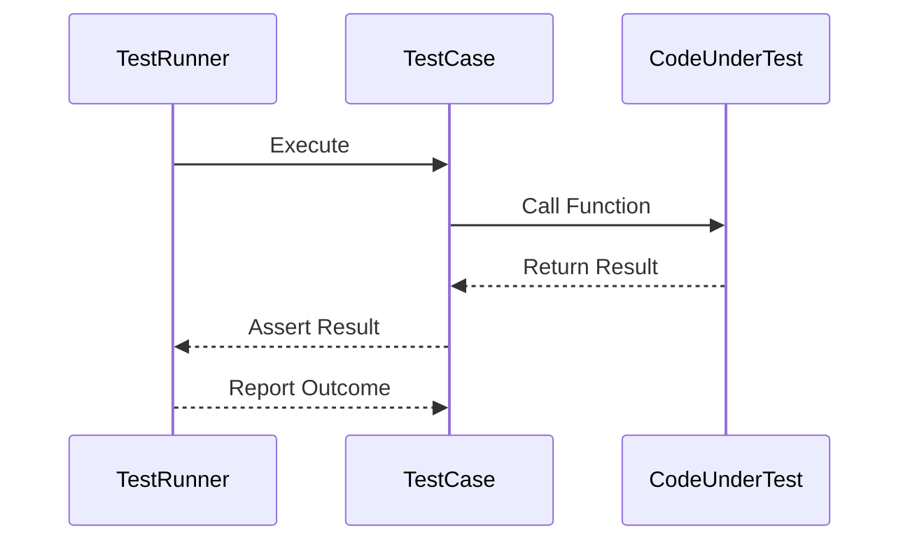

## 12.2 Unit Testing with Jest and Mocha

Unit testing is a fundamental practice in software development that ensures individual components of a program work as expected. In the JavaScript ecosystem, Jest and Mocha are two of the most popular frameworks for unit testing. This section will guide you through setting up these frameworks, writing test cases, and leveraging their powerful features to enhance your testing strategy.

### Overview of Jest and Mocha

#### Jest

[Jest](https://jestjs.io/) is a delightful JavaScript testing framework with a focus on simplicity. It is maintained by Facebook and is widely used in the React ecosystem. Jest provides a complete and ready-to-use solution for testing, including a test runner, assertion library, and built-in mocking capabilities.

**Key Features of Jest:**

- **Zero Configuration:** Jest requires minimal setup, making it easy to start testing quickly.
- **Built-in Mocking:** Jest includes powerful mocking capabilities, allowing you to mock functions, modules, and timers.
- **Snapshot Testing:** Capture the state of your UI components and ensure they do not change unexpectedly.
- **Code Coverage:** Jest can generate code coverage reports, helping you understand which parts of your code are tested.

#### Mocha

[Mocha](https://mochajs.org/) is a flexible JavaScript test framework running on Node.js and in the browser. It provides a robust set of features for asynchronous testing and is often paired with other libraries for assertions and mocking.

**Key Features of Mocha:**

- **Flexibility:** Mocha allows you to choose your assertion library (e.g., Chai) and mocking tools (e.g., Sinon).
- **Asynchronous Testing:** Mocha provides excellent support for testing asynchronous code.
- **Customizable Reporters:** Choose from a variety of reporters to display test results in different formats.
- **Browser Support:** Mocha can be used for testing in both Node.js and browser environments.

### Setting Up Jest and Mocha

#### Setting Up Jest

To get started with Jest, you need to have Node.js and npm installed on your system. Follow these steps to set up Jest in your project:

1. **Initialize Your Project:**

   ```bash
   npm init -y
   ```

2. **Install Jest:**

   ```bash
   npm install --save-dev jest
   ```

3. **Configure Jest:**

   Add the following script to your `package.json` file:

   ```json
   "scripts": {
     "test": "jest"
   }
   ```

4. **Create a Test File:**

   Create a file named `sum.test.js` in your project directory:

   ```javascript
   // sum.test.js
   const sum = (a, b) => a + b;

   test('adds 1 + 2 to equal 3', () => {
     expect(sum(1, 2)).toBe(3);
   });
   ```

5. **Run Your Tests:**

   Execute the following command to run your tests:

   ```bash
   npm test
   ```

#### Setting Up Mocha

Mocha requires a bit more setup compared to Jest, as it does not include an assertion library by default. Here's how to set up Mocha with Chai for assertions:

1. **Initialize Your Project:**

   ```bash
   npm init -y
   ```

2. **Install Mocha and Chai:**

   ```bash
   npm install --save-dev mocha chai
   ```

3. **Configure Mocha:**

   Add the following script to your `package.json` file:

   ```json
   "scripts": {
     "test": "mocha"
   }
   ```

4. **Create a Test File:**

   Create a file named `sum.test.js` in your project directory:

   ```javascript
   // sum.test.js
   const chai = require('chai');
   const expect = chai.expect;

   const sum = (a, b) => a + b;

   describe('Sum Function', () => {
     it('should add 1 + 2 to equal 3', () => {
       expect(sum(1, 2)).to.equal(3);
     });
   });
   ```

5. **Run Your Tests:**

   Execute the following command to run your tests:

   ```bash
   npm test
   ```

### Writing Test Cases and Assertions

Writing effective test cases is crucial for ensuring the reliability of your code. Both Jest and Mocha provide powerful tools for writing assertions and organizing test cases.

#### Writing Test Cases in Jest

In Jest, test cases are defined using the `test` or `it` function. Assertions are made using Jest's built-in `expect` function.

```javascript
// math.test.js
const multiply = (a, b) => a * b;

test('multiplies 2 * 3 to equal 6', () => {
  expect(multiply(2, 3)).toBe(6);
});
```

#### Writing Test Cases in Mocha

In Mocha, test cases are organized using `describe` and `it` blocks. Assertions are made using an assertion library like Chai.

```javascript
// math.test.js
const chai = require('chai');
const expect = chai.expect;

const multiply = (a, b) => a * b;

describe('Multiply Function', () => {
  it('should multiply 2 * 3 to equal 6', () => {
    expect(multiply(2, 3)).to.equal(6);
  });
});
```

### Test Runners, Reporters, and Watch Modes

#### Test Runners

Both Jest and Mocha come with their own test runners. Jest's test runner is built-in, while Mocha requires you to run tests using the `mocha` command.

#### Reporters

Reporters are used to display test results in a readable format. Jest includes a default reporter, but you can customize it using options like `--verbose`. Mocha allows you to choose from a variety of reporters, such as `spec`, `dot`, and `nyan`.

```bash
# Running Jest with verbose output
npm test -- --verbose

# Running Mocha with the spec reporter
mocha --reporter spec
```

#### Watch Modes

Watch mode is a feature that automatically reruns tests when files change. Jest includes a built-in watch mode, while Mocha requires an additional package like `nodemon` to achieve similar functionality.

```bash
# Running Jest in watch mode
npm test -- --watch

# Running Mocha with nodemon
npx nodemon --exec "npm test"
```

### Comparing Features of Jest and Mocha

#### Built-in Mocking and Coverage Tools

- **Jest:** Jest includes built-in mocking capabilities, allowing you to mock functions, modules, and timers without additional libraries. It also provides a built-in code coverage tool that generates detailed reports.

- **Mocha:** Mocha does not include built-in mocking or coverage tools. You can use libraries like Sinon for mocking and Istanbul for code coverage.

#### Snapshot Testing

- **Jest:** Supports snapshot testing out of the box, making it easy to test UI components and ensure they do not change unexpectedly.

- **Mocha:** Does not support snapshot testing natively, but you can use third-party libraries to achieve similar functionality.

### Best Practices for Effective Unit Testing

1. **Write Clear and Concise Tests:** Ensure each test case is focused on a single functionality or behavior.

2. **Use Descriptive Test Names:** Test names should clearly describe the expected behavior or outcome.

3. **Mock External Dependencies:** Use mocking to isolate the unit of code being tested and avoid side effects.

4. **Keep Tests Independent:** Ensure tests do not depend on each other to prevent cascading failures.

5. **Run Tests Frequently:** Integrate tests into your development workflow to catch issues early.

6. **Measure Code Coverage:** Use code coverage tools to identify untested parts of your codebase.

7. **Refactor Tests as Needed:** Keep your test suite maintainable by refactoring tests alongside your code.

### Try It Yourself

Experiment with the code examples provided in this section. Try modifying the functions being tested or the test cases themselves to see how changes affect the test outcomes. This hands-on approach will deepen your understanding of unit testing with Jest and Mocha.

### Visualizing the Testing Process

Below is a sequence diagram illustrating the interaction between a test runner, test cases, and the code under test:



### References and Links

- [Jest Official Documentation](https://jestjs.io/docs/en/getting-started)
- [Mocha Official Documentation](https://mochajs.org/#getting-started)
- [Chai Assertion Library](https://www.chaijs.com/)
- [Sinon.js for Mocking](https://sinonjs.org/)
- [Istanbul Code Coverage Tool](https://istanbul.js.org/)

### Knowledge Check

To reinforce your understanding of unit testing with Jest and Mocha, try answering the following questions:

## Quiz: Mastering Unit Testing with Jest and Mocha



### What is the primary purpose of unit testing?

- [x] To verify that individual components of a program work as expected
- [ ] To test the entire application as a whole
- [ ] To ensure the application is free of bugs
- [ ] To optimize the performance of the application

> **Explanation:** Unit testing focuses on verifying the functionality of individual components or units of a program.

### Which of the following is a key feature of Jest?

- [x] Built-in mocking capabilities
- [ ] Requires an external assertion library
- [ ] Does not support snapshot testing
- [ ] Only works with Node.js

> **Explanation:** Jest includes built-in mocking capabilities, making it easy to mock functions and modules.

### How do you run tests in Jest?

- [x] Using the `npm test` command
- [ ] Using the `jest` command directly
- [ ] Using the `mocha` command
- [ ] Using the `chai` command

> **Explanation:** Tests in Jest are typically run using the `npm test` command, which is configured in the `package.json` file.

### What additional library is commonly used with Mocha for assertions?

- [x] Chai
- [ ] Jest
- [ ] Sinon
- [ ] Istanbul

> **Explanation:** Chai is a popular assertion library often used with Mocha to write test assertions.

### Which feature is unique to Jest compared to Mocha?

- [x] Snapshot testing
- [ ] Asynchronous testing support
- [ ] Customizable reporters
- [ ] Browser support

> **Explanation:** Snapshot testing is a unique feature of Jest that allows capturing and comparing the state of UI components.

### What is the purpose of using watch mode in testing?

- [x] To automatically rerun tests when files change
- [ ] To run tests in a browser environment
- [ ] To generate code coverage reports
- [ ] To mock external dependencies

> **Explanation:** Watch mode automatically reruns tests whenever files change, providing immediate feedback during development.

### Which tool is used for code coverage in Mocha?

- [x] Istanbul
- [ ] Jest
- [ ] Chai
- [ ] Sinon

> **Explanation:** Istanbul is commonly used with Mocha to generate code coverage reports.

### What is a best practice for writing unit tests?

- [x] Keep tests independent and focused on a single functionality
- [ ] Write tests that depend on each other
- [ ] Avoid using mocks to simplify tests
- [ ] Run tests only before deployment

> **Explanation:** Keeping tests independent and focused ensures they are reliable and easy to maintain.

### Which command is used to run Mocha tests with a specific reporter?

- [x] `mocha --reporter spec`
- [ ] `npm test -- --watch`
- [ ] `jest --reporter spec`
- [ ] `chai --reporter spec`

> **Explanation:** The `mocha --reporter spec` command runs Mocha tests with the spec reporter.

### True or False: Jest requires an external library for mocking.

- [ ] True
- [x] False

> **Explanation:** Jest includes built-in mocking capabilities, so no external library is needed for mocking.



Remember, mastering unit testing is a journey. As you continue to practice and explore, you'll gain deeper insights into writing effective tests and maintaining high-quality code. Keep experimenting, stay curious, and enjoy the process!
