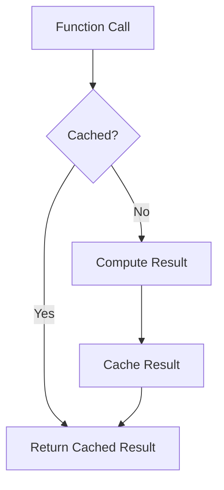

## 12.3 Memoization

In the realm of performance optimization, memoization stands out as a powerful technique to enhance the efficiency of function calls by caching results. This section delves into the concept of memoization, its implementation in JavaScript and TypeScript, and best practices to maximize its benefits.

### Introduction to Memoization

Memoization is a technique used to store the results of expensive function calls and return the cached result when the same inputs occur again. This approach is particularly useful for functions that are called frequently with the same parameters, as it avoids redundant calculations and improves performance.

### Understanding the Concept

At its core, memoization involves storing the results of function calls alongside their input parameters. When a function is called, the memoization mechanism checks if the result for the given inputs is already cached. If so, it returns the cached result; otherwise, it computes the result, caches it, and then returns it.

### Implementation Steps

#### Implement Memoization Functions

To implement memoization, you can write a utility function or leverage existing libraries like Lodash's `_.memoize`. Here's a simple example of a memoization utility function in JavaScript:

```javascript
function memoize(fn) {
    const cache = new Map();
    return function(...args) {
        const key = JSON.stringify(args);
        if (cache.has(key)) {
            return cache.get(key);
        }
        const result = fn(...args);
        cache.set(key, result);
        return result;
    };
}
```

This function creates a cache using a `Map` object, where the keys are stringified versions of the function's arguments, and the values are the computed results.

#### Apply Memoization

Memoization is best applied to pure functions—functions that have deterministic outputs for the same inputs and do not produce side effects. Here's how you can apply memoization to a Fibonacci function:

```javascript
const fibonacci = memoize(function(n) {
    if (n <= 1) return n;
    return fibonacci(n - 1) + fibonacci(n - 2);
});

console.log(fibonacci(40)); // Efficiently computes the 40th Fibonacci number
```

#### Manage Cache Size

While memoization can significantly improve performance, it can also lead to increased memory consumption. To manage cache size, consider implementing cache size limits or eviction policies. Here's an example of a simple cache size limit:

```javascript
function memoizeWithLimit(fn, limit = 100) {
    const cache = new Map();
    return function(...args) {
        const key = JSON.stringify(args);
        if (cache.has(key)) {
            return cache.get(key);
        }
        const result = fn(...args);
        cache.set(key, result);
        if (cache.size > limit) {
            const firstKey = cache.keys().next().value;
            cache.delete(firstKey);
        }
        return result;
    };
}
```

### Practice: Memoizing a Recursive Function

Memoization is particularly effective for recursive functions, such as calculating Fibonacci numbers or factorials. By caching results, you can avoid redundant calculations and significantly reduce execution time.

### Considerations

While memoization is a powerful optimization technique, it comes with considerations:

- **Memory Consumption:** Be cautious of memory usage, especially when caching large results or when the function is called with a wide variety of inputs.
- **Repetitive Calls:** Memoization is most effective for functions that are frequently called with identical inputs.

### Visual Aids

To better understand memoization, consider the following diagram illustrating the memoization process:



### Code Examples with Modern Libraries

Modern JavaScript and TypeScript libraries offer built-in memoization utilities. For instance, Lodash provides a `_.memoize` function that simplifies the memoization process:

```javascript
const _ = require('lodash');

const memoizedFactorial = _.memoize(function(n) {
    if (n <= 1) return 1;
    return n * memoizedFactorial(n - 1);
});

console.log(memoizedFactorial(10)); // Efficiently computes factorial of 10
```

### Best Practices

- **Use with Pure Functions:** Ensure that the functions you memoize are pure, as memoization relies on consistent outputs for the same inputs.
- **Monitor Cache Size:** Implement cache size limits or eviction strategies to prevent excessive memory consumption.
- **Test Performance Gains:** Measure performance improvements to ensure that memoization provides tangible benefits.

### Conclusion

Memoization is a valuable technique for optimizing performance in JavaScript and TypeScript applications. By caching results of expensive function calls, you can significantly reduce computation time and enhance application efficiency. However, it's crucial to manage memory usage and apply memoization judiciously to achieve optimal results.

## Quiz Time!



### What is memoization primarily used for?

- [x] Storing results of expensive function calls
- [ ] Managing asynchronous operations
- [ ] Handling exceptions in code
- [ ] Optimizing database queries

> **Explanation:** Memoization is used to store the results of expensive function calls and return the cached result when the same inputs occur again.

### Which type of functions are best suited for memoization?

- [x] Pure functions
- [ ] Functions with side effects
- [ ] Asynchronous functions
- [ ] Functions that modify global state

> **Explanation:** Pure functions, which have deterministic outputs for the same inputs and do not produce side effects, are best suited for memoization.

### What is a potential drawback of memoization?

- [x] Increased memory consumption
- [ ] Slower execution time
- [ ] Increased code complexity
- [ ] Reduced code readability

> **Explanation:** Memoization can lead to increased memory consumption due to caching results.

### How can you manage cache size in a memoization implementation?

- [x] Implement cache size limits or eviction policies
- [ ] Use a larger data structure for caching
- [ ] Increase the number of function calls
- [ ] Reduce the number of function arguments

> **Explanation:** Implementing cache size limits or eviction policies helps manage memory usage in memoization.

### Which library provides a built-in memoization utility?

- [x] Lodash
- [ ] Axios
- [ ] Express
- [ ] React

> **Explanation:** Lodash provides a built-in memoization utility with its `_.memoize` function.

### What is the primary benefit of memoizing a recursive function?

- [x] Improved performance by avoiding redundant calculations
- [ ] Reduced code complexity
- [ ] Enhanced readability of the function
- [ ] Easier debugging

> **Explanation:** Memoizing a recursive function improves performance by caching results and avoiding redundant calculations.

### What should be considered when applying memoization?

- [x] Memory consumption and repetitive calls
- [ ] Code readability and maintainability
- [ ] Compatibility with all libraries
- [ ] Support for asynchronous operations

> **Explanation:** When applying memoization, consider memory consumption and whether the function is called frequently with identical inputs.

### What is the role of the cache in memoization?

- [x] Store results of function calls
- [ ] Execute function calls asynchronously
- [ ] Handle exceptions in function execution
- [ ] Optimize database queries

> **Explanation:** The cache in memoization stores the results of function calls to avoid redundant calculations.

### Which of the following is a characteristic of a pure function?

- [x] Deterministic outputs for the same inputs
- [ ] Modifies global state
- [ ] Produces side effects
- [ ] Depends on external variables

> **Explanation:** Pure functions have deterministic outputs for the same inputs and do not produce side effects.

### Memoization is most effective for functions with:

- [x] Repetitive calls and identical inputs
- [ ] Asynchronous operations
- [ ] Complex logic and multiple parameters
- [ ] Dynamic outputs and varying inputs

> **Explanation:** Memoization is most effective for functions that are called frequently with the same inputs, allowing for cached results to be reused.


