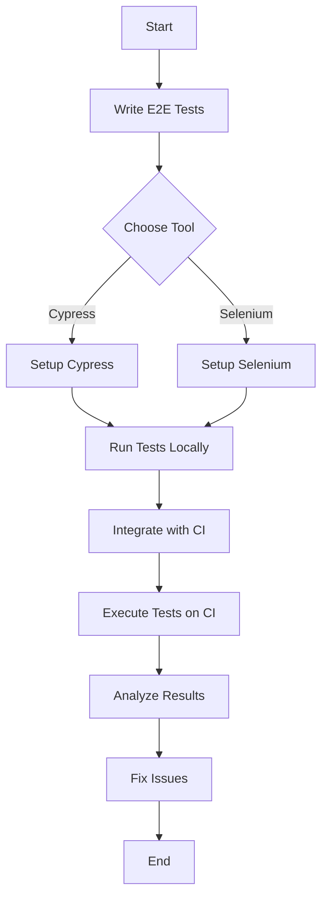

## 12.4 End-to-End Testing with Cypress and Selenium

End-to-end (E2E) testing is a critical component of modern web development, ensuring that applications function correctly from the user's perspective. In this section, we will delve into E2E testing using two popular tools: [Cypress](https://www.cypress.io/) and [Selenium](https://www.selenium.dev/). We will explore their features, provide examples of writing E2E tests, and discuss best practices for maintaining reliable tests.

### What is End-to-End Testing?

End-to-end testing is a methodology used to test whether the flow of an application is performing as expected from start to finish. The purpose is to simulate real user scenarios and validate the system as a whole, including its integration with external interfaces and dependencies.

#### Importance of End-to-End Testing

- **User Experience Validation**: Ensures that the application behaves as expected in real-world scenarios.
- **Integration Testing**: Verifies that different components of the application work together seamlessly.
- **Regression Testing**: Detects issues that may arise from new changes or updates to the codebase.
- **Error Detection**: Identifies bugs that unit or integration tests might miss.

### Overview of Cypress

Cypress is a modern testing framework specifically designed for web applications. It is known for its ease of use, fast execution, and ability to provide real-time feedback.

#### Key Features of Cypress

- **Time Travel**: Cypress takes snapshots as tests run, allowing you to hover over commands in the Command Log to see what happened at each step.
- **Automatic Waiting**: No need to add waits or sleeps to your tests. Cypress automatically waits for commands and assertions before moving on.
- **Real-Time Reloads**: Automatically reloads whenever you make changes to your tests.
- **Network Traffic Control**: Cypress can stub and control network traffic, allowing you to test edge cases without relying on external servers.

#### Writing a Simple Cypress Test

```javascript
describe('My First Test', () => {
  it('Visits the Kitchen Sink', () => {
    cy.visit('https://example.cypress.io');
    cy.contains('type').click();
    cy.url().should('include', '/commands/actions');
    cy.get('.action-email').type('fake@email.com').should('have.value', 'fake@email.com');
  });
});
```

### Overview of Selenium

Selenium is a well-established tool for automating web browsers. It supports multiple programming languages and is widely used for testing web applications.

#### Key Features of Selenium

- **Cross-Browser Compatibility**: Supports multiple browsers such as Chrome, Firefox, Safari, and Internet Explorer.
- **Language Support**: Allows writing tests in various languages, including JavaScript, Java, Python, and C#.
- **Integration with Other Tools**: Easily integrates with tools like TestNG and JUnit for managing test cases and generating reports.
- **Remote Execution**: Supports running tests on remote machines using Selenium Grid.

#### Writing a Simple Selenium Test

```javascript
const { Builder, By, until } = require('selenium-webdriver');

(async function example() {
  let driver = await new Builder().forBrowser('chrome').build();
  try {
    await driver.get('http://www.google.com/ncr');
    await driver.findElement(By.name('q')).sendKeys('webdriver');
    await driver.findElement(By.name('btnK')).click();
    await driver.wait(until.titleIs('webdriver - Google Search'), 1000);
  } finally {
    await driver.quit();
  }
})();
```

### Setting Up Testing Environments

#### Cypress Setup

1. **Installation**: Install Cypress using npm:
   ```bash
   npm install cypress --save-dev
   ```

2. **Running Tests**: Open Cypress using:
   ```bash
   npx cypress open
   ```

3. **Configuration**: Customize your Cypress configuration in `cypress.json`.

#### Selenium Setup

1. **Installation**: Install Selenium WebDriver for Node.js:
   ```bash
   npm install selenium-webdriver
   ```

2. **Browser Drivers**: Download the appropriate browser drivers (e.g., ChromeDriver for Chrome).

3. **Running Tests**: Execute your test scripts using Node.js.

### Continuous Integration with E2E Testing

Integrating E2E tests into a continuous integration (CI) pipeline ensures that tests are run automatically with each code change, providing immediate feedback.

#### Cypress CI Integration

- **GitHub Actions**: Use GitHub Actions to run Cypress tests on every push or pull request.
- **CircleCI**: Configure CircleCI to execute Cypress tests in a Docker container.

#### Selenium CI Integration

- **Jenkins**: Set up Jenkins to run Selenium tests as part of your build process.
- **Travis CI**: Use Travis CI to automate Selenium test execution.

### Comparing Cypress and Selenium

| Feature                | Cypress                                      | Selenium                                     |
|------------------------|----------------------------------------------|----------------------------------------------|
| **Ease of Use**        | Easy to set up and use, with a modern API    | Requires more setup and configuration        |
| **Performance**        | Fast execution with automatic waiting        | Slower due to network latency and setup      |
| **Browser Support**    | Limited to Chrome and Firefox                | Supports all major browsers                  |
| **Language Support**   | JavaScript only                              | Multiple languages                           |
| **Community Support**  | Growing community with active development    | Large, established community                 |

### Best Practices for Reliable E2E Tests

1. **Keep Tests Independent**: Ensure tests do not rely on the state left by previous tests.
2. **Use Data Fixtures**: Mock data to ensure tests are consistent and repeatable.
3. **Test Critical Paths**: Focus on the most important user journeys.
4. **Regular Maintenance**: Update tests as the application evolves to prevent false positives.
5. **Parallel Execution**: Run tests in parallel to reduce execution time.

### Try It Yourself

Experiment with the provided code examples by modifying them to test different scenarios. For instance, try changing the URL in the Cypress test to a different website or add more assertions to the Selenium test.

### Visualizing E2E Testing Workflow



### Knowledge Check

## End-to-End Testing with Cypress and Selenium: Quiz



### What is the primary purpose of end-to-end testing?

- [x] To simulate real user scenarios and validate the system as a whole
- [ ] To test individual components in isolation
- [ ] To perform load testing
- [ ] To check code syntax

> **Explanation:** End-to-end testing is designed to simulate real user scenarios and validate the entire system's functionality.

### Which of the following is a key feature of Cypress?

- [x] Automatic waiting
- [ ] Supports multiple programming languages
- [ ] Requires browser drivers
- [ ] Remote execution

> **Explanation:** Cypress automatically waits for commands and assertions, eliminating the need for manual waits.

### What is a major advantage of Selenium over Cypress?

- [x] Supports multiple browsers
- [ ] Faster execution
- [ ] Easier setup
- [ ] JavaScript-only support

> **Explanation:** Selenium supports multiple browsers, whereas Cypress is limited to Chrome and Firefox.

### How can you integrate Cypress tests into a CI pipeline?

- [x] Use GitHub Actions or CircleCI
- [ ] Use only Jenkins
- [ ] Use only Travis CI
- [ ] Use only Docker

> **Explanation:** Cypress tests can be integrated into CI pipelines using various tools like GitHub Actions and CircleCI.

### What is a best practice for maintaining reliable E2E tests?

- [x] Keep tests independent
- [ ] Use global variables
- [ ] Rely on external servers for data
- [ ] Avoid using data fixtures

> **Explanation:** Keeping tests independent ensures they do not rely on the state left by previous tests, making them more reliable.

### Which tool provides real-time feedback with snapshots?

- [x] Cypress
- [ ] Selenium
- [ ] Both
- [ ] Neither

> **Explanation:** Cypress provides real-time feedback with snapshots, allowing you to see what happened at each step.

### What is required to run Selenium tests?

- [x] Browser drivers
- [ ] Only Node.js
- [ ] Only npm
- [ ] Only Docker

> **Explanation:** Selenium requires browser drivers to automate browser actions.

### Which language is primarily used for writing Cypress tests?

- [x] JavaScript
- [ ] Java
- [ ] Python
- [ ] C#

> **Explanation:** Cypress tests are written in JavaScript.

### What is a common use case for E2E testing?

- [x] Regression testing
- [ ] Unit testing
- [ ] Load testing
- [ ] Syntax checking

> **Explanation:** E2E testing is commonly used for regression testing to detect issues from code changes.

### True or False: Cypress supports running tests on remote machines using Selenium Grid.

- [ ] True
- [x] False

> **Explanation:** Cypress does not support running tests on remote machines using Selenium Grid; this is a feature of Selenium.



Remember, mastering E2E testing with Cypress and Selenium is a journey. As you progress, you'll be able to create more complex and reliable tests, ensuring your applications deliver a seamless user experience. Keep experimenting, stay curious, and enjoy the process!
