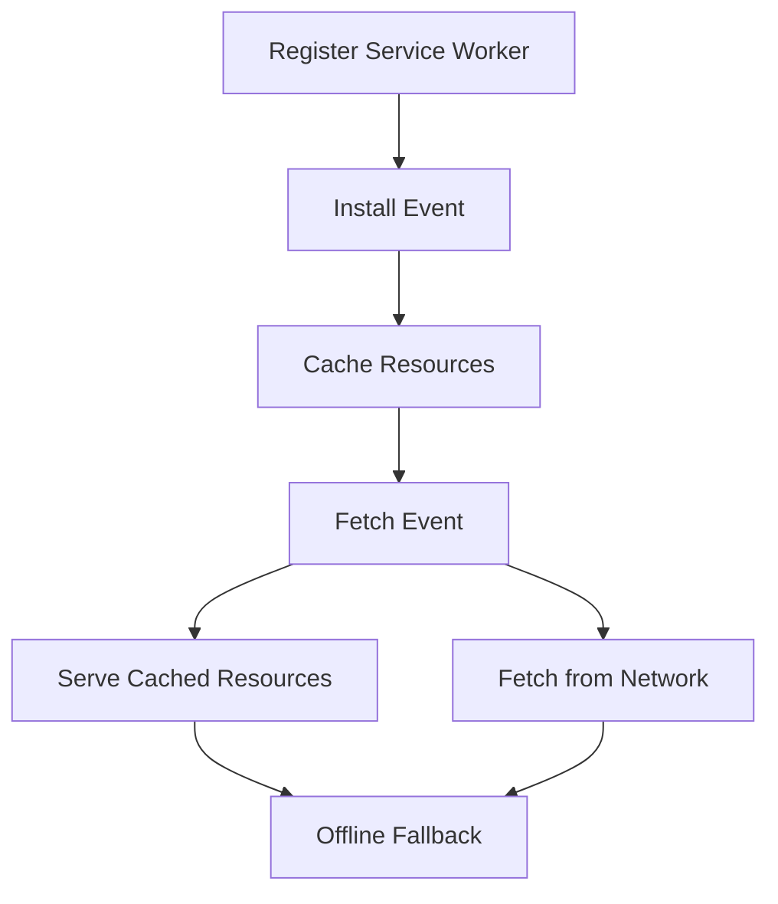

## 12.4 Service Worker Caching

In the realm of web development, optimizing performance is crucial for providing a seamless user experience. One powerful tool at our disposal is the Service Worker, a script that runs in the background and can intercept network requests to cache resources. This capability is essential for improving load times and enabling offline functionality. In this section, we'll delve into the intricacies of Service Worker Caching and how it can be leveraged to enhance web application performance.

### Understanding Service Workers

Service Workers are background scripts that operate independently of web pages. They provide the ability to intercept network requests, cache resources, and deliver them efficiently. This capability is particularly useful for:

- **Offline Support:** Allowing web applications to function without a network connection.
- **Performance Optimization:** Reducing load times by serving cached resources.
- **Resource Management:** Controlling how and when resources are fetched and cached.

### Implementation Steps

Implementing Service Worker Caching involves several key steps:

#### Register a Service Worker

The first step is to register a Service Worker in your main JavaScript file. This process involves checking if the browser supports Service Workers and then registering the worker script.

```javascript
if ('serviceWorker' in navigator) {
  navigator.serviceWorker.register('/sw.js')
    .then(registration => {
      console.log('Service Worker registered with scope:', registration.scope);
    })
    .catch(error => {
      console.error('Service Worker registration failed:', error);
    });
}
```

#### Cache Resources

Once the Service Worker is registered, you can cache essential assets during the install event. This involves opening a cache and adding resources to it.

```javascript
// sw.js
self.addEventListener('install', event => {
  event.waitUntil(
    caches.open('v1').then(cache => {
      return cache.addAll([
        '/',
        '/index.html',
        '/styles.css',
        '/script.js',
        '/images/logo.png'
      ]);
    })
  );
});
```

#### Serve Cached Resources

During the fetch event, the Service Worker can intercept network requests and serve cached resources. If the resource is not in the cache, it can be fetched from the network.

```javascript
self.addEventListener('fetch', event => {
  event.respondWith(
    caches.match(event.request).then(response => {
      return response || fetch(event.request);
    })
  );
});
```

#### Update Strategy

Implementing a cache update strategy is crucial for ensuring that users receive the latest content. This can be achieved through cache versioning and update logic.

```javascript
self.addEventListener('activate', event => {
  const cacheWhitelist = ['v2'];
  event.waitUntil(
    caches.keys().then(cacheNames => {
      return Promise.all(
        cacheNames.map(cacheName => {
          if (!cacheWhitelist.includes(cacheName)) {
            return caches.delete(cacheName);
          }
        })
      );
    })
  );
});
```

#### Handle Offline Scenarios

To provide a seamless offline experience, you can offer fallback responses when the user is offline.

```javascript
self.addEventListener('fetch', event => {
  event.respondWith(
    caches.match(event.request).then(response => {
      return response || fetch(event.request).catch(() => {
        return caches.match('/offline.html');
      });
    })
  );
});
```

### Practice: Building an Offline Page

To put these concepts into practice, try building a simple offline page that works without network connectivity. This involves creating an `offline.html` page and ensuring it's cached during the install event.

### Considerations

When implementing Service Worker Caching, consider the following:

- **Browser Compatibility:** Test service worker registration and caching in different browsers to ensure consistent behavior.
- **Lifecycle Events:** Be aware of service worker lifecycle events such as install, activate, and fetch, and handle them appropriately.

### Visual Aids

Below is a conceptual diagram illustrating the workflow of a Service Worker:



### Advantages and Disadvantages

**Advantages:**

- **Improved Performance:** Faster load times by serving cached resources.
- **Offline Support:** Enables applications to function without a network connection.
- **Resource Management:** Provides control over resource fetching and caching.

**Disadvantages:**

- **Complexity:** Requires understanding of service worker lifecycle and caching strategies.
- **Storage Limitations:** Browsers impose limits on cache storage size.

### Best Practices

- **Cache Only Essential Resources:** Avoid caching unnecessary assets to conserve storage.
- **Implement Cache Versioning:** Use versioning to manage updates and ensure users receive the latest content.
- **Test Across Browsers:** Ensure consistent behavior by testing in different browsers.

### Conclusion

Service Worker Caching is a powerful technique for optimizing web application performance and providing offline support. By understanding and implementing the steps outlined above, you can enhance the user experience and ensure your application performs efficiently under various network conditions.

## Quiz Time!



### What is the primary role of a Service Worker?

- [x] To intercept network requests and cache resources
- [ ] To manage server-side operations
- [ ] To handle user authentication
- [ ] To render HTML content

> **Explanation:** Service Workers are background scripts that intercept network requests and cache resources to improve performance and enable offline functionality.

### How do you register a Service Worker in a JavaScript file?

- [x] Using `navigator.serviceWorker.register('/sw.js');`
- [ ] Using `document.registerServiceWorker('/sw.js');`
- [ ] Using `window.serviceWorker.register('/sw.js');`
- [ ] Using `serviceWorker.register('/sw.js');`

> **Explanation:** The correct method to register a Service Worker is by using `navigator.serviceWorker.register('/sw.js');`.

### During which event do you cache resources in a Service Worker?

- [x] Install event
- [ ] Fetch event
- [ ] Activate event
- [ ] Sync event

> **Explanation:** Resources are typically cached during the install event of a Service Worker.

### What is the purpose of the fetch event in a Service Worker?

- [x] To intercept network requests and serve cached resources
- [ ] To update the Service Worker
- [ ] To delete old caches
- [ ] To register the Service Worker

> **Explanation:** The fetch event is used to intercept network requests and serve cached resources or fetch them from the network.

### Which strategy helps ensure users receive the latest content?

- [x] Cache versioning
- [ ] Cache deletion
- [ ] Cache compression
- [ ] Cache encryption

> **Explanation:** Cache versioning helps manage updates and ensures users receive the latest content.

### What should you provide when the user is offline?

- [x] Fallback responses
- [ ] Error messages
- [ ] Redirects
- [ ] Alerts

> **Explanation:** Providing fallback responses ensures a seamless offline experience for users.

### What is a key consideration when implementing Service Worker Caching?

- [x] Testing in different browsers
- [ ] Using only one cache
- [ ] Avoiding lifecycle events
- [ ] Disabling network requests

> **Explanation:** Testing in different browsers is crucial to ensure consistent behavior of Service Worker Caching.

### Which event is used to clean up old caches?

- [x] Activate event
- [ ] Install event
- [ ] Fetch event
- [ ] Sync event

> **Explanation:** The activate event is used to clean up old caches that are no longer needed.

### What is a disadvantage of Service Worker Caching?

- [x] Complexity in understanding lifecycle and caching strategies
- [ ] Lack of offline support
- [ ] Increased server load
- [ ] Inability to cache resources

> **Explanation:** Service Worker Caching can be complex due to the need to understand lifecycle events and caching strategies.

### True or False: Service Workers can run even when the web page is closed.

- [x] True
- [ ] False

> **Explanation:** Service Workers run in the background and can operate independently of web pages, even when they are closed.


