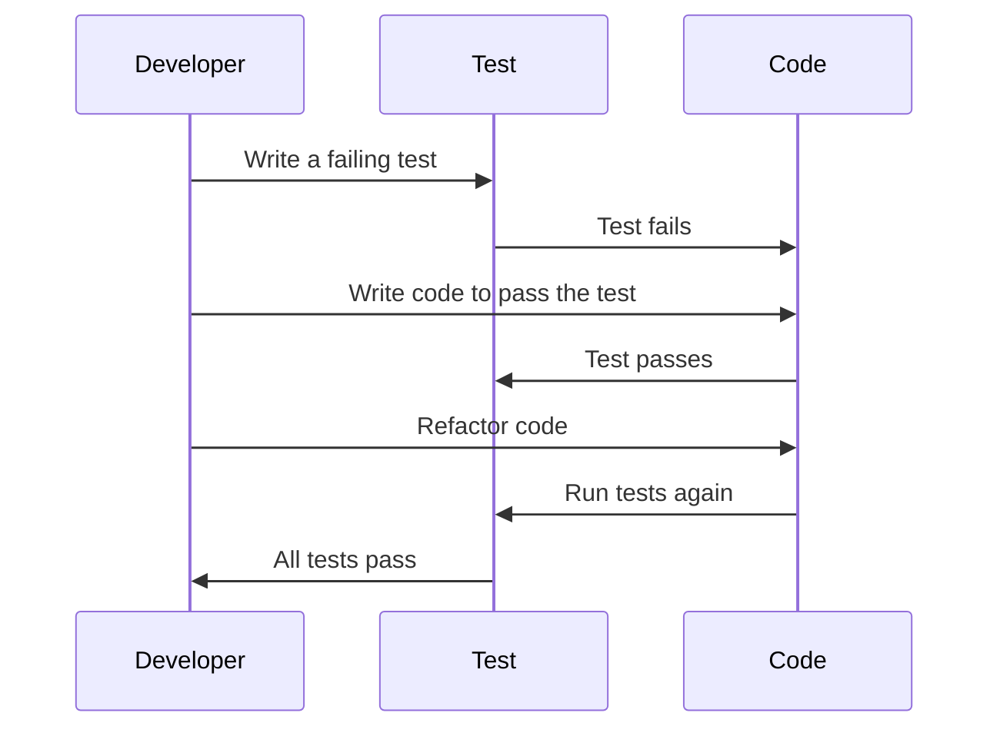

## 12.5 Test-Driven Development (TDD) Practices

Test-Driven Development (TDD) is a software development process that emphasizes writing tests before writing the actual code. This approach not only ensures that the code meets the specified requirements but also guides the design and architecture of the software. In this section, we will delve into the principles of TDD, explore the TDD cycle, provide examples, discuss its benefits and challenges, and offer tips for adopting TDD in your JavaScript projects.

### Understanding Test-Driven Development (TDD)

**Definition**: TDD is a software development methodology where tests are written before the code itself. The main goal is to improve the quality and design of the code by ensuring that it meets the requirements from the outset.

**Fundamental Principles**:
- **Write a Test First**: Before writing any functional code, write a test that defines a function or improvements of a function.
- **Run All Tests and See if the New Test Fails**: This step ensures that the test is valid and that the feature is not already implemented.
- **Write the Minimum Amount of Code to Pass the Test**: Implement just enough code to make the test pass.
- **Refactor the Code**: Clean up the code, ensuring that it adheres to the design principles and is optimized.

### The TDD Cycle: Red, Green, Refactor

The TDD process is often described as a cycle consisting of three main stages: Red, Green, and Refactor.

#### Red: Write a Failing Test

In the first step, you write a test for a new feature or functionality. Since the feature is not yet implemented, the test will fail. This step is crucial as it defines what the code should do.

```javascript
// Example: Testing a function that adds two numbers
function add(a, b) {
  // Function not yet implemented
}

describe('add', () => {
  it('should return the sum of two numbers', () => {
    expect(add(1, 2)).toBe(3);
  });
});
```

#### Green: Make the Test Pass

Next, write the minimum amount of code necessary to make the test pass. This step focuses on functionality rather than optimization or design.

```javascript
// Implementing the add function
function add(a, b) {
  return a + b;
}

describe('add', () => {
  it('should return the sum of two numbers', () => {
    expect(add(1, 2)).toBe(3);
  });
});
```

#### Refactor: Optimize the Code

Once the test passes, refactor the code to improve its structure and readability without changing its behavior. This step ensures that the codebase remains clean and maintainable.

```javascript
// Refactored code (if necessary)
function add(a, b) {
  return a + b; // Simple and clean
}

describe('add', () => {
  it('should return the sum of two numbers', () => {
    expect(add(1, 2)).toBe(3);
  });
});
```

### Benefits of TDD

Implementing TDD in your projects can lead to numerous benefits:

- **Improved Code Quality**: Writing tests first ensures that the code meets the requirements and behaves as expected.
- **Better Design**: TDD encourages developers to think about the design and architecture of the code before implementation.
- **Reduced Bugs**: By catching errors early in the development process, TDD reduces the number of bugs in the final product.
- **Easier Refactoring**: With a comprehensive suite of tests, developers can refactor code with confidence, knowing that any regressions will be caught.
- **Documentation**: Tests serve as documentation for the code, making it easier for new developers to understand the codebase.

### Challenges and Common Misconceptions

While TDD offers many benefits, it also presents some challenges and misconceptions:

- **Time-Consuming**: Writing tests before code can seem time-consuming, but it often saves time in the long run by reducing bugs and simplifying refactoring.
- **Over-Testing**: Developers may write too many tests, leading to a bloated test suite that is difficult to maintain.
- **Misunderstanding TDD**: Some developers may see TDD as a testing technique rather than a design methodology, leading to improper implementation.
- **Resistance to Change**: Teams accustomed to traditional development methods may resist adopting TDD.

### Tips for Adopting TDD

To successfully adopt TDD in your projects, consider the following tips:

- **Start Small**: Begin with small, manageable projects to get comfortable with the TDD process.
- **Educate Your Team**: Ensure that all team members understand the principles and benefits of TDD.
- **Use the Right Tools**: Utilize testing frameworks like Jest, Mocha, or Jasmine to streamline the TDD process.
- **Integrate TDD into Your Workflow**: Make TDD a part of your development workflow, not an afterthought.
- **Practice Regularly**: Like any skill, TDD requires practice. Encourage regular practice to build proficiency.

### Code Example: TDD in Action

Let's walk through a simple example of TDD in action. We'll implement a function that calculates the factorial of a number.

#### Step 1: Write a Failing Test

```javascript
// factorial.test.js
const factorial = require('./factorial');

describe('factorial', () => {
  it('should return 1 for the factorial of 0', () => {
    expect(factorial(0)).toBe(1);
  });

  it('should return 120 for the factorial of 5', () => {
    expect(factorial(5)).toBe(120);
  });
});
```

#### Step 2: Implement the Minimum Code

```javascript
// factorial.js
function factorial(n) {
  if (n === 0) return 1;
  return n * factorial(n - 1);
}

module.exports = factorial;
```

#### Step 3: Refactor the Code

In this case, the code is already clean and efficient, so no refactoring is necessary.

### Visualizing the TDD Cycle



**Caption**: The TDD cycle involves writing a failing test, implementing code to pass the test, and then refactoring the code.

### Try It Yourself

Try modifying the factorial function to handle negative numbers by returning `null`. Update the tests accordingly and see how TDD helps guide the implementation.

### References and Further Reading

- [MDN Web Docs: Test-Driven Development](https://developer.mozilla.org/en-US/docs/Glossary/Test-driven_development)
- [Jest Documentation](https://jestjs.io/docs/getting-started)
- [Mocha Documentation](https://mochajs.org/)

### Knowledge Check

To reinforce your understanding of TDD, try answering the following questions:

## Test Your Knowledge on TDD Practices



### What is the first step in the TDD cycle?

- [x] Write a failing test
- [ ] Write the code
- [ ] Refactor the code
- [ ] Run the code

> **Explanation:** The first step in the TDD cycle is to write a failing test that defines the desired functionality.

### What does the "Green" phase in TDD refer to?

- [x] Making the test pass
- [ ] Writing a failing test
- [ ] Refactoring the code
- [ ] Running all tests

> **Explanation:** The "Green" phase involves writing the minimum amount of code necessary to make the test pass.

### What is a common misconception about TDD?

- [x] It's only about testing
- [ ] It improves code quality
- [ ] It encourages better design
- [ ] It reduces bugs

> **Explanation:** A common misconception is that TDD is only about testing, whereas it is actually a design methodology.

### What is a benefit of TDD?

- [x] Easier refactoring
- [ ] Increased development time
- [ ] More complex code
- [ ] Less documentation

> **Explanation:** TDD makes refactoring easier because a comprehensive suite of tests ensures that any regressions are caught.

### What is a challenge of adopting TDD?

- [x] Resistance to change
- [ ] Improved code quality
- [ ] Better design
- [ ] Reduced bugs

> **Explanation:** Teams accustomed to traditional development methods may resist adopting TDD.

### What is the purpose of refactoring in TDD?

- [x] To improve code structure and readability
- [ ] To add new features
- [ ] To write more tests
- [ ] To make the test pass

> **Explanation:** Refactoring improves the structure and readability of the code without changing its behavior.

### Which tool is commonly used for TDD in JavaScript?

- [x] Jest
- [ ] Git
- [ ] Docker
- [ ] Babel

> **Explanation:** Jest is a popular testing framework used for TDD in JavaScript.

### What should you do after refactoring the code in TDD?

- [x] Run all tests again
- [ ] Write new tests
- [ ] Implement new features
- [ ] Document the code

> **Explanation:** After refactoring, you should run all tests again to ensure that the code still behaves as expected.

### How does TDD help with documentation?

- [x] Tests serve as documentation
- [ ] It generates documentation automatically
- [ ] It requires less documentation
- [ ] It replaces documentation

> **Explanation:** Tests serve as documentation for the code, making it easier for new developers to understand the codebase.

### True or False: TDD can lead to over-testing.

- [x] True
- [ ] False

> **Explanation:** TDD can lead to over-testing if developers write too many tests, leading to a bloated test suite.



Remember, adopting TDD is a journey. Start small, practice regularly, and gradually integrate it into your workflow. As you become more comfortable with TDD, you'll find that it not only improves your code quality but also enhances your overall development process. Keep experimenting, stay curious, and enjoy the journey!
