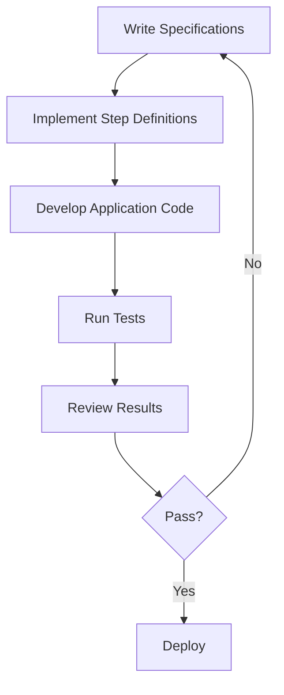

## 12.6 Behavior-Driven Development (BDD)

Behavior-Driven Development (BDD) is a software development approach that extends Test-Driven Development (TDD) by emphasizing collaboration among developers, testers, and non-technical stakeholders. BDD encourages writing tests in natural language, making them accessible to all team members, and ensuring that the software meets business requirements.

### Understanding BDD and Its Differences from TDD

**Behavior-Driven Development (BDD)** is a methodology that focuses on the behavior of an application for the end user. It builds upon the principles of Test-Driven Development (TDD) but shifts the focus from testing to specifying the behavior of software. While TDD involves writing tests before code, BDD involves writing specifications in a language that non-developers can understand.

#### Key Differences Between BDD and TDD

- **Language**: BDD uses natural language constructs to describe the behavior of the system, making it more accessible to non-technical stakeholders. TDD, on the other hand, uses technical language focused on testing.
- **Focus**: BDD emphasizes the behavior of the application from the user's perspective, while TDD focuses on the correctness of the code.
- **Collaboration**: BDD fosters collaboration between developers, testers, and business stakeholders by using a shared language for specifications.

### Writing Specifications in Plain Language

In BDD, specifications are written in a structured format using a language called Gherkin. Gherkin is designed to be readable by humans and is used to describe the behavior of the application in terms of scenarios.

#### Gherkin Syntax

Gherkin uses a simple syntax with keywords such as `Given`, `When`, `Then`, `And`, and `But` to define scenarios. Here's a basic example:

```gherkin
Feature: User login

  Scenario: Successful login
    Given the user is on the login page
    When the user enters valid credentials
    Then the user should be redirected to the dashboard
```

- **Feature**: Describes the feature being tested.
- **Scenario**: Represents a specific situation or behavior.
- **Given**: Sets up the initial context.
- **When**: Describes the action taken by the user.
- **Then**: Specifies the expected outcome.

### Tools for BDD in JavaScript

Several tools support BDD in JavaScript, with Cucumber and Jasmine being among the most popular.

#### Cucumber

[Cucumber](https://cucumber.io/) is a tool that supports BDD by allowing you to write specifications in Gherkin and execute them against your code. It bridges the gap between technical and non-technical team members by using plain language.

**Example of a Cucumber Feature File:**

```gherkin
Feature: User registration

  Scenario: Successful registration
    Given the user is on the registration page
    When the user enters valid registration details
    Then the user should see a confirmation message
```

**Step Definitions in JavaScript:**

```javascript
const { Given, When, Then } = require('@cucumber/cucumber');

Given('the user is on the registration page', function () {
  // Code to navigate to the registration page
});

When('the user enters valid registration details', function () {
  // Code to enter registration details
});

Then('the user should see a confirmation message', function () {
  // Code to verify the confirmation message
});
```

#### Jasmine

[Jasmine](https://jasmine.github.io/) is a behavior-driven development framework for testing JavaScript code. It provides a clean syntax for writing tests and is often used for unit testing.

**Example of a Jasmine Test:**

```javascript
describe('User registration', function() {
  it('should show a confirmation message on successful registration', function() {
    // Arrange
    const registrationPage = new RegistrationPage();
    registrationPage.navigate();

    // Act
    registrationPage.enterDetails('validUser', 'validPassword');
    registrationPage.submit();

    // Assert
    expect(registrationPage.getConfirmationMessage()).toBe('Registration successful!');
  });
});
```

### Benefits of BDD for Stakeholder Communication

BDD enhances communication among team members by using a common language to describe the behavior of the application. This shared understanding helps ensure that the software meets business requirements and reduces the risk of misunderstandings.

#### Key Benefits

- **Improved Collaboration**: BDD fosters collaboration between developers, testers, and business stakeholders by using a shared language for specifications.
- **Clear Requirements**: Specifications written in natural language provide a clear understanding of requirements for all team members.
- **Early Detection of Issues**: By involving stakeholders early in the process, BDD helps identify potential issues before development begins.

### Best Practices and Potential Pitfalls

#### Best Practices

- **Involve Stakeholders Early**: Engage stakeholders in writing specifications to ensure that the software meets business needs.
- **Keep Scenarios Simple**: Write clear and concise scenarios that focus on a single behavior.
- **Use Real-World Language**: Use language that reflects the domain and is understandable to all team members.

#### Potential Pitfalls

- **Overcomplicating Scenarios**: Avoid writing overly complex scenarios that are difficult to understand.
- **Neglecting Collaboration**: Ensure that all team members are involved in the BDD process to avoid misunderstandings.
- **Ignoring Maintenance**: Regularly update scenarios to reflect changes in requirements or the application.

### Visualizing BDD Workflow

Below is a diagram illustrating the BDD workflow, from writing specifications to executing tests.



**Diagram Description**: This flowchart represents the BDD process, starting with writing specifications and ending with deployment if tests pass. If tests fail, the process loops back to writing specifications.

### Try It Yourself

To get hands-on experience with BDD, try modifying the example scenarios and step definitions provided above. Experiment with different scenarios and see how changes affect the test outcomes. This practice will help solidify your understanding of BDD principles.

### Knowledge Check

To reinforce your understanding of BDD, consider the following questions:

- What is the primary focus of BDD compared to TDD?
- How does Gherkin syntax facilitate communication among team members?
- What are the benefits of using tools like Cucumber and Jasmine for BDD?
- How can BDD improve stakeholder communication and collaboration?
- What are some best practices for writing effective BDD scenarios?

### Embrace the Journey

Remember, mastering BDD is a journey that involves continuous learning and collaboration. As you progress, you'll find that BDD not only improves the quality of your software but also enhances team communication and alignment with business goals. Keep experimenting, stay curious, and enjoy the journey!

## Quiz: Mastering Behavior-Driven Development (BDD) in JavaScript



### What is the primary focus of Behavior-Driven Development (BDD)?

- [x] Describing the behavior of the application from the user's perspective
- [ ] Ensuring code correctness through technical tests
- [ ] Writing tests after code implementation
- [ ] Automating deployment processes

> **Explanation:** BDD focuses on describing the behavior of the application from the user's perspective, using natural language to ensure clarity and collaboration.

### Which language is used in BDD to write specifications?

- [x] Gherkin
- [ ] JavaScript
- [ ] HTML
- [ ] SQL

> **Explanation:** Gherkin is the language used in BDD to write specifications in a human-readable format.

### What is the role of the `Given` keyword in Gherkin syntax?

- [x] To set up the initial context for a scenario
- [ ] To describe the action taken by the user
- [ ] To specify the expected outcome
- [ ] To define a feature

> **Explanation:** The `Given` keyword is used to set up the initial context for a scenario in Gherkin syntax.

### Which tool is commonly used for BDD in JavaScript?

- [x] Cucumber
- [ ] Mocha
- [ ] Selenium
- [ ] JUnit

> **Explanation:** Cucumber is a popular tool for BDD in JavaScript, allowing specifications to be written in Gherkin and executed against the code.

### How does BDD improve stakeholder communication?

- [x] By using a common language to describe application behavior
- [ ] By automating code deployment
- [ ] By reducing the number of tests needed
- [ ] By focusing solely on technical details

> **Explanation:** BDD improves stakeholder communication by using a common language to describe application behavior, ensuring all team members have a shared understanding.

### What is a potential pitfall of BDD?

- [x] Writing overly complex scenarios
- [ ] Focusing too much on code correctness
- [ ] Ignoring deployment processes
- [ ] Using technical language in specifications

> **Explanation:** A potential pitfall of BDD is writing overly complex scenarios that are difficult to understand and maintain.

### What is the benefit of using Jasmine for BDD?

- [x] It provides a clean syntax for writing tests
- [ ] It automates deployment processes
- [ ] It focuses on database integration
- [ ] It simplifies UI design

> **Explanation:** Jasmine provides a clean syntax for writing tests, making it a popular choice for BDD in JavaScript.

### What should be avoided when writing BDD scenarios?

- [x] Overcomplicating scenarios
- [ ] Using natural language
- [ ] Involving stakeholders
- [ ] Focusing on user behavior

> **Explanation:** When writing BDD scenarios, it's important to avoid overcomplicating them to ensure they remain clear and understandable.

### What is the purpose of the `Then` keyword in Gherkin syntax?

- [x] To specify the expected outcome of a scenario
- [ ] To set up the initial context
- [ ] To describe the action taken by the user
- [ ] To define a feature

> **Explanation:** The `Then` keyword is used to specify the expected outcome of a scenario in Gherkin syntax.

### True or False: BDD is only beneficial for technical team members.

- [ ] True
- [x] False

> **Explanation:** False. BDD is beneficial for both technical and non-technical team members as it fosters collaboration and ensures a shared understanding of application behavior.


