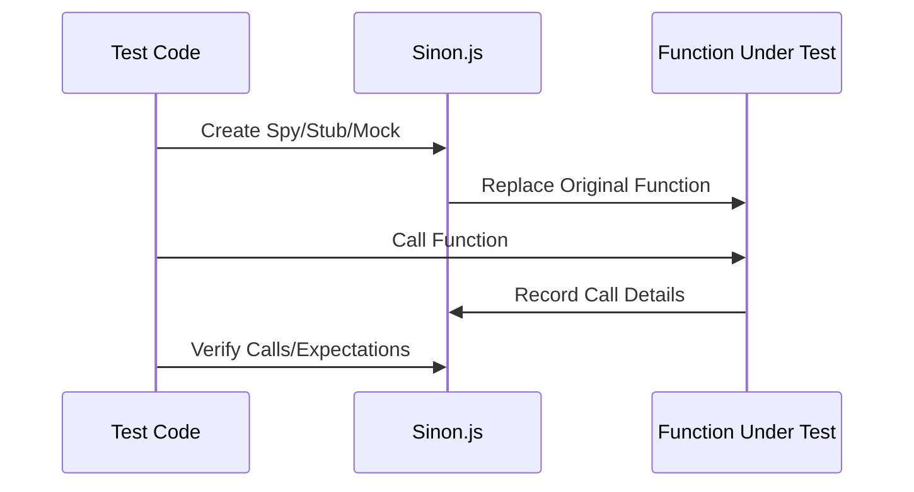

## 12.7 Mocks, Stubs, and Spies with Sinon.js

In the realm of software testing, especially in JavaScript, isolating code to test individual components is crucial. Sinon.js is a powerful library that provides developers with the tools to create mocks, stubs, and spies, which are essential for effective unit testing. This section will guide you through the use of Sinon.js, explaining its capabilities and how it can be integrated with popular testing frameworks like Jest and Mocha.

### Introduction to Sinon.js

[Sinon.js](https://sinonjs.org/) is a standalone library for JavaScript that provides spies, stubs, and mocks. It works with any unit testing framework and is particularly useful for testing code that relies on external services or complex interactions. Sinon.js allows you to replace parts of your system under test with mock objects and functions, making it easier to test in isolation.

#### Key Features of Sinon.js

- **Spies**: Monitor function calls, arguments, return values, and exceptions.
- **Stubs**: Replace functions with controllable behavior.
- **Mocks**: Pre-programmed expectations and behaviors for functions.
- **Compatibility**: Works seamlessly with testing frameworks like Mocha, Jasmine, and Jest.

### Understanding Mocks, Stubs, and Spies

Before diving into Sinon.js, it's important to understand the differences between mocks, stubs, and spies, as they each serve distinct purposes in testing.

#### Spies

A spy is a function that records arguments, return values, the value of `this`, and exceptions thrown (if any) for all its calls. Spies are useful for verifying that a function was called with the correct arguments.

```javascript
const sinon = require('sinon');

function greet(name) {
  return `Hello, ${name}!`;
}

const spy = sinon.spy(greet);
spy('World');

console.log(spy.called); // true
console.log(spy.callCount); // 1
console.log(spy.calledWith('World')); // true
```

#### Stubs

Stubs are functions (spies) with pre-programmed behavior. They can replace existing functions with custom behavior, making them ideal for testing code that relies on external services or APIs.

```javascript
const sinon = require('sinon');

const user = {
  getName: function() {
    return 'Alice';
  }
};

const stub = sinon.stub(user, 'getName').returns('Bob');

console.log(user.getName()); // Bob
console.log(stub.calledOnce); // true
```

#### Mocks

Mocks are similar to stubs but with built-in expectations. They are used to set expectations on the behavior of a function, such as how many times it should be called and with what arguments.

```javascript
const sinon = require('sinon');

const user = {
  getName: function() {
    return 'Alice';
  }
};

const mock = sinon.mock(user);
mock.expects('getName').once().returns('Bob');

console.log(user.getName()); // Bob
mock.verify(); // Verifies that the expected call was made
```

### Using Sinon.js with Testing Frameworks

Sinon.js can be integrated with various testing frameworks to enhance your testing capabilities. Let's explore how it can be used with Mocha and Jest.

#### Integrating with Mocha

Mocha is a popular JavaScript test framework running on Node.js and in the browser. It makes asynchronous testing simple and fun. Here's how you can use Sinon.js with Mocha:

```javascript
const sinon = require('sinon');
const assert = require('assert');

describe('User Module', function() {
  it('should call getName once', function() {
    const user = {
      getName: function() {
        return 'Alice';
      }
    };

    const spy = sinon.spy(user, 'getName');
    user.getName();

    assert(spy.calledOnce);
  });
});
```

#### Integrating with Jest

Jest is a delightful JavaScript Testing Framework with a focus on simplicity. While Jest has its own mocking capabilities, Sinon.js can still be used for more complex scenarios.

```javascript
const sinon = require('sinon');

test('should call getName once', () => {
  const user = {
    getName: function() {
      return 'Alice';
    }
  };

  const spy = sinon.spy(user, 'getName');
  user.getName();

  expect(spy.calledOnce).toBe(true);
});
```

### Best Practices for Using Sinon.js

When using Sinon.js, it's important to follow best practices to ensure your tests are reliable and maintainable.

1. **Isolate Tests**: Ensure each test is independent by resetting spies, stubs, and mocks after each test.
2. **Avoid Over-Mocking**: Mock only what is necessary to avoid making tests brittle.
3. **Use Stubs for External Dependencies**: Replace calls to external services with stubs to control their behavior.
4. **Verify Expectations**: Always verify that mocks meet their expectations to catch errors early.

### Use Cases for Sinon.js

Sinon.js is particularly useful in scenarios where your code interacts with external systems or complex dependencies. Here are some common use cases:

- **Testing API Calls**: Use stubs to simulate API responses and test how your code handles them.
- **Verifying Function Calls**: Use spies to ensure functions are called with the correct arguments.
- **Mocking Complex Interactions**: Use mocks to set expectations on complex interactions between objects.

### Try It Yourself

To get hands-on experience with Sinon.js, try modifying the examples provided. For instance, change the return value of a stub or add additional expectations to a mock. Experiment with different scenarios to see how Sinon.js can simplify your testing process.

### Visualizing Sinon.js Concepts

To better understand how Sinon.js works, let's visualize the interaction between spies, stubs, and mocks using a sequence diagram.



### References and Further Reading

- [Sinon.js Official Documentation](https://sinonjs.org/)
- [Mocha Testing Framework](https://mochajs.org/)
- [Jest Testing Framework](https://jestjs.io/)

### Knowledge Check

To reinforce your understanding of Sinon.js, try answering the following questions and challenges.

## Mastering Sinon.js: Quiz on Mocks, Stubs, and Spies



### What is a spy in Sinon.js?

- [x] A function that records arguments, return values, and exceptions for all its calls.
- [ ] A function that replaces another function with pre-programmed behavior.
- [ ] A function that sets expectations on the behavior of another function.
- [ ] A function that automatically verifies expectations.

> **Explanation:** A spy in Sinon.js is used to monitor function calls, arguments, return values, and exceptions.

### How does a stub differ from a spy?

- [x] A stub can replace a function with pre-programmed behavior.
- [ ] A stub records function call details.
- [ ] A stub sets expectations on function behavior.
- [ ] A stub automatically verifies expectations.

> **Explanation:** A stub is a spy with pre-programmed behavior, allowing you to replace a function's implementation.

### What is the primary purpose of a mock in Sinon.js?

- [x] To set expectations on the behavior of a function.
- [ ] To replace a function with pre-programmed behavior.
- [ ] To record function call details.
- [ ] To automatically verify expectations.

> **Explanation:** Mocks are used to set expectations on function behavior and verify that they are met.

### Which testing framework is Sinon.js compatible with?

- [x] Mocha
- [x] Jest
- [ ] Jasmine
- [ ] All of the above

> **Explanation:** Sinon.js is compatible with any testing framework, including Mocha and Jest.

### What should you do after each test when using Sinon.js?

- [x] Reset spies, stubs, and mocks.
- [ ] Create new spies, stubs, and mocks.
- [ ] Verify expectations.
- [ ] Replace all functions with stubs.

> **Explanation:** Resetting spies, stubs, and mocks after each test ensures test isolation.

### What is a common use case for stubs in Sinon.js?

- [x] Simulating API responses.
- [ ] Recording function call details.
- [ ] Setting expectations on function behavior.
- [ ] Automatically verifying expectations.

> **Explanation:** Stubs are often used to simulate API responses and control external dependencies.

### How can you verify that a mock met its expectations?

- [x] By calling the `verify()` method.
- [ ] By checking the call count.
- [ ] By inspecting the return value.
- [ ] By resetting the mock.

> **Explanation:** The `verify()` method is used to check if a mock met its expectations.

### What is a best practice when using Sinon.js?

- [x] Avoid over-mocking.
- [ ] Mock every function in your codebase.
- [ ] Use only spies for testing.
- [ ] Never reset spies, stubs, or mocks.

> **Explanation:** Avoiding over-mocking helps prevent brittle tests.

### Can Sinon.js be used with Jest's built-in mocking capabilities?

- [x] Yes
- [ ] No

> **Explanation:** While Jest has its own mocking capabilities, Sinon.js can be used for more complex scenarios.

### True or False: Mocks automatically verify expectations in Sinon.js.

- [ ] True
- [x] False

> **Explanation:** Mocks in Sinon.js require manual verification using the `verify()` method.



Remember, mastering Sinon.js and its capabilities is a journey. As you continue to explore and experiment, you'll find that testing becomes more efficient and effective. Keep practicing, stay curious, and enjoy the process of creating robust and reliable tests for your JavaScript applications!
