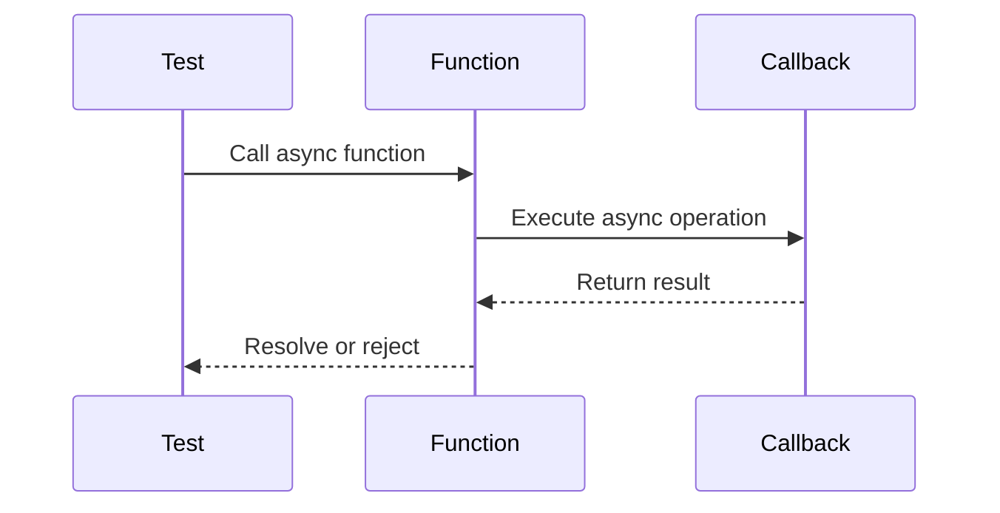

## 12.8 Testing Asynchronous Code

Asynchronous programming is a cornerstone of modern JavaScript development, enabling non-blocking operations that enhance performance and responsiveness. However, testing asynchronous code presents unique challenges. In this section, we'll explore techniques for effectively testing asynchronous JavaScript code, including callbacks, Promises, and async/await. We'll also discuss the importance of ensuring tests complete after asynchronous operations and address potential issues such as timeouts.

### Challenges in Testing Asynchronous Code

Testing asynchronous code can be tricky due to the non-linear execution of operations. Unlike synchronous code, where operations execute sequentially, asynchronous code involves operations that may complete at different times. This can lead to several challenges:

- **Timing Issues**: Ensuring that tests wait for asynchronous operations to complete before asserting results.
- **Error Handling**: Properly catching and handling errors in asynchronous code.
- **State Management**: Maintaining the correct state across asynchronous operations.
- **Timeouts**: Dealing with operations that may take longer than expected or never complete.

To address these challenges, we need to employ specific techniques and tools designed for testing asynchronous operations.

### Testing Asynchronous Code with Callbacks

Callbacks are one of the earliest methods for handling asynchronous operations in JavaScript. Testing code that uses callbacks requires ensuring that the callback is invoked and that the expected results are produced.

#### Example: Testing a Callback Function

Let's consider a simple example of a function that reads a file asynchronously using a callback:

```javascript
const fs = require('fs');

function readFileAsync(filePath, callback) {
  fs.readFile(filePath, 'utf8', (err, data) => {
    if (err) {
      return callback(err);
    }
    callback(null, data);
  });
}
```

To test this function, we can use a testing framework like Mocha along with an assertion library like Chai:

```javascript
const chai = require('chai');
const expect = chai.expect;

describe('readFileAsync', function() {
  it('should read file content correctly', function(done) {
    readFileAsync('test.txt', (err, data) => {
      expect(err).to.be.null;
      expect(data).to.equal('Hello, World!');
      done();
    });
  });

  it('should return an error for non-existent file', function(done) {
    readFileAsync('nonexistent.txt', (err, data) => {
      expect(err).to.not.be.null;
      expect(data).to.be.undefined;
      done();
    });
  });
});
```

**Key Points**:
- **Use `done`**: The `done` callback is used to signal that the test is complete. This is crucial for asynchronous tests to ensure they wait for the callback to be invoked.
- **Error Handling**: Ensure that errors are properly caught and tested.

### Testing Promises with `.then()` and `.catch()`

Promises provide a more structured way to handle asynchronous operations compared to callbacks. They allow chaining and better error handling, making them a popular choice in modern JavaScript.

#### Example: Testing a Promise-Based Function

Consider a function that returns a Promise:

```javascript
function fetchData(url) {
  return new Promise((resolve, reject) => {
    setTimeout(() => {
      if (url === 'valid-url') {
        resolve('Data fetched successfully');
      } else {
        reject(new Error('Invalid URL'));
      }
    }, 1000);
  });
}
```

To test this function, we can use Mocha and Chai with Promises:

```javascript
describe('fetchData', function() {
  it('should resolve with data for valid URL', function() {
    return fetchData('valid-url').then(data => {
      expect(data).to.equal('Data fetched successfully');
    });
  });

  it('should reject with error for invalid URL', function() {
    return fetchData('invalid-url').catch(err => {
      expect(err).to.be.an('error');
      expect(err.message).to.equal('Invalid URL');
    });
  });
});
```

**Key Points**:
- **Return the Promise**: Instead of using `done`, return the Promise from the test. Mocha will wait for the Promise to resolve or reject.
- **Chain `.then()` and `.catch()`**: Use these methods to handle resolved and rejected states of the Promise.

### Testing Async Functions with `async`/`await`

The `async`/`await` syntax provides a more readable and concise way to work with Promises. It allows us to write asynchronous code that looks synchronous, simplifying the testing process.

#### Example: Testing an Async Function

Let's refactor the `fetchData` function to use `async`/`await`:

```javascript
async function fetchDataAsync(url) {
  if (url === 'valid-url') {
    return 'Data fetched successfully';
  } else {
    throw new Error('Invalid URL');
  }
}
```

Testing this function is straightforward with `async`/`await`:

```javascript
describe('fetchDataAsync', function() {
  it('should resolve with data for valid URL', async function() {
    const data = await fetchDataAsync('valid-url');
    expect(data).to.equal('Data fetched successfully');
  });

  it('should throw error for invalid URL', async function() {
    try {
      await fetchDataAsync('invalid-url');
    } catch (err) {
      expect(err).to.be.an('error');
      expect(err.message).to.equal('Invalid URL');
    }
  });
});
```

**Key Points**:
- **Use `async`/`await` in Tests**: This allows you to write tests that look synchronous, improving readability.
- **Error Handling with `try`/`catch`**: Use `try`/`catch` blocks to handle errors in async functions.

### Ensuring Tests Complete After Asynchronous Operations

One of the most critical aspects of testing asynchronous code is ensuring that tests complete only after all asynchronous operations have finished. This can be achieved by:

- **Using Callbacks**: As shown in the callback example, use the `done` callback to signal test completion.
- **Returning Promises**: For Promise-based tests, return the Promise to let the testing framework handle completion.
- **Using `async`/`await`**: In async functions, use `await` to ensure all operations complete before the test ends.

### Handling Timeouts and Potential Issues

Asynchronous tests may sometimes hang or take longer than expected. To address this, consider the following:

- **Set Timeouts**: Use timeouts to prevent tests from running indefinitely. Most testing frameworks allow you to set a timeout for each test.
- **Mocking and Stubbing**: Use mocking libraries to simulate asynchronous operations and control their behavior.
- **Debugging**: Use debugging tools to trace asynchronous operations and identify issues.

### Visualizing Asynchronous Operations

To better understand how asynchronous operations work, let's visualize the flow of an asynchronous function using a sequence diagram:



**Diagram Explanation**:
- The test calls the asynchronous function.
- The function performs an asynchronous operation and invokes a callback.
- The callback returns the result, which is then resolved or rejected by the function.

### Try It Yourself

To deepen your understanding, try modifying the code examples:

- **Change the URL in `fetchData`** to see how the function handles different inputs.
- **Add a delay** to the `readFileAsync` function to simulate a longer asynchronous operation.
- **Experiment with error handling** by introducing errors in the async functions.

### Knowledge Check

To reinforce your learning, consider the following questions:

- How do you ensure that a test waits for an asynchronous operation to complete?
- What are the benefits of using `async`/`await` over traditional Promises?
- How can you handle errors in asynchronous tests effectively?

### Summary

Testing asynchronous JavaScript code requires understanding the flow of asynchronous operations and employing techniques to ensure tests complete reliably. By using callbacks, Promises, and `async`/`await`, we can effectively test asynchronous code and handle potential issues such as timeouts and errors. Remember, mastering these techniques will enhance your ability to write robust and reliable tests for your JavaScript applications.

### Mastering Asynchronous JavaScript Testing Quiz



### What is a common challenge when testing asynchronous code?

- [x] Ensuring tests wait for operations to complete
- [ ] Writing synchronous code
- [ ] Using global variables
- [ ] Avoiding callbacks

> **Explanation:** A key challenge in testing asynchronous code is ensuring that tests wait for all operations to complete before asserting results.

### How do you signal the completion of a test using callbacks?

- [x] Use the `done` callback
- [ ] Return a Promise
- [ ] Use `async`/`await`
- [ ] Use `setTimeout`

> **Explanation:** The `done` callback is used in testing frameworks like Mocha to signal that an asynchronous test is complete.

### What is the advantage of using Promises over callbacks?

- [x] Better error handling and chaining
- [ ] Simpler syntax
- [ ] Faster execution
- [ ] Less memory usage

> **Explanation:** Promises provide better error handling and allow chaining, making asynchronous code more manageable than using callbacks.

### How do you test a function that returns a Promise?

- [x] Return the Promise from the test
- [ ] Use the `done` callback
- [ ] Use `setTimeout`
- [ ] Ignore the Promise

> **Explanation:** Returning the Promise from the test allows the testing framework to handle the completion of the asynchronous operation.

### What is the benefit of using `async`/`await` in tests?

- [x] Improved readability and synchronous-like syntax
- [ ] Faster execution
- [ ] Less memory usage
- [ ] Avoiding errors

> **Explanation:** `async`/`await` provides a more readable syntax that resembles synchronous code, making tests easier to write and understand.

### How can you handle errors in async functions during tests?

- [x] Use `try`/`catch` blocks
- [ ] Ignore errors
- [ ] Use `setTimeout`
- [ ] Use global variables

> **Explanation:** `try`/`catch` blocks are used to handle errors in async functions, ensuring that tests can properly assert error conditions.

### What should you do if an asynchronous test hangs?

- [x] Set a timeout for the test
- [ ] Ignore the test
- [ ] Use global variables
- [ ] Use `setTimeout`

> **Explanation:** Setting a timeout for the test prevents it from running indefinitely if the asynchronous operation hangs.

### What is a common tool for mocking asynchronous operations?

- [x] Sinon.js
- [ ] Mocha
- [ ] ESLint
- [ ] Babel

> **Explanation:** Sinon.js is a popular library for mocking and stubbing asynchronous operations in tests.

### How can you simulate a delay in an asynchronous function?

- [x] Use `setTimeout`
- [ ] Use `async`/`await`
- [ ] Use `try`/`catch`
- [ ] Use global variables

> **Explanation:** `setTimeout` can be used to simulate a delay in an asynchronous function, allowing you to test how your code handles longer operations.

### True or False: `async`/`await` can only be used with Promises.

- [x] True
- [ ] False

> **Explanation:** `async`/`await` is designed to work with Promises, allowing you to write asynchronous code that looks synchronous.



Remember, this is just the beginning. As you progress, you'll build more complex and interactive web pages. Keep experimenting, stay curious, and enjoy the journey!
