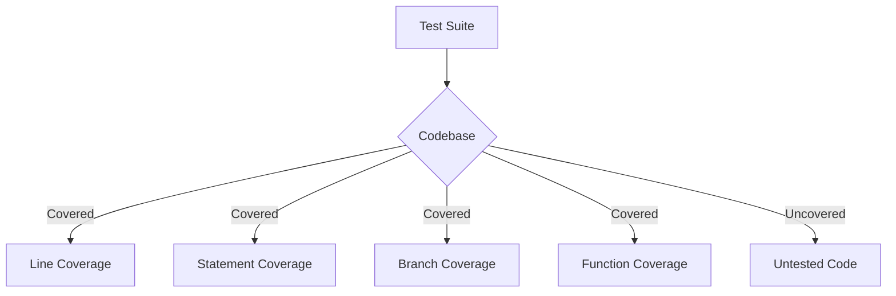

## 12.9 Code Coverage Analysis

In the realm of software development, ensuring the quality and reliability of your code is paramount. One of the key metrics used to assess the effectiveness of your tests is **code coverage**. This section will delve into the concept of code coverage, its various metrics, the tools available for analyzing coverage, and best practices for interpreting and utilizing coverage results effectively.

### Understanding Code Coverage

**Code coverage** is a measure used to describe the degree to which the source code of a program is executed when a particular test suite runs. It provides insights into which parts of your code are being tested and which are not, helping you identify untested areas that might harbor bugs.

#### Types of Code Coverage Metrics

1. **Line Coverage**: This metric indicates the percentage of lines of code that have been executed by the test suite. It helps in identifying which lines of code are not being tested.

2. **Statement Coverage**: Similar to line coverage, statement coverage measures the percentage of executable statements that have been run. It provides a broader view than line coverage, as a single line can contain multiple statements.

3. **Branch Coverage**: This metric measures the percentage of branches (e.g., `if` and `else` blocks) that have been executed. It ensures that all possible paths in the code are tested.

4. **Function Coverage**: Function coverage tracks the percentage of functions that have been called during testing. It helps ensure that all functions in the codebase are being exercised.

### Importance of Code Coverage

Code coverage is a valuable tool for identifying untested parts of your codebase. However, it's important to understand its limitations. High coverage does not necessarily mean high-quality tests. Coverage should be used as a guide to improve test quality, not as an end goal.

#### Limitations of Code Coverage

- **False Sense of Security**: High coverage numbers can give a false sense of security. Tests might cover code but not assert the correct behavior.
- **Quality Over Quantity**: It's possible to achieve high coverage with poor tests. Focus on writing meaningful tests that validate the behavior of your code.
- **Complexity and Edge Cases**: Coverage metrics might not capture complex scenarios or edge cases. Ensure your tests cover these aspects.

### Tools for Code Coverage Analysis

Several tools are available for generating code coverage reports in JavaScript. Two popular options are **Istanbul** and **Jest**.

#### Istanbul

[Istanbul](https://istanbul.js.org/) is a popular tool for JavaScript code coverage. It provides detailed coverage reports and integrates well with various testing frameworks.

**Generating Coverage Reports with Istanbul**

To generate a coverage report using Istanbul, you can use the following steps:

1. **Install Istanbul**: First, install Istanbul using npm:

   ```bash
   npm install --save-dev nyc
   ```

2. **Configure Istanbul**: Add a script to your `package.json` to run tests with coverage:

   ```json
   "scripts": {
     "test": "nyc mocha"
   }
   ```

3. **Run Tests**: Execute the test script to generate a coverage report:

   ```bash
   npm test
   ```

4. **View Coverage Report**: After running the tests, Istanbul generates a coverage report in the `coverage` directory. Open the `index.html` file in a browser to view detailed coverage information.

#### Jest

[Jest](https://jestjs.io/) is a popular testing framework for JavaScript that includes built-in support for code coverage.

**Generating Coverage Reports with Jest**

To generate a coverage report using Jest, follow these steps:

1. **Install Jest**: First, install Jest using npm:

   ```bash
   npm install --save-dev jest
   ```

2. **Configure Jest**: Add a script to your `package.json` to run tests with coverage:

   ```json
   "scripts": {
     "test": "jest --coverage"
   }
   ```

3. **Run Tests**: Execute the test script to generate a coverage report:

   ```bash
   npm test
   ```

4. **View Coverage Report**: Jest generates a coverage report in the `coverage` directory. Open the `index.html` file in a browser to view detailed coverage information.

### Best Practices for Interpreting Coverage Results

1. **Focus on Critical Code Paths**: Prioritize coverage for critical parts of your application, such as business logic and data processing.

2. **Balance Coverage and Test Quality**: Aim for a balance between high coverage and meaningful tests. Ensure tests validate the expected behavior.

3. **Use Coverage to Identify Gaps**: Use coverage reports to identify untested areas and write tests to cover those gaps.

4. **Regularly Review Coverage Reports**: Make coverage analysis a regular part of your development process to maintain test quality over time.

5. **Avoid Coverage as a Sole Metric**: Do not rely solely on coverage metrics to assess test quality. Consider other factors, such as test reliability and maintainability.

### Encouraging Meaningful Tests Over High Coverage

While achieving high code coverage is desirable, it's crucial to focus on writing meaningful tests that validate the behavior of your code. Here are some tips to encourage meaningful testing:

- **Write Tests for Edge Cases**: Ensure your tests cover edge cases and unexpected inputs.
- **Use Assertions Effectively**: Use assertions to validate the expected behavior of your code.
- **Refactor Tests Regularly**: Regularly review and refactor tests to improve their clarity and effectiveness.
- **Collaborate with Peers**: Collaborate with team members to review and improve test cases.

### Visualizing Code Coverage

To better understand how code coverage works, let's visualize the process using a flowchart. This diagram illustrates the interaction between your test suite and the codebase, highlighting the areas covered by tests.



**Diagram Description**: This flowchart represents the interaction between a test suite and the codebase. It shows how different coverage metrics (line, statement, branch, function) are derived from the codebase and highlights untested code.

### Try It Yourself

To reinforce your understanding of code coverage analysis, try modifying the code examples provided earlier. Experiment with adding new tests and observe how the coverage metrics change. Consider the following exercises:

- **Exercise 1**: Add a new test case to cover an untested branch in your code. Observe the change in branch coverage.
- **Exercise 2**: Refactor an existing test to improve its assertions. Check if the coverage metrics remain the same or improve.
- **Exercise 3**: Introduce a bug in your code and write a test to catch it. Verify that the test fails and the coverage report highlights the affected area.

### Key Takeaways

- **Code Coverage Metrics**: Understand the different types of coverage metrics (line, statement, branch, function) and their significance.
- **Tools for Coverage Analysis**: Familiarize yourself with tools like Istanbul and Jest for generating coverage reports.
- **Interpreting Coverage Results**: Focus on meaningful tests and use coverage as a guide to improve test quality.
- **Visualizing Coverage**: Use diagrams to visualize the interaction between tests and the codebase.
- **Continuous Improvement**: Regularly review and improve your test suite to maintain high-quality coverage.

### References and Further Reading

- [Istanbul Documentation](https://istanbul.js.org/)
- [Jest Documentation](https://jestjs.io/docs/getting-started)
- [MDN Web Docs: Code Coverage](https://developer.mozilla.org/en-US/docs/Glossary/Code_coverage)

Remember, this is just the beginning. As you progress, you'll build more robust and reliable test suites. Keep experimenting, stay curious, and enjoy the journey!

## Quiz: Mastering Code Coverage Analysis in JavaScript



### What is code coverage?

- [x] A metric that measures how much of the codebase is exercised by tests
- [ ] A tool for debugging code
- [ ] A method for optimizing code performance
- [ ] A technique for writing tests

> **Explanation:** Code coverage is a metric used to assess how much of the codebase is exercised by tests.

### Which of the following is NOT a type of code coverage metric?

- [ ] Line Coverage
- [ ] Branch Coverage
- [ ] Function Coverage
- [x] Variable Coverage

> **Explanation:** Variable coverage is not a recognized type of code coverage metric.

### What tool is commonly used for code coverage analysis in JavaScript?

- [x] Istanbul
- [ ] Selenium
- [ ] Webpack
- [ ] Babel

> **Explanation:** Istanbul is a popular tool for code coverage analysis in JavaScript.

### Why is high code coverage not always indicative of high-quality tests?

- [x] Tests might cover code but not assert correct behavior
- [ ] High coverage always indicates high-quality tests
- [ ] Coverage metrics capture all edge cases
- [ ] High coverage ensures no bugs in the code

> **Explanation:** High code coverage can give a false sense of security as tests might cover code but not assert correct behavior.

### What is the purpose of branch coverage?

- [x] To ensure all possible paths in the code are tested
- [ ] To measure the percentage of lines executed
- [ ] To track the percentage of functions called
- [ ] To identify untested variables

> **Explanation:** Branch coverage ensures that all possible paths in the code are tested.

### Which command generates a coverage report using Jest?

- [x] `jest --coverage`
- [ ] `jest --report`
- [ ] `jest --test`
- [ ] `jest --analyze`

> **Explanation:** The `jest --coverage` command generates a coverage report using Jest.

### What should be prioritized over achieving high coverage percentages?

- [x] Writing meaningful tests
- [ ] Increasing test execution speed
- [ ] Reducing the number of tests
- [ ] Achieving 100% coverage

> **Explanation:** Writing meaningful tests should be prioritized over achieving high coverage percentages.

### What does Istanbul generate after running tests?

- [x] A coverage report
- [ ] A performance report
- [ ] A bug report
- [ ] A test summary

> **Explanation:** Istanbul generates a coverage report after running tests.

### Which of the following is a limitation of code coverage?

- [x] It might not capture complex scenarios or edge cases
- [ ] It guarantees no bugs in the code
- [ ] It ensures high-quality tests
- [ ] It provides a complete view of code quality

> **Explanation:** Code coverage might not capture complex scenarios or edge cases.

### Code coverage should be used as a guide to improve test quality, not as an end goal.

- [x] True
- [ ] False

> **Explanation:** Code coverage should guide improvements in test quality, not be the sole focus.




