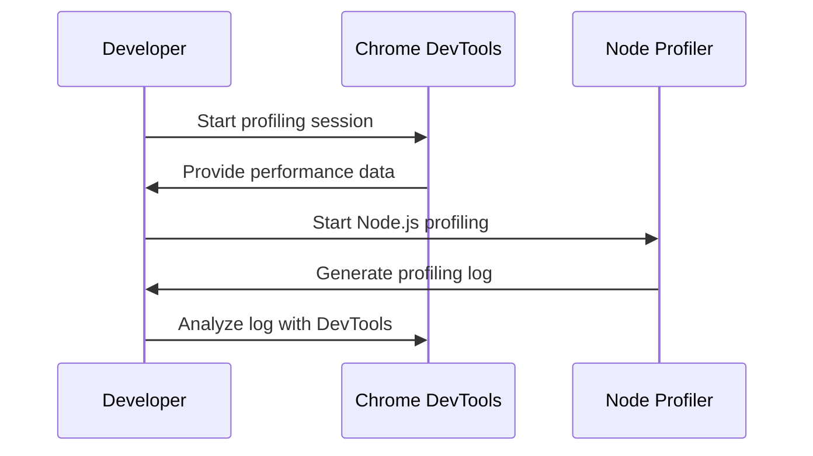

## 13.1 Profiling Tools and Techniques (Chrome DevTools, Node Profiler)

In the realm of modern web development, performance is paramount. As JavaScript applications grow in complexity, ensuring they run efficiently becomes a critical task. Profiling is an essential technique for identifying performance bottlenecks and optimizing code. In this section, we will delve into the tools and techniques available for profiling JavaScript code, both in the browser and in Node.js environments.

### The Importance of Profiling in Performance Optimization

Profiling is the process of measuring the space (memory) and time complexity of a program. It helps developers understand where their code spends the most time and consumes the most resources. By identifying these hotspots, developers can make informed decisions about where to focus optimization efforts.

- **Identify Bottlenecks**: Profiling helps pinpoint functions or operations that are consuming excessive CPU or memory resources.
- **Improve User Experience**: Faster applications lead to better user satisfaction and engagement.
- **Resource Management**: Efficient code reduces server load and can lead to cost savings in cloud environments.

### Browser Profiling Tools

#### Chrome DevTools Performance Panel

The [Chrome DevTools Performance Panel](https://developer.chrome.com/docs/devtools/evaluate-performance/) is a powerful tool for profiling web applications. It allows developers to record and analyze the performance of their applications in real-time.

- **Recording a Profile**: To start profiling, open Chrome DevTools, navigate to the Performance panel, and click the "Record" button. Interact with your application to capture the performance data.
- **Analyzing the Profile**: Once recording is stopped, the Performance panel displays a flame chart, which visualizes the call stack over time. This helps identify CPU-intensive functions.

```javascript
// Example of a CPU-intensive function
function computeFactorial(n) {
  if (n === 0) return 1;
  return n * computeFactorial(n - 1);
}

// Optimize using memoization
const memo = {};
function optimizedComputeFactorial(n) {
  if (n in memo) return memo[n];
  if (n === 0) return 1;
  return memo[n] = n * optimizedComputeFactorial(n - 1);
}
```

- **Identifying Memory Issues**: The Memory panel in DevTools can be used to detect memory leaks and excessive memory usage. Take heap snapshots and analyze them to find objects that are not being garbage collected.

#### Firefox Performance Tool

The [Firefox Performance Tool](https://firefox-source-docs.mozilla.org/devtools-user/performance/) offers similar capabilities to Chrome DevTools. It provides insights into the execution of JavaScript, layout, and rendering processes.

- **Recording and Analyzing**: Use the Performance tab to record a session. The tool provides a detailed breakdown of CPU usage, helping identify slow functions and rendering bottlenecks.

### Node.js Profiling Tools

#### Node.js Built-in Profiler

Node.js comes with a built-in profiler that can be used to analyze the performance of server-side applications. It generates a V8 profiler output that can be visualized using tools like Chrome DevTools.

- **Using the Profiler**: Run your Node.js application with the `--prof` flag to generate a profiling log.

```bash
node --prof app.js
```

- **Analyzing the Output**: Use the `node --prof-process` command to convert the log into a human-readable format.

```bash
node --prof-process isolate-0xnnnnnnnnnnnn-v8.log > processed.txt
```

#### Clinic.js

[Clinic.js](https://clinicjs.org/) is a suite of tools designed to help diagnose and fix performance issues in Node.js applications. It includes tools like Doctor, Bubbleprof, and Flame.

- **Clinic Doctor**: Provides an overview of the application's health and suggests improvements.
- **Clinic Bubbleprof**: Visualizes asynchronous operations to identify bottlenecks.
- **Clinic Flame**: Generates flame graphs to analyze CPU usage.

### Optimizing Code Based on Profiling Data

Once profiling data is collected, the next step is optimization. Here are some strategies:

- **Refactor CPU-Intensive Functions**: Use algorithms with better time complexity or apply techniques like memoization.
- **Optimize Memory Usage**: Identify and fix memory leaks by ensuring objects are properly dereferenced.
- **Reduce Network Latency**: Minimize the number of HTTP requests and use techniques like lazy loading.

### Best Practices for Ongoing Performance Monitoring

- **Automate Profiling**: Integrate profiling into your CI/CD pipeline to catch performance regressions early.
- **Use Monitoring Tools**: Tools like New Relic or Datadog can provide real-time insights into application performance.
- **Regularly Review Code**: Conduct performance audits periodically to ensure your application remains efficient.

### Visualizing JavaScript's Interaction with Profiling Tools



This diagram illustrates the interaction between a developer and profiling tools, highlighting the process of starting a profiling session, collecting data, and analyzing it for optimization.

### Try It Yourself

Experiment with the provided code examples by modifying the recursive function to use iterative approaches or by implementing additional optimizations. Observe the changes in performance using the profiling tools discussed.

### Knowledge Check

Reflect on the following questions to reinforce your understanding:

- What are the key differences between Chrome DevTools and Firefox Performance Tool?
- How can you identify a memory leak using profiling tools?
- What are the benefits of using Clinic.js for Node.js applications?

### Summary

Profiling is a critical step in optimizing JavaScript applications. By leveraging tools like Chrome DevTools and Node Profiler, developers can gain valuable insights into their code's performance, identify bottlenecks, and implement effective optimizations. Remember, this is just the beginning. As you progress, you'll build more efficient and responsive applications. Keep experimenting, stay curious, and enjoy the journey!

## Mastering JavaScript Profiling Tools and Techniques



### What is the primary purpose of profiling in JavaScript development?

- [x] To identify performance bottlenecks
- [ ] To write new features
- [ ] To debug syntax errors
- [ ] To manage version control

> **Explanation:** Profiling is used to identify performance bottlenecks in code, helping developers optimize resource usage.

### Which tool is used for profiling JavaScript in Chrome?

- [x] Chrome DevTools Performance Panel
- [ ] Firefox Performance Tool
- [ ] Node.js built-in profiler
- [ ] Clinic.js

> **Explanation:** The Chrome DevTools Performance Panel is used for profiling JavaScript in the Chrome browser.

### How can you start a profiling session in Node.js?

- [x] By using the `--prof` flag
- [ ] By opening Chrome DevTools
- [ ] By using the `--inspect` flag
- [ ] By running `npm start`

> **Explanation:** The `--prof` flag is used to start a profiling session in Node.js.

### What is the purpose of Clinic.js?

- [x] To diagnose and fix performance issues in Node.js
- [ ] To manage dependencies
- [ ] To compile JavaScript code
- [ ] To test JavaScript applications

> **Explanation:** Clinic.js is a suite of tools designed to diagnose and fix performance issues in Node.js applications.

### Which of the following is a technique to optimize CPU-intensive functions?

- [x] Memoization
- [ ] Increasing server resources
- [ ] Using more loops
- [ ] Adding more comments

> **Explanation:** Memoization is a technique used to optimize CPU-intensive functions by caching results of expensive function calls.

### What does the flame chart in Chrome DevTools represent?

- [x] The call stack over time
- [ ] The memory usage
- [ ] The network requests
- [ ] The DOM structure

> **Explanation:** The flame chart in Chrome DevTools visualizes the call stack over time, helping identify CPU-intensive functions.

### How can memory leaks be detected using profiling tools?

- [x] By analyzing heap snapshots
- [ ] By checking console logs
- [ ] By increasing memory allocation
- [ ] By using more variables

> **Explanation:** Memory leaks can be detected by analyzing heap snapshots to find objects that are not being garbage collected.

### What is a benefit of integrating profiling into CI/CD pipelines?

- [x] Catching performance regressions early
- [ ] Writing more code
- [ ] Reducing code complexity
- [ ] Increasing code readability

> **Explanation:** Integrating profiling into CI/CD pipelines helps catch performance regressions early in the development process.

### Which tool provides a visual representation of asynchronous operations in Node.js?

- [x] Clinic Bubbleprof
- [ ] Chrome DevTools
- [ ] Node.js built-in profiler
- [ ] Firefox Performance Tool

> **Explanation:** Clinic Bubbleprof visualizes asynchronous operations to identify bottlenecks in Node.js applications.

### Profiling is only necessary during the initial development phase.

- [ ] True
- [x] False

> **Explanation:** Profiling should be an ongoing process throughout the development lifecycle to ensure optimal performance.




