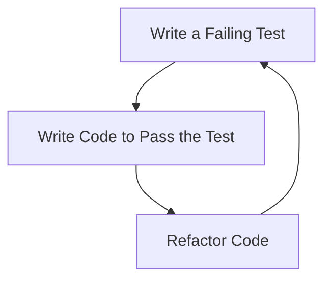
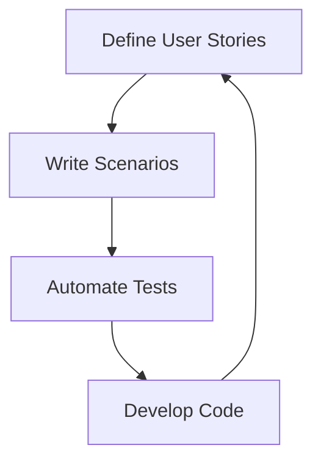

## 13.1 Test-Driven Development (TDD) and Behavior-Driven Development (BDD)

In the realm of software development, ensuring code quality and meeting user expectations are paramount. Two methodologies that significantly contribute to these goals are Test-Driven Development (TDD) and Behavior-Driven Development (BDD). This article delves into these testing patterns, highlighting their principles, implementation steps, tools, and best practices in the context of JavaScript and TypeScript.

### Understanding the Concepts

#### TDD (Test-Driven Development)

Test-Driven Development is a software development approach where tests are written before the actual code. It follows a simple yet effective cycle:

- **Red (Fail):** Write a test that fails because the functionality is not yet implemented.
- **Green (Pass):** Write the minimal amount of code necessary to pass the test.
- **Refactor:** Improve the code structure while ensuring the test still passes.

TDD aims for short development iterations, allowing developers to focus on small, manageable pieces of functionality.

#### BDD (Behavior-Driven Development)

Behavior-Driven Development extends TDD by emphasizing the behavior expected by the end-user. It uses human-readable descriptions to define tests, enhancing collaboration between developers, testers, and non-technical stakeholders. BDD focuses on:

- **Defining User Stories:** Using a format like "As a [role], I want [feature], so that [benefit]."
- **Writing Scenarios:** Describing behaviors using the Given-When-Then syntax.

### Implementation Steps

#### For TDD

1. **Identify a Functionality:**
   - Choose a small piece of functionality to implement.

2. **Write a Test Case:**
   - Write a unit test that fails because the functionality is not yet implemented.

3. **Implement Code:**
   - Write the minimal code necessary to pass the test.

4. **Refactor:**
   - Improve the code structure while ensuring the test still passes.

5. **Repeat:**
   - Continue with the next piece of functionality.

#### For BDD

1. **Define User Stories:**
   - Write features using the format "As a [role], I want [feature], so that [benefit]."

2. **Write Scenarios:**
   - Use Given-When-Then syntax to describe behaviors.

3. **Automate Tests:**
   - Use BDD tools to automate the scenarios.

4. **Develop Code:**
   - Implement the code to fulfill the behaviors specified.

### Tools and Frameworks

#### TDD

- **Jest:** A delightful JavaScript testing framework with a focus on simplicity.
- **Mocha:** A flexible testing framework for Node.js.
- **Jasmine:** A behavior-driven development framework for testing JavaScript code.

#### BDD

- **Cucumber.js:** A tool for running automated tests written in plain language.
- **Jasmine (with BDD syntax):** Supports BDD-style testing.
- **CodeceptJS:** A modern end-to-end testing framework with BDD-style syntax.

### Practice

- **Begin a New Feature by Writing a Failing Test First:** This ensures that the development is test-driven.
- **Collaborate with Stakeholders:** Define behaviors in natural language to ensure alignment with user expectations.
- **Regularly Refactor Code:** Improve design and maintainability without altering functionality.

### Considerations

- **Keep Tests Clear and Focused:** Each test should focus on a single functionality.
- **Ensure Tests are Repeatable and Independent:** Tests should not depend on each other and should yield the same results every time.
- **Use Continuous Integration Tools:** Automate the running of tests to catch issues early.

### Visual Aids

#### TDD Cycle Diagram



#### BDD Workflow Diagram



### Code Examples

#### TDD Example with Jest

```typescript
// calculator.test.ts
import { add } from './calculator';

test('adds 1 + 2 to equal 3', () => {
  expect(add(1, 2)).toBe(3);
});

// calculator.ts
export function add(a: number, b: number): number {
  return a + b;
}
```

#### BDD Example with Cucumber.js

```gherkin
Feature: Addition
  As a user
  I want to add two numbers
  So that I can see the result

  Scenario: Add two numbers
    Given I have entered 1 into the calculator
    And I have entered 2 into the calculator
    When I press add
    Then the result should be 3 on the screen
```

```typescript
// steps.ts
import { Given, When, Then } from '@cucumber/cucumber';
import { expect } from 'chai';

let result: number;
let calculator: Calculator;

Given('I have entered {int} into the calculator', (number: number) => {
  calculator.enter(number);
});

When('I press add', () => {
  result = calculator.add();
});

Then('the result should be {int} on the screen', (expectedResult: number) => {
  expect(result).to.equal(expectedResult);
});
```

### Advantages and Disadvantages

#### TDD

**Advantages:**
- Ensures code correctness.
- Facilitates refactoring.
- Encourages simple design.

**Disadvantages:**
- Can be time-consuming.
- Requires a learning curve.

#### BDD

**Advantages:**
- Enhances collaboration.
- Aligns development with business goals.
- Improves communication.

**Disadvantages:**
- Requires stakeholder involvement.
- Can be challenging to automate complex scenarios.

### Best Practices

- **For TDD:** Keep tests atomic and focused. Refactor regularly.
- **For BDD:** Use clear, concise language. Collaborate closely with stakeholders.

### Comparisons

- **TDD vs. BDD:** TDD focuses on the technical correctness of code, while BDD emphasizes the behavior and user experience.

### Conclusion

Test-Driven Development (TDD) and Behavior-Driven Development (BDD) are powerful methodologies that enhance code quality and ensure alignment with user expectations. By integrating these practices into your JavaScript and TypeScript projects, you can achieve more reliable and maintainable software.

## Quiz Time!



### What is the primary cycle of TDD?

- [x] Red (fail) → Green (pass) → Refactor
- [ ] Green (pass) → Red (fail) → Refactor
- [ ] Refactor → Red (fail) → Green (pass)
- [ ] Red (fail) → Refactor → Green (pass)

> **Explanation:** TDD follows the cycle of Red (fail), Green (pass), and Refactor to ensure code correctness and simplicity.

### What does BDD emphasize?

- [x] Behavior expected by the end-user
- [ ] Technical correctness of code
- [ ] Code performance
- [ ] Code security

> **Explanation:** BDD focuses on the behavior expected by the end-user, enhancing collaboration and communication.

### Which tool is commonly used for TDD in JavaScript?

- [x] Jest
- [ ] Cucumber.js
- [ ] CodeceptJS
- [ ] Selenium

> **Explanation:** Jest is a popular testing framework used for TDD in JavaScript.

### What syntax does BDD use to describe behaviors?

- [x] Given-When-Then
- [ ] Arrange-Act-Assert
- [ ] Setup-Execute-Verify
- [ ] Before-After-Then

> **Explanation:** BDD uses the Given-When-Then syntax to describe behaviors in a human-readable format.

### Which of the following is a BDD tool?

- [x] Cucumber.js
- [ ] Mocha
- [ ] Jest
- [ ] JUnit

> **Explanation:** Cucumber.js is a tool used for BDD, allowing tests to be written in plain language.

### What is the first step in TDD?

- [x] Write a failing test
- [ ] Write the code
- [ ] Refactor the code
- [ ] Deploy the application

> **Explanation:** In TDD, the first step is to write a test that fails because the functionality is not yet implemented.

### What is a key benefit of BDD?

- [x] Enhances collaboration between stakeholders
- [ ] Reduces code execution time
- [ ] Increases code complexity
- [ ] Limits user involvement

> **Explanation:** BDD enhances collaboration between developers, testers, and non-technical stakeholders by focusing on user behavior.

### What should tests be in TDD?

- [x] Repeatable and independent
- [ ] Complex and interdependent
- [ ] Sporadic and dependent
- [ ] Random and interconnected

> **Explanation:** Tests in TDD should be repeatable and independent to ensure reliability and consistency.

### What is the purpose of refactoring in TDD?

- [x] Improve code structure
- [ ] Add new features
- [ ] Increase code size
- [ ] Reduce test coverage

> **Explanation:** Refactoring in TDD aims to improve the code structure while ensuring that the tests still pass.

### TDD and BDD are methodologies used to enhance what aspect of software development?

- [x] Code quality and user alignment
- [ ] Code obfuscation and complexity
- [ ] Code execution speed
- [ ] Code size and length

> **Explanation:** TDD and BDD enhance code quality and ensure alignment with user expectations.


