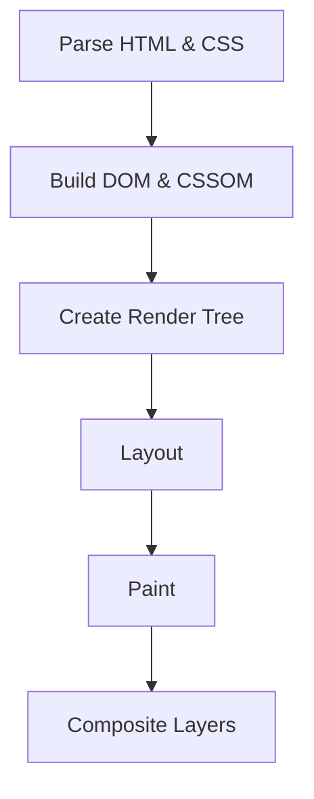

## 13.10 Minimizing Repaints and Reflows

In the world of web development, performance is paramount. A key aspect of optimizing web performance is minimizing repaints and reflows. These processes are integral to how browsers render web pages, and understanding them can lead to significant improvements in the responsiveness and efficiency of your applications.

### Understanding Repaints and Reflows

#### What Are Repaints and Reflows?

**Repaints** and **reflows** are part of the browser's rendering process. When a web page is loaded, the browser parses the HTML and CSS to construct the **DOM (Document Object Model)** and **CSSOM (CSS Object Model)**. These models are then used to create the **render tree**, which is a visual representation of the document.

- **Repaint**: This occurs when changes are made to an element's appearance that do not affect its layout, such as changing the background color. The browser simply repaints the affected pixels.

- **Reflow**: This is more complex and occurs when changes affect the layout of the document. This could be due to changes in size, position, or structure of elements. Reflows are more computationally expensive than repaints because they require the browser to recalculate the positions and geometries of elements.

#### How Do Repaints and Reflows Affect Performance?

Repaints and reflows can significantly impact performance, especially on complex pages or devices with limited resources. Frequent reflows can lead to **layout thrashing**, where the browser is forced to recalculate layouts repeatedly, causing jank and slowdowns.

### Common Causes of Excessive Repaints and Reflows

1. **DOM Manipulations**: Frequent changes to the DOM can trigger reflows. This includes adding, removing, or modifying elements.

2. **CSS Changes**: Modifying styles that affect layout, such as width, height, or font size, can cause reflows.

3. **JavaScript Calculations**: Accessing layout properties like `offsetWidth` or `clientHeight` can trigger reflows because the browser needs to ensure the layout is up-to-date.

4. **Animations**: Animations that change layout properties can cause continuous reflows.

### Techniques for Minimizing Repaints and Reflows

#### Avoiding Layout Thrashing

**Layout thrashing** occurs when JavaScript reads from and writes to the DOM repeatedly, causing multiple reflows. To avoid this:

- **Batch DOM Changes**: Group multiple DOM reads and writes together to minimize reflows.

```javascript
// Inefficient: Causes multiple reflows
element.style.width = "100px";
console.log(element.offsetHeight);
element.style.height = "200px";

// Efficient: Batches changes
element.style.cssText = "width: 100px; height: 200px;";
console.log(element.offsetHeight);
```

- **Use Document Fragments**: When adding multiple elements, use a `DocumentFragment` to batch changes.

```javascript
const fragment = document.createDocumentFragment();
for (let i = 0; i < 100; i++) {
  const newElement = document.createElement('div');
  newElement.textContent = `Item ${i}`;
  fragment.appendChild(newElement);
}
document.body.appendChild(fragment);
```

#### Using CSS Instead of JavaScript for Animations

CSS animations are often more performant than JavaScript animations because they can be optimized by the browser. Use CSS transitions and animations whenever possible.

```css
/* CSS Animation */
.element {
  transition: transform 0.3s ease-in-out;
}

.element:hover {
  transform: translateX(100px);
}
```

#### Applying Transformations and Opacity for Hardware Acceleration

Modern browsers can offload certain CSS properties, like `transform` and `opacity`, to the GPU, which can handle these operations more efficiently than the CPU.

```css
/* Use transform for animations */
.element {
  transition: transform 0.5s;
}

.element:hover {
  transform: scale(1.1);
}
```

### Tools for Identifying Repaint and Reflow Issues

**Chrome DevTools** provides a feature called **Paint Flashing** that highlights areas of the page that are being repainted. This can help identify which elements are causing excessive repaints.

- **Enable Paint Flashing**: Open Chrome DevTools, go to the "Rendering" tab, and check "Paint Flashing".

### Best Practices for Writing Performant CSS and Animations

1. **Minimize CSS Selectors**: Use simple and specific selectors to reduce the complexity of the CSSOM.

2. **Avoid Inline Styles**: Use external stylesheets to separate content from presentation, which can improve caching and reduce reflows.

3. **Use Flexbox and Grid**: These modern layout techniques can simplify complex layouts and reduce the need for JavaScript-based positioning.

4. **Limit the Use of Expensive Properties**: Properties like `box-shadow` and `border-radius` can be costly in terms of repaints.

5. **Optimize Images and Media**: Use appropriately sized images and consider lazy loading to reduce initial load times.

### Try It Yourself

Experiment with the following code snippets to see how different techniques affect performance. Try modifying the CSS and JavaScript to observe changes in repaint and reflow behavior.

```html
<!DOCTYPE html>
<html lang="en">
<head>
  <meta charset="UTF-8">
  <meta name="viewport" content="width=device-width, initial-scale=1.0">
  <style>
    .box {
      width: 100px;
      height: 100px;
      background-color: blue;
      transition: transform 0.5s;
    }

    .box:hover {
      transform: translateX(100px);
    }
  </style>
</head>
<body>
  <div class="box"></div>
  <script>
    const box = document.querySelector('.box');
    box.addEventListener('click', () => {
      box.style.width = '200px'; // Try changing this to see the effect on reflows
    });
  </script>
</body>
</html>
```

### Visualizing the Rendering Process

To better understand how repaints and reflows work, let's visualize the rendering process using a flowchart.



**Diagram Description**: This flowchart represents the browser's rendering process, starting from parsing HTML and CSS to building the DOM and CSSOM, creating the render tree, performing layout calculations, painting, and finally compositing layers.

### References and Further Reading

- [MDN Web Docs: Repaints and Reflows](https://developer.mozilla.org/en-US/docs/Web/Performance/Reflow)
- [Google Developers: Rendering Performance](https://developers.google.com/web/fundamentals/performance/rendering)
- [CSS Tricks: Understanding Repaint and Reflow](https://css-tricks.com/understanding-repaint-reflow/)

### Knowledge Check

To reinforce your understanding, consider these questions:

- What is the difference between a repaint and a reflow?
- How can layout thrashing be avoided?
- Why is it beneficial to use CSS for animations instead of JavaScript?
- What tools can be used to identify repaint and reflow issues?

### Embrace the Journey

Remember, optimizing web performance is an ongoing process. As you continue to refine your skills, you'll discover new techniques and tools to enhance your applications. Keep experimenting, stay curious, and enjoy the journey!

## Quiz: Mastering Repaints and Reflows in Web Development



### What is a repaint in the context of web rendering?

- [x] A change in the appearance of an element that does not affect its layout
- [ ] A change in the layout of the document
- [ ] The initial rendering of a web page
- [ ] The process of loading external resources

> **Explanation:** A repaint occurs when changes are made to an element's appearance that do not affect its layout, such as changing the background color.

### What causes a reflow in a web page?

- [x] Changes that affect the layout of the document
- [ ] Changes that only affect the color of an element
- [ ] Loading external scripts
- [ ] Adding event listeners

> **Explanation:** A reflow occurs when changes affect the layout of the document, such as changes in size, position, or structure of elements.

### How can layout thrashing be minimized?

- [x] By batching DOM changes
- [ ] By using inline styles
- [ ] By increasing the number of event listeners
- [ ] By using complex CSS selectors

> **Explanation:** Batching DOM changes helps minimize layout thrashing by reducing the number of reflows.

### Why is it recommended to use CSS for animations?

- [x] CSS animations can be optimized by the browser
- [ ] CSS animations are always faster than JavaScript animations
- [ ] CSS animations do not affect performance
- [ ] CSS animations are easier to write

> **Explanation:** CSS animations can be optimized by the browser, often resulting in better performance compared to JavaScript animations.

### Which CSS properties can be offloaded to the GPU for better performance?

- [x] Transform and opacity
- [ ] Width and height
- [ ] Margin and padding
- [ ] Font size and color

> **Explanation:** Transform and opacity can be offloaded to the GPU, which can handle these operations more efficiently.

### What tool in Chrome DevTools can help identify repaint issues?

- [x] Paint Flashing
- [ ] Network Throttling
- [ ] Console
- [ ] Lighthouse

> **Explanation:** Paint Flashing in Chrome DevTools highlights areas of the page that are being repainted.

### What is the render tree?

- [x] A visual representation of the document used for rendering
- [ ] A data structure for storing CSS rules
- [ ] A list of all event listeners on a page
- [ ] A map of all network requests

> **Explanation:** The render tree is a visual representation of the document used for rendering.

### What is layout thrashing?

- [x] Repeatedly reading from and writing to the DOM, causing multiple reflows
- [ ] A technique for optimizing CSS animations
- [ ] A method for reducing network requests
- [ ] A process for caching resources

> **Explanation:** Layout thrashing occurs when JavaScript reads from and writes to the DOM repeatedly, causing multiple reflows.

### What is the purpose of using DocumentFragment?

- [x] To batch DOM changes and reduce reflows
- [ ] To store CSS styles
- [ ] To manage event listeners
- [ ] To optimize network requests

> **Explanation:** DocumentFragment is used to batch DOM changes, which helps reduce reflows.

### True or False: Reflows are less computationally expensive than repaints.

- [ ] True
- [x] False

> **Explanation:** Reflows are more computationally expensive than repaints because they require recalculating the positions and geometries of elements.


