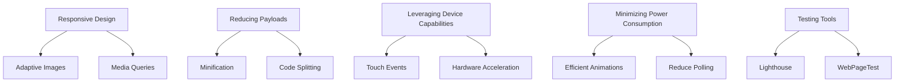

## 13.11 Optimizing for Mobile Devices

In the ever-evolving landscape of web development, optimizing for mobile devices is crucial. Mobile devices often come with constraints such as limited processing power, variable network conditions, and smaller screens. This section delves into strategies and best practices for optimizing JavaScript applications for mobile devices, ensuring they are performant, accessible, and user-friendly.

### Challenges Unique to Mobile Performance

Mobile devices present unique challenges that developers must address to ensure optimal performance:

- **Limited Resources**: Mobile devices typically have less processing power and memory compared to desktops.
- **Variable Network Conditions**: Mobile users often experience fluctuating network speeds, making efficient data loading essential.
- **Battery Consumption**: Intensive applications can drain battery life quickly, affecting user experience.
- **Screen Size and Resolution**: Smaller screens require careful design to ensure readability and usability.
- **Touch Interfaces**: Mobile devices rely on touch interactions, necessitating different design considerations compared to mouse and keyboard inputs.

### Strategies for Optimization

#### Responsive Design and Adaptive Images

Responsive design is essential for creating applications that work well on any device. Here are some strategies:

- **Use Media Queries**: Implement CSS media queries to adjust layouts based on screen size and resolution.
  
  ```css
  @media (max-width: 600px) {
    .container {
      flex-direction: column;
    }
  }
  ```

- **Adaptive Images**: Serve different image sizes based on the device's screen size and resolution. Use the `srcset` attribute to provide multiple image sources.

  ```html
  
  ```

- **Responsive Frameworks**: Utilize frameworks like Bootstrap or Foundation that offer built-in responsive design components.

#### Reducing JavaScript and CSS Payloads

Reducing the size of JavaScript and CSS files can significantly improve load times:

- **Minification**: Use tools like UglifyJS or CSSNano to minify JavaScript and CSS files, removing unnecessary characters and whitespace.
- **Code Splitting**: Implement code splitting to load only the necessary code for the current page, reducing initial load times.
  
  ```javascript
  import(/* webpackChunkName: "lodash" */ 'lodash').then(({ default: _ }) => {
    // Use lodash here
  });
  ```

- **Tree Shaking**: Remove unused code from JavaScript bundles using tools like Webpack.

#### Leveraging Device Capabilities

Take advantage of mobile device capabilities to enhance performance and user experience:

- **Touch Events**: Optimize touch interactions by using touch-specific events like `touchstart` and `touchend`.

  ```javascript
  element.addEventListener('touchstart', function(event) {
    // Handle touch start
  });
  ```

- **Hardware Acceleration**: Use CSS properties like `transform` and `opacity` to leverage GPU acceleration for smoother animations.

  ```css
  .animated {
    transform: translate3d(0, 0, 0);
  }
  ```

#### Minimizing Power Consumption

Efficient code can help reduce power consumption, extending battery life:

- **Efficient Animations**: Use CSS animations instead of JavaScript for smoother and more power-efficient animations.
- **Reduce Polling**: Avoid frequent polling for data updates. Use WebSockets or Server-Sent Events for real-time data without excessive polling.

### Tools for Mobile Performance Testing

Testing is crucial to ensure your application performs well on mobile devices. Here are some tools to consider:

- **[Lighthouse](https://developers.google.com/web/tools/lighthouse)**: An open-source tool for auditing web performance, accessibility, and SEO. It provides insights and recommendations for improving mobile performance.
- **[WebPageTest](https://www.webpagetest.org/)**: A tool that allows you to run performance tests from different locations and devices, providing detailed reports on load times and resource usage.

### Best Practices for Accessibility and Usability

Ensuring accessibility and usability is vital for reaching a broader audience:

- **Semantic HTML**: Use semantic HTML elements to improve accessibility and SEO.
  
  ```html
  <header>
    <h1>Page Title</h1>
  </header>
  ```

- **Keyboard Navigation**: Ensure that all interactive elements are accessible via keyboard navigation.
- **Color Contrast**: Maintain sufficient color contrast to ensure readability for users with visual impairments.
- **Accessible Forms**: Use labels and ARIA attributes to make forms accessible.

  ```html
  <label for="name">Name:</label>
  <input type="text" id="name" aria-required="true">
  ```

### Visualizing Mobile Optimization Strategies

Below is a diagram illustrating the interaction between various optimization strategies and their impact on mobile performance.



### Try It Yourself

Experiment with the following code snippets to see how they affect mobile performance. Try modifying the media queries or implementing code splitting in a small project.

### Knowledge Check

- What are the key challenges in optimizing for mobile devices?
- How can adaptive images improve mobile performance?
- What tools can be used to test mobile performance?

### Summary

Optimizing for mobile devices requires a comprehensive approach that addresses performance, usability, and accessibility. By implementing responsive design, reducing payloads, leveraging device capabilities, and using testing tools, you can create applications that perform well across a variety of mobile devices. Remember, this is just the beginning. As you progress, you'll build more complex and interactive web pages. Keep experimenting, stay curious, and enjoy the journey!

## Quiz: Mastering Mobile Performance Optimization



### What is a key challenge unique to mobile performance?

- [x] Limited resources
- [ ] Unlimited bandwidth
- [ ] Large screen sizes
- [ ] Consistent power supply

> **Explanation:** Mobile devices often have limited processing power and memory compared to desktops.

### Which CSS property can leverage GPU acceleration for smoother animations?

- [x] transform
- [ ] display
- [ ] color
- [ ] font-size

> **Explanation:** The `transform` property can leverage GPU acceleration, making animations smoother.

### What is the purpose of code splitting?

- [x] To load only necessary code for the current page
- [ ] To increase the size of JavaScript bundles
- [ ] To duplicate code across multiple files
- [ ] To remove all comments from code

> **Explanation:** Code splitting helps reduce initial load times by loading only the necessary code for the current page.

### Which tool provides insights and recommendations for improving mobile performance?

- [x] Lighthouse
- [ ] Photoshop
- [ ] Excel
- [ ] Notepad

> **Explanation:** Lighthouse is an open-source tool for auditing web performance, accessibility, and SEO.

### How can adaptive images improve mobile performance?

- [x] By serving different image sizes based on device screen size
- [ ] By using the same image size for all devices
- [ ] By increasing image resolution
- [ ] By converting images to text

> **Explanation:** Adaptive images serve different sizes based on the device's screen size, improving load times.

### What is a benefit of using semantic HTML?

- [x] Improved accessibility and SEO
- [ ] Increased file size
- [ ] Slower load times
- [ ] Reduced readability

> **Explanation:** Semantic HTML improves accessibility and SEO by providing meaningful structure to web content.

### Which event is specific to touch interactions on mobile devices?

- [x] touchstart
- [ ] click
- [ ] hover
- [ ] focus

> **Explanation:** The `touchstart` event is specific to touch interactions on mobile devices.

### What is a common tool for testing mobile performance?

- [x] WebPageTest
- [ ] Microsoft Word
- [ ] Adobe Illustrator
- [ ] VLC Media Player

> **Explanation:** WebPageTest is a tool that allows you to run performance tests from different locations and devices.

### How can you minimize power consumption in mobile applications?

- [x] Use efficient animations
- [ ] Increase polling frequency
- [ ] Use large images
- [ ] Disable caching

> **Explanation:** Efficient animations reduce power consumption, extending battery life.

### True or False: Responsive design is only about adjusting layouts for different screen sizes.

- [x] True
- [ ] False

> **Explanation:** Responsive design involves adjusting layouts, images, and other elements to ensure usability across various devices.




