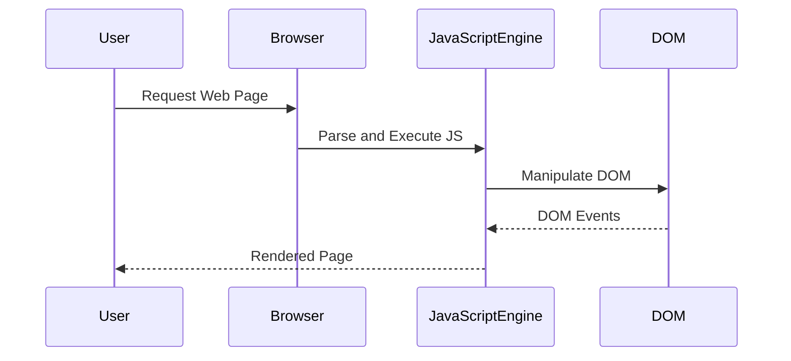

## 13.12 Best Practices for High-Performance JavaScript

In the world of modern web development, performance is a critical factor that can make or break the user experience. JavaScript, being a core technology for web applications, plays a significant role in determining the performance of a web page. This section will guide you through best practices for writing high-performance JavaScript code, ensuring your applications run smoothly and efficiently.

### Understanding JavaScript Performance

Before diving into specific practices, it's essential to understand what affects JavaScript performance. JavaScript execution is influenced by several factors, including:

- **The JavaScript Engine**: Different browsers use different engines (e.g., V8 for Chrome, SpiderMonkey for Firefox), each with its own optimizations.
- **The Event Loop**: JavaScript is single-threaded, and the event loop manages asynchronous operations.
- **Memory Management**: Efficient use of memory and garbage collection can impact performance.
- **DOM Manipulation**: Interacting with the DOM can be costly in terms of performance.

### Avoiding Unnecessary Computations

One of the fundamental principles of high-performance JavaScript is to avoid unnecessary computations. This can be achieved through various strategies:

#### Minimize DOM Access

Accessing and manipulating the DOM is one of the most expensive operations in JavaScript. To minimize its impact:

- **Batch DOM Updates**: Instead of making multiple changes to the DOM, batch them together to reduce reflows and repaints.
- **Use Document Fragments**: When adding multiple elements, use a document fragment to build the elements and then append them to the DOM in one go.

```javascript
// Example of using a document fragment
const fragment = document.createDocumentFragment();
for (let i = 0; i < 100; i++) {
  const newElement = document.createElement('div');
  newElement.textContent = `Item ${i}`;
  fragment.appendChild(newElement);
}
document.body.appendChild(fragment);
```

#### Cache Length in Loops

When iterating over arrays or collections, cache the length of the collection to avoid recalculating it on each iteration.

```javascript
// Inefficient loop
for (let i = 0; i < array.length; i++) {
  // Do something with array[i]
}

// Efficient loop
for (let i = 0, len = array.length; i < len; i++) {
  // Do something with array[i]
}
```

### Leveraging Built-in Methods and Optimized Algorithms

JavaScript provides a plethora of built-in methods and optimized algorithms that can significantly enhance performance.

#### Use Native Methods

Whenever possible, use native methods provided by JavaScript, as they are often optimized by the JavaScript engine.

```javascript
// Using native methods
const numbers = [1, 2, 3, 4, 5];
const doubled = numbers.map(num => num * 2);
```

#### Choose the Right Algorithm

Selecting the appropriate algorithm for a task can drastically affect performance. For example, when searching for an element in a sorted array, use a binary search instead of a linear search.

```javascript
// Binary search implementation
function binarySearch(arr, target) {
  let left = 0;
  let right = arr.length - 1;
  while (left <= right) {
    const mid = Math.floor((left + right) / 2);
    if (arr[mid] === target) return mid;
    if (arr[mid] < target) left = mid + 1;
    else right = mid - 1;
  }
  return -1;
}
```

### Using Appropriate Data Structures

Choosing the right data structure is crucial for performance optimization. Here are some guidelines:

#### Arrays vs. Objects

- **Arrays**: Use arrays for ordered collections and when you need to perform operations like map, filter, or reduce.
- **Objects**: Use objects for key-value pairs and when you need fast lookups.

```javascript
// Using an array
const fruits = ['apple', 'banana', 'cherry'];

// Using an object
const fruitPrices = {
  apple: 1.2,
  banana: 0.5,
  cherry: 2.0
};
```

#### Sets and Maps

- **Set**: Use a Set for unique values and when you need to check for the existence of an item quickly.
- **Map**: Use a Map for key-value pairs where keys are not limited to strings.

```javascript
// Using a Set
const uniqueNumbers = new Set([1, 2, 3, 3, 4]);

// Using a Map
const userRoles = new Map();
userRoles.set('admin', 'Admin User');
userRoles.set('editor', 'Editor User');
```

### Common Anti-Patterns to Avoid

Avoiding anti-patterns is as important as following best practices. Here are some common pitfalls:

#### Blocking the Event Loop

JavaScript is single-threaded, so blocking the event loop can cause the UI to freeze. Avoid long-running operations on the main thread.

```javascript
// Blocking code
function heavyComputation() {
  for (let i = 0; i < 1e9; i++) {
    // Intensive computation
  }
}

// Use Web Workers for heavy computation
const worker = new Worker('worker.js');
worker.postMessage('start');
```

#### Inefficient Event Handling

Avoid attaching too many event listeners, especially on elements that are frequently added or removed from the DOM.

```javascript
// Inefficient event handling
document.querySelectorAll('button').forEach(button => {
  button.addEventListener('click', () => {
    // Handle click
  });
});

// Use event delegation
document.body.addEventListener('click', event => {
  if (event.target.tagName === 'BUTTON') {
    // Handle click
  }
});
```

### Profiling and Performance Testing

Regular profiling and performance testing are essential to identify bottlenecks and optimize your code.

#### Use Browser DevTools

Most modern browsers come with built-in developer tools that allow you to profile JavaScript performance.

- **Performance Tab**: Use this to record and analyze the performance of your application.
- **Memory Tab**: Identify memory leaks and optimize memory usage.

#### Automated Performance Testing

Incorporate automated performance testing into your development workflow using tools like Lighthouse or WebPageTest.

### Try It Yourself

To solidify your understanding, try modifying the code examples provided. For instance, experiment with different data structures or algorithms and observe the impact on performance. Use browser DevTools to profile your changes and identify any improvements or regressions.

### Visualizing JavaScript Performance

To better understand how JavaScript interacts with web browsers and web pages, let's visualize the process using a sequence diagram.



**Caption**: This diagram illustrates the interaction between the user, browser, JavaScript engine, and DOM during the execution of a web page.

### Key Takeaways

- **Avoid unnecessary computations** by minimizing DOM access and caching values.
- **Leverage built-in methods** and choose the right algorithms for your tasks.
- **Use appropriate data structures** like arrays, objects, sets, and maps.
- **Avoid common anti-patterns** such as blocking the event loop and inefficient event handling.
- **Regularly profile and test performance** to identify and address bottlenecks.

### Embrace the Journey

Remember, optimizing JavaScript performance is an ongoing process. As you continue to develop your skills, you'll discover new techniques and strategies to enhance your applications. Keep experimenting, stay curious, and enjoy the journey!

### References and Links

- [MDN Web Docs: JavaScript Performance](https://developer.mozilla.org/en-US/docs/Web/JavaScript/Performance)
- [Google Developers: Optimize JavaScript Execution](https://developers.google.com/web/fundamentals/performance/optimizing-javascript)
- [WebPageTest](https://www.webpagetest.org/)

## Test Your Knowledge on High-Performance JavaScript



### What is one of the most expensive operations in JavaScript?

- [x] DOM manipulation
- [ ] Variable declaration
- [ ] Function definition
- [ ] String concatenation

> **Explanation:** DOM manipulation is costly because it often triggers reflows and repaints, which are resource-intensive operations.

### Which of the following is a native method in JavaScript?

- [x] Array.prototype.map
- [ ] customMapFunction
- [ ] Array.prototype.customMap
- [ ] mapArrayFunction

> **Explanation:** `Array.prototype.map` is a built-in method in JavaScript, optimized for performance.

### What is the advantage of using a Set in JavaScript?

- [x] Ensures unique values
- [ ] Allows duplicate values
- [ ] Provides key-value pairs
- [ ] Slower than arrays

> **Explanation:** A Set stores unique values, making it ideal for operations where duplicates are not allowed.

### How can you avoid blocking the event loop in JavaScript?

- [x] Use Web Workers
- [ ] Use synchronous functions
- [ ] Increase loop iterations
- [ ] Use more event listeners

> **Explanation:** Web Workers allow you to run scripts in background threads, preventing the main thread from being blocked.

### Which tool can be used for automated performance testing?

- [x] Lighthouse
- [ ] Notepad
- [ ] Paint
- [ ] Calculator

> **Explanation:** Lighthouse is a tool that provides insights into the performance of web applications.

### What is the purpose of caching the length of an array in a loop?

- [x] To avoid recalculating it on each iteration
- [ ] To increase the array size
- [ ] To decrease the array size
- [ ] To change the array elements

> **Explanation:** Caching the length prevents the need to recalculate it on each loop iteration, improving performance.

### What is the benefit of using document fragments?

- [x] Reduces reflows and repaints
- [ ] Increases DOM size
- [ ] Slows down rendering
- [ ] Increases memory usage

> **Explanation:** Document fragments allow you to make multiple DOM changes at once, reducing reflows and repaints.

### Which of the following is a common anti-pattern in JavaScript?

- [x] Blocking the event loop
- [ ] Using native methods
- [ ] Optimizing loops
- [ ] Caching values

> **Explanation:** Blocking the event loop can cause the UI to freeze, making it a common anti-pattern.

### What is the role of the Performance tab in browser DevTools?

- [x] To record and analyze application performance
- [ ] To edit HTML
- [ ] To change CSS styles
- [ ] To write JavaScript code

> **Explanation:** The Performance tab is used to record and analyze the performance of web applications.

### True or False: Using too many event listeners can lead to inefficient event handling.

- [x] True
- [ ] False

> **Explanation:** Attaching too many event listeners can degrade performance, especially if they are frequently added or removed.




