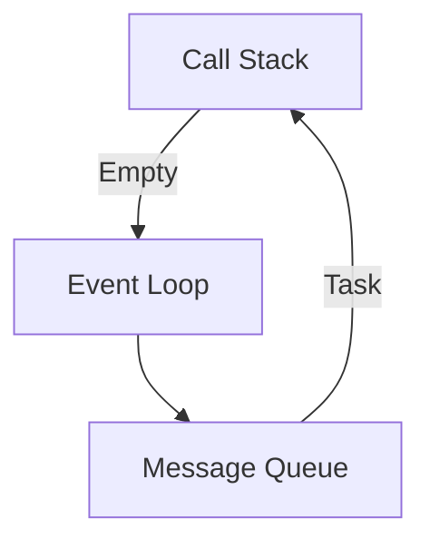

## 13.13 Writing Asynchronous Code Efficiently

In modern web development, writing efficient asynchronous code is crucial for creating responsive and performant applications. JavaScript's non-blocking nature allows developers to handle multiple operations concurrently, improving user experience by preventing the UI from freezing during long-running tasks. This section explores the best practices for writing asynchronous JavaScript code efficiently, focusing on Promises, `async/await`, and concurrency.

### Understanding Asynchronous JavaScript

JavaScript is single-threaded, meaning it can execute one task at a time. However, it uses an event loop to handle asynchronous operations, allowing other tasks to run while waiting for an operation to complete. This non-blocking behavior is essential for tasks like network requests, file I/O, and timers.

#### The Event Loop

The event loop is the heart of JavaScript's asynchronous model. It continuously checks the call stack and the message queue, executing tasks from the queue when the stack is empty. Understanding the event loop is crucial for writing efficient asynchronous code.



*Figure 1: The Event Loop in JavaScript*

### Performance Benefits of Non-Blocking Code

Non-blocking code allows JavaScript to perform other tasks while waiting for an asynchronous operation to complete. This improves performance by:

- **Reducing UI Freezes**: Long-running tasks don't block the main thread, keeping the UI responsive.
- **Improving Resource Utilization**: Multiple operations can run concurrently, making better use of system resources.
- **Enhancing User Experience**: Faster response times lead to a smoother user experience.

### Efficient Use of Promises

Promises provide a cleaner way to handle asynchronous operations compared to callbacks, avoiding the infamous "callback hell." They represent a value that may be available now, or in the future, or never.

#### Creating and Using Promises

To create a Promise, use the `Promise` constructor, which takes a function with `resolve` and `reject` parameters.

```javascript
function fetchData(url) {
    return new Promise((resolve, reject) => {
        fetch(url)
            .then(response => response.json())
            .then(data => resolve(data))
            .catch(error => reject(error));
    });
}

fetchData('https://api.example.com/data')
    .then(data => console.log(data))
    .catch(error => console.error('Error:', error));
```

*Code Example 1: Creating and Using Promises*

#### Guidelines for Efficient Promises

- **Avoid Nesting**: Chain `then` calls instead of nesting them to keep the code readable.
- **Handle Errors**: Use `catch` to handle errors and prevent unhandled promise rejections.
- **Use `finally`**: Execute cleanup code regardless of the promise's outcome.

### Leveraging `async/await` for Simplicity

`async/await` syntax simplifies working with Promises, making asynchronous code look synchronous. This improves readability and maintainability.

#### Using `async/await`

Declare a function as `async` to use `await` inside it. `await` pauses the function execution until the Promise is resolved.

```javascript
async function fetchData(url) {
    try {
        const response = await fetch(url);
        const data = await response.json();
        console.log(data);
    } catch (error) {
        console.error('Error:', error);
    }
}

fetchData('https://api.example.com/data');
```

*Code Example 2: Using `async/await` for Fetching Data*

#### Guidelines for `async/await`

- **Error Handling**: Use `try/catch` blocks to handle errors in `async` functions.
- **Avoid Blocking**: Don't use `await` inside loops if possible; use `Promise.all` for concurrent execution.

### Concurrency with `Promise.all`

`Promise.all` allows multiple Promises to run concurrently, resolving when all Promises are fulfilled or rejecting if any Promise fails. This is useful for tasks that can be performed in parallel.

#### Using `Promise.all`

```javascript
async function fetchMultipleData(urls) {
    try {
        const promises = urls.map(url => fetch(url).then(response => response.json()));
        const results = await Promise.all(promises);
        console.log(results);
    } catch (error) {
        console.error('Error:', error);
    }
}

const urls = ['https://api.example.com/data1', 'https://api.example.com/data2'];
fetchMultipleData(urls);
```

*Code Example 3: Using `Promise.all` for Concurrent Fetching*

### Avoiding Common Pitfalls

#### Unnecessary Asynchronous Operations

Creating unnecessary asynchronous operations can lead to performance issues. Only use asynchronous code when needed.

#### Blocking the Event Loop

Avoid blocking the event loop with synchronous operations in `async` functions. This can negate the benefits of asynchronous code.

### Optimizing Asynchronous Loops

When dealing with loops, avoid using `await` inside the loop body, as it will execute each iteration sequentially. Instead, use `Promise.all` to run iterations concurrently.

#### Example of Optimizing Asynchronous Loops

```javascript
async function processItems(items) {
    const promises = items.map(async item => {
        const result = await processItem(item);
        return result;
    });
    const results = await Promise.all(promises);
    console.log(results);
}

async function processItem(item) {
    // Simulate an asynchronous operation
    return new Promise(resolve => setTimeout(() => resolve(item * 2), 1000));
}

const items = [1, 2, 3, 4, 5];
processItems(items);
```

*Code Example 4: Optimizing Asynchronous Loops with `Promise.all`*

### Optimizing Network Requests

Network requests are common asynchronous operations. Optimize them by:

- **Batching Requests**: Combine multiple requests into a single request when possible.
- **Caching Responses**: Cache responses to reduce the number of network requests.
- **Using HTTP/2**: Take advantage of HTTP/2's multiplexing capabilities for better performance.

### Monitoring Asynchronous Performance

Use tools like Chrome DevTools and Node.js Profiler to monitor and optimize asynchronous performance. These tools help identify bottlenecks and improve code efficiency.

#### Example of Monitoring with Chrome DevTools

1. Open Chrome DevTools and navigate to the "Network" tab.
2. Perform the asynchronous operation in your application.
3. Analyze the network requests and their timings to identify performance issues.

### Knowledge Check

- **What is the event loop, and why is it important for asynchronous JavaScript?**
- **How can `Promise.all` improve the performance of asynchronous operations?**
- **What are the benefits of using `async/await` over traditional Promises?**

### Practice Problems

1. **Modify the `fetchMultipleData` function to handle errors for individual requests without stopping the entire process.**
2. **Optimize a loop that processes a list of URLs by fetching data concurrently.**

### Key Takeaways

- Writing efficient asynchronous code improves application performance and user experience.
- Use Promises and `async/await` to handle asynchronous operations cleanly and efficiently.
- Leverage concurrency with `Promise.all` to perform tasks in parallel.
- Avoid common pitfalls like unnecessary asynchronous operations and blocking the event loop.
- Monitor performance using tools like Chrome DevTools to identify and fix bottlenecks.

### Embrace the Journey

Remember, mastering asynchronous JavaScript is a journey. As you practice and experiment with these techniques, you'll become more adept at writing efficient, non-blocking code. Stay curious, keep learning, and enjoy the process!

## Quiz: Mastering Asynchronous JavaScript



### What is the primary benefit of non-blocking asynchronous code in JavaScript?

- [x] It prevents the UI from freezing during long-running tasks.
- [ ] It makes the code run faster than synchronous code.
- [ ] It eliminates the need for error handling.
- [ ] It simplifies the code structure.

> **Explanation:** Non-blocking asynchronous code allows the UI to remain responsive by not blocking the main thread during long-running tasks.

### How does `Promise.all` improve the performance of asynchronous operations?

- [x] By allowing multiple Promises to run concurrently.
- [ ] By executing Promises sequentially.
- [ ] By reducing the number of network requests.
- [ ] By caching the results of Promises.

> **Explanation:** `Promise.all` allows multiple Promises to run concurrently, improving performance by executing tasks in parallel.

### What is the advantage of using `async/await` over traditional Promises?

- [x] It makes asynchronous code look synchronous, improving readability.
- [ ] It eliminates the need for error handling.
- [ ] It runs faster than Promises.
- [ ] It allows for more complex asynchronous operations.

> **Explanation:** `async/await` syntax makes asynchronous code look synchronous, improving readability and maintainability.

### What should you avoid when using `await` inside loops?

- [x] Using `await` inside loops can cause sequential execution, reducing performance.
- [ ] Using `await` inside loops can cause errors.
- [ ] Using `await` inside loops can block the event loop.
- [ ] Using `await` inside loops can lead to memory leaks.

> **Explanation:** Using `await` inside loops can cause each iteration to execute sequentially, reducing performance. Use `Promise.all` for concurrent execution.

### Which tool can be used to monitor asynchronous performance in JavaScript?

- [x] Chrome DevTools
- [ ] ESLint
- [ ] Babel
- [ ] Webpack

> **Explanation:** Chrome DevTools provides tools for monitoring and analyzing asynchronous performance in JavaScript applications.

### What is a common pitfall when writing asynchronous code?

- [x] Creating unnecessary asynchronous operations.
- [ ] Using `async/await` syntax.
- [ ] Handling errors with `try/catch`.
- [ ] Using `Promise.all`.

> **Explanation:** Creating unnecessary asynchronous operations can lead to performance issues and should be avoided.

### How can you optimize network requests in asynchronous code?

- [x] By batching requests and caching responses.
- [ ] By using synchronous requests.
- [ ] By increasing the number of requests.
- [ ] By using `await` inside loops.

> **Explanation:** Batching requests and caching responses can optimize network requests, reducing the number of requests and improving performance.

### What is the role of the event loop in JavaScript?

- [x] It manages the execution of asynchronous operations.
- [ ] It executes synchronous code.
- [ ] It handles error management.
- [ ] It optimizes network requests.

> **Explanation:** The event loop manages the execution of asynchronous operations, allowing JavaScript to handle multiple tasks concurrently.

### What is the purpose of using `finally` in Promises?

- [x] To execute cleanup code regardless of the promise's outcome.
- [ ] To handle errors in Promises.
- [ ] To chain multiple Promises.
- [ ] To improve performance.

> **Explanation:** `finally` is used to execute cleanup code regardless of whether the promise is fulfilled or rejected.

### True or False: Using `Promise.all` will reject if any of the Promises fail.

- [x] True
- [ ] False

> **Explanation:** `Promise.all` will reject if any of the Promises in the array fail, providing a single point of failure handling.




