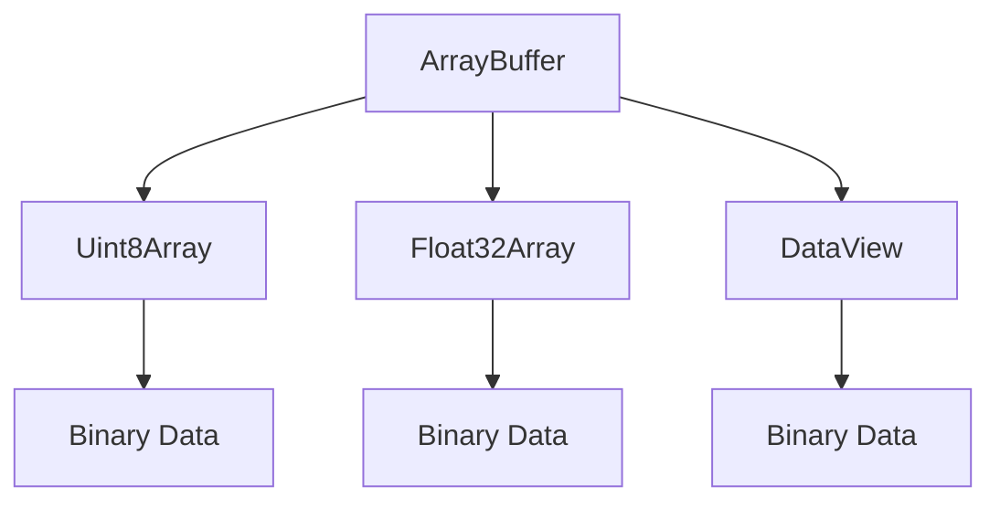

## 13.14 Using Typed Arrays and ArrayBuffers

In modern web development, handling binary data efficiently is crucial for applications that require high performance, such as games, image processing, and real-time data streaming. JavaScript provides powerful tools for this purpose: Typed Arrays and ArrayBuffers. In this section, we'll delve into these concepts, explore their use cases, and demonstrate how they can significantly enhance performance.

### Understanding Typed Arrays and ArrayBuffers

**Typed Arrays** are a set of array-like objects in JavaScript that provide a mechanism for accessing raw binary data. They allow you to work with binary data directly, offering a way to read and write binary data in a more efficient manner than traditional JavaScript arrays.

**ArrayBuffers** are the underlying data structure that stores the binary data. They represent a generic, fixed-length binary data buffer. You can think of an ArrayBuffer as a block of memory that you can manipulate using Typed Arrays.

#### Key Characteristics

- **Fixed Size**: Once an ArrayBuffer is created, its size cannot be changed.
- **Binary Data Handling**: Typed Arrays provide a way to handle binary data directly, which is essential for performance-critical applications.
- **Typed Views**: Typed Arrays are views over an ArrayBuffer, allowing you to interpret the binary data in various formats (e.g., Int8, Uint8, Float32).

### Use Cases for Typed Arrays and ArrayBuffers

Typed Arrays and ArrayBuffers are particularly useful in scenarios where performance is critical, and binary data needs to be processed efficiently. Here are some common use cases:

- **Image and Video Processing**: Manipulating pixel data directly for operations such as filtering, transformations, and encoding.
- **Audio Processing**: Handling raw audio data for tasks like mixing, filtering, and effects.
- **Game Development**: Managing large datasets for graphics rendering, physics calculations, and more.
- **Networking**: Efficiently handling binary protocols and data streams.
- **Scientific Computing**: Performing complex mathematical computations on large datasets.

### Creating and Manipulating Typed Arrays

Let's explore how to create and manipulate Typed Arrays in JavaScript. We'll start by creating an ArrayBuffer and then use various Typed Arrays to interact with it.

```javascript
// Create an ArrayBuffer with a size of 16 bytes
let buffer = new ArrayBuffer(16);

// Create a Uint8Array view over the buffer
let uint8View = new Uint8Array(buffer);

// Set values in the Uint8Array
uint8View[0] = 255;
uint8View[1] = 128;

// Create a Float32Array view over the same buffer
let float32View = new Float32Array(buffer);

// Set values in the Float32Array
float32View[0] = 3.14;
float32View[1] = 2.71;

console.log(uint8View); // Output: Uint8Array(16) [ 195, 245, 72, 64, 174, 71, 5, 64, 0, 0, 0, 0, 0, 0, 0, 0 ]
console.log(float32View); // Output: Float32Array(4) [ 3.140000104904175, 2.7100000381469727, 0, 0 ]
```

In this example, we create an ArrayBuffer of 16 bytes and then create two different Typed Array views over it: a `Uint8Array` and a `Float32Array`. This demonstrates how the same binary data can be interpreted in different ways.

### Performance Benefits

Typed Arrays and ArrayBuffers offer significant performance benefits when processing large amounts of data. Traditional JavaScript arrays are not optimized for binary data manipulation, leading to inefficiencies. Typed Arrays, on the other hand, provide:

- **Direct Memory Access**: Typed Arrays allow you to work with binary data directly, reducing the overhead of data conversion.
- **Efficient Memory Usage**: They use a fixed amount of memory, which can lead to more predictable performance.
- **Faster Data Processing**: Operations on Typed Arrays are generally faster than on regular arrays, especially for large datasets.

### Related APIs: DataView

The `DataView` API provides a low-level interface for reading and writing multiple number types in an ArrayBuffer, regardless of the platform's endianness. It allows you to work with data in a more flexible way compared to Typed Arrays.

```javascript
// Create an ArrayBuffer
let buffer = new ArrayBuffer(8);

// Create a DataView over the buffer
let view = new DataView(buffer);

// Set values using DataView
view.setInt8(0, 127);
view.setUint8(1, 255);
view.setFloat32(2, 3.14, true); // Little-endian

// Get values using DataView
console.log(view.getInt8(0)); // Output: 127
console.log(view.getUint8(1)); // Output: 255
console.log(view.getFloat32(2, true)); // Output: 3.140000104904175
```

The `DataView` API is particularly useful when you need to handle data with mixed types or when dealing with data from external sources that require specific byte ordering.

### Potential Pitfalls and Browser Compatibility

While Typed Arrays and ArrayBuffers offer many advantages, there are some potential pitfalls to be aware of:

- **Endianness**: Different systems may use different byte orders (endianness). The `DataView` API allows you to specify endianness when reading or writing data.
- **Fixed Size**: Once an ArrayBuffer is created, its size cannot be changed. Plan your memory usage accordingly.
- **Browser Compatibility**: Typed Arrays and ArrayBuffers are well-supported in modern browsers, but it's always a good practice to check compatibility if you're targeting older environments.

### Visualizing Typed Arrays and ArrayBuffers

To better understand how Typed Arrays and ArrayBuffers work, let's visualize the relationship between them.



**Diagram Description**: This diagram illustrates how an `ArrayBuffer` can have multiple views, such as `Uint8Array`, `Float32Array`, and `DataView`, each interpreting the binary data differently.

### Try It Yourself

Experiment with the code examples provided by modifying the Typed Array types and observing the changes in output. Try creating a `Uint16Array` or a `Float64Array` and see how the data representation changes.

### Knowledge Check

- What are the main benefits of using Typed Arrays and ArrayBuffers?
- How does the `DataView` API differ from Typed Arrays?
- What are some common use cases for Typed Arrays in web development?

### Summary

Typed Arrays and ArrayBuffers are powerful tools for handling binary data efficiently in JavaScript. They provide direct access to memory, leading to performance improvements in applications that require processing large datasets. By understanding and utilizing these tools, you can build more efficient and performant web applications.

### Quiz: Mastering Typed Arrays and ArrayBuffers



### What is the primary purpose of Typed Arrays in JavaScript?

- [x] To handle binary data efficiently
- [ ] To create dynamic arrays
- [ ] To manipulate DOM elements
- [ ] To manage asynchronous operations

> **Explanation:** Typed Arrays are designed to handle binary data efficiently, providing a way to work with raw binary data directly.

### How does an ArrayBuffer differ from a Typed Array?

- [x] An ArrayBuffer is a fixed-length binary data buffer, while a Typed Array is a view over an ArrayBuffer.
- [ ] An ArrayBuffer is a dynamic array, while a Typed Array is static.
- [ ] An ArrayBuffer is used for string manipulation, while a Typed Array is for numbers.
- [ ] An ArrayBuffer is a type of JavaScript object, while a Typed Array is a primitive.

> **Explanation:** An ArrayBuffer is a fixed-length binary data buffer, and Typed Arrays are views that allow you to interpret the data in various formats.

### Which API allows you to specify endianness when reading or writing data?

- [x] DataView
- [ ] Uint8Array
- [ ] Float32Array
- [ ] ArrayBuffer

> **Explanation:** The DataView API allows you to specify endianness, providing more flexibility in handling binary data.

### What is a common use case for Typed Arrays?

- [x] Image and video processing
- [ ] DOM manipulation
- [ ] Event handling
- [ ] CSS styling

> **Explanation:** Typed Arrays are commonly used in image and video processing for efficient manipulation of pixel data.

### Which of the following is a potential pitfall of using Typed Arrays?

- [x] Fixed size of ArrayBuffers
- [ ] Lack of browser support
- [ ] Inability to handle binary data
- [ ] Complexity in syntax

> **Explanation:** Once an ArrayBuffer is created, its size cannot be changed, which can be a limitation in some scenarios.

### True or False: Typed Arrays can improve performance in applications that process large datasets.

- [x] True
- [ ] False

> **Explanation:** Typed Arrays provide direct access to memory, leading to performance improvements in applications that process large datasets.

### What is the relationship between a Typed Array and an ArrayBuffer?

- [x] A Typed Array is a view over an ArrayBuffer.
- [ ] A Typed Array is a subclass of ArrayBuffer.
- [ ] A Typed Array is unrelated to ArrayBuffer.
- [ ] A Typed Array is a method of ArrayBuffer.

> **Explanation:** A Typed Array is a view over an ArrayBuffer, allowing you to interpret the binary data in various formats.

### Which of the following Typed Arrays would you use to handle 32-bit floating-point numbers?

- [x] Float32Array
- [ ] Uint8Array
- [ ] Int16Array
- [ ] Float64Array

> **Explanation:** Float32Array is used to handle 32-bit floating-point numbers.

### What is the role of the DataView API?

- [x] To provide a flexible interface for reading and writing multiple number types in an ArrayBuffer
- [ ] To create dynamic arrays
- [ ] To manage asynchronous operations
- [ ] To manipulate DOM elements

> **Explanation:** The DataView API provides a flexible interface for reading and writing multiple number types in an ArrayBuffer.

### True or False: Typed Arrays are not supported in modern browsers.

- [ ] True
- [x] False

> **Explanation:** Typed Arrays are well-supported in modern browsers, making them a reliable choice for handling binary data.



Remember, this is just the beginning. As you progress, you'll build more complex and interactive web applications. Keep experimenting, stay curious, and enjoy the journey!
