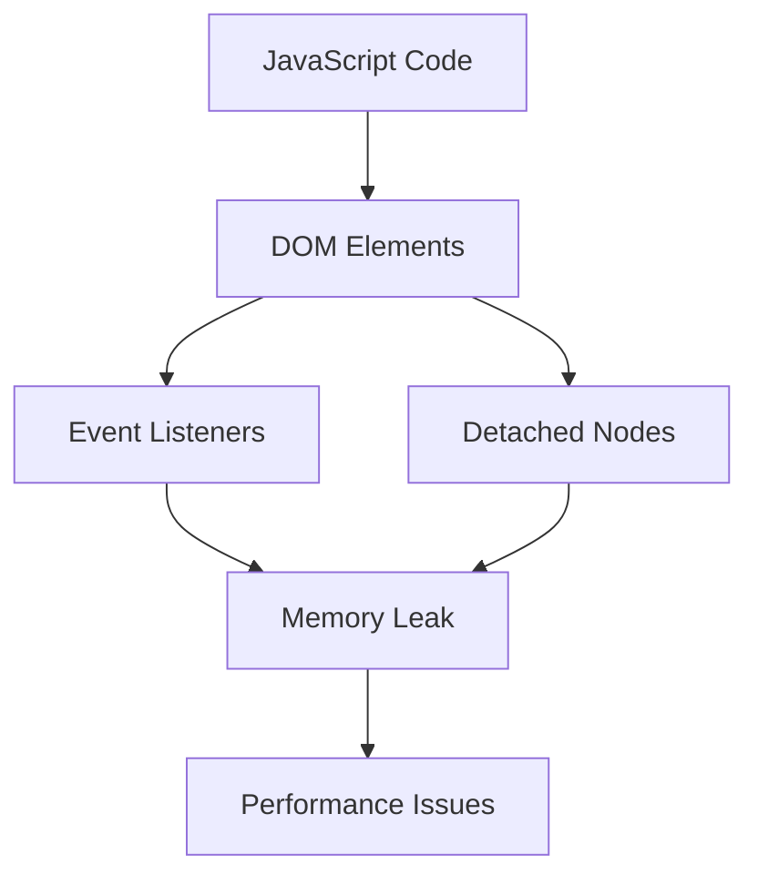

## 13.15 Avoiding Memory Leaks

Memory leaks in JavaScript applications can lead to performance degradation, increased latency, and even application crashes. Understanding how memory leaks occur and how to prevent them is crucial for maintaining efficient and responsive applications. In this section, we will delve into the concept of memory leaks, identify common causes, provide code examples, and discuss tools and best practices for detecting and preventing memory leaks.

### Understanding Memory Leaks

A memory leak occurs when a program retains memory that is no longer needed, leading to a gradual increase in memory usage over time. In JavaScript, memory leaks can be particularly problematic because they can cause the browser to slow down or crash, especially on devices with limited resources.

#### Why Memory Leaks Are Problematic

- **Performance Degradation**: As memory usage increases, the application may become slower and less responsive.
- **Increased Latency**: Memory leaks can lead to longer garbage collection cycles, increasing latency.
- **Application Crashes**: In severe cases, memory leaks can cause the application to crash, leading to a poor user experience.

### Common Causes of Memory Leaks

Let's explore some common causes of memory leaks in JavaScript applications and how to address them.

#### 1. Unreleased Event Listeners

Event listeners that are not properly removed can lead to memory leaks, as they keep references to DOM elements and other objects.

**Example of a Memory Leak with Event Listeners:**

```javascript
function addEventListenerToButton() {
    const button = document.getElementById('myButton');
    button.addEventListener('click', function handleClick() {
        console.log('Button clicked!');
    });
}

// This function is called multiple times, but the event listener is never removed.
```

**Fix:**

To prevent memory leaks, always remove event listeners when they are no longer needed.

```javascript
function addEventListenerToButton() {
    const button = document.getElementById('myButton');
    function handleClick() {
        console.log('Button clicked!');
    }
    button.addEventListener('click', handleClick);

    // Remove the event listener when it's no longer needed
    return () => button.removeEventListener('click', handleClick);
}

const removeListener = addEventListenerToButton();
// Call removeListener() when you want to remove the event listener
```

#### 2. Global Variables

Global variables can lead to memory leaks because they remain in memory for the lifetime of the application.

**Example of a Memory Leak with Global Variables:**

```javascript
var globalArray = [];

function addToArray(item) {
    globalArray.push(item);
}

// The globalArray keeps growing and is never cleared.
```

**Fix:**

Minimize the use of global variables and clear them when they are no longer needed.

```javascript
function manageArray() {
    let array = [];

    function addToArray(item) {
        array.push(item);
    }

    function clearArray() {
        array = [];
    }

    return { addToArray, clearArray };
}

const arrayManager = manageArray();
arrayManager.addToArray('item1');
arrayManager.clearArray(); // Clear the array when done
```

#### 3. Closures Retaining References

Closures can inadvertently retain references to variables, leading to memory leaks.

**Example of a Memory Leak with Closures:**

```javascript
function createClosure() {
    const largeObject = new Array(1000).fill('data');

    return function() {
        console.log(largeObject);
    };
}

const closure = createClosure();
// The largeObject is retained in memory even if it's no longer needed.
```

**Fix:**

Ensure that closures do not retain unnecessary references.

```javascript
function createClosure() {
    const largeObject = new Array(1000).fill('data');

    return function() {
        // Use the data and then clear the reference
        console.log(largeObject);
        // Clear the reference when done
        largeObject.length = 0;
    };
}

const closure = createClosure();
closure(); // Use the closure and clear the reference
```

#### 4. Detached DOM Nodes

Detached DOM nodes are elements that are removed from the DOM tree but are still referenced in JavaScript, preventing them from being garbage collected.

**Example of a Memory Leak with Detached DOM Nodes:**

```javascript
function createDetachedNode() {
    const div = document.createElement('div');
    div.innerHTML = 'Detached Node';
    document.body.appendChild(div);

    // Later, the node is removed from the DOM but still referenced
    document.body.removeChild(div);
    return div;
}

const detachedNode = createDetachedNode();
// The detachedNode is still in memory
```

**Fix:**

Ensure that references to detached nodes are cleared.

```javascript
function createDetachedNode() {
    const div = document.createElement('div');
    div.innerHTML = 'Detached Node';
    document.body.appendChild(div);

    // Remove the node and clear the reference
    document.body.removeChild(div);
    return null; // Clear the reference
}

let detachedNode = createDetachedNode();
detachedNode = null; // Clear the reference
```

### Tools for Detecting Memory Leaks

Detecting memory leaks can be challenging, but several tools can help identify and fix them.

#### Chrome DevTools Memory Profiling

[Chrome DevTools](https://developer.chrome.com/docs/devtools/memory-problems/) provides powerful tools for profiling memory usage and identifying leaks. You can take heap snapshots, analyze memory allocations, and track down memory leaks.

**Steps to Use Chrome DevTools for Memory Profiling:**

1. Open Chrome DevTools and navigate to the "Memory" tab.
2. Take a heap snapshot to capture the current memory state.
3. Perform actions in your application that you suspect may cause memory leaks.
4. Take another heap snapshot and compare it with the previous one.
5. Analyze the differences to identify objects that are not being garbage collected.

### Best Practices for Memory Management

To prevent memory leaks, follow these best practices for memory management in JavaScript applications:

- **Use Local Variables**: Prefer local variables over global variables to limit the scope and lifetime of objects.
- **Remove Event Listeners**: Always remove event listeners when they are no longer needed.
- **Avoid Unnecessary References**: Be mindful of closures and avoid retaining unnecessary references.
- **Clear References**: Explicitly set references to `null` when objects are no longer needed.
- **Use WeakMap and WeakSet**: Use `WeakMap` and `WeakSet` for objects that should not prevent garbage collection.
- **Optimize DOM Manipulation**: Minimize DOM manipulation and ensure detached nodes are properly handled.

### Visualizing Memory Leaks

To better understand how memory leaks occur, let's visualize the interaction between JavaScript and the DOM.



**Diagram Description**: This diagram illustrates how JavaScript code interacts with DOM elements. Event listeners and detached nodes can lead to memory leaks, which in turn cause performance issues.

### Try It Yourself

Experiment with the code examples provided in this section. Try modifying the examples to see how changes affect memory usage. Use Chrome DevTools to profile memory and identify potential leaks in your own applications.

### Knowledge Check

- What is a memory leak, and why is it problematic?
- How can event listeners lead to memory leaks?
- What are some common causes of memory leaks in JavaScript?
- How can you use Chrome DevTools to detect memory leaks?
- What are some best practices for preventing memory leaks?

### Summary

In this section, we've explored the concept of memory leaks in JavaScript applications and discussed common causes, such as unreleased event listeners, global variables, closures retaining references, and detached DOM nodes. We've provided code examples to illustrate how memory leaks occur and how to fix them. Additionally, we've highlighted tools like Chrome DevTools for detecting memory leaks and shared best practices for memory management.

Remember, this is just the beginning. As you progress, you'll build more efficient and responsive applications. Keep experimenting, stay curious, and enjoy the journey!

## Quiz: Mastering Memory Management in JavaScript



### What is a memory leak in JavaScript?

- [x] Retaining memory that is no longer needed
- [ ] Allocating memory for new objects
- [ ] Using global variables
- [ ] Declaring variables without initialization

> **Explanation:** A memory leak occurs when a program retains memory that is no longer needed, leading to increased memory usage over time.

### Which of the following can cause a memory leak?

- [x] Unreleased event listeners
- [x] Global variables
- [x] Closures retaining references
- [ ] Using `let` and `const` for variable declarations

> **Explanation:** Unreleased event listeners, global variables, and closures retaining references can all lead to memory leaks.

### How can you prevent memory leaks caused by event listeners?

- [x] Remove event listeners when they are no longer needed
- [ ] Use global variables for event handlers
- [ ] Avoid using event listeners altogether
- [ ] Use `var` for declaring event handlers

> **Explanation:** Removing event listeners when they are no longer needed helps prevent memory leaks.

### What tool can you use to detect memory leaks in JavaScript applications?

- [x] Chrome DevTools Memory Profiling
- [ ] Visual Studio Code
- [ ] Node.js
- [ ] Git

> **Explanation:** Chrome DevTools provides memory profiling tools to detect memory leaks.

### What is a common cause of memory leaks related to closures?

- [x] Retaining unnecessary references
- [ ] Using `let` and `const` for variable declarations
- [ ] Declaring functions inside loops
- [ ] Using arrow functions

> **Explanation:** Closures can retain unnecessary references, leading to memory leaks.

### How can you clear references to prevent memory leaks?

- [x] Set references to `null` when objects are no longer needed
- [ ] Use `var` for declaring variables
- [ ] Avoid using closures
- [ ] Use global variables

> **Explanation:** Setting references to `null` helps clear them and prevent memory leaks.

### Which data structures can help prevent memory leaks by not preventing garbage collection?

- [x] WeakMap
- [x] WeakSet
- [ ] Map
- [ ] Set

> **Explanation:** `WeakMap` and `WeakSet` do not prevent garbage collection, helping prevent memory leaks.

### What is a detached DOM node?

- [x] An element removed from the DOM but still referenced in JavaScript
- [ ] An element added to the DOM
- [ ] An element without any event listeners
- [ ] An element with a unique ID

> **Explanation:** A detached DOM node is an element removed from the DOM but still referenced in JavaScript, leading to memory leaks.

### How can you optimize DOM manipulation to prevent memory leaks?

- [x] Minimize DOM manipulation and handle detached nodes properly
- [ ] Use global variables for DOM elements
- [ ] Avoid using event listeners
- [ ] Use `var` for declaring DOM elements

> **Explanation:** Minimizing DOM manipulation and properly handling detached nodes helps prevent memory leaks.

### True or False: Memory leaks can lead to application crashes.

- [x] True
- [ ] False

> **Explanation:** Memory leaks can lead to application crashes, especially on devices with limited resources.


