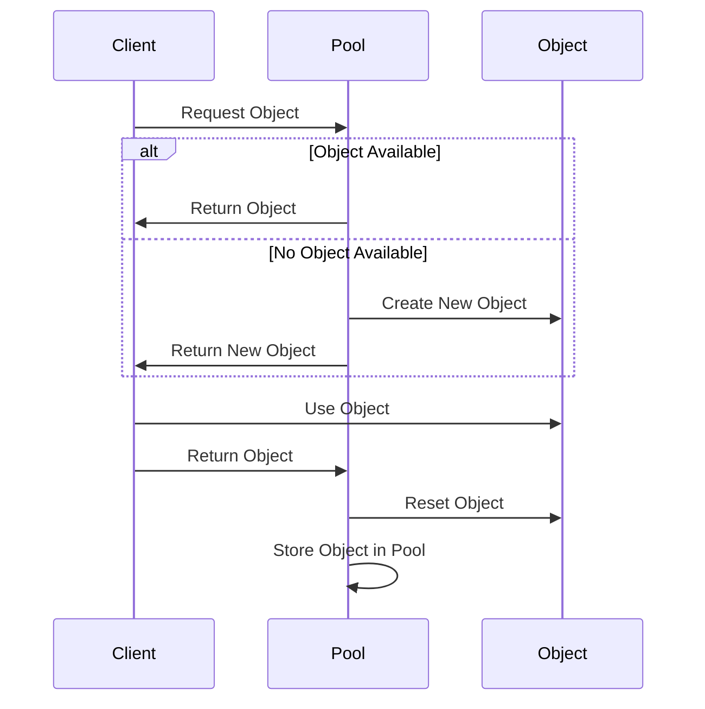

## 13.16 The Memory Pool Pattern

### Introduction

In modern web development, performance optimization is crucial, especially when dealing with applications that require high efficiency and speed. One effective technique to enhance performance is the **Memory Pool Pattern**. This pattern involves reusing objects instead of frequently creating and destroying them, thereby reducing the overhead associated with garbage collection. Let's dive into the details of how the Memory Pool Pattern works, its benefits, and how to implement it in JavaScript.

### Understanding the Memory Pool Pattern

The Memory Pool Pattern is a design pattern that aims to manage the allocation and deallocation of objects in a way that minimizes the impact on system performance. Instead of creating new objects every time they are needed and destroying them when they are no longer in use, the pattern reuses existing objects from a pool. This approach is particularly beneficial in environments where object creation is a performance bottleneck.

#### How It Works

1. **Object Pool Creation**: A pool of objects is created and initialized. These objects are kept ready for use.
2. **Object Reuse**: When an object is needed, it is retrieved from the pool. If no objects are available, a new one is created.
3. **Object Return**: Once the object is no longer needed, it is returned to the pool instead of being destroyed.
4. **Object Reset**: Before returning an object to the pool, it is reset to a clean state to ensure it is ready for reuse.

### Scenarios Where Object Creation is a Bottleneck

In JavaScript, object creation can become a bottleneck in several scenarios:

- **High-Frequency Operations**: Applications that require frequent creation and destruction of objects, such as real-time simulations or games.
- **Memory-Intensive Applications**: Applications that handle large datasets or perform complex calculations.
- **Garbage Collection Overhead**: Frequent object creation can lead to increased garbage collection, which can slow down application performance.

### Implementing Object Pools in JavaScript

Let's explore how to implement an object pool in JavaScript with a practical example.

```javascript
class ObjectPool {
  constructor(createFn, size = 10) {
    this.createFn = createFn;
    this.pool = [];
    this.size = size;

    // Pre-fill the pool with objects
    for (let i = 0; i < this.size; i++) {
      this.pool.push(this.createFn());
    }
  }

  acquire() {
    // Retrieve an object from the pool
    return this.pool.length > 0 ? this.pool.pop() : this.createFn();
  }

  release(obj) {
    // Reset the object state before returning it to the pool
    if (this.pool.length < this.size) {
      this.reset(obj);
      this.pool.push(obj);
    }
  }

  reset(obj) {
    // Reset object properties to default values
    for (let key in obj) {
      if (obj.hasOwnProperty(key)) {
        obj[key] = null;
      }
    }
  }
}

// Usage
const createObject = () => ({ data: null });
const pool = new ObjectPool(createObject, 5);

const obj1 = pool.acquire();
obj1.data = "Some data";

pool.release(obj1);

const obj2 = pool.acquire();
console.log(obj2.data); // null, as the object was reset
```

### Benefits of the Memory Pool Pattern

- **Reduced Garbage Collection**: By reusing objects, the frequency of garbage collection is reduced, leading to improved performance.
- **Improved Efficiency**: Object reuse minimizes the overhead associated with object creation and destruction.
- **Consistent Performance**: Applications experience more consistent performance as memory allocation and deallocation are managed efficiently.

### Considerations for Object State Management and Thread Safety

When implementing the Memory Pool Pattern, it's essential to consider:

- **Object State Management**: Ensure that objects are reset to a clean state before being returned to the pool. This prevents data leakage and ensures that objects are ready for reuse.
- **Thread Safety**: In environments where multiple threads access the pool, ensure that access to the pool is synchronized to prevent race conditions.

### When to Use the Memory Pool Pattern

The Memory Pool Pattern is appropriate in scenarios where:

- **High Object Turnover**: Applications frequently create and destroy objects.
- **Performance is Critical**: Applications require high performance and low latency.
- **Memory Management**: Efficient memory management is necessary to prevent performance degradation.

### Potential Drawbacks

While the Memory Pool Pattern offers significant benefits, it also has potential drawbacks:

- **Complexity**: Implementing and managing an object pool can add complexity to the codebase.
- **Memory Usage**: Pools can consume more memory upfront, as objects are pre-allocated and held in memory.

### Visualizing the Memory Pool Pattern

To better understand the Memory Pool Pattern, let's visualize the process using a Mermaid.js diagram.



### Try It Yourself

Experiment with the object pool implementation by modifying the pool size or the object creation function. Observe how changes affect performance and memory usage.

### References and Further Reading

- [MDN Web Docs: Memory Management](https://developer.mozilla.org/en-US/docs/Web/JavaScript/Memory_Management)
- [JavaScript Design Patterns](https://www.patterns.dev/posts/classic-design-patterns/)
- [Effective JavaScript: 68 Specific Ways to Harness the Power of JavaScript](https://www.oreilly.com/library/view/effective-javascript/9780132902250/)

### Knowledge Check

To reinforce your understanding of the Memory Pool Pattern, try answering the following questions.

## Memory Pool Pattern Quiz: Test Your Knowledge



### What is the primary benefit of using the Memory Pool Pattern?

- [x] Reduces garbage collection overhead
- [ ] Increases object creation speed
- [ ] Simplifies code structure
- [ ] Enhances security

> **Explanation:** The Memory Pool Pattern reduces garbage collection overhead by reusing objects instead of frequently creating and destroying them.

### In which scenario is the Memory Pool Pattern most beneficial?

- [x] High-frequency object creation and destruction
- [ ] Low-memory applications
- [ ] Applications with minimal object usage
- [ ] Static web pages

> **Explanation:** The pattern is most beneficial in scenarios with high-frequency object creation and destruction, where performance is critical.

### What should be done before returning an object to the pool?

- [x] Reset the object's state
- [ ] Destroy the object
- [ ] Log the object's usage
- [ ] Increase the pool size

> **Explanation:** Resetting the object's state ensures it is clean and ready for reuse.

### What is a potential drawback of the Memory Pool Pattern?

- [x] Increased complexity
- [ ] Reduced performance
- [ ] Higher garbage collection frequency
- [ ] Decreased memory usage

> **Explanation:** Implementing and managing an object pool can add complexity to the codebase.

### How does the Memory Pool Pattern improve performance?

- [x] By reusing objects and reducing garbage collection
- [ ] By increasing the number of objects created
- [ ] By simplifying the code structure
- [ ] By enhancing security features

> **Explanation:** The pattern improves performance by reusing objects, which reduces the need for frequent garbage collection.

### What is a key consideration when implementing the Memory Pool Pattern?

- [x] Thread safety
- [ ] Object size
- [ ] Network latency
- [ ] User interface design

> **Explanation:** Ensuring thread safety is crucial when multiple threads access the pool to prevent race conditions.

### When is the Memory Pool Pattern not appropriate?

- [x] In applications with minimal object usage
- [ ] In high-performance applications
- [ ] In memory-intensive applications
- [ ] In real-time simulations

> **Explanation:** The pattern is not appropriate in applications with minimal object usage, as the benefits of reuse are negligible.

### What is the role of the `reset` function in the object pool implementation?

- [x] To reset object properties to default values
- [ ] To destroy the object
- [ ] To log the object's usage
- [ ] To increase the pool size

> **Explanation:** The `reset` function resets object properties to default values, ensuring they are ready for reuse.

### What is a potential memory-related drawback of using object pools?

- [x] Increased upfront memory usage
- [ ] Decreased memory usage
- [ ] Higher garbage collection frequency
- [ ] Reduced object creation speed

> **Explanation:** Object pools can consume more memory upfront, as objects are pre-allocated and held in memory.

### True or False: The Memory Pool Pattern is only useful in JavaScript.

- [ ] True
- [x] False

> **Explanation:** The Memory Pool Pattern is a general design pattern applicable in various programming languages, not just JavaScript.



Remember, this is just the beginning. As you progress, you'll build more complex and interactive web applications. Keep experimenting, stay curious, and enjoy the journey!
