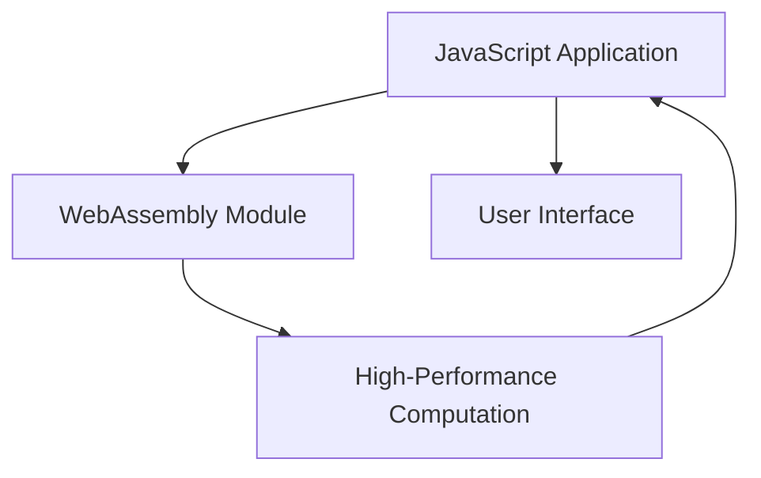

## 13.17 Optimizing JavaScript Performance with SIMD.js and WebAssembly

In the realm of modern web development, performance optimization is crucial for delivering seamless user experiences. As applications grow in complexity, the demand for efficient execution of computationally intensive tasks becomes more pronounced. This section explores advanced techniques using SIMD.js and WebAssembly to enhance JavaScript performance, particularly in areas such as graphics processing, gaming, and scientific computations.

### Understanding SIMD (Single Instruction, Multiple Data)

SIMD, or Single Instruction, Multiple Data, is a parallel computing architecture that allows a single instruction to process multiple data points simultaneously. This approach is particularly effective for tasks that involve repetitive operations on large datasets, such as image processing, matrix calculations, and physics simulations.

#### Key Concepts of SIMD

- **Parallelism**: SIMD exploits data-level parallelism by applying the same operation to multiple data points in parallel, reducing the number of instructions executed.
- **Vectorization**: Data is processed in "vectors," or batches, rather than individually, which can significantly speed up computation.
- **Efficiency**: By reducing the number of instructions and leveraging parallel processing, SIMD can enhance performance and reduce execution time.

### The Status of SIMD.js

SIMD.js was an experimental API introduced to bring SIMD capabilities to JavaScript. However, due to various challenges, including browser support and the complexity of implementation, SIMD.js has been deprecated in favor of WebAssembly, which offers broader support and more robust performance benefits.

#### Alternatives to SIMD.js

While SIMD.js is no longer actively developed, WebAssembly provides a compelling alternative for achieving similar performance gains. WebAssembly supports SIMD operations, allowing developers to leverage parallel processing in a more standardized and efficient manner.

### Introducing WebAssembly

[WebAssembly](https://webassembly.org/) (Wasm) is a binary instruction format designed for efficient execution and compact representation. It serves as a compilation target for languages like C, C++, and Rust, enabling high-performance applications to run on the web.

#### Performance Benefits of WebAssembly

- **Speed**: WebAssembly is designed to be fast, with near-native execution speed, making it ideal for performance-critical applications.
- **Portability**: WebAssembly modules can run on any platform that supports the WebAssembly runtime, ensuring broad compatibility.
- **Security**: WebAssembly operates in a sandboxed environment, providing a secure execution context for running untrusted code.

### Leveraging WebAssembly in JavaScript Applications

WebAssembly can be seamlessly integrated into JavaScript applications, allowing developers to offload computationally intensive tasks to WebAssembly modules while maintaining the flexibility of JavaScript for other parts of the application.

#### Example: Integrating a WebAssembly Module

Let's explore how to integrate a simple WebAssembly module into a JavaScript application. We'll use a C function compiled to WebAssembly to perform a mathematical operation.

```c
// math.c - A simple C function to add two numbers
int add(int a, int b) {
    return a + b;
}
```

Compile the C code to WebAssembly using a tool like Emscripten:

```bash
emcc math.c -s WASM=1 -o math.js
```

This command generates `math.wasm` and `math.js`, which can be used in a JavaScript application.

```javascript
// Load and instantiate the WebAssembly module
fetch('math.wasm')
  .then(response => response.arrayBuffer())
  .then(bytes => WebAssembly.instantiate(bytes))
  .then(results => {
    const add = results.instance.exports.add;
    console.log('Result:', add(5, 7)); // Output: Result: 12
  });
```

### Use Cases for WebAssembly

WebAssembly is particularly well-suited for applications that require high performance and computational efficiency. Some common use cases include:

- **Graphics Processing**: WebAssembly can accelerate rendering and image processing tasks, making it ideal for graphics-intensive applications.
- **Gaming**: The performance benefits of WebAssembly make it a popular choice for game engines and complex simulations.
- **Scientific Computations**: WebAssembly can handle large-scale numerical computations efficiently, making it valuable for scientific and engineering applications.

### Tools and Languages for Compiling to WebAssembly

Several tools and languages support compilation to WebAssembly, enabling developers to leverage existing codebases and expertise.

#### C/C++

C and C++ are widely used for performance-critical applications and can be compiled to WebAssembly using tools like Emscripten.

#### Rust

Rust is a systems programming language known for its safety and performance. It has robust support for WebAssembly, making it a popular choice for web development.

### Considerations for Integrating WebAssembly Code

While WebAssembly offers significant performance benefits, there are several considerations to keep in mind when integrating it into your applications:

- **Interoperability**: Ensure seamless communication between JavaScript and WebAssembly modules, particularly when passing data between them.
- **Debugging**: Debugging WebAssembly code can be challenging, so familiarize yourself with available tools and techniques.
- **Performance Overhead**: While WebAssembly is fast, there may be overhead associated with loading and instantiating modules, so optimize your code accordingly.

### Visualizing WebAssembly Integration

To better understand how WebAssembly integrates with JavaScript applications, consider the following diagram:



**Diagram Description**: This diagram illustrates the interaction between a JavaScript application and a WebAssembly module. The JavaScript application delegates high-performance computations to the WebAssembly module, which processes the data and returns the results to the application for further use or display in the user interface.

### Knowledge Check

To reinforce your understanding of SIMD.js and WebAssembly, consider the following questions:

- What are the key benefits of using SIMD for performance optimization?
- How does WebAssembly improve the execution speed of web applications?
- What are some common use cases for WebAssembly in web development?

### Embrace the Journey

Remember, this is just the beginning. As you explore the capabilities of SIMD.js and WebAssembly, you'll unlock new possibilities for optimizing your web applications. Keep experimenting, stay curious, and enjoy the journey!

### Quiz: Mastering SIMD.js and WebAssembly



### What is SIMD?

- [x] Single Instruction, Multiple Data
- [ ] Single Instruction, Multiple Devices
- [ ] Simple Instruction, Multiple Data
- [ ] Single Instruction, Multiple Directions

> **Explanation:** SIMD stands for Single Instruction, Multiple Data, a parallel computing architecture that processes multiple data points simultaneously.

### Why was SIMD.js deprecated?

- [x] Due to limited browser support and complexity
- [ ] Because it was too fast
- [ ] It was replaced by JavaScript
- [ ] It was never implemented

> **Explanation:** SIMD.js was deprecated due to limited browser support and the complexity of implementation, with WebAssembly providing a more robust alternative.

### What is WebAssembly?

- [x] A binary instruction format for efficient execution
- [ ] A new JavaScript framework
- [ ] A CSS preprocessor
- [ ] A database management system

> **Explanation:** WebAssembly is a binary instruction format designed for efficient execution and compact representation, enabling high-performance applications on the web.

### Which languages can be compiled to WebAssembly?

- [x] C/C++
- [x] Rust
- [ ] Python
- [ ] Java

> **Explanation:** C/C++ and Rust are commonly compiled to WebAssembly, enabling high-performance applications on the web.

### What are common use cases for WebAssembly?

- [x] Graphics processing
- [x] Gaming
- [x] Scientific computations
- [ ] Text editing

> **Explanation:** WebAssembly is well-suited for graphics processing, gaming, and scientific computations due to its performance benefits.

### How does WebAssembly improve performance?

- [x] By providing near-native execution speed
- [ ] By reducing code size
- [ ] By simplifying code
- [ ] By using JavaScript

> **Explanation:** WebAssembly improves performance by providing near-native execution speed, making it ideal for performance-critical applications.

### What is a key consideration when integrating WebAssembly?

- [x] Interoperability with JavaScript
- [ ] Reducing code size
- [ ] Simplifying code
- [ ] Using JavaScript

> **Explanation:** Interoperability with JavaScript is a key consideration when integrating WebAssembly, ensuring seamless communication between modules.

### What tool is commonly used to compile C/C++ to WebAssembly?

- [x] Emscripten
- [ ] Babel
- [ ] Webpack
- [ ] Node.js

> **Explanation:** Emscripten is a tool commonly used to compile C/C++ code to WebAssembly, enabling high-performance applications on the web.

### What is the primary benefit of using SIMD?

- [x] Parallel processing of multiple data points
- [ ] Simplifying code
- [ ] Reducing code size
- [ ] Using JavaScript

> **Explanation:** SIMD provides the benefit of parallel processing of multiple data points, enhancing performance for computationally intensive tasks.

### True or False: WebAssembly operates in a sandboxed environment.

- [x] True
- [ ] False

> **Explanation:** WebAssembly operates in a sandboxed environment, providing a secure execution context for running untrusted code.



### Conclusion

Optimizing JavaScript performance with SIMD.js and WebAssembly opens up new possibilities for creating high-performance web applications. By leveraging these technologies, developers can enhance the efficiency of computationally intensive tasks, providing users with faster and more responsive experiences. As you continue to explore these tools, remember to embrace the journey, experiment with new techniques, and push the boundaries of what's possible in web development.
