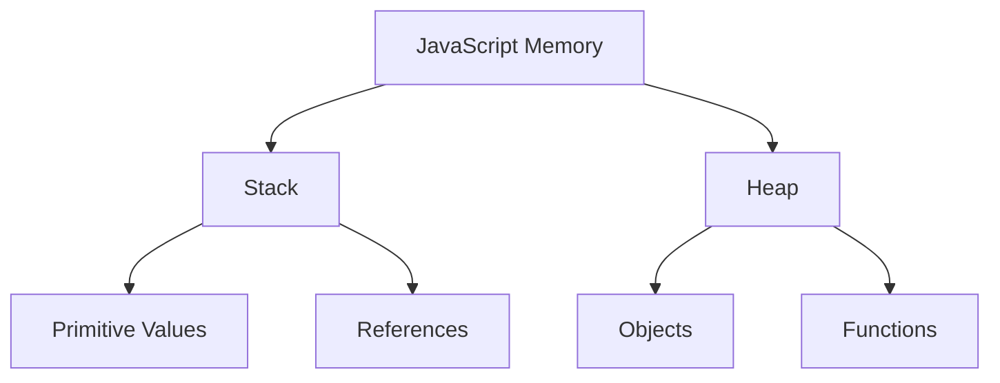
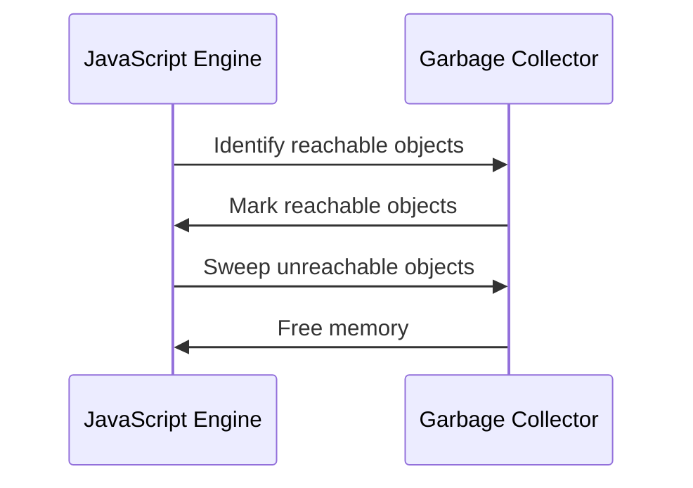
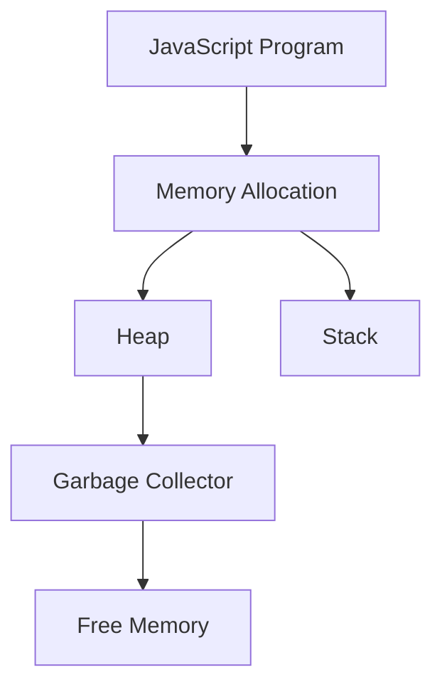

## 13.2 Memory Management and Garbage Collection

In the realm of JavaScript, understanding memory management and garbage collection is crucial for optimizing performance and preventing memory leaks. This section delves into how JavaScript handles memory allocation, the role of the garbage collector, and best practices for efficient memory usage.

### Understanding Memory Allocation in JavaScript

JavaScript, like many programming languages, manages memory allocation automatically. This process involves allocating memory for variables, objects, and functions, and subsequently freeing it when it's no longer needed. Let's explore the key components involved in this process:

#### The Stack and the Heap

- **Stack**: The stack is a region of memory that stores primitive values and references to objects. It operates on a last-in, first-out (LIFO) basis, making it efficient for managing function calls and local variables.
- **Heap**: The heap is a larger region of memory used for dynamic allocation. Objects and functions are stored in the heap, allowing for flexible memory usage.



*Figure 1: JavaScript Memory Structure*

### The Role of the Garbage Collector

The garbage collector is responsible for automatically freeing memory that is no longer in use. JavaScript employs a form of garbage collection known as **mark-and-sweep**. Here's how it works:

1. **Marking**: The garbage collector identifies objects that are still reachable from the root (e.g., global variables, function calls).
2. **Sweeping**: Unreachable objects are considered garbage and are removed from memory.



*Figure 2: Mark-and-Sweep Garbage Collection Process*

### Common Causes of Memory Leaks

Memory leaks occur when memory that is no longer needed is not released. This can lead to increased memory usage and degraded performance. Here are some common causes:

#### Unintentionally Retained References

Objects that are no longer needed but still have references pointing to them can cause memory leaks. For example:

```javascript
let element = document.getElementById('myElement');
function doSomething() {
    element.addEventListener('click', () => {
        console.log('Clicked!');
    });
}
// If 'element' is removed from the DOM but not set to null, it remains in memory.
```

#### Closures Holding onto Variables

Closures can inadvertently retain variables, leading to memory leaks:

```javascript
function createClosure() {
    let largeArray = new Array(1000).fill('data');
    return function() {
        console.log(largeArray[0]);
    };
}
let closure = createClosure();
// 'largeArray' is retained in memory even if it's no longer needed.
```

#### Listeners Not Properly Removed

Event listeners that are not removed can prevent objects from being garbage collected:

```javascript
let button = document.getElementById('myButton');
function handleClick() {
    console.log('Button clicked!');
}
button.addEventListener('click', handleClick);
// If 'button' is removed from the DOM, remove the listener to free memory.
button.removeEventListener('click', handleClick);
```

### Detecting Memory Leaks

Detecting memory leaks is crucial for maintaining optimal performance. Tools like Chrome DevTools provide powerful features for identifying and resolving memory issues.

#### Using Chrome DevTools Memory Panel

The Chrome DevTools Memory Panel allows developers to take heap snapshots, record allocation timelines, and analyze memory usage.

1. **Heap Snapshots**: Capture the state of memory at a specific point in time.
2. **Allocation Timeline**: Record memory allocations over time to identify leaks.
3. **Retainers**: Analyze which objects are retaining memory and why.

For more information, visit the [Chrome DevTools Memory Panel documentation](https://developer.chrome.com/docs/devtools/memory-problems/).

### Strategies for Optimizing Memory Usage

Efficient memory management involves proactive strategies to minimize memory usage and ensure timely garbage collection.

#### Managing References

- **Nullify References**: Set references to `null` when objects are no longer needed.
- **Use Weak References**: Use `WeakMap` and `WeakSet` for objects that can be garbage collected when no longer needed.

#### Avoiding Memory Leaks

- **Remove Event Listeners**: Always remove event listeners when they are no longer needed.
- **Limit Scope of Variables**: Use block-scoped variables (`let`, `const`) to limit the lifespan of variables.

#### Best Practices for Memory Management

- **Optimize Data Structures**: Use efficient data structures to minimize memory usage.
- **Monitor Memory Usage**: Regularly profile memory usage to identify potential leaks.
- **Use Efficient Algorithms**: Implement algorithms that minimize memory allocations.

### Try It Yourself

Experiment with the following code to understand memory management in JavaScript. Modify the code to observe how changes affect memory usage.

```javascript
function createLargeArray() {
    let largeArray = new Array(1000000).fill('data');
    return largeArray;
}

let array = createLargeArray();
// Try setting 'array' to null and observe memory usage.
array = null;
```

### Visualizing Memory Management



*Figure 3: Memory Management Flow in JavaScript*

### Knowledge Check

- What is the difference between the stack and the heap in JavaScript memory management?
- How does the mark-and-sweep garbage collection process work?
- What are some common causes of memory leaks in JavaScript?
- How can Chrome DevTools be used to detect memory leaks?
- What strategies can be employed to optimize memory usage in JavaScript?

### Summary

In this section, we explored the intricacies of memory management and garbage collection in JavaScript. By understanding how memory is allocated and freed, developers can optimize performance and prevent memory leaks. Remember to regularly profile memory usage, manage references efficiently, and employ best practices to ensure a smooth and performant web application.

---

## Quiz: Mastering JavaScript Memory Management and Garbage Collection



### What is the primary role of the garbage collector in JavaScript?

- [x] To automatically free memory that is no longer in use
- [ ] To allocate memory for new variables
- [ ] To manage the execution context
- [ ] To optimize code performance

> **Explanation:** The garbage collector automatically frees memory that is no longer in use, preventing memory leaks.

### Which memory region is used for storing objects and functions in JavaScript?

- [ ] Stack
- [x] Heap
- [ ] Queue
- [ ] Register

> **Explanation:** The heap is used for dynamic memory allocation, storing objects and functions.

### What is a common cause of memory leaks in JavaScript?

- [x] Unintentionally retained references
- [ ] Using `const` instead of `let`
- [ ] Declaring variables globally
- [ ] Using strict mode

> **Explanation:** Unintentionally retained references prevent objects from being garbage collected, leading to memory leaks.

### How can you detect memory leaks using Chrome DevTools?

- [x] By taking heap snapshots and analyzing memory usage
- [ ] By using the Console panel
- [ ] By inspecting the DOM
- [ ] By running performance audits

> **Explanation:** Chrome DevTools' Memory Panel allows developers to take heap snapshots and analyze memory usage to detect leaks.

### What is the purpose of setting references to `null`?

- [x] To allow garbage collection of objects
- [ ] To initialize variables
- [ ] To prevent variable hoisting
- [ ] To optimize code execution

> **Explanation:** Setting references to `null` allows objects to be garbage collected when they are no longer needed.

### Which data structures can help manage memory efficiently?

- [x] WeakMap and WeakSet
- [ ] Array and Object
- [ ] Map and Set
- [ ] String and Number

> **Explanation:** WeakMap and WeakSet allow objects to be garbage collected when no longer needed, managing memory efficiently.

### What is the mark-and-sweep process in garbage collection?

- [x] Marking reachable objects and sweeping unreachable ones
- [ ] Allocating memory for new variables
- [ ] Executing code in the call stack
- [ ] Optimizing code performance

> **Explanation:** The mark-and-sweep process involves marking reachable objects and sweeping unreachable ones to free memory.

### How can you prevent memory leaks caused by event listeners?

- [x] By removing event listeners when they are no longer needed
- [ ] By using global variables
- [ ] By declaring listeners inside functions
- [ ] By using `var` instead of `let`

> **Explanation:** Removing event listeners when they are no longer needed prevents memory leaks.

### What is the benefit of using block-scoped variables?

- [x] They limit the lifespan of variables, reducing memory usage
- [ ] They prevent variable hoisting
- [ ] They improve code readability
- [ ] They allow for dynamic typing

> **Explanation:** Block-scoped variables limit the lifespan of variables, reducing memory usage and potential leaks.

### True or False: The stack is used for dynamic memory allocation in JavaScript.

- [ ] True
- [x] False

> **Explanation:** The heap, not the stack, is used for dynamic memory allocation in JavaScript.



Remember, mastering memory management and garbage collection is a journey. As you continue to develop your skills, you'll build more efficient and performant applications. Keep experimenting, stay curious, and enjoy the process!
