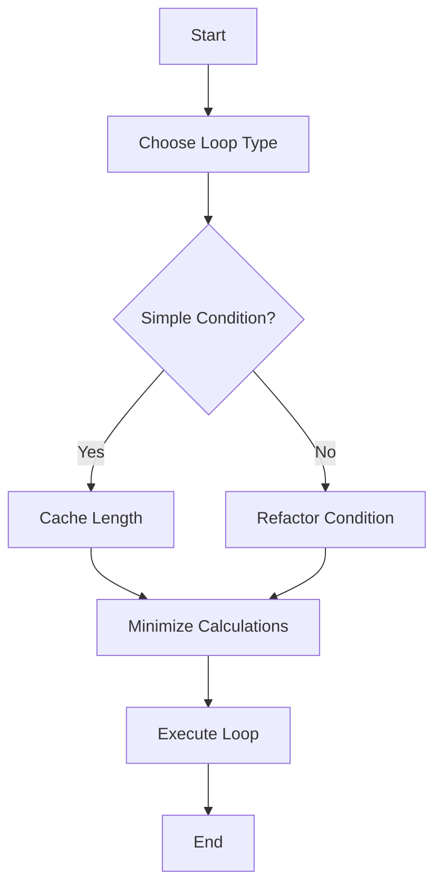
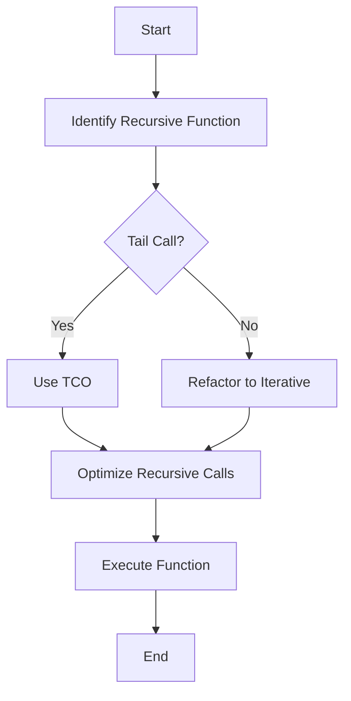

## 13.3 Optimizing Loops and Recursions

In the realm of JavaScript programming, loops and recursion are fundamental constructs that allow us to perform repetitive tasks efficiently. However, their improper use can lead to significant performance bottlenecks. In this section, we will explore various techniques to optimize loops and recursive functions, enhancing execution speed and efficiency in modern web development.

### Understanding the Impact of Loops and Recursion on Performance

Loops and recursion are essential for iterating over data structures, performing calculations, and solving complex problems. However, they can also be a source of inefficiency if not used wisely. Let's delve into how these constructs impact performance and how we can optimize them.

#### Loops

Loops are a basic control structure used to repeat a block of code multiple times. Common loop constructs in JavaScript include `for`, `while`, `do...while`, and `forEach`. The performance of loops can be affected by factors such as loop overhead, the complexity of operations within the loop, and the number of iterations.

#### Recursion

Recursion is a technique where a function calls itself to solve a problem. While recursion can lead to elegant solutions, it can also be inefficient due to the overhead of function calls and the risk of exceeding the call stack size. Understanding when and how to use recursion effectively is crucial for performance optimization.

### Tips for Optimizing Loops

Optimizing loops involves minimizing overhead, choosing the right loop construct, and reducing the complexity of operations within the loop. Here are some tips to achieve these goals:

#### Minimizing Loop Overhead

Loop overhead refers to the time taken to manage the loop itself, such as incrementing counters and checking conditions. To minimize loop overhead:

- **Use simple conditions**: Ensure that the loop condition is as simple as possible to reduce evaluation time.
- **Avoid unnecessary calculations**: Perform calculations outside the loop if they do not change with each iteration.

#### Caching Loop Length in For-Loops

When iterating over arrays, especially large ones, repeatedly accessing the array's length property can be costly. Caching the length before the loop starts can improve performance:

```javascript
const array = [/* large array */];
const length = array.length;

for (let i = 0; i < length; i++) {
  // Perform operations with array[i]
}
```

#### Choosing the Appropriate Loop Construct

Different loop constructs have different performance characteristics. Choose the one that best fits your use case:

- **`for` loop**: Offers the most control and is generally the fastest for simple iterations.
- **`while` loop**: Useful when the number of iterations is not known in advance.
- **`forEach` method**: Provides a cleaner syntax for iterating over arrays but may be slower than a `for` loop due to function calls.

### Tail Call Optimization in JavaScript

Tail call optimization (TCO) is a technique used by some JavaScript engines to optimize recursive functions. It allows a function to call itself without growing the call stack, thus preventing stack overflow errors. TCO is supported in strict mode in some JavaScript environments, such as Node.js.

#### Understanding Tail Calls

A tail call occurs when a function calls another function as its last action. If the call is recursive, and the JavaScript engine supports TCO, the current function's stack frame can be replaced with the new one, reducing memory usage.

#### Example of Tail Call Optimization

Consider a simple recursive function to calculate the factorial of a number:

```javascript
"use strict";

function factorial(n, acc = 1) {
  if (n <= 1) return acc;
  return factorial(n - 1, n * acc); // Tail call
}

console.log(factorial(5)); // Output: 120
```

In this example, the recursive call to `factorial` is the last action in the function, making it a tail call. If TCO is supported, this function will not cause a stack overflow for large values of `n`.

### Refactoring Recursive Functions for Performance

Recursive functions can be refactored to improve performance by reducing the number of recursive calls or converting them into iterative solutions.

#### Example: Fibonacci Sequence

The Fibonacci sequence is a classic example where naive recursion can be inefficient:

```javascript
function fibonacci(n) {
  if (n <= 1) return n;
  return fibonacci(n - 1) + fibonacci(n - 2);
}

console.log(fibonacci(10)); // Output: 55
```

This implementation is inefficient because it recalculates the same values multiple times. We can optimize it using memoization or by converting it to an iterative solution.

#### Iterative Solution

An iterative solution for the Fibonacci sequence can be more efficient:

```javascript
function fibonacciIterative(n) {
  let a = 0, b = 1, temp;

  for (let i = 2; i <= n; i++) {
    temp = a + b;
    a = b;
    b = temp;
  }

  return n === 0 ? a : b;
}

console.log(fibonacciIterative(10)); // Output: 55
```

This approach uses a loop to calculate the Fibonacci numbers, avoiding the overhead of recursive calls.

### Limitations of Recursion Due to Call Stack Size

Recursion can be limited by the maximum call stack size, which varies between environments. Deep recursion can lead to stack overflow errors. When dealing with large datasets or deep recursive calls, consider using iterative solutions or optimizing with techniques like TCO.

### Visualizing Loop and Recursion Optimization

To better understand the optimization of loops and recursion, let's visualize the process using Mermaid.js diagrams.

#### Loop Optimization Flowchart



**Caption**: This flowchart illustrates the process of optimizing loops by choosing the appropriate loop type, simplifying conditions, caching lengths, and minimizing calculations.

#### Recursive Function Optimization Flowchart



**Caption**: This flowchart demonstrates the steps to optimize recursive functions by identifying tail calls, using TCO, and refactoring to iterative solutions when necessary.

### Try It Yourself

Experiment with the code examples provided in this section. Try modifying the loop conditions, caching strategies, and recursive functions to see how they impact performance. Consider implementing your own recursive functions and refactoring them for optimization.

### References and Further Reading

- [MDN Web Docs: Loops and Iteration](https://developer.mozilla.org/en-US/docs/Web/JavaScript/Guide/Loops_and_iteration)
- [MDN Web Docs: Recursion](https://developer.mozilla.org/en-US/docs/Glossary/Recursion)
- [MDN Web Docs: Tail Call Optimization](https://developer.mozilla.org/en-US/docs/Web/JavaScript/Reference/Functions/Tail_calls)

### Knowledge Check

- What are some common loop constructs in JavaScript, and how do they differ in performance?
- How can caching the length of an array improve loop performance?
- What is tail call optimization, and how does it benefit recursive functions?
- How can you refactor a recursive function to improve its performance?
- What are the limitations of recursion in JavaScript, and how can they be mitigated?

### Embrace the Journey

Optimizing loops and recursion is a crucial skill for any JavaScript developer. By understanding the impact of these constructs on performance and applying the techniques discussed in this section, you can write more efficient and effective code. Remember, this is just the beginning. As you progress, you'll encounter more complex scenarios where these optimizations will prove invaluable. Keep experimenting, stay curious, and enjoy the journey!

## Quiz: Mastering Loop and Recursion Optimization in JavaScript



### What is the primary benefit of caching the length of an array in a loop?

- [x] It reduces the number of property lookups.
- [ ] It increases the loop's readability.
- [ ] It decreases the memory usage.
- [ ] It simplifies the loop's logic.

> **Explanation:** Caching the length of an array reduces the number of property lookups, which can improve performance, especially in large arrays.

### Which loop construct generally offers the most control and is often the fastest for simple iterations?

- [x] `for` loop
- [ ] `while` loop
- [ ] `do...while` loop
- [ ] `forEach` method

> **Explanation:** The `for` loop offers the most control over the iteration process and is generally the fastest for simple iterations due to its straightforward structure.

### What is tail call optimization (TCO)?

- [x] A technique that optimizes recursive function calls to prevent stack overflow.
- [ ] A method to improve loop performance by caching values.
- [ ] A way to enhance the readability of recursive functions.
- [ ] A strategy to reduce memory usage in loops.

> **Explanation:** Tail call optimization is a technique used to optimize recursive function calls, allowing them to execute without growing the call stack, thus preventing stack overflow.

### How can you refactor a recursive function to improve its performance?

- [x] By converting it to an iterative solution.
- [ ] By adding more recursive calls.
- [ ] By increasing the call stack size.
- [ ] By using more complex conditions.

> **Explanation:** Refactoring a recursive function to an iterative solution can improve performance by eliminating the overhead of recursive calls and reducing the risk of stack overflow.

### What is a common limitation of recursion in JavaScript?

- [x] The maximum call stack size.
- [ ] The inability to handle large datasets.
- [ ] The lack of support for loops.
- [ ] The requirement for tail call optimization.

> **Explanation:** A common limitation of recursion in JavaScript is the maximum call stack size, which can lead to stack overflow errors in deep recursive calls.

### Which of the following is a benefit of using iterative solutions over recursive ones?

- [x] They avoid stack overflow errors.
- [ ] They are always faster.
- [ ] They require less code.
- [ ] They are easier to read.

> **Explanation:** Iterative solutions avoid stack overflow errors because they do not rely on the call stack for execution, unlike recursive solutions.

### What is a key characteristic of a tail call in a recursive function?

- [x] It is the last action performed by the function.
- [ ] It involves multiple recursive calls.
- [ ] It requires additional memory allocation.
- [ ] It simplifies the function's logic.

> **Explanation:** A tail call is the last action performed by a function, allowing the current function's stack frame to be replaced with the new one, optimizing memory usage.

### Why might you choose a `while` loop over a `for` loop?

- [x] When the number of iterations is not known in advance.
- [ ] When you want to cache the loop length.
- [ ] When you need to iterate over an array.
- [ ] When you want to use a simpler syntax.

> **Explanation:** A `while` loop is useful when the number of iterations is not known in advance, as it continues to execute as long as a specified condition is true.

### What is the primary advantage of using the `forEach` method for array iteration?

- [x] It provides a cleaner syntax.
- [ ] It is the fastest loop construct.
- [ ] It allows for caching the array length.
- [ ] It reduces memory usage.

> **Explanation:** The `forEach` method provides a cleaner syntax for iterating over arrays, making the code more readable, although it may not be the fastest option.

### True or False: Tail call optimization is supported in all JavaScript environments.

- [ ] True
- [x] False

> **Explanation:** Tail call optimization is not supported in all JavaScript environments. It is available in strict mode in some environments, such as Node.js.


