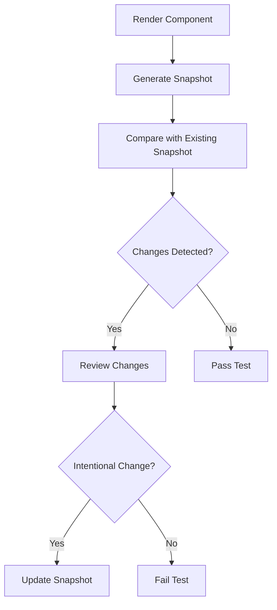

## 13. Testing Patterns
### 13.3 Snapshot Testing

Snapshot testing is a powerful technique used in software development to ensure that the output of a component or function remains consistent over time. This method is particularly useful for detecting unintended changes in user interfaces (UI) or other serializable outputs. In this article, we will delve into the concept of snapshot testing, explore its implementation using modern JavaScript and TypeScript frameworks, and discuss best practices and considerations.

### Understand the Concept

Snapshot testing involves capturing the rendered output of components or functions and comparing these snapshots over time. This approach is beneficial for:

- **Detecting Unintended Changes:** By comparing current output with a previously stored snapshot, developers can quickly identify unexpected changes.
- **Ensuring UI Consistency:** Particularly useful in UI development, snapshot testing helps maintain consistent visual output across different versions of a component.

### Implementation Steps

#### Set Up Testing Framework

To implement snapshot testing, you need a testing framework that supports this feature. Jest is a popular choice due to its robust support for snapshot testing.

1. **Install Jest:**

   ```bash
   npm install --save-dev jest
   ```

2. **Configure Jest:**

   Create a `jest.config.js` file to configure Jest for your project.

   ```javascript
   module.exports = {
     testEnvironment: 'node',
     // Add other configurations as needed
   };
   ```

#### Write a Snapshot Test

Writing a snapshot test involves rendering the component or output and generating a snapshot.

1. **Render the Component:**

   Use a testing library like `@testing-library/react` to render your component.

   ```javascript
   import React from 'react';
   import { render } from '@testing-library/react';
   import MyComponent from './MyComponent';

   test('renders correctly', () => {
     const { asFragment } = render(<MyComponent />);
     expect(asFragment()).toMatchSnapshot();
   });
   ```

2. **Generate a Snapshot:**

   The first time you run the test, Jest will create a snapshot file in a `__snapshots__` directory.

3. **Review Snapshots:**

   Check the generated snapshot files into version control to track changes over time.

#### Update Snapshots When Needed

When intentional changes are made to the component or output, update the snapshots using Jest's update command:

```bash
npm test -- -u
```

### Practice

#### Implement Snapshot Tests for React Components

Snapshot testing is particularly effective for React components. By capturing the rendered output, you can ensure that UI changes are intentional and verified.

```javascript
import React from 'react';
import { render } from '@testing-library/react';
import MyButton from './MyButton';

test('MyButton renders correctly', () => {
  const { asFragment } = render(<MyButton label="Click me" />);
  expect(asFragment()).toMatchSnapshot();
});
```

#### Use Snapshots to Test Serializable Data Structures

Snapshot testing is not limited to UI components. It can also be used to verify the structure and content of serializable data.

```javascript
test('data structure matches snapshot', () => {
  const data = { name: 'John Doe', age: 30 };
  expect(data).toMatchSnapshot();
});
```

### Considerations

- **Large Snapshots:** Be cautious of large snapshots, as they can be difficult to review and maintain. Focus on capturing only the necessary parts of the output.
- **Review Changes Carefully:** Always review snapshot changes carefully to catch unintended updates. This practice helps maintain the integrity of your tests.

### Visual Aids

Here's a conceptual diagram illustrating the snapshot testing process:



### Best Practices

- **Keep Snapshots Small:** Focus on capturing only the essential parts of the output to keep snapshots manageable.
- **Use Descriptive Test Names:** Clearly describe what each snapshot test is verifying to make it easier to understand the purpose of each snapshot.
- **Regularly Update Snapshots:** Ensure that snapshots are updated whenever intentional changes are made to the component or output.

### Conclusion

Snapshot testing is a valuable tool in the developer's toolkit, offering a straightforward way to ensure UI consistency and detect unintended changes. By integrating snapshot testing into your development workflow, you can enhance the reliability and maintainability of your codebase.

## Quiz Time!



### What is the primary purpose of snapshot testing?

- [x] To detect unintended changes in UI or serializable outputs
- [ ] To test the performance of a component
- [ ] To ensure code coverage
- [ ] To validate API responses

> **Explanation:** Snapshot testing is primarily used to detect unintended changes in the UI or other serializable outputs by comparing current output with stored snapshots.

### Which testing framework is commonly used for snapshot testing in JavaScript?

- [x] Jest
- [ ] Mocha
- [ ] Jasmine
- [ ] Cypress

> **Explanation:** Jest is a popular testing framework that provides robust support for snapshot testing in JavaScript applications.

### How do you update snapshots when intentional changes are made?

- [x] Run `npm test -- -u`
- [ ] Manually edit the snapshot files
- [ ] Delete the old snapshots and rerun the tests
- [ ] Use a special IDE plugin

> **Explanation:** Running `npm test -- -u` updates the snapshots to reflect intentional changes in the component or output.

### What should you be cautious of when using snapshot testing?

- [x] Large snapshots that are hard to review
- [ ] Small snapshots that are easy to review
- [ ] Using too many snapshots
- [ ] Not using enough snapshots

> **Explanation:** Large snapshots can be difficult to review and maintain, so it's important to keep them focused and manageable.

### What is a key benefit of snapshot testing for React components?

- [x] Ensures UI consistency
- [ ] Improves component performance
- [ ] Reduces code complexity
- [ ] Increases development speed

> **Explanation:** Snapshot testing helps ensure UI consistency by capturing the rendered output of React components and comparing it over time.

### Can snapshot testing be used for non-UI components?

- [x] Yes
- [ ] No

> **Explanation:** Snapshot testing can be used to verify the structure and content of serializable data, not just UI components.

### What command is used to run Jest tests?

- [x] npm test
- [ ] jest run
- [ ] test jest
- [ ] run test

> **Explanation:** The `npm test` command is commonly used to run Jest tests, including snapshot tests.

### What should be done with generated snapshot files?

- [x] Check them into version control
- [ ] Delete them after each test run
- [ ] Ignore them in version control
- [ ] Manually edit them for accuracy

> **Explanation:** Generated snapshot files should be checked into version control to track changes over time.

### What is a potential drawback of snapshot testing?

- [x] Difficulty in reviewing large snapshots
- [ ] Increased test execution time
- [ ] Decreased code coverage
- [ ] Reduced test accuracy

> **Explanation:** Large snapshots can be difficult to review, making it challenging to identify the specific changes that occurred.

### Snapshot testing is only applicable to UI components. True or False?

- [ ] True
- [x] False

> **Explanation:** Snapshot testing is not limited to UI components; it can also be used for testing serializable data structures.


