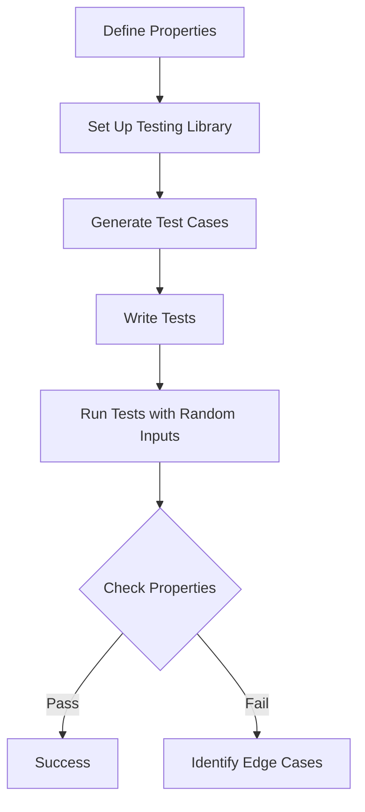

---

linkTitle: "13.4 Property-Based Testing"
title: "Property-Based Testing: Enhancing JavaScript and TypeScript Testing Strategies"
description: "Explore the concept of property-based testing in JavaScript and TypeScript, learn how to implement it using modern libraries, and understand its advantages over traditional testing methods."
categories:
- Software Development
- Testing
- JavaScript
- TypeScript
tags:
- Property-Based Testing
- JavaScript
- TypeScript
- Testing Patterns
- fast-check
date: 2024-10-25
type: docs
nav_weight: 1340000
canonical: "https://softwarepatternslexicon.com/patterns-js/13/4"
license: "© 2024 Tokenizer Inc. CC BY-NC-SA 4.0"
---

## 13.4 Property-Based Testing

### Introduction

In the realm of software testing, ensuring that your code behaves correctly across a wide range of inputs is crucial. Property-based testing offers a robust approach by focusing on the properties or invariants of your code rather than specific input-output pairs. This method contrasts with example-based testing, which relies on predefined inputs. By leveraging property-based testing, developers can uncover edge cases and unexpected behaviors that might otherwise go unnoticed.

### Understanding the Concept

Property-based testing is a testing paradigm where you define properties or invariants that your code should satisfy, and then test these properties over a wide range of randomly generated inputs. This approach helps in identifying edge cases and ensuring that the code behaves correctly under various conditions.

#### Key Concepts

- **Properties/Invariants:** These are the rules or conditions that should always hold true for your code. For example, sorting a list should always result in a list where each element is less than or equal to the next.
- **Random Data Generation:** Instead of manually specifying test cases, property-based testing uses random data generation to explore a vast input space.
- **Automation:** The testing framework automatically generates inputs, runs tests, and reports failures, making it easier to identify problematic areas in the code.

### Implementation Steps

#### 1. Define Properties

The first step in property-based testing is to identify the properties or invariants that your code should satisfy. These properties are the foundation of your tests.

- **Example:** For a sorting function, a property might be that the output list is always sorted, and it contains the same elements as the input list.

#### 2. Set Up a Property-Based Testing Library

To implement property-based testing in JavaScript or TypeScript, you can use libraries like `fast-check`. This library provides tools for generating random inputs and testing properties.

```bash
npm install --save-dev fast-check
```

#### 3. Generate Test Cases

Use the library's generators to produce a wide range of inputs. Generators can create various data types, including numbers, strings, arrays, and more complex structures.

```typescript
import * as fc from 'fast-check';

// Example of generating an array of integers
const integerArray = fc.array(fc.integer());
```

#### 4. Write Tests

Write tests that assert the properties hold for all generated inputs. The library will automatically run the tests with different inputs and report any failures.

```typescript
import * as fc from 'fast-check';

const sort = (arr: number[]): number[] => arr.sort((a, b) => a - b);

fc.assert(
  fc.property(fc.array(fc.integer()), (arr) => {
    const sortedArr = sort(arr);
    // Property: The array should be sorted
    for (let i = 0; i < sortedArr.length - 1; i++) {
      if (sortedArr[i] > sortedArr[i + 1]) {
        return false;
      }
    }
    // Property: The sorted array should have the same elements
    return sortedArr.length === arr.length;
  })
);
```

### Practice

Property-based testing is particularly useful for testing functions that need to handle edge cases and unexpected inputs gracefully. It can also validate algorithms by asserting their properties under various conditions.

#### Example: Testing a Reverse Function

Let's consider a simple function that reverses an array. We want to ensure that reversing an array twice yields the original array.

```typescript
const reverse = (arr: any[]): any[] => arr.reverse();

fc.assert(
  fc.property(fc.array(fc.anything()), (arr) => {
    const reversedTwice = reverse(reverse([...arr]));
    return JSON.stringify(reversedTwice) === JSON.stringify(arr);
  })
);
```

### Considerations

- **Choosing Properties:** Carefully consider which properties to test. The properties should be meaningful and reflect the intended behavior of the code.
- **Diagnosing Failures:** Be prepared to diagnose failures with unexpected input data. Property-based testing can uncover edge cases that are difficult to reproduce manually.

### Visual Aids

#### Conceptual Diagram of Property-Based Testing



### Advantages and Disadvantages

#### Advantages

- **Comprehensive Testing:** Tests a wide range of inputs, increasing the likelihood of finding edge cases.
- **Automation:** Automatically generates and tests inputs, reducing manual effort.
- **Robustness:** Helps ensure code behaves correctly under various conditions.

#### Disadvantages

- **Complexity:** Requires careful thought to define meaningful properties.
- **Debugging:** Diagnosing failures can be challenging with complex input data.

### Best Practices

- **Start Simple:** Begin with simple properties and gradually introduce more complex ones.
- **Use Descriptive Properties:** Clearly describe the properties to make tests easier to understand and maintain.
- **Combine with Example-Based Testing:** Use property-based testing alongside example-based testing for comprehensive coverage.

### Comparisons

Property-based testing complements example-based testing by exploring a broader input space. While example-based tests are useful for specific scenarios, property-based tests ensure general correctness across many cases.

### Conclusion

Property-based testing is a powerful tool for enhancing the robustness and reliability of your code. By focusing on properties and using random data generation, you can uncover edge cases and ensure your code behaves correctly under various conditions. As you integrate property-based testing into your workflow, you'll gain confidence in your code's ability to handle unexpected inputs gracefully.

## Quiz Time!



### What is the primary focus of property-based testing?

- [x] Testing properties or invariants over a wide range of inputs
- [ ] Testing specific input-output pairs
- [ ] Testing only edge cases
- [ ] Testing only with predefined inputs

> **Explanation:** Property-based testing focuses on testing properties or invariants over a wide range of inputs, unlike example-based testing which uses specific input-output pairs.

### Which library is commonly used for property-based testing in JavaScript?

- [x] fast-check
- [ ] Mocha
- [ ] Jest
- [ ] Jasmine

> **Explanation:** `fast-check` is a popular library for property-based testing in JavaScript, providing tools for generating random inputs and testing properties.

### What is a key advantage of property-based testing?

- [x] It tests a wide range of inputs automatically
- [ ] It requires less thought to define properties
- [ ] It is easier to debug than example-based testing
- [ ] It only tests predefined scenarios

> **Explanation:** A key advantage of property-based testing is that it tests a wide range of inputs automatically, increasing the likelihood of finding edge cases.

### What should be carefully considered when defining properties for property-based testing?

- [x] The meaningfulness and relevance of the properties
- [ ] The number of properties
- [ ] The complexity of the properties
- [ ] The simplicity of the properties

> **Explanation:** When defining properties for property-based testing, it's important to consider the meaningfulness and relevance of the properties to ensure they reflect the intended behavior of the code.

### How does property-based testing differ from example-based testing?

- [x] It uses random data generation to explore a vast input space
- [ ] It uses predefined inputs only
- [ ] It focuses on specific input-output pairs
- [ ] It is less comprehensive

> **Explanation:** Property-based testing differs from example-based testing by using random data generation to explore a vast input space, rather than focusing on specific input-output pairs.

### What is a potential disadvantage of property-based testing?

- [x] Diagnosing failures can be challenging
- [ ] It requires less manual effort
- [ ] It is less comprehensive
- [ ] It only tests predefined scenarios

> **Explanation:** A potential disadvantage of property-based testing is that diagnosing failures can be challenging, especially with complex input data.

### Which of the following is a best practice for property-based testing?

- [x] Start with simple properties and gradually introduce more complex ones
- [ ] Use only complex properties from the start
- [ ] Avoid using example-based testing
- [ ] Test only with predefined inputs

> **Explanation:** A best practice for property-based testing is to start with simple properties and gradually introduce more complex ones, ensuring a solid foundation before tackling more challenging scenarios.

### What is the role of generators in property-based testing?

- [x] They produce a wide range of inputs for testing
- [ ] They define the properties to be tested
- [ ] They execute the tests
- [ ] They report test results

> **Explanation:** In property-based testing, generators produce a wide range of inputs for testing, allowing the testing framework to explore various scenarios.

### Why is property-based testing particularly useful for algorithms?

- [x] It validates algorithms by asserting their properties under various conditions
- [ ] It simplifies the algorithm design
- [ ] It reduces the need for manual testing
- [ ] It focuses only on edge cases

> **Explanation:** Property-based testing is particularly useful for algorithms because it validates them by asserting their properties under various conditions, ensuring robustness and correctness.

### True or False: Property-based testing should be used exclusively, without example-based testing.

- [ ] True
- [x] False

> **Explanation:** False. Property-based testing should be used alongside example-based testing for comprehensive coverage, as both approaches complement each other.


