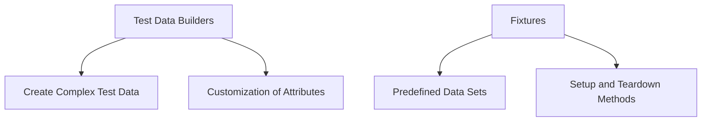

## 13.5 Test Data Builders and Fixtures

In the realm of software testing, creating reliable and maintainable tests is crucial for ensuring the quality of your codebase. Two powerful patterns that facilitate this are **Test Data Builders** and **Fixtures**. These patterns help streamline the process of setting up test data, making tests more readable and easier to maintain.

### Understand the Concepts

#### Test Data Builders

**Test Data Builders** are design patterns that simplify the creation of complex test data. They provide a fluent interface for constructing objects with various attributes, allowing for easy customization and readability.

- **Purpose:** To create complex test data with ease and flexibility.
- **Benefits:** Enhances test readability, reduces duplication, and allows for easy customization of test data.

#### Fixtures

**Fixtures** are predefined data sets or states used across multiple tests. They help ensure consistency and reduce redundancy by centralizing common test data or states.

- **Purpose:** To provide a consistent and reusable setup for tests.
- **Benefits:** Simplifies test setup, ensures consistency, and reduces code duplication.

### Implementation Steps

#### Implement Test Data Builders

1. **Create Builder Functions or Classes:**
   - Define a builder class or function for each complex object you need to create in your tests.
   - Use method chaining to allow for a fluent interface.

2. **Allow Customization:**
   - Provide methods to customize the attributes of the object being built.
   - Ensure default values are sensible to reduce the need for customization in every test.

**Example:**

```typescript
class UserBuilder {
    private user: any = {
        name: 'Default Name',
        age: 30,
        email: 'default@example.com'
    };

    withName(name: string): UserBuilder {
        this.user.name = name;
        return this;
    }

    withAge(age: number): UserBuilder {
        this.user.age = age;
        return this;
    }

    withEmail(email: string): UserBuilder {
        this.user.email = email;
        return this;
    }

    build(): any {
        return this.user;
    }
}

// Usage
const user = new UserBuilder().withName('John Doe').withEmail('john.doe@example.com').build();
```

#### Set Up Fixtures

1. **Define Common Test Data or States:**
   - Centralize common test data in a fixture file or setup function.
   - Use this data across multiple tests to ensure consistency.

2. **Use Setup and Teardown Methods:**
   - Implement setup methods to initialize fixtures before tests run.
   - Use teardown methods to clean up after tests to prevent state leakage.

**Example:**

```typescript
import { setupDatabase, teardownDatabase } from './testHelpers';

beforeEach(async () => {
    await setupDatabase();
});

afterEach(async () => {
    await teardownDatabase();
});

// Test using fixtures
test('should retrieve user from database', async () => {
    const user = await getUserFromDatabase('john.doe@example.com');
    expect(user.name).toBe('John Doe');
});
```

### Practice

#### Use Builders to Create Test Users

Builders can be used to create test users with various attributes, ensuring that each test has the specific data it needs without unnecessary duplication.

#### Implement Database Fixtures for Integration Tests

For integration tests, database fixtures can be used to set up a known state in the database before tests run. This ensures that tests are consistent and reliable.

### Considerations

- **Avoid Overly Generic Test Data:** Tailor test data to the specific needs of each test to ensure clarity and relevance.
- **Ensure Proper Isolation:** Fixtures should be isolated to prevent tests from affecting each other. Use setup and teardown methods to manage this isolation.

### Visual Aids

#### Conceptual Diagram of Test Data Builders and Fixtures



### Advantages and Disadvantages

#### Advantages

- **Readability:** Both patterns enhance the readability of tests by abstracting complex setup logic.
- **Reusability:** Fixtures and builders promote reusability of test data and setup logic.
- **Maintainability:** Centralizing test data and setup logic makes tests easier to maintain and update.

#### Disadvantages

- **Complexity:** Overuse of builders and fixtures can introduce unnecessary complexity.
- **Setup Overhead:** Managing fixtures can add overhead to test setup and teardown processes.

### Best Practices

- **Use Builders for Complex Objects:** Employ builders for objects with multiple attributes or complex construction logic.
- **Centralize Common Setup Logic:** Use fixtures to centralize common setup logic, but ensure they are isolated and do not introduce dependencies between tests.
- **Keep Tests Independent:** Ensure each test is independent and does not rely on the state left by previous tests.

### Conclusion

Test Data Builders and Fixtures are invaluable tools in the arsenal of any developer aiming to write clean, maintainable, and reliable tests. By abstracting the complexity of test data setup, these patterns enhance test readability and reduce duplication. Implementing these patterns effectively can lead to a more robust and efficient testing strategy.

## Quiz Time!



### What is the primary purpose of Test Data Builders?

- [x] To create complex test data with ease and flexibility.
- [ ] To execute tests faster.
- [ ] To replace all test data with mock data.
- [ ] To automate test execution.

> **Explanation:** Test Data Builders are designed to simplify the creation of complex test data, allowing for easy customization and readability.

### What is a key benefit of using Fixtures in testing?

- [x] Simplifies test setup and ensures consistency.
- [ ] Increases test execution speed.
- [ ] Eliminates the need for test assertions.
- [ ] Automatically generates test reports.

> **Explanation:** Fixtures provide a consistent and reusable setup for tests, simplifying the setup process and ensuring consistency across tests.

### How do Test Data Builders enhance test readability?

- [x] By providing a fluent interface for constructing objects.
- [ ] By eliminating the need for test descriptions.
- [ ] By reducing the number of test cases.
- [ ] By automating test documentation.

> **Explanation:** Test Data Builders use method chaining to create a fluent interface, making the construction of test objects more readable and intuitive.

### What is a potential disadvantage of using Fixtures?

- [x] They can introduce unnecessary complexity if overused.
- [ ] They make tests run slower.
- [ ] They eliminate the need for test assertions.
- [ ] They require additional hardware resources.

> **Explanation:** While fixtures are useful, overusing them can introduce complexity and make tests harder to manage.

### Which method is used to clean up after tests when using Fixtures?

- [x] Teardown methods.
- [ ] Initialization methods.
- [ ] Execution methods.
- [ ] Verification methods.

> **Explanation:** Teardown methods are used to clean up after tests, ensuring that the test environment is reset to a known state.

### What should be avoided when creating test data?

- [x] Overly generic test data.
- [ ] Specific test data tailored to each test.
- [ ] Using builders for complex objects.
- [ ] Centralizing common setup logic.

> **Explanation:** Overly generic test data should be avoided as it may not accurately reflect the needs of each specific test.

### How can Test Data Builders be implemented in JavaScript/TypeScript?

- [x] By creating builder functions or classes with method chaining.
- [ ] By using global variables for test data.
- [ ] By writing inline test data in each test case.
- [ ] By using external APIs to fetch test data.

> **Explanation:** Test Data Builders are typically implemented using builder functions or classes that allow method chaining for a fluent interface.

### What is a key consideration when using Fixtures?

- [x] Ensuring proper isolation to prevent tests from affecting each other.
- [ ] Ensuring all tests use the same fixture data.
- [ ] Using fixtures only for unit tests.
- [ ] Avoiding the use of setup methods.

> **Explanation:** Proper isolation is crucial to ensure that fixtures do not cause tests to interfere with each other, maintaining test independence.

### What is the role of setup methods in testing?

- [x] To initialize fixtures before tests run.
- [ ] To execute the main logic of the test.
- [ ] To verify test results.
- [ ] To generate test reports.

> **Explanation:** Setup methods are used to initialize fixtures and prepare the test environment before tests are executed.

### True or False: Test Data Builders and Fixtures can help reduce code duplication in tests.

- [x] True
- [ ] False

> **Explanation:** Both Test Data Builders and Fixtures help reduce code duplication by centralizing test data setup and providing reusable components.


