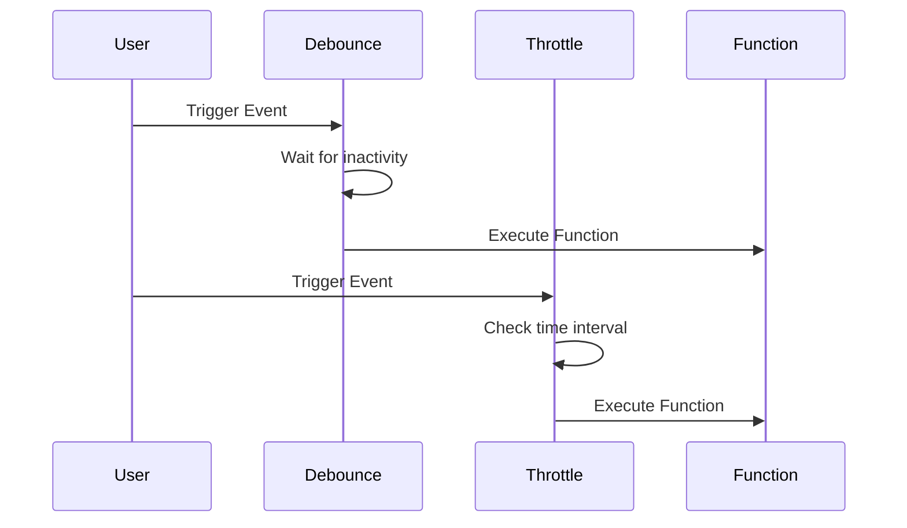

## 13.5 Debouncing and Throttling for Performance

In modern web development, performance optimization is crucial for delivering a seamless user experience. Two powerful techniques to control the frequency of function execution in response to events are **debouncing** and **throttling**. These methods help reduce unnecessary processing and improve responsiveness, especially in scenarios involving frequent event triggers like scrolling, resizing, or typing.

### Understanding Debouncing and Throttling

Before diving into implementation, let's define these concepts and understand their differences.

#### Debouncing

**Debouncing** is a technique used to ensure that a function is only executed after a certain period of inactivity. This means that if the event is triggered multiple times, the function will only run once after the specified delay has passed since the last event. Debouncing is particularly useful for scenarios like search input fields, where you want to wait until the user has stopped typing before making an API call.

**Example Use Case**: A search bar that fetches results from a server. You want to avoid making a request for every keystroke and instead wait until the user has finished typing.

#### Throttling

**Throttling** ensures that a function is executed at most once in a specified time interval, regardless of how many times the event is triggered. This technique is beneficial for events that fire continuously, such as window resizing or scrolling, where you want to limit the function execution to a manageable rate.

**Example Use Case**: A scroll event handler that updates the position of a fixed header. You want to ensure the function runs at a consistent rate to avoid performance issues.

### Key Differences

- **Debouncing** delays the function execution until after a specified period of inactivity.
- **Throttling** limits the function execution to once per specified time interval.

### Implementing Debouncing and Throttling

Let's explore how to implement these techniques in JavaScript, along with examples and utility libraries that simplify the process.

#### Debouncing Function Implementation

Here's a basic implementation of a debounce function:

```javascript
function debounce(func, delay) {
  let timeoutId;
  return function(...args) {
    clearTimeout(timeoutId);
    timeoutId = setTimeout(() => {
      func.apply(this, args);
    }, delay);
  };
}

// Usage example
const handleSearch = debounce((event) => {
  console.log('Searching for:', event.target.value);
}, 300);

document.getElementById('searchInput').addEventListener('input', handleSearch);
```

**Explanation**:
- The `debounce` function takes a `func` and a `delay` as arguments.
- It returns a new function that clears the previous timeout and sets a new one.
- The `func` is executed only after the specified `delay` has passed since the last event.

#### Throttling Function Implementation

Here's a basic implementation of a throttle function:

```javascript
function throttle(func, limit) {
  let lastFunc;
  let lastRan;
  return function(...args) {
    const context = this;
    if (!lastRan) {
      func.apply(context, args);
      lastRan = Date.now();
    } else {
      clearTimeout(lastFunc);
      lastFunc = setTimeout(function() {
        if ((Date.now() - lastRan) >= limit) {
          func.apply(context, args);
          lastRan = Date.now();
        }
      }, limit - (Date.now() - lastRan));
    }
  };
}

// Usage example
const handleScroll = throttle(() => {
  console.log('Scroll event triggered');
}, 1000);

window.addEventListener('scroll', handleScroll);
```

**Explanation**:
- The `throttle` function takes a `func` and a `limit` as arguments.
- It ensures that `func` is executed at most once every `limit` milliseconds.

### Utility Libraries

For more robust implementations, consider using utility libraries like [Lodash](https://lodash.com/docs/#debounce), which provide well-tested and optimized versions of these functions.

**Lodash Debounce Example**:

```javascript
import _ from 'lodash';

const handleResize = _.debounce(() => {
  console.log('Window resized');
}, 200);

window.addEventListener('resize', handleResize);
```

**Lodash Throttle Example**:

```javascript
import _ from 'lodash';

const handleMouseMove = _.throttle(() => {
  console.log('Mouse moved');
}, 500);

document.addEventListener('mousemove', handleMouseMove);
```

### Use Cases and Best Practices

#### Handling Scroll Events

When dealing with scroll events, throttling is often the preferred choice to ensure smooth performance without overwhelming the browser with too many function calls.

#### Handling Resize Events

For resize events, both debouncing and throttling can be useful. Debouncing can help ensure that the function is only executed once the user has finished resizing, while throttling can provide periodic updates during the resize.

#### Handling Input Events

Debouncing is ideal for input events, such as search fields, where you want to wait until the user has stopped typing before executing a function.

### Selecting Appropriate Delays

Choosing the right delay for debouncing and throttling depends on the specific use case and the desired user experience. Here are some guidelines:

- **Debouncing**: A delay of 200-300 milliseconds is often sufficient for input fields.
- **Throttling**: A limit of 100-200 milliseconds works well for scroll and resize events.

### Reducing Unnecessary Processing

By implementing debouncing and throttling, you can significantly reduce the number of times a function is executed, leading to improved performance and responsiveness. This is especially important for mobile devices and low-powered hardware where resources are limited.

### Visualizing Debouncing and Throttling

To better understand how these techniques work, let's visualize the function execution with a simple diagram.



**Diagram Explanation**:
- The **Debounce** participant waits for a period of inactivity before executing the function.
- The **Throttle** participant checks the time interval and executes the function at most once per interval.

### Conclusion

Debouncing and throttling are essential techniques for optimizing performance in JavaScript applications. By controlling the frequency of function execution, you can enhance user experience and ensure your applications run smoothly. Remember to experiment with different delays and limits to find the best balance for your specific use case.

### Try It Yourself

To deepen your understanding, try modifying the code examples provided. Experiment with different delay and limit values, and observe how they affect the function execution. This hands-on approach will help you master these techniques and apply them effectively in your projects.

### Knowledge Check

Let's reinforce what we've learned with a quiz.

## Debouncing and Throttling in JavaScript: Quiz



### What is the main purpose of debouncing in JavaScript?

- [x] To delay function execution until after a period of inactivity
- [ ] To execute a function at most once per time interval
- [ ] To execute a function immediately after an event
- [ ] To prevent function execution entirely

> **Explanation:** Debouncing delays function execution until after a specified period of inactivity, reducing unnecessary calls.

### Which technique is best for handling scroll events?

- [ ] Debouncing
- [x] Throttling
- [ ] Polling
- [ ] Caching

> **Explanation:** Throttling is ideal for scroll events as it limits the function execution rate, ensuring smooth performance.

### What is a common use case for debouncing?

- [ ] Handling mouse movements
- [x] Handling input fields
- [ ] Handling network requests
- [ ] Handling animations

> **Explanation:** Debouncing is commonly used for input fields to wait until the user has stopped typing before executing a function.

### How does throttling differ from debouncing?

- [x] Throttling limits execution to once per interval, while debouncing waits for inactivity
- [ ] Throttling waits for inactivity, while debouncing limits execution to once per interval
- [ ] Both techniques are identical
- [ ] Throttling is used for input fields, while debouncing is used for scroll events

> **Explanation:** Throttling limits function execution to once per specified time interval, while debouncing waits for a period of inactivity.

### Which library provides optimized debounce and throttle functions?

- [ ] jQuery
- [x] Lodash
- [ ] React
- [ ] Angular

> **Explanation:** Lodash provides well-tested and optimized versions of debounce and throttle functions.

### What is a suitable debounce delay for input fields?

- [ ] 50-100 milliseconds
- [x] 200-300 milliseconds
- [ ] 400-500 milliseconds
- [ ] 600-700 milliseconds

> **Explanation:** A delay of 200-300 milliseconds is often sufficient for input fields to balance responsiveness and performance.

### What is the effect of using a throttle limit of 100 milliseconds?

- [x] The function executes at most once every 100 milliseconds
- [ ] The function executes immediately after an event
- [ ] The function never executes
- [ ] The function executes twice every 100 milliseconds

> **Explanation:** A throttle limit of 100 milliseconds ensures the function executes at most once every 100 milliseconds.

### Which event is commonly throttled to improve performance?

- [ ] Click events
- [x] Scroll events
- [ ] Keydown events
- [ ] Load events

> **Explanation:** Scroll events are commonly throttled to improve performance by limiting the execution rate.

### What is the main benefit of using debouncing and throttling?

- [x] Reducing unnecessary processing and improving responsiveness
- [ ] Increasing the number of function executions
- [ ] Decreasing application performance
- [ ] Eliminating all event listeners

> **Explanation:** Debouncing and throttling reduce unnecessary processing and improve responsiveness by controlling function execution frequency.

### True or False: Debouncing and throttling can be used interchangeably.

- [ ] True
- [x] False

> **Explanation:** Debouncing and throttling serve different purposes and are not interchangeable. Debouncing waits for inactivity, while throttling limits execution to once per interval.



Remember, this is just the beginning. As you progress, you'll build more complex and interactive web pages. Keep experimenting, stay curious, and enjoy the journey!

---
