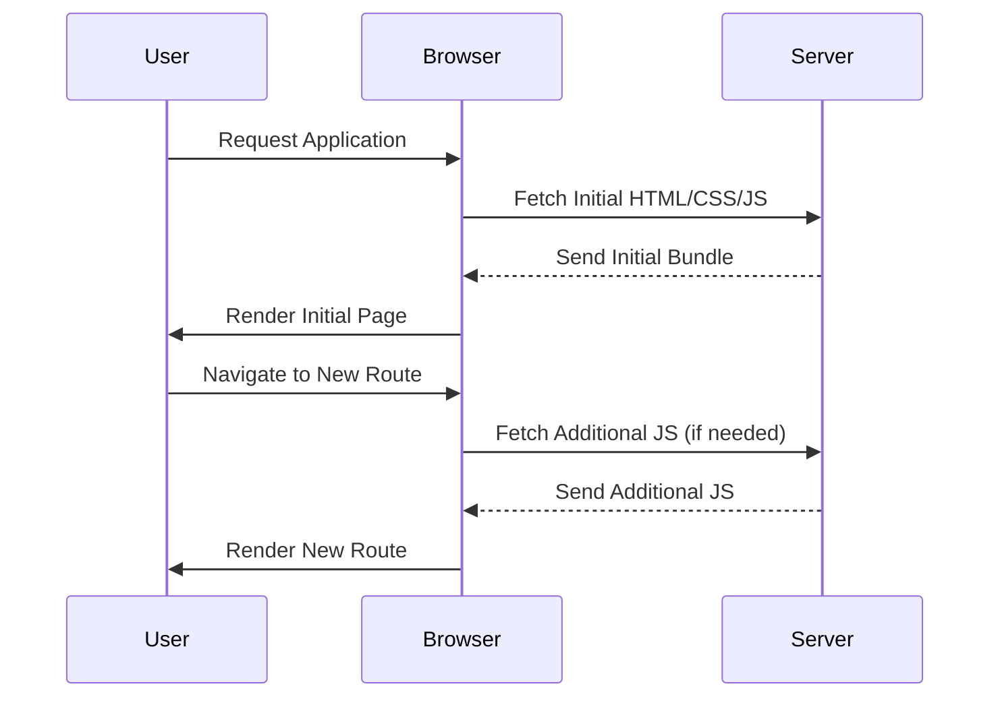

## 13.6 Code Splitting and Lazy Loading

In the ever-evolving landscape of web development, optimizing performance is crucial for delivering a seamless user experience. Two powerful techniques that have emerged to address this challenge are **code splitting** and **lazy loading**. These strategies allow developers to manage and deliver JavaScript code more efficiently, reducing initial load times and improving perceived performance. In this section, we will delve into these concepts, explore their benefits, and provide practical examples of how to implement them in your projects.

### Understanding Code Splitting

**Code splitting** is a technique that involves breaking down your application's code into smaller, manageable chunks. Instead of loading the entire application at once, code splitting allows you to load only the necessary parts of the application as needed. This approach can significantly enhance performance, especially for large applications.

#### Benefits of Code Splitting

1. **Reduced Initial Load Time**: By loading only the essential code initially, you can decrease the time it takes for your application to become interactive.
2. **Improved Perceived Performance**: Users perceive applications as faster when they can interact with them sooner, even if not all features are immediately available.
3. **Efficient Resource Utilization**: Code splitting ensures that resources are used efficiently by loading code only when required, reducing unnecessary data transfer.

### Tools and Techniques for Code Splitting

Several tools and techniques can be employed to implement code splitting effectively. One of the most popular tools is **Webpack**, a powerful module bundler for JavaScript applications.

#### Webpack's `import()` for Dynamic Imports

Webpack provides a feature called **dynamic imports** using the `import()` function. This allows you to load modules dynamically at runtime, enabling code splitting.

```javascript
// Example of dynamic import using Webpack
function loadComponent() {
  import('./myComponent.js')
    .then((module) => {
      const MyComponent = module.default;
      // Use the dynamically imported component
      MyComponent.render();
    })
    .catch((error) => console.error('Error loading component:', error));
}
```

In this example, `myComponent.js` is loaded only when `loadComponent()` is called, rather than at the initial load time. This reduces the initial bundle size and improves load times.

#### Route-Based Splitting in Single-Page Applications (SPAs)

In SPAs, route-based code splitting is a common practice. It involves splitting code based on the application's routes, loading only the code necessary for the current route.

```javascript
// Example of route-based code splitting in a React application
import React, { Suspense, lazy } from 'react';
import { BrowserRouter as Router, Route, Switch } from 'react-router-dom';

const Home = lazy(() => import('./Home'));
const About = lazy(() => import('./About'));

function App() {
  return (
    <Router>
      <Suspense fallback={<div>Loading...</div>}>
        <Switch>
          <Route exact path="/" component={Home} />
          <Route path="/about" component={About} />
        </Switch>
      </Suspense>
    </Router>
  );
}

export default App;
```

In this React example, the `Home` and `About` components are loaded only when their respective routes are accessed, thanks to the `lazy()` function and `Suspense` component.

### Implementing Lazy Loading

**Lazy loading** is a technique that delays the loading of resources until they are needed. This can be applied to images, scripts, and other assets, as well as components in JavaScript applications.

#### Lazy Loading Assets

Lazy loading assets such as images can significantly improve page load times, especially for media-rich applications. The `loading` attribute in HTML can be used to lazy load images.

```html

```

This attribute tells the browser to load the image only when it is about to enter the viewport, reducing the initial load time.

#### Lazy Loading Components

In JavaScript applications, lazy loading components can be achieved using dynamic imports, as demonstrated earlier. This approach ensures that components are loaded only when they are needed, reducing the initial bundle size.

### Configuring Code Splitting in Webpack

To configure code splitting in Webpack, you need to adjust your Webpack configuration file. Here's a basic example:

```javascript
// webpack.config.js
module.exports = {
  entry: './src/index.js',
  output: {
    filename: '[name].bundle.js',
    path: __dirname + '/dist',
  },
  optimization: {
    splitChunks: {
      chunks: 'all',
    },
  },
};
```

In this configuration, the `splitChunks` option is set to `all`, which tells Webpack to split all chunks, including those from `node_modules`. This can help reduce the size of your main bundle by separating vendor code.

### Impact on Initial Load Time and Perceived Performance

By implementing code splitting and lazy loading, you can achieve a noticeable improvement in both initial load time and perceived performance. Users will experience faster load times and smoother interactions, leading to higher satisfaction and engagement.

### Considerations for User Experience

While code splitting and lazy loading offer significant performance benefits, it's essential to consider the user experience. Here are some tips:

- **Loading Indicators**: Provide visual feedback to users while content is loading. This can be achieved using loading spinners or skeleton screens.
- **Prioritize Critical Content**: Ensure that critical content is loaded first to maintain a seamless user experience.
- **Test Across Devices**: Test your application on various devices and network conditions to ensure consistent performance.

### Visualizing Code Splitting and Lazy Loading

To better understand how code splitting and lazy loading work, let's visualize the process using a sequence diagram.



This diagram illustrates the flow of requests and responses when a user navigates through an application with code splitting and lazy loading implemented.

### Try It Yourself

Experiment with the code examples provided in this section. Try modifying the dynamic imports and route-based splitting to see how they affect your application's performance. Consider adding loading indicators to enhance the user experience.

### References and Links

- [MDN Web Docs: Dynamic Imports](https://developer.mozilla.org/en-US/docs/Web/JavaScript/Reference/Statements/import#dynamic_imports)
- [Webpack Documentation: Code Splitting](https://webpack.js.org/guides/code-splitting/)
- [React Documentation: Code Splitting](https://reactjs.org/docs/code-splitting.html)

### Knowledge Check

- What is code splitting, and how does it benefit performance?
- How can you implement lazy loading for images in HTML?
- What role does Webpack play in code splitting?
- How can route-based splitting be implemented in a React application?
- Why is it important to provide loading indicators when using lazy loading?

### Embrace the Journey

Remember, mastering code splitting and lazy loading is just one step in optimizing your JavaScript applications. As you continue to explore these techniques, you'll discover new ways to enhance performance and deliver exceptional user experiences. Keep experimenting, stay curious, and enjoy the journey!

## Quiz: Mastering Code Splitting and Lazy Loading



### What is the primary benefit of code splitting in JavaScript applications?

- [x] Reducing initial load time
- [ ] Increasing code complexity
- [ ] Enhancing security
- [ ] Improving code readability

> **Explanation:** Code splitting reduces the initial load time by loading only the necessary parts of the application as needed.

### Which tool is commonly used for code splitting in JavaScript applications?

- [x] Webpack
- [ ] Babel
- [ ] ESLint
- [ ] Prettier

> **Explanation:** Webpack is a popular module bundler that provides features for code splitting.

### How can lazy loading be implemented for images in HTML?

- [x] Using the `loading` attribute
- [ ] Using inline CSS
- [ ] Using JavaScript only
- [ ] Using the `srcset` attribute

> **Explanation:** The `loading` attribute in HTML can be used to lazy load images.

### What is the purpose of dynamic imports in Webpack?

- [x] To load modules dynamically at runtime
- [ ] To increase bundle size
- [ ] To improve code readability
- [ ] To enhance security

> **Explanation:** Dynamic imports allow modules to be loaded dynamically at runtime, enabling code splitting.

### In a React application, which component is used to handle lazy loading?

- [x] `Suspense`
- [ ] `Fragment`
- [ ] `Context`
- [ ] `Portal`

> **Explanation:** The `Suspense` component is used in React to handle lazy loading of components.

### What should be provided to users when content is being lazy loaded?

- [x] Loading indicators
- [ ] Error messages
- [ ] Debug logs
- [ ] Console warnings

> **Explanation:** Loading indicators provide visual feedback to users while content is being lazy loaded.

### How does code splitting affect perceived performance?

- [x] It improves perceived performance by allowing users to interact with the application sooner.
- [ ] It decreases perceived performance by delaying content loading.
- [ ] It has no effect on perceived performance.
- [ ] It complicates the user interface.

> **Explanation:** Code splitting improves perceived performance by allowing users to interact with the application sooner, even if not all features are immediately available.

### What is a common practice for code splitting in single-page applications?

- [x] Route-based splitting
- [ ] Inline scripting
- [ ] Server-side rendering
- [ ] Using global variables

> **Explanation:** Route-based splitting is a common practice in single-page applications to load code based on the application's routes.

### Which Webpack configuration option is used to enable code splitting?

- [x] `splitChunks`
- [ ] `minimize`
- [ ] `devtool`
- [ ] `resolve`

> **Explanation:** The `splitChunks` option in Webpack is used to enable code splitting.

### True or False: Lazy loading can only be applied to images.

- [ ] True
- [x] False

> **Explanation:** Lazy loading can be applied to various resources, including images, scripts, and components.




