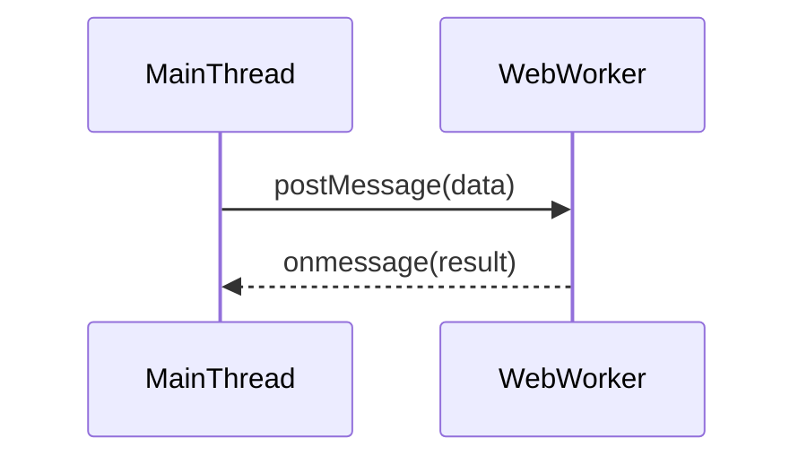

## 13.8 Web Workers for Heavy Computations

In modern web development, ensuring a smooth and responsive user experience is paramount. One of the challenges developers face is managing heavy computations that can block the main thread, leading to sluggish interfaces and poor user interactions. Enter Web Workers, a powerful tool in JavaScript that allows developers to perform heavy computations in the background, without interfering with the user interface.

### What Are Web Workers?

Web Workers are a feature of the HTML5 specification that enables JavaScript to run in the background, separate from the main execution thread of a web application. This separation allows for parallel processing, meaning that heavy computations can be offloaded to a worker thread, freeing up the main thread to handle user interactions smoothly.

#### Purpose of Web Workers

The primary purpose of Web Workers is to enhance the performance of web applications by preventing the main thread from becoming blocked by intensive tasks. This is particularly useful for:

- **Data Processing**: Handling large datasets or complex calculations.
- **Image Manipulation**: Performing operations like filtering or transformations on images.
- **Real-Time Calculations**: Running simulations or calculations that require continuous updates.

### Creating and Communicating with Web Workers

Creating a Web Worker in JavaScript is straightforward. Let's walk through the process of setting up a Web Worker and communicating with it.

#### Creating a Web Worker

To create a Web Worker, you need to define a separate JavaScript file that contains the code you want to run in the background. Here's a simple example:

```javascript
// worker.js
self.onmessage = function(event) {
  const result = event.data * 2; // Perform some computation
  self.postMessage(result); // Send the result back to the main thread
};
```

In the main JavaScript file, you can create a Web Worker instance and communicate with it:

```javascript
// main.js
const worker = new Worker('worker.js');

// Send data to the worker
worker.postMessage(10);

// Receive data from the worker
worker.onmessage = function(event) {
  console.log('Result from worker:', event.data);
};
```

#### Communication Between Main Thread and Worker

Communication between the main thread and a Web Worker is achieved through a messaging system. The `postMessage` method is used to send data to the worker, and the `onmessage` event handler is used to receive data from the worker.

### Offloading Intensive Tasks to Web Workers

Web Workers are ideal for offloading tasks that are computationally intensive and would otherwise block the main thread. Let's explore some examples.

#### Example: Data Processing

Suppose you have a large dataset that requires sorting. You can offload this task to a Web Worker:

```javascript
// worker.js
self.onmessage = function(event) {
  const sortedData = event.data.sort();
  self.postMessage(sortedData);
};

// main.js
const worker = new Worker('worker.js');
const largeArray = [/* large dataset */];

worker.postMessage(largeArray);

worker.onmessage = function(event) {
  console.log('Sorted data:', event.data);
};
```

#### Example: Image Manipulation

For image manipulation, such as applying filters, Web Workers can be used to perform these operations without freezing the UI:

```javascript
// worker.js
self.onmessage = function(event) {
  const imageData = event.data;
  // Apply some filter to imageData
  self.postMessage(imageData);
};

// main.js
const worker = new Worker('worker.js');
const imageData = getImageDataFromCanvas();

worker.postMessage(imageData);

worker.onmessage = function(event) {
  updateCanvasWithImageData(event.data);
};
```

### Limitations of Web Workers

While Web Workers are powerful, they come with certain limitations:

- **No DOM Access**: Web Workers cannot directly manipulate the DOM. This means any UI updates must be communicated back to the main thread.
- **Limited APIs**: Not all browser APIs are available in Web Workers. For example, `localStorage` and `document` are inaccessible.
- **Overhead**: Creating and managing Web Workers involves some overhead, so they should be used judiciously.

### Tools and Libraries for Web Workers

Several tools and libraries can simplify working with Web Workers. One such library is [Comlink](https://github.com/GoogleChromeLabs/comlink), which abstracts the complexity of communication between the main thread and workers.

#### Using Comlink

Comlink makes it easier to work with Web Workers by allowing you to call functions in workers as if they were synchronous:

```javascript
import { wrap } from 'comlink';

// worker.js
export function double(value) {
  return value * 2;
}

// main.js
const worker = new Worker('worker.js');
const workerApi = wrap(worker);

(async () => {
  const result = await workerApi.double(10);
  console.log('Result from worker:', result);
})();
```

### Use Cases for Web Workers

Web Workers are particularly useful in scenarios where performance is critical:

- **Data Processing**: Handling large datasets, such as in data visualization or analytics applications.
- **Image Manipulation**: Applying complex filters or transformations to images.
- **Real-Time Calculations**: Running simulations or calculations that require continuous updates, such as in gaming or financial applications.

### Visualizing Web Workers

To better understand how Web Workers interact with the main thread, let's visualize the process using a sequence diagram.



**Diagram Description**: This sequence diagram illustrates the communication flow between the main thread and a Web Worker. The main thread sends data to the worker using `postMessage`, and the worker processes the data and sends the result back using `onmessage`.

### Knowledge Check

- **What are Web Workers, and why are they used?**
- **How do you create a Web Worker in JavaScript?**
- **What are some limitations of Web Workers?**
- **How can Comlink simplify working with Web Workers?**

### Exercises

1. **Create a Web Worker**: Write a Web Worker that calculates the Fibonacci sequence for a given number and returns the result to the main thread.
2. **Image Processing**: Use a Web Worker to apply a grayscale filter to an image and update the canvas with the processed image data.
3. **Data Sorting**: Implement a Web Worker that sorts a large array of numbers and returns the sorted array to the main thread.

### Summary

Web Workers are a powerful tool for enhancing the performance of web applications by offloading heavy computations to a separate thread. While they come with certain limitations, such as restricted access to the DOM, they are invaluable for tasks like data processing, image manipulation, and real-time calculations. Tools like Comlink can further simplify the process of working with Web Workers, making them more accessible to developers.

Remember, this is just the beginning. As you progress, you'll build more complex and interactive web applications. Keep experimenting, stay curious, and enjoy the journey!

## Web Workers for Heavy Computations Quiz



### What is the primary purpose of Web Workers in JavaScript?

- [x] To perform heavy computations without blocking the main thread
- [ ] To manipulate the DOM directly
- [ ] To enhance CSS styling
- [ ] To manage browser storage

> **Explanation:** Web Workers are used to perform heavy computations in the background, allowing the main thread to remain responsive.

### How do you communicate with a Web Worker from the main thread?

- [x] Using `postMessage` and `onmessage`
- [ ] Using `localStorage`
- [ ] Using `document.querySelector`
- [ ] Using `fetch`

> **Explanation:** Communication with Web Workers is done using `postMessage` to send data and `onmessage` to receive data.

### What is a limitation of Web Workers?

- [x] They cannot access the DOM directly
- [ ] They can only run on mobile browsers
- [ ] They require a server to function
- [ ] They can only handle text data

> **Explanation:** Web Workers cannot directly manipulate the DOM, which is a key limitation.

### Which library simplifies working with Web Workers?

- [x] Comlink
- [ ] jQuery
- [ ] Lodash
- [ ] Axios

> **Explanation:** Comlink is a library that simplifies the communication between the main thread and Web Workers.

### What is a common use case for Web Workers?

- [x] Data processing and real-time calculations
- [ ] Styling web pages
- [ ] Managing cookies
- [ ] Sending emails

> **Explanation:** Web Workers are commonly used for data processing and real-time calculations to keep the UI responsive.

### Can Web Workers directly manipulate the DOM?

- [ ] Yes
- [x] No

> **Explanation:** Web Workers cannot directly manipulate the DOM; they must communicate results back to the main thread.

### What method is used to send data to a Web Worker?

- [x] `postMessage`
- [ ] `sendData`
- [ ] `dispatchEvent`
- [ ] `emit`

> **Explanation:** The `postMessage` method is used to send data to a Web Worker.

### What is a benefit of using Web Workers?

- [x] They allow for parallel processing
- [ ] They reduce the need for CSS
- [ ] They increase HTML rendering speed
- [ ] They improve image quality

> **Explanation:** Web Workers allow for parallel processing, which can improve application performance.

### Which of the following is true about Web Workers?

- [x] They run in the background
- [ ] They require a UI component
- [ ] They can access the DOM
- [ ] They are only available in Node.js

> **Explanation:** Web Workers run in the background and are separate from the main thread.

### Web Workers can be used for image manipulation tasks.

- [x] True
- [ ] False

> **Explanation:** Web Workers can be used for image manipulation tasks to offload processing from the main thread.




