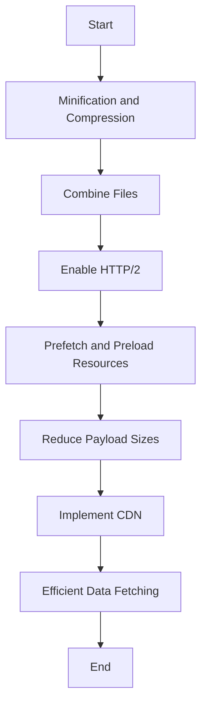

## 13.9 Optimizing Network Requests

In the realm of modern web development, optimizing network requests is crucial for enhancing application performance and user experience. Network requests can significantly impact load times, and understanding how to manage them efficiently is a key skill for any developer. In this section, we will explore various strategies to optimize network requests, including minification, compression, HTTP/2 multiplexing, prefetching, and more. Let's dive in and unlock the potential of your web applications.

### The Impact of Network Requests on Load Times

Network requests are the backbone of web applications, enabling data exchange between clients and servers. However, excessive or inefficient requests can lead to increased load times, negatively affecting user experience and potentially driving users away. Understanding the impact of network requests is the first step toward optimization.

#### Key Factors Affecting Load Times

1. **Latency**: The time it takes for a request to travel from the client to the server and back. High latency can slow down data retrieval.
2. **Bandwidth**: The amount of data that can be transmitted over a network in a given time. Limited bandwidth can bottleneck data transfer.
3. **Request Size**: Larger requests take longer to transmit and process, increasing load times.
4. **Number of Requests**: More requests mean more round trips, which can compound latency and bandwidth issues.

### Strategies for Optimizing Network Requests

#### Minification and Compression

Minification and compression are essential techniques for reducing the size of network requests, thereby improving load times.

- **Minification**: This process involves removing unnecessary characters from code, such as whitespace, comments, and line breaks, without affecting functionality. Tools like UglifyJS and Terser can automate this process for JavaScript files.

```javascript
// Original JavaScript code
function greet(name) {
    console.log("Hello, " + name + "!");
}

// Minified JavaScript code
function greet(n){console.log("Hello, "+n+"!")}
```

- **Compression**: Compressing files before transmission can significantly reduce their size. Gzip and Brotli are popular compression algorithms supported by most web servers and browsers.

```plaintext
# Example of enabling Gzip compression in an Apache server
AddOutputFilterByType DEFLATE text/html text/plain text/xml text/css application/javascript
```

#### Combining Files

Combining multiple files into a single file can reduce the number of HTTP requests, which is particularly beneficial for resources like CSS and JavaScript.

- **CSS and JavaScript Bundling**: Tools like Webpack and Rollup can bundle multiple files into a single file, reducing the number of requests.

```javascript
// Webpack configuration example for bundling JavaScript files
module.exports = {
    entry: './src/index.js',
    output: {
        filename: 'bundle.js',
        path: __dirname + '/dist'
    }
};
```

#### Using HTTP/2 Multiplexing

HTTP/2 introduces multiplexing, allowing multiple requests and responses to be sent over a single connection simultaneously. This reduces latency and improves load times.

- **Enable HTTP/2**: Ensure your server supports HTTP/2. Most modern web servers, like Nginx and Apache, support HTTP/2 with minimal configuration changes.

```plaintext
# Example of enabling HTTP/2 in an Nginx server
server {
    listen 443 ssl http2;
    server_name example.com;
    # SSL configuration
}
```

#### Prefetching and Preloading Resources

Prefetching and preloading are techniques to load resources before they are needed, reducing perceived load times.

- **Prefetching**: Use `<link rel="prefetch">` to load resources that might be needed in the future.

```html
<link rel="prefetch" href="future-resource.js">
```

- **Preloading**: Use `<link rel="preload">` to load resources that are needed immediately.

```html
<link rel="preload" href="critical-resource.css" as="style">
```

#### Reducing Payload Sizes

Reducing the size of payloads can significantly improve performance, especially for media-rich applications.

- **Image Optimization**: Use modern image formats like WebP and tools like ImageMagick to compress images without losing quality.

```plaintext
# Example of converting an image to WebP format
convert input.jpg -quality 80 output.webp
```

- **Lazy Loading**: Load images and other resources only when they are needed, using the `loading="lazy"` attribute in HTML.

```html

```

### Content Delivery Networks (CDNs)

CDNs distribute content across multiple servers worldwide, reducing latency and improving load times by serving content from the nearest server to the user.

- **Implementing a CDN**: Services like Cloudflare, Akamai, and AWS CloudFront offer CDN solutions that can be integrated with minimal changes to your existing infrastructure.

```plaintext
# Example of configuring a CDN in Cloudflare
1. Sign up for a Cloudflare account.
2. Add your website to Cloudflare.
3. Update your DNS settings to point to Cloudflare's servers.
```

### Best Practices for Efficient Data Fetching

Efficient data fetching is crucial for optimizing network requests. Here are some best practices:

- **Pagination**: Fetch data in chunks rather than all at once to reduce load times and improve performance.

```javascript
// Example of fetching paginated data
async function fetchPage(pageNumber) {
    const response = await fetch(`/api/data?page=${pageNumber}`);
    const data = await response.json();
    return data;
}
```

- **Data Fetching Libraries**: Use libraries like Axios or Fetch API for efficient data fetching and handling.

```javascript
// Example of using Axios for data fetching
axios.get('/api/data')
    .then(response => console.log(response.data))
    .catch(error => console.error(error));
```

### Visualizing Network Optimization Techniques

To better understand how these techniques work together, let's visualize the process of optimizing network requests using a flowchart.



### Knowledge Check

- **What is the impact of network requests on load times?**
- **How does minification differ from compression?**
- **What are the benefits of using HTTP/2 multiplexing?**
- **Explain the difference between prefetching and preloading.**
- **What role do CDNs play in optimizing network requests?**

### Exercises

1. **Minify and Compress**: Take a JavaScript file and use a tool like Terser to minify it. Then, compress it using Gzip. Compare the file sizes before and after.
2. **Bundle Files**: Use Webpack to bundle multiple JavaScript files into a single file. Observe the impact on the number of HTTP requests.
3. **Enable HTTP/2**: If you have access to a server, enable HTTP/2 and observe the changes in network performance using browser developer tools.
4. **Implement Lazy Loading**: Add lazy loading to images on a webpage and measure the impact on load times.

### Embrace the Journey

Optimizing network requests is a continuous journey. As you implement these techniques, you'll notice improvements in your application's performance and user experience. Remember, this is just the beginning. Keep experimenting, stay curious, and enjoy the journey!

### References and Links

- [MDN Web Docs: Minification](https://developer.mozilla.org/en-US/docs/Glossary/Minification)
- [MDN Web Docs: HTTP/2](https://developer.mozilla.org/en-US/docs/Web/HTTP/Overview)
- [Google Developers: Image Optimization](https://developers.google.com/web/fundamentals/performance/optimizing-content-efficiency/image-optimization)
- [Cloudflare: What is a CDN?](https://www.cloudflare.com/learning/cdn/what-is-a-cdn/)

## Mastering Network Request Optimization in JavaScript



### What is the primary benefit of minifying JavaScript files?

- [x] Reducing file size for faster load times
- [ ] Improving code readability
- [ ] Enhancing security
- [ ] Increasing code complexity

> **Explanation:** Minifying JavaScript files reduces their size, leading to faster load times.

### Which compression algorithm is commonly used for web content?

- [x] Gzip
- [ ] Lempel-Ziv
- [ ] Huffman
- [ ] RLE

> **Explanation:** Gzip is a widely used compression algorithm for web content.

### What does HTTP/2 multiplexing allow?

- [x] Multiple requests and responses over a single connection
- [ ] Encryption of data
- [ ] Faster DNS resolution
- [ ] Improved caching

> **Explanation:** HTTP/2 multiplexing allows multiple requests and responses to be sent over a single connection simultaneously.

### What is the purpose of prefetching resources?

- [x] Loading resources before they are needed
- [ ] Compressing resources
- [ ] Encrypting resources
- [ ] Caching resources

> **Explanation:** Prefetching loads resources before they are needed to reduce perceived load times.

### How do CDNs improve web performance?

- [x] By serving content from the nearest server to the user
- [ ] By compressing data
- [x] By reducing server load
- [ ] By encrypting data

> **Explanation:** CDNs improve performance by serving content from the nearest server and reducing server load.

### What is a common tool for bundling JavaScript files?

- [x] Webpack
- [ ] Babel
- [ ] ESLint
- [ ] Prettier

> **Explanation:** Webpack is a popular tool for bundling JavaScript files.

### Which attribute is used for lazy loading images in HTML?

- [x] `loading="lazy"`
- [ ] `defer`
- [x] `async`
- [ ] `preload`

> **Explanation:** The `loading="lazy"` attribute is used for lazy loading images.

### What is the main advantage of using a CDN?

- [x] Reduced latency
- [ ] Increased bandwidth
- [ ] Enhanced security
- [ ] Improved SEO

> **Explanation:** CDNs reduce latency by serving content from the nearest server.

### What is the difference between prefetching and preloading?

- [x] Prefetching is for future resources, preloading is for immediate resources
- [ ] Prefetching is for images, preloading is for scripts
- [ ] Prefetching is for CSS, preloading is for HTML
- [ ] Prefetching is for caching, preloading is for compression

> **Explanation:** Prefetching is for resources that might be needed in the future, while preloading is for resources needed immediately.

### True or False: Combining files can reduce the number of HTTP requests.

- [x] True
- [ ] False

> **Explanation:** Combining files reduces the number of HTTP requests by bundling multiple files into one.


