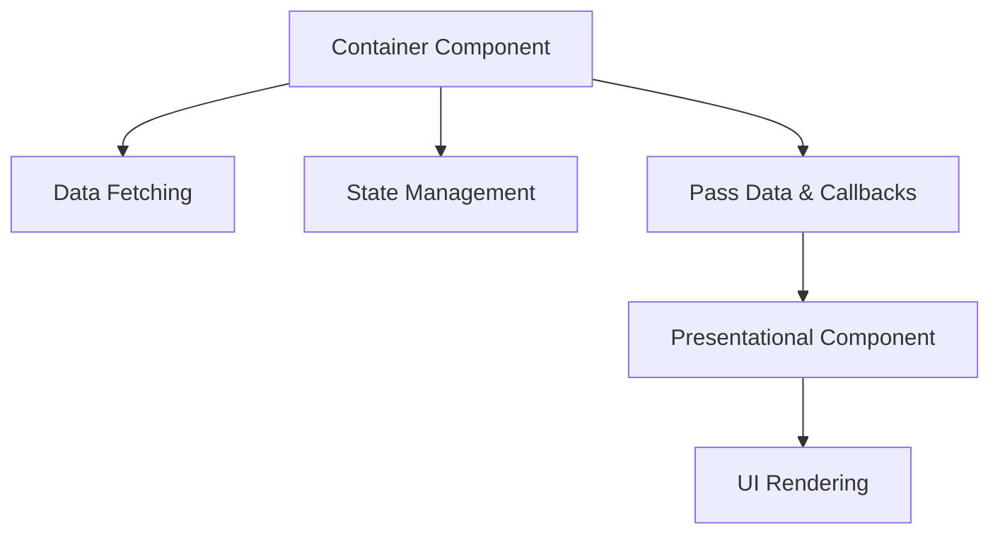

---

linkTitle: "14.1.1 Container and Presentational Components"
title: "Container and Presentational Components in JavaScript and TypeScript"
description: "Explore the use of Container and Presentational Components in JavaScript and TypeScript to enhance code reusability and maintainability in frontend development."
categories:
- Frontend Development
- Design Patterns
- JavaScript
tags:
- Container Components
- Presentational Components
- React
- State Management
- UI Design
date: 2024-10-25
type: docs
nav_weight: 14110

canonical: "https://softwarepatternslexicon.com/patterns-js/14/1/1"
license: "© 2024 Tokenizer Inc. CC BY-NC-SA 4.0"
---

## 14.1.1 Container and Presentational Components

In modern frontend development, especially with libraries like React, the separation of concerns is crucial for building maintainable and scalable applications. One effective pattern to achieve this is the use of Container and Presentational Components. This pattern helps in organizing components based on their responsibilities, enhancing code reusability, and facilitating easier testing.

### Understand the Concepts

#### Container Components (Smart Components)
- **Responsibilities:**
  - Manage state and contain business logic.
  - Handle data fetching and state management.
  - Pass data and callbacks to presentational components.
- **Characteristics:**
  - Often connected to state management libraries like Redux or Context API.
  - Focus on the "how" of data manipulation and retrieval.

#### Presentational Components (Dumb Components)
- **Responsibilities:**
  - Focus on the UI and rendering.
  - Receive data and functions via props.
  - Do not manage state beyond UI-specific state (e.g., animations).
- **Characteristics:**
  - Stateless or minimally stateful.
  - Concerned with the "what" of displaying data.

### Implementation Steps

#### Identify Responsibilities
- **Separate Components:** Begin by analyzing your components to determine which ones should handle data logic and which should focus on rendering the UI. This separation helps in maintaining a clear boundary between data handling and presentation.

#### Create Container Components
- **Data Handling:** These components are responsible for fetching data from APIs or state management stores. They process the data and pass it down to presentational components.
- **Example:**
  ```jsx
  import React, { useEffect, useState } from 'react';
  import PresentationComponent from './PresentationComponent';

  const ContainerComponent = () => {
    const [data, setData] = useState([]);

    useEffect(() => {
      fetchData().then(response => setData(response));
    }, []);

    return <PresentationComponent data={data} />;
  };

  export default ContainerComponent;
  ```

#### Develop Presentational Components
- **UI Rendering:** These components accept props and render the UI accordingly. They should remain stateless or manage minimal UI state.
- **Example:**
  ```jsx
  const PresentationComponent = ({ data }) => (
    <ul>
      {data.map(item => (
        <li key={item.id}>{item.name}</li>
      ))}
    </ul>
  );

  export default PresentationComponent;
  ```

### Use Cases

- **Enhancing Code Reusability and Readability:** By separating concerns, components become more focused and easier to reuse across different parts of the application.
- **Facilitating Testing:** Isolating UI from business logic simplifies testing, as presentational components can be tested independently of the data they display.

### Practice

- **Refactor Existing Components:** Look at your current components and refactor them to distinguish between data handling and UI rendering.
- **Connect to State Management:** Use container components to connect to Redux or context APIs, passing state to presentational components.

### Considerations

- **Avoid Overcomplication:** Not all components need to be split into container and presentational components. Use this pattern where it makes sense to do so.
- **Mindful of Prop Drilling:** Excessive prop drilling can become cumbersome. Consider using context or state management solutions to pass data efficiently.

### Visual Aids

#### Conceptual Diagram



### Code Examples with Modern Libraries

#### Using React with Hooks

- **Container Component with Context API:**
  ```jsx
  import React, { useContext } from 'react';
  import { DataContext } from './DataContext';
  import PresentationComponent from './PresentationComponent';

  const ContainerComponent = () => {
    const data = useContext(DataContext);

    return <PresentationComponent data={data} />;
  };

  export default ContainerComponent;
  ```

- **Presentational Component:**
  ```jsx
  const PresentationComponent = ({ data }) => (
    <div>
      {data.map(item => (
        <div key={item.id}>{item.name}</div>
      ))}
    </div>
  );

  export default PresentationComponent;
  ```

### Best Practices

- **SOLID Principles:** Adhering to the Single Responsibility Principle, each component should have one reason to change, either due to a change in data logic or UI rendering.
- **Code Maintainability:** Keep components small and focused on a single task to enhance maintainability and scalability.

### Advanced Topics

#### Integration with Domain-Driven Design (DDD)
- **Aggregates and Repositories:** Container components can act as repositories, fetching and managing data aggregates before passing them to presentational components.

#### Event Sourcing
- **State Management:** Container components can manage state changes and event sourcing, ensuring that presentational components remain focused on rendering.

### Comparative Analyses

- **Container vs. Presentational vs. Higher-Order Components (HOCs):** While container and presentational components focus on separation of concerns, HOCs provide a way to enhance components with additional functionality.

### Performance Considerations

- **Efficiency:** Ensure that container components efficiently manage state and data fetching to prevent unnecessary re-renders of presentational components.
- **Optimization Strategies:** Use memoization techniques like `React.memo` to optimize rendering performance.

### Conclusion

The Container and Presentational Components pattern is a powerful tool in frontend development, promoting a clean separation of concerns and enhancing code maintainability. By understanding and implementing this pattern, developers can build more scalable and testable applications.

## Quiz Time!



### What is the primary responsibility of container components?

- [x] Manage state and contain business logic
- [ ] Focus on UI rendering
- [ ] Handle animations
- [ ] Style components

> **Explanation:** Container components are responsible for managing state and containing business logic, such as data fetching and state management.

### What is the main focus of presentational components?

- [ ] Manage state and contain business logic
- [x] Focus on UI and rendering
- [ ] Handle data fetching
- [ ] Connect to Redux

> **Explanation:** Presentational components focus on UI and rendering, receiving data and functions via props.

### Which of the following is NOT a characteristic of presentational components?

- [ ] Stateless or minimally stateful
- [x] Connected to state management libraries
- [ ] Concerned with displaying data
- [ ] Receive data via props

> **Explanation:** Presentational components are not typically connected to state management libraries; they receive data via props from container components.

### What is a benefit of using container and presentational components?

- [x] Enhancing code reusability and readability
- [ ] Increasing code complexity
- [ ] Reducing testing capabilities
- [ ] Decreasing performance

> **Explanation:** The separation of concerns enhances code reusability and readability, making it easier to maintain and test.

### Which principle is closely related to the separation of container and presentational components?

- [x] Single Responsibility Principle
- [ ] Open/Closed Principle
- [ ] Liskov Substitution Principle
- [ ] Dependency Inversion Principle

> **Explanation:** The Single Responsibility Principle states that a class should have one reason to change, aligning with the separation of concerns in container and presentational components.

### What should container components avoid to maintain performance?

- [x] Unnecessary re-renders
- [ ] UI rendering
- [ ] Data fetching
- [ ] Passing props

> **Explanation:** Container components should avoid unnecessary re-renders to maintain performance, ensuring efficient state management and data fetching.

### How can presentational components be optimized for performance?

- [x] Use memoization techniques like `React.memo`
- [ ] Connect directly to APIs
- [ ] Manage complex state
- [ ] Handle business logic

> **Explanation:** Presentational components can be optimized using memoization techniques like `React.memo` to prevent unnecessary re-renders.

### What is a potential drawback of excessive prop drilling?

- [x] It can become cumbersome and difficult to manage
- [ ] It simplifies component structure
- [ ] It enhances performance
- [ ] It reduces code readability

> **Explanation:** Excessive prop drilling can become cumbersome and difficult to manage, making it harder to maintain the codebase.

### Which pattern is similar to container and presentational components but provides additional functionality?

- [ ] Singleton Pattern
- [ ] Factory Pattern
- [x] Higher-Order Components (HOCs)
- [ ] Observer Pattern

> **Explanation:** Higher-Order Components (HOCs) provide a way to enhance components with additional functionality, similar to container and presentational components.

### True or False: All components in an application should be split into container and presentational components.

- [ ] True
- [x] False

> **Explanation:** Not all components need to be split into container and presentational components. This pattern should be used where it makes sense to do so, avoiding overcomplication.


