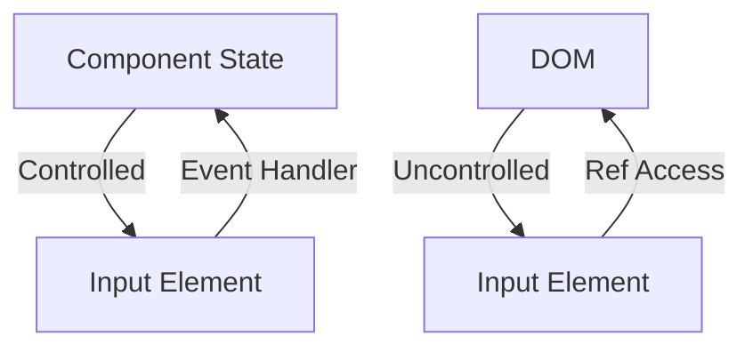

---

linkTitle: "14.1.2 Controlled and Uncontrolled Components"
title: "Controlled and Uncontrolled Components in React: A Comprehensive Guide"
description: "Explore the differences between controlled and uncontrolled components in React, with detailed examples, use cases, and best practices."
categories:
- Frontend Development
- React
- JavaScript
tags:
- React Components
- Controlled Components
- Uncontrolled Components
- JavaScript Patterns
- Frontend Design
date: 2024-10-25
type: docs
nav_weight: 1412000
canonical: "https://softwarepatternslexicon.com/patterns-js/14/1/2"
license: "© 2024 Tokenizer Inc. CC BY-NC-SA 4.0"
---

## 14.1.2 Controlled and Uncontrolled Components

In the realm of React development, understanding the distinction between controlled and uncontrolled components is crucial for building efficient and maintainable applications. This section delves into these two types of components, providing insights into their implementation, use cases, and best practices.

### Understand the Concepts

#### Controlled Components

Controlled components are form inputs whose values are managed by the component's state. This approach ensures that the React component has full control over the form data, allowing for immediate validation and manipulation.

- **State Management:** The component's state holds the form values.
- **Event Handlers:** Every change in the input is captured by an event handler, which updates the state.
- **Data Flow:** Data flows from the component's state to the input element, ensuring a single source of truth.

#### Uncontrolled Components

Uncontrolled components, on the other hand, manage their own state internally. They rely on the DOM to store the current value of the input, which can be accessed using a `ref`.

- **Internal State:** The input element maintains its own state.
- **Refs Usage:** Use `ref` to directly access the DOM element's value when needed.
- **Data Flow:** Data is retrieved from the DOM, allowing for a more traditional form handling approach.

### Implementation Steps

#### For Controlled Components

1. **Initialize State:** Set up state variables to hold the form values.
2. **Handle Input Changes:** Use event handlers to update the state whenever the input value changes.
3. **Bind Input Values:** Ensure that the input element's value is bound to the state variable.

```jsx
import React, { useState } from 'react';

const ControlledForm = () => {
  const [value, setValue] = useState('');

  const handleChange = (event) => setValue(event.target.value);

  return <input type="text" value={value} onChange={handleChange} />;
};
```

#### For Uncontrolled Components

1. **Assign Refs:** Use `useRef` to create a reference to the input element.
2. **Access Values:** Retrieve the input value using `ref.current.value` when necessary.

```jsx
import React, { useRef } from 'react';

const UncontrolledForm = () => {
  const inputRef = useRef(null);

  const handleSubmit = () => {
    const value = inputRef.current.value;
    // Process value
  };

  return (
    <div>
      <input type="text" ref={inputRef} />
      <button onClick={handleSubmit}>Submit</button>
    </div>
  );
};
```

### Use Cases

- **Controlled Components:** Ideal for scenarios requiring immediate access to form data, such as real-time validation or dynamic form updates.
- **Uncontrolled Components:** Suitable for simple forms or when integrating with non-React codebases, where direct DOM manipulation is necessary.

### Practice

- **Form Validation:** Implement form validation logic using controlled components to ensure data integrity.
- **File Uploads:** Use uncontrolled components for handling file uploads, where accessing the file directly is essential.

### Considerations

- **Performance:** Controlled components offer better control over form data but may introduce performance overhead due to frequent state updates.
- **Complexity:** Choose the approach that aligns with your application's complexity and requirements. Controlled components are preferable for complex forms, while uncontrolled components can simplify less demanding scenarios.

### Visual Aids

#### Conceptual Diagram of Controlled and Uncontrolled Components



### Best Practices

- **Consistency:** Use controlled components for consistency in data handling across your application.
- **Performance Optimization:** For performance-critical applications, consider the trade-offs between controlled and uncontrolled components.
- **Hybrid Approach:** In some cases, a hybrid approach using both controlled and uncontrolled components may be beneficial.

### Conclusion

Understanding the differences between controlled and uncontrolled components is essential for React developers. By choosing the right approach based on your application's needs, you can ensure efficient and maintainable code.

## Quiz Time!



### What is a controlled component in React?

- [x] A component where form inputs are controlled by the component's state.
- [ ] A component that manages its own state internally.
- [ ] A component that does not use state or props.
- [ ] A component that only uses props for data.

> **Explanation:** Controlled components have their form inputs managed by the component's state, ensuring a single source of truth.

### How do you access the value of an uncontrolled component?

- [x] Using a ref to access the DOM element's value.
- [ ] By directly accessing the component's state.
- [ ] By using props to pass the value.
- [ ] By using a context provider.

> **Explanation:** Uncontrolled components use refs to access the DOM element's value directly.

### Which of the following is a benefit of controlled components?

- [x] Immediate access to form data for validation.
- [ ] Reduced complexity in form handling.
- [ ] Less performance overhead.
- [ ] Automatic state management by the DOM.

> **Explanation:** Controlled components provide immediate access to form data, which is useful for validation and dynamic updates.

### What is a common use case for uncontrolled components?

- [x] Simple forms or integration with non-React code.
- [ ] Complex forms requiring dynamic updates.
- [ ] Real-time data validation.
- [ ] State management across multiple components.

> **Explanation:** Uncontrolled components are suitable for simple forms or when integrating with non-React code.

### How do you handle input changes in a controlled component?

- [x] By using event handlers to update the state.
- [ ] By directly modifying the DOM element.
- [ ] By using context to manage state.
- [ ] By using lifecycle methods.

> **Explanation:** Controlled components use event handlers to update the state in response to input changes.

### What is a potential drawback of using controlled components?

- [x] Performance overhead due to frequent state updates.
- [ ] Lack of control over form data.
- [ ] Difficulty in accessing DOM elements.
- [ ] Inability to handle complex forms.

> **Explanation:** Controlled components can introduce performance overhead due to frequent state updates.

### Which approach is better for handling file uploads?

- [x] Uncontrolled components.
- [ ] Controlled components.
- [ ] Context API.
- [ ] Redux state management.

> **Explanation:** Uncontrolled components are better for file uploads as they allow direct access to the file input element.

### What is the main difference between controlled and uncontrolled components?

- [x] Controlled components use state to manage form inputs, while uncontrolled components use the DOM.
- [ ] Controlled components use props, while uncontrolled components use state.
- [ ] Controlled components are stateless, while uncontrolled components are stateful.
- [ ] Controlled components use refs, while uncontrolled components use context.

> **Explanation:** Controlled components manage form inputs using state, whereas uncontrolled components rely on the DOM.

### Can you mix controlled and uncontrolled components in a single form?

- [x] Yes, but it requires careful management of state and refs.
- [ ] No, it is not possible to mix them.
- [ ] Yes, but only in class components.
- [ ] No, they must be used in separate forms.

> **Explanation:** It is possible to mix controlled and uncontrolled components, but it requires careful management of state and refs.

### True or False: Controlled components provide better control over form data but may introduce performance overhead.

- [x] True
- [ ] False

> **Explanation:** Controlled components offer better control over form data, but frequent state updates can lead to performance overhead.


