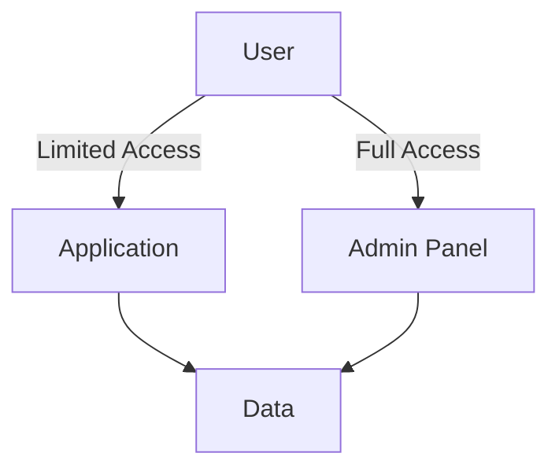

## 14.1 Secure Coding Practices in JavaScript

In the ever-evolving landscape of web development, security remains a paramount concern. As JavaScript continues to be a cornerstone of modern web applications, understanding and implementing secure coding practices is essential for developers. This section delves into the fundamental principles of secure coding in JavaScript, providing you with the knowledge to safeguard your applications against common vulnerabilities.

### The Importance of Security in Software Development

Security is not just a feature; it's a fundamental aspect of software development. With the increasing sophistication of cyber threats, developers must prioritize security from the outset. A single vulnerability can lead to data breaches, financial loss, and damage to reputation. Therefore, adopting a security-first mindset is crucial for building resilient applications.

### General Secure Coding Practices

#### Principle of Least Privilege

The principle of least privilege dictates that a user or process should have the minimum level of access necessary to perform its function. This minimizes the potential damage from accidental or malicious actions.

- **Implement Role-Based Access Control (RBAC):** Assign permissions based on roles rather than individual users.
- **Limit Access to Sensitive Data:** Ensure that only authorized users can access sensitive information.

#### Input Validation and Sanitization

Input validation and sanitization are critical to preventing injection attacks, such as SQL injection and cross-site scripting (XSS).

- **Validate Input:** Ensure that all input is checked against expected formats and types.
- **Sanitize Input:** Remove or encode potentially harmful characters from user input.

#### Avoiding Insecure Constructs

Certain coding practices can introduce vulnerabilities. Avoiding these insecure constructs is vital for secure coding.

- **Avoid `eval`:** The `eval` function can execute arbitrary code, making it a significant security risk.
- **Use Strict Mode:** Enabling strict mode (`'use strict';`) helps catch common coding errors and prevents the use of insecure features.

### JavaScript-Specific Recommendations

JavaScript's dynamic nature and widespread use in web applications present unique security challenges. Here are some JavaScript-specific recommendations:

#### Use HTTPS

Ensure that your application uses HTTPS to encrypt data in transit. This prevents man-in-the-middle attacks and protects sensitive information.

#### Secure Cookies

- **Set the `HttpOnly` Flag:** This prevents client-side scripts from accessing cookies.
- **Use the `Secure` Flag:** Ensure cookies are only sent over HTTPS.

#### Content Security Policy (CSP)

Implement a Content Security Policy to restrict the sources from which content can be loaded. This helps mitigate XSS attacks.

```javascript
// Example of setting a Content Security Policy
const csp = "default-src 'self'; script-src 'self' https://apis.google.com";
document.head.appendChild(document.createElement('meta')).httpEquiv = "Content-Security-Policy";
document.head.appendChild(document.createElement('meta')).content = csp;
```

#### Avoid Insecure Dependencies

Regularly update and audit third-party libraries to avoid vulnerabilities introduced by outdated or insecure dependencies.

### The Role of Code Reviews and Security Training

Code reviews are an essential part of the development process, providing an opportunity to catch security issues before they reach production.

- **Conduct Regular Code Reviews:** Incorporate security checks into your code review process.
- **Provide Security Training:** Ensure that all team members are aware of the latest security threats and best practices.

### Encouraging a Security-First Mindset

Fostering a security-first mindset involves integrating security into every stage of the development lifecycle. This includes:

- **Threat Modeling:** Identify potential threats and design your application to mitigate them.
- **Continuous Monitoring:** Implement tools to monitor your application for security breaches.
- **Incident Response Planning:** Prepare a plan for responding to security incidents.

### Code Examples

Let's explore some practical examples to illustrate secure coding practices in JavaScript.

#### Example 1: Input Validation

```javascript
// Function to validate email input
function validateEmail(email) {
    const emailRegex = /^[^\s@]+@[^\s@]+\.[^\s@]+$/;
    return emailRegex.test(email);
}

// Usage
const userEmail = "user@example.com";
if (validateEmail(userEmail)) {
    console.log("Valid email address.");
} else {
    console.log("Invalid email address.");
}
```

#### Example 2: Avoiding `eval`

```javascript
// Insecure use of eval
const userInput = "alert('Hello, world!')";
eval(userInput); // Dangerous: Executes arbitrary code

// Secure alternative
const safeFunction = new Function('console.log("Hello, world!");');
safeFunction(); // Executes predefined code
```

### Visualizing Secure Coding Practices

To further enhance your understanding, let's visualize some of these concepts using Mermaid.js diagrams.

#### Diagram: Principle of Least Privilege



*Caption: This diagram illustrates the principle of least privilege, where users have limited access to the application, while administrators have full access to the admin panel and data.*

### References and Links

- [MDN Web Docs: JavaScript Security](https://developer.mozilla.org/en-US/docs/Web/JavaScript/Security)
- [OWASP Secure Coding Practices](https://owasp.org/www-project-secure-coding-practices-quick-reference-guide/)
- [W3Schools: JavaScript Security](https://www.w3schools.com/js/js_security.asp)

### Knowledge Check

To reinforce your understanding, consider the following questions:

1. What is the principle of least privilege, and why is it important?
2. How can input validation prevent security vulnerabilities?
3. Why should you avoid using `eval` in JavaScript?
4. What role do code reviews play in secure coding practices?
5. How can a Content Security Policy help mitigate XSS attacks?

### Embrace the Journey

Remember, secure coding is an ongoing journey. As you continue to develop your skills, stay curious and proactive in learning about new security threats and best practices. By adopting a security-first mindset, you'll be well-equipped to build robust and secure JavaScript applications.

### Quiz: Secure Coding Practices in JavaScript



### What is the principle of least privilege?

- [x] Granting users the minimum level of access necessary
- [ ] Allowing users full access to all system resources
- [ ] Providing users with administrative privileges by default
- [ ] Restricting all access to system resources

> **Explanation:** The principle of least privilege involves granting users only the access they need to perform their tasks, minimizing potential security risks.

### Why is input validation important?

- [x] It prevents injection attacks
- [ ] It improves application performance
- [ ] It enhances user experience
- [ ] It reduces code complexity

> **Explanation:** Input validation is crucial for preventing injection attacks by ensuring that user input conforms to expected formats and types.

### What is a secure alternative to using `eval` in JavaScript?

- [x] Using `new Function` with predefined code
- [ ] Using `setTimeout` to execute code
- [ ] Using `document.write` to insert code
- [ ] Using `innerHTML` to execute code

> **Explanation:** Using `new Function` with predefined code is a secure alternative to `eval`, as it avoids executing arbitrary code.

### How can code reviews contribute to secure coding practices?

- [x] By identifying security issues before production
- [ ] By improving application performance
- [ ] By reducing code duplication
- [ ] By enhancing user interface design

> **Explanation:** Code reviews help identify security issues early in the development process, preventing them from reaching production.

### What is the purpose of a Content Security Policy (CSP)?

- [x] To restrict content sources and mitigate XSS attacks
- [ ] To improve application performance
- [ ] To enhance user experience
- [ ] To reduce code complexity

> **Explanation:** A Content Security Policy (CSP) restricts the sources from which content can be loaded, helping to mitigate XSS attacks.

### What is the role of HTTPS in secure coding practices?

- [x] Encrypting data in transit
- [ ] Improving application performance
- [ ] Enhancing user interface design
- [ ] Reducing code complexity

> **Explanation:** HTTPS encrypts data in transit, preventing man-in-the-middle attacks and protecting sensitive information.

### Why should you set the `HttpOnly` flag on cookies?

- [x] To prevent client-side scripts from accessing cookies
- [ ] To improve application performance
- [ ] To enhance user experience
- [ ] To reduce code complexity

> **Explanation:** Setting the `HttpOnly` flag on cookies prevents client-side scripts from accessing them, enhancing security.

### What is the benefit of using strict mode in JavaScript?

- [x] It catches common coding errors
- [ ] It improves application performance
- [ ] It enhances user experience
- [ ] It reduces code complexity

> **Explanation:** Strict mode helps catch common coding errors and prevents the use of insecure features, enhancing security.

### How can regular code reviews improve security?

- [x] By incorporating security checks into the review process
- [ ] By improving application performance
- [ ] By enhancing user interface design
- [ ] By reducing code complexity

> **Explanation:** Regular code reviews that incorporate security checks help identify and address security issues early in the development process.

### True or False: A security-first mindset involves integrating security into every stage of the development lifecycle.

- [x] True
- [ ] False

> **Explanation:** A security-first mindset involves considering security at every stage of the development lifecycle, from design to deployment.



By following these secure coding practices, you'll be well on your way to building robust and secure JavaScript applications. Keep experimenting, stay curious, and enjoy the journey of mastering secure coding in JavaScript!
