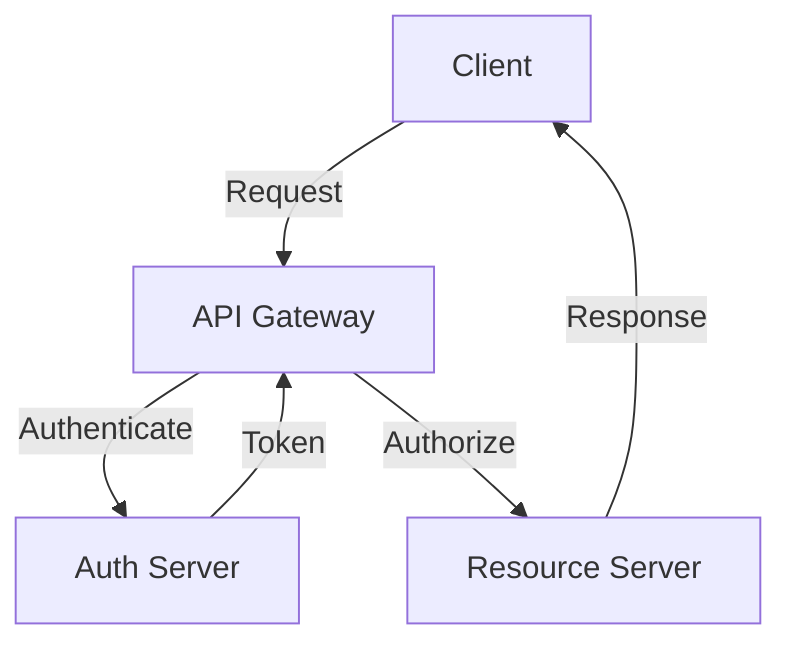

## 14.11 Patterns for Building Secure APIs

In the modern web development landscape, APIs (Application Programming Interfaces) are the backbone of communication between different software systems. Ensuring the security of these APIs is crucial to protect sensitive data and maintain the integrity of applications. This section delves into the patterns and best practices for building secure APIs, focusing on authentication, authorization, data validation, and more.

### Understanding Common API Security Vulnerabilities

Before we dive into the patterns, it's essential to understand the common vulnerabilities that can affect APIs:

1. **Injection Attacks**: These occur when untrusted data is sent to an interpreter as part of a command or query, leading to unintended execution.
2. **Broken Authentication**: Weak authentication mechanisms can allow unauthorized access.
3. **Sensitive Data Exposure**: Inadequate protection of sensitive data can lead to data breaches.
4. **Lack of Rate Limiting**: Without rate limiting, APIs can be overwhelmed by too many requests, leading to denial of service.
5. **Security Misconfiguration**: Incorrectly configured security settings can expose APIs to attacks.

### Authentication Methods

Authentication is the process of verifying the identity of a user or system. Here are some common methods used in APIs:

#### JWT (JSON Web Tokens)

JWT is a compact, URL-safe means of representing claims to be transferred between two parties. It is commonly used for authentication and information exchange.

- **Structure**: A JWT consists of three parts: Header, Payload, and Signature.
- **Usage**: After a user logs in, a JWT is generated and sent to the client. The client includes this token in the header of subsequent requests.
- **Security**: JWTs should be signed using a strong algorithm (e.g., RS256) and should not contain sensitive information.

**Example Code:**

```javascript
const jwt = require('jsonwebtoken');

// Generate a JWT
const token = jwt.sign({ userId: 123 }, 'your-secure-secret', { expiresIn: '1h' });

// Verify a JWT
jwt.verify(token, 'your-secure-secret', (err, decoded) => {
  if (err) {
    console.error('Token verification failed:', err);
  } else {
    console.log('Decoded token:', decoded);
  }
});
```

#### OAuth 2.0

OAuth 2.0 is an authorization framework that enables applications to obtain limited access to user accounts on an HTTP service.

- **Flow**: OAuth 2.0 provides several flows for different use cases, such as authorization code flow and implicit flow.
- **Tokens**: Access tokens are used to access protected resources, and refresh tokens can be used to obtain new access tokens.

**Example Code:**

```javascript
// Example of using OAuth 2.0 with a Node.js library
const { AuthorizationCode } = require('simple-oauth2');

const client = new AuthorizationCode({
  client: {
    id: 'your-client-id',
    secret: 'your-client-secret',
  },
  auth: {
    tokenHost: 'https://authorization-server.com',
  },
});

// Obtain the authorization URL
const authorizationUri = client.authorizeURL({
  redirect_uri: 'https://your-app.com/callback',
  scope: 'read write',
  state: 'random-string',
});

// Redirect the user to the authorization URL
console.log('Redirect to:', authorizationUri);
```

#### API Keys

API keys are simple, unique identifiers used to authenticate requests associated with a project for usage and billing purposes.

- **Usage**: API keys are included in the request header or URL.
- **Limitations**: They provide basic security and should be used in conjunction with other methods for sensitive operations.

**Example Code:**

```javascript
// Example of using an API key in a request
const axios = require('axios');

axios.get('https://api.example.com/data', {
  headers: {
    'Authorization': 'Bearer your-api-key',
  }
})
.then(response => {
  console.log('Data:', response.data);
})
.catch(error => {
  console.error('Error fetching data:', error);
});
```

### Authorization Checks

Authorization determines what an authenticated user is allowed to do. Implementing robust authorization checks is crucial for API security.

- **Role-Based Access Control (RBAC)**: Assign roles to users and define permissions for each role.
- **Attribute-Based Access Control (ABAC)**: Use attributes (e.g., user, resource, environment) to define access policies.

**Example Code:**

```javascript
// Example of role-based access control
function checkPermission(user, action) {
  const roles = {
    admin: ['read', 'write', 'delete'],
    user: ['read', 'write'],
    guest: ['read'],
  };

  return roles[user.role].includes(action);
}

const user = { role: 'user' };
console.log('Can write:', checkPermission(user, 'write')); // true
console.log('Can delete:', checkPermission(user, 'delete')); // false
```

### Input Validation and Output Encoding

Input validation and output encoding are critical to prevent injection attacks and ensure data integrity.

- **Input Validation**: Validate all inputs against a set of rules to ensure they are safe and expected.
- **Output Encoding**: Encode outputs to prevent injection attacks, such as cross-site scripting (XSS).

**Example Code:**

```javascript
// Example of input validation using a library
const Joi = require('joi');

const schema = Joi.object({
  username: Joi.string().alphanum().min(3).max(30).required(),
  password: Joi.string().pattern(new RegExp('^[a-zA-Z0-9]{3,30}$')).required(),
});

const { error, value } = schema.validate({ username: 'abc', password: '123' });

if (error) {
  console.error('Validation error:', error.details);
} else {
  console.log('Validated data:', value);
}
```

### Rate Limiting and Throttling

Rate limiting and throttling are techniques used to control the number of requests a client can make to an API in a given time period.

- **Rate Limiting**: Restrict the number of requests to prevent abuse and ensure fair usage.
- **Throttling**: Slow down the processing of requests to prevent server overload.

**Example Code:**

```javascript
// Example of rate limiting using a middleware
const rateLimit = require('express-rate-limit');

const limiter = rateLimit({
  windowMs: 15 * 60 * 1000, // 15 minutes
  max: 100, // Limit each IP to 100 requests per windowMs
  message: 'Too many requests, please try again later.',
});

app.use('/api/', limiter);
```

### Importance of HTTPS and Secure Communication

Using HTTPS ensures that data transmitted between the client and server is encrypted, protecting it from eavesdropping and tampering.

- **SSL/TLS**: Use SSL/TLS certificates to enable HTTPS.
- **HSTS**: Implement HTTP Strict Transport Security (HSTS) to enforce secure connections.

**Example Code:**

```javascript
// Example of setting up HTTPS with Express
const https = require('https');
const fs = require('fs');
const express = require('express');

const app = express();

const options = {
  key: fs.readFileSync('path/to/private.key'),
  cert: fs.readFileSync('path/to/certificate.crt'),
};

https.createServer(options, app).listen(443, () => {
  console.log('HTTPS server running on port 443');
});
```

### Visualizing Secure API Architecture

To better understand how these components fit together, let's visualize a secure API architecture using a flowchart.



**Diagram Description**: This flowchart illustrates a secure API architecture where the client sends a request to the API Gateway. The gateway authenticates the request with the Auth Server, receives a token, and then authorizes access to the Resource Server, which sends a response back to the client.

### Best Practices for Building Secure APIs

1. **Use Strong Authentication**: Implement robust authentication mechanisms like JWT and OAuth 2.0.
2. **Implement Authorization Checks**: Use RBAC or ABAC to control access to resources.
3. **Validate Inputs and Encode Outputs**: Prevent injection attacks by validating inputs and encoding outputs.
4. **Apply Rate Limiting and Throttling**: Protect your API from abuse and ensure fair usage.
5. **Enforce HTTPS**: Use SSL/TLS to encrypt data in transit and implement HSTS.
6. **Keep Software Updated**: Regularly update your software to patch security vulnerabilities.
7. **Monitor and Log Activity**: Keep track of API usage and monitor for suspicious activity.

### Knowledge Check

To reinforce your understanding of secure API patterns, consider the following questions:

1. What are some common vulnerabilities that can affect APIs?
2. How does JWT differ from OAuth 2.0 in terms of authentication?
3. Why is input validation important for API security?
4. What is the purpose of rate limiting in APIs?
5. How does HTTPS contribute to secure communication?

### Embrace the Journey

Building secure APIs is a continuous process that requires vigilance and adaptation to new threats. Remember, this is just the beginning. As you progress, you'll build more robust and secure APIs. Keep experimenting, stay curious, and enjoy the journey!

## Quiz: Mastering Secure API Patterns



### What is a common vulnerability that can affect APIs?

- [x] Injection Attacks
- [ ] Secure Token Storage
- [ ] Data Encryption
- [ ] HTTPS Usage

> **Explanation:** Injection attacks occur when untrusted data is sent to an interpreter as part of a command or query, leading to unintended execution.

### Which authentication method uses a compact, URL-safe means of representing claims?

- [x] JWT (JSON Web Tokens)
- [ ] OAuth 2.0
- [ ] API Keys
- [ ] Basic Authentication

> **Explanation:** JWT is a compact, URL-safe means of representing claims to be transferred between two parties.

### What is the purpose of rate limiting in APIs?

- [x] To restrict the number of requests to prevent abuse
- [ ] To encrypt data in transit
- [ ] To validate user inputs
- [ ] To store user credentials securely

> **Explanation:** Rate limiting restricts the number of requests a client can make to an API in a given time period to prevent abuse.

### How does HTTPS contribute to secure communication?

- [x] It encrypts data transmitted between the client and server
- [ ] It validates user inputs
- [ ] It restricts the number of requests
- [ ] It provides role-based access control

> **Explanation:** HTTPS ensures that data transmitted between the client and server is encrypted, protecting it from eavesdropping and tampering.

### What is a key benefit of using OAuth 2.0?

- [x] It enables applications to obtain limited access to user accounts
- [ ] It provides a compact, URL-safe means of representing claims
- [ ] It restricts the number of requests
- [ ] It encrypts data in transit

> **Explanation:** OAuth 2.0 is an authorization framework that enables applications to obtain limited access to user accounts on an HTTP service.

### Why is input validation important for API security?

- [x] To prevent injection attacks and ensure data integrity
- [ ] To encrypt data in transit
- [ ] To restrict the number of requests
- [ ] To store user credentials securely

> **Explanation:** Input validation is critical to prevent injection attacks and ensure data integrity.

### What is the role of an API key?

- [x] To authenticate requests associated with a project
- [ ] To encrypt data in transit
- [ ] To validate user inputs
- [ ] To provide role-based access control

> **Explanation:** API keys are unique identifiers used to authenticate requests associated with a project for usage and billing purposes.

### What is the purpose of output encoding?

- [x] To prevent injection attacks, such as cross-site scripting (XSS)
- [ ] To encrypt data in transit
- [ ] To restrict the number of requests
- [ ] To store user credentials securely

> **Explanation:** Output encoding is used to prevent injection attacks, such as cross-site scripting (XSS).

### What is the benefit of using HSTS?

- [x] It enforces secure connections by implementing HTTP Strict Transport Security
- [ ] It validates user inputs
- [ ] It restricts the number of requests
- [ ] It provides role-based access control

> **Explanation:** HSTS (HTTP Strict Transport Security) enforces secure connections by ensuring that browsers only connect to the server using HTTPS.

### True or False: JWTs should contain sensitive information.

- [ ] True
- [x] False

> **Explanation:** JWTs should not contain sensitive information as they can be decoded by anyone with access to the token.


