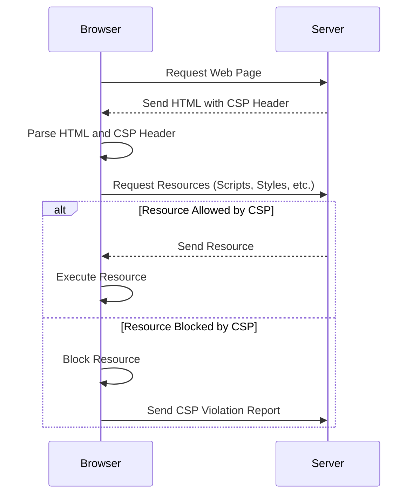

## 14.12 Content Security Policy (CSP) Implementation

In the ever-evolving landscape of web security, Content Security Policy (CSP) stands out as a powerful tool to protect web applications from cross-site scripting (XSS) and other injection attacks. By specifying trusted content sources, CSP helps ensure that only safe and intended resources are loaded and executed by the browser. In this section, we will delve into the intricacies of CSP, explore how it works, and provide practical guidance on implementing it effectively.

### What is Content Security Policy?

Content Security Policy (CSP) is a security feature that helps prevent a variety of attacks, including XSS, clickjacking, and other code injection attacks. It does so by allowing web developers to control which resources can be loaded and executed on their web pages. CSP is implemented by setting HTTP headers that instruct the browser on which resources are considered safe.

#### How CSP Works

CSP works by defining a set of rules, known as directives, that specify which types of content are allowed to be loaded and executed. These directives are communicated to the browser via HTTP headers or `<meta>` tags. When a browser encounters a CSP header, it evaluates the rules and blocks any content that does not comply with the policy.

### Setting CSP Headers

To implement CSP, you need to set the `Content-Security-Policy` HTTP header in your server configuration. Here is a basic example of a CSP header:

```http
Content-Security-Policy: default-src 'self'; script-src 'self' https://apis.example.com; style-src 'self' 'unsafe-inline';
```

In this example, the `default-src` directive allows content to be loaded only from the same origin (`'self'`). The `script-src` directive permits scripts to be loaded from the same origin and from `https://apis.example.com`. The `style-src` directive allows styles to be loaded from the same origin and permits inline styles (`'unsafe-inline'`).

### Key CSP Directives

CSP directives define the policy for different types of resources. Here are some of the most commonly used directives:

- **`default-src`**: Serves as a fallback for other resource types if they are not explicitly specified.
- **`script-src`**: Specifies valid sources for JavaScript.
- **`style-src`**: Defines valid sources for CSS styles.
- **`img-src`**: Specifies valid sources for images.
- **`connect-src`**: Defines valid endpoints for XMLHttpRequest, WebSocket, and EventSource connections.
- **`font-src`**: Specifies valid sources for fonts.
- **`object-src`**: Defines valid sources for `<object>`, `<embed>`, and `<applet>` elements.
- **`media-src`**: Specifies valid sources for audio and video elements.
- **`frame-src`**: Defines valid sources for nested browsing contexts like `<iframe>`.

### Best Practices for Crafting a Secure CSP

Crafting a secure CSP requires careful consideration of your application's needs and potential security threats. Here are some best practices to follow:

1. **Start with a Strict Policy**: Begin with a restrictive policy and gradually relax it as needed. This approach helps identify and mitigate potential vulnerabilities early.

2. **Avoid `unsafe-inline` and `unsafe-eval`**: These keywords allow inline scripts and styles, which can be exploited by attackers. Use nonce or hash-based approaches to allow specific inline content.

3. **Use Nonces or Hashes**: Instead of allowing all inline scripts, use nonces or hashes to permit specific inline scripts. This approach provides a more secure alternative to `unsafe-inline`.

4. **Regularly Review and Update CSP**: As your application evolves, so should your CSP. Regularly review and update your policy to address new features and potential security threats.

5. **Monitor CSP Violations**: Enable CSP reporting to monitor violations and identify potential security issues. Use the `report-uri` or `report-to` directives to specify endpoints for receiving violation reports.

### Tools and Browser Support for CSP

CSP is widely supported across modern browsers, making it a reliable security feature for web applications. Here are some tools and resources to help you implement and test CSP:

- **CSP Evaluator**: A tool by Google that evaluates your CSP and provides feedback on potential security issues. [CSP Evaluator](https://csp-evaluator.withgoogle.com/)

- **Report URI**: A service that collects CSP violation reports and provides insights into potential security threats. [Report URI](https://report-uri.com/)

- **Mozilla Observatory**: A tool that analyzes your website's security headers, including CSP, and provides recommendations for improvement. [Mozilla Observatory](https://observatory.mozilla.org/)

### Reporting Mechanisms and Monitoring CSP Violations

Monitoring CSP violations is crucial for maintaining a secure web application. CSP provides two directives for reporting violations:

- **`report-uri`**: Specifies a URI where the browser should send reports about policy violations.

- **`report-to`**: A newer directive that allows more flexible reporting, including grouping reports and specifying multiple endpoints.

Here is an example of a CSP header with reporting enabled:

```http
Content-Security-Policy: default-src 'self'; script-src 'self'; report-uri https://example.com/csp-report;
```

By monitoring CSP violations, you can identify and address potential security issues before they are exploited by attackers.

### Visualizing CSP Implementation

To better understand how CSP works, let's visualize the interaction between a web browser and a server with CSP implemented.



**Diagram Description**: This sequence diagram illustrates the process of a browser requesting a web page from a server with CSP implemented. The server sends the HTML along with the CSP header. The browser parses the HTML and CSP header, requests resources, and either executes or blocks them based on the CSP rules. If a resource is blocked, a CSP violation report is sent to the server.

### Try It Yourself

To get hands-on experience with CSP, try implementing a basic CSP on your own web application. Start with a strict policy and gradually adjust it to meet your application's needs. Use tools like CSP Evaluator and Report URI to test and monitor your policy.

### Knowledge Check

- What is the primary purpose of Content Security Policy (CSP)?
- How does CSP help prevent XSS attacks?
- What are some common CSP directives, and what do they control?
- Why is it important to avoid `unsafe-inline` and `unsafe-eval` in CSP?
- How can you monitor CSP violations in your web application?

### Summary

Content Security Policy (CSP) is a vital tool for enhancing the security of web applications. By specifying trusted content sources, CSP helps prevent XSS and other injection attacks. Implementing a secure CSP requires careful consideration of your application's needs and potential security threats. Regularly reviewing and updating your CSP, along with monitoring violations, will help maintain a robust security posture.

Remember, this is just the beginning. As you progress, you'll build more secure and resilient web applications. Keep experimenting, stay curious, and enjoy the journey!

## Test Your Knowledge on Content Security Policy (CSP) Implementation



### What is the primary purpose of Content Security Policy (CSP)?

- [x] To prevent XSS and other injection attacks by specifying trusted content sources.
- [ ] To improve website performance by caching resources.
- [ ] To enhance user experience by optimizing layout rendering.
- [ ] To manage user authentication and authorization.

> **Explanation:** CSP is designed to prevent XSS and other injection attacks by allowing developers to specify which content sources are trusted.

### Which directive serves as a fallback for other resource types in CSP?

- [x] `default-src`
- [ ] `script-src`
- [ ] `style-src`
- [ ] `img-src`

> **Explanation:** The `default-src` directive serves as a fallback for other resource types if they are not explicitly specified in the CSP.

### Why should `unsafe-inline` and `unsafe-eval` be avoided in CSP?

- [x] They allow inline scripts and styles, which can be exploited by attackers.
- [ ] They reduce the performance of the website.
- [ ] They increase the complexity of the CSP configuration.
- [ ] They are deprecated and no longer supported by modern browsers.

> **Explanation:** `unsafe-inline` and `unsafe-eval` allow potentially dangerous inline scripts and styles, which can be exploited by attackers to execute malicious code.

### What is the purpose of the `report-uri` directive in CSP?

- [x] To specify a URI where the browser should send reports about policy violations.
- [ ] To define the source of images allowed by the policy.
- [ ] To enable inline styles in the policy.
- [ ] To specify the default source for all resources.

> **Explanation:** The `report-uri` directive specifies a URI where the browser should send reports about CSP violations, allowing developers to monitor and address security issues.

### Which tool can be used to evaluate your CSP and provide feedback on potential security issues?

- [x] CSP Evaluator
- [ ] PageSpeed Insights
- [ ] Lighthouse
- [ ] WebPageTest

> **Explanation:** CSP Evaluator is a tool by Google that evaluates your CSP and provides feedback on potential security issues.

### How does CSP help prevent XSS attacks?

- [x] By restricting the sources from which scripts can be loaded and executed.
- [ ] By encrypting all data transmitted between the server and the client.
- [ ] By requiring user authentication for accessing resources.
- [ ] By optimizing the loading time of web pages.

> **Explanation:** CSP helps prevent XSS attacks by restricting the sources from which scripts can be loaded and executed, thus blocking malicious scripts from unauthorized sources.

### What is the role of the `script-src` directive in CSP?

- [x] To specify valid sources for JavaScript.
- [ ] To define valid sources for CSS styles.
- [ ] To specify valid sources for images.
- [ ] To define valid endpoints for XMLHttpRequest connections.

> **Explanation:** The `script-src` directive specifies valid sources for JavaScript, controlling which scripts can be loaded and executed on the web page.

### Which directive in CSP specifies valid sources for images?

- [x] `img-src`
- [ ] `default-src`
- [ ] `style-src`
- [ ] `connect-src`

> **Explanation:** The `img-src` directive specifies valid sources for images, controlling which images can be loaded on the web page.

### What is the benefit of using nonces or hashes in CSP?

- [x] They provide a more secure alternative to `unsafe-inline` for allowing specific inline content.
- [ ] They improve the performance of the website by caching resources.
- [ ] They simplify the CSP configuration by reducing the number of directives needed.
- [ ] They enable cross-origin resource sharing.

> **Explanation:** Nonces or hashes provide a more secure alternative to `unsafe-inline` by allowing specific inline content without exposing the application to potential XSS attacks.

### True or False: CSP is only supported by modern browsers and not by older versions.

- [x] True
- [ ] False

> **Explanation:** CSP is widely supported by modern browsers, but older versions may not fully support all CSP features and directives.


