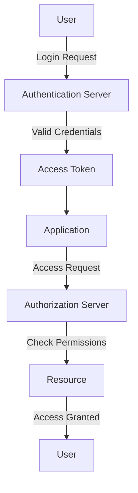

## 14.13 Authentication and Authorization Strategies

In the realm of web development, securing applications is paramount. Two critical components of security are authentication and authorization. While often used interchangeably, these concepts serve distinct purposes. Authentication verifies the identity of a user, whereas authorization determines what an authenticated user is allowed to do. This section delves into various strategies and technologies for implementing authentication and authorization in JavaScript web applications.

### Differentiating Authentication and Authorization

**Authentication** is the process of verifying who a user is. It involves confirming the identity of a user through credentials such as passwords, tokens, or biometric data. 

**Authorization**, on the other hand, is the process of determining what an authenticated user is permitted to do. It involves setting permissions and access levels for various resources within an application.

### Authentication Methods

#### Password-Based Authentication

Password-based authentication is the most common form of authentication. It involves users providing a username and password to gain access to an application. While simple, it is susceptible to security risks such as brute force attacks and password theft.

**Best Practices for Password-Based Authentication:**

- **Use Strong Password Policies**: Encourage users to create complex passwords with a mix of letters, numbers, and symbols.
- **Implement Rate Limiting**: Prevent brute force attacks by limiting the number of login attempts.
- **Use Secure Hashing Algorithms**: Store passwords using secure hashing algorithms like bcrypt.

#### Multi-Factor Authentication (MFA)

MFA adds an extra layer of security by requiring users to provide two or more verification factors. This could include something the user knows (password), something the user has (a mobile device), or something the user is (fingerprint).

**Benefits of MFA:**

- **Enhanced Security**: Reduces the risk of unauthorized access.
- **User Trust**: Increases user confidence in the security of the application.

#### Single Sign-On (SSO)

SSO allows users to authenticate once and gain access to multiple applications. This is achieved through a centralized authentication service.

**Advantages of SSO:**

- **Convenience**: Users need to remember only one set of credentials.
- **Improved User Experience**: Seamless access to multiple applications.

### Authorization Models

#### Role-Based Access Control (RBAC)

RBAC assigns permissions to users based on their roles within an organization. Each role has a set of permissions that define what actions a user can perform.

**Key Features of RBAC:**

- **Simplicity**: Easy to manage and understand.
- **Scalability**: Suitable for organizations of all sizes.

#### Attribute-Based Access Control (ABAC)

ABAC provides more granular control by using attributes to define access policies. Attributes can include user characteristics, resource types, and environmental conditions.

**Benefits of ABAC:**

- **Flexibility**: Allows for complex access control policies.
- **Dynamic Access**: Adapts to changing conditions and user attributes.

### Implementing Authentication with Libraries

#### Passport.js

[Passport.js](http://www.passportjs.org/) is a popular middleware for Node.js that simplifies authentication. It supports various authentication strategies, including local, OAuth, and OpenID.

**Example: Implementing Local Authentication with Passport.js**

```javascript
const express = require('express');
const passport = require('passport');
const LocalStrategy = require('passport-local').Strategy;
const bcrypt = require('bcrypt');

const users = [{ id: 1, username: 'user', passwordHash: bcrypt.hashSync('password', 10) }];

passport.use(new LocalStrategy(
  function(username, password, done) {
    const user = users.find(u => u.username === username);
    if (!user) {
      return done(null, false, { message: 'Incorrect username.' });
    }
    if (!bcrypt.compareSync(password, user.passwordHash)) {
      return done(null, false, { message: 'Incorrect password.' });
    }
    return done(null, user);
  }
));

passport.serializeUser(function(user, done) {
  done(null, user.id);
});

passport.deserializeUser(function(id, done) {
  const user = users.find(u => u.id === id);
  done(null, user);
});

const app = express();
app.use(require('body-parser').urlencoded({ extended: true }));
app.use(require('express-session')({ secret: 'secret', resave: false, saveUninitialized: false }));
app.use(passport.initialize());
app.use(passport.session());

app.post('/login', passport.authenticate('local', { successRedirect: '/', failureRedirect: '/login' }));

app.listen(3000, () => console.log('Server started on http://localhost:3000'));
```

**Try It Yourself**: Modify the code to add more users or change the hashing algorithm.

#### Auth0

[Auth0](https://auth0.com/) is a flexible, drop-in solution to add authentication and authorization services to your applications. It supports various identity providers and offers features like social login, MFA, and SSO.

**Example: Implementing Authentication with Auth0**

```javascript
const express = require('express');
const { auth } = require('express-openid-connect');

const config = {
  authRequired: false,
  auth0Logout: true,
  secret: 'LONG_RANDOM_STRING',
  baseURL: 'http://localhost:3000',
  clientID: 'YOUR_CLIENT_ID',
  issuerBaseURL: 'https://YOUR_DOMAIN'
};

const app = express();

app.use(auth(config));

app.get('/', (req, res) => {
  res.send(req.oidc.isAuthenticated() ? 'Logged in' : 'Logged out');
});

app.listen(3000, () => console.log('Server started on http://localhost:3000'));
```

**Try It Yourself**: Experiment with different configurations and explore Auth0's dashboard for additional features.

### Best Practices for Session Management and Token Security

- **Use Secure Cookies**: Ensure cookies are marked as `Secure` and `HttpOnly` to prevent interception and access by client-side scripts.
- **Implement Token Expiry**: Use short-lived tokens and refresh tokens to enhance security.
- **Store Tokens Securely**: Avoid storing tokens in local storage. Use secure, server-side storage when possible.
- **Use HTTPS**: Always use HTTPS to encrypt data in transit.

### Visualizing Authentication and Authorization Flow



**Diagram Description**: This flowchart illustrates the process of authentication and authorization in a web application. The user sends a login request to the authentication server, which validates the credentials and issues an access token. The application uses this token to request access to resources, and the authorization server checks permissions before granting access.

### References and Links

- [MDN Web Docs: Authentication](https://developer.mozilla.org/en-US/docs/Web/Security/Authentication)
- [OWASP Authentication Cheat Sheet](https://cheatsheetseries.owasp.org/cheatsheets/Authentication_Cheat_Sheet.html)
- [Passport.js Documentation](http://www.passportjs.org/docs/)
- [Auth0 Documentation](https://auth0.com/docs/)

### Knowledge Check

- **What is the difference between authentication and authorization?**
- **How does multi-factor authentication enhance security?**
- **What are the advantages of using Single Sign-On?**
- **How does Role-Based Access Control differ from Attribute-Based Access Control?**
- **What are some best practices for managing sessions and tokens?**

### Exercises

1. **Implement a simple authentication system using Passport.js.**
2. **Explore Auth0's dashboard and configure a new application.**
3. **Create a role-based access control system for a sample application.**

### Key Takeaways

- **Authentication** verifies user identity, while **authorization** determines access rights.
- **Password-based authentication** is common but requires strong security measures.
- **MFA** and **SSO** enhance security and user experience.
- **RBAC** and **ABAC** offer different approaches to access control.
- **Passport.js** and **Auth0** provide robust solutions for implementing authentication.
- **Secure session management** and **token handling** are crucial for application security.

### Embrace the Journey

Remember, mastering authentication and authorization is a journey. As you progress, you'll build more secure and robust applications. Keep experimenting, stay curious, and enjoy the journey!

## Quiz: Mastering Authentication and Authorization Strategies



### What is the primary purpose of authentication?

- [x] Verifying the identity of a user
- [ ] Determining what a user can access
- [ ] Encrypting user data
- [ ] Managing user sessions

> **Explanation:** Authentication is the process of verifying the identity of a user.

### What is a key benefit of multi-factor authentication (MFA)?

- [x] Enhanced security
- [ ] Reduced server load
- [ ] Simplified user experience
- [ ] Faster login times

> **Explanation:** MFA enhances security by requiring multiple forms of verification.

### Which of the following is an example of Single Sign-On (SSO)?

- [x] Logging into multiple applications with one set of credentials
- [ ] Using a password and a security question
- [ ] Logging in with a fingerprint
- [ ] Using a password manager

> **Explanation:** SSO allows users to log into multiple applications with one set of credentials.

### What is a characteristic of Role-Based Access Control (RBAC)?

- [x] Assigning permissions based on user roles
- [ ] Using attributes to define access policies
- [ ] Allowing access based on user location
- [ ] Granting access based on time of day

> **Explanation:** RBAC assigns permissions based on predefined user roles.

### How does Attribute-Based Access Control (ABAC) differ from RBAC?

- [x] ABAC uses attributes to define access policies
- [ ] ABAC is simpler to implement
- [ ] ABAC is less flexible
- [ ] ABAC is only used in small organizations

> **Explanation:** ABAC uses attributes such as user characteristics and environmental conditions to define access policies.

### What is a best practice for session management?

- [x] Use secure cookies
- [ ] Store tokens in local storage
- [ ] Use long-lived tokens
- [ ] Avoid using HTTPS

> **Explanation:** Using secure cookies helps protect session data from interception.

### Which library is commonly used for authentication in Node.js applications?

- [x] Passport.js
- [ ] jQuery
- [ ] React
- [ ] Angular

> **Explanation:** Passport.js is a popular middleware for authentication in Node.js applications.

### What is a benefit of using Auth0 for authentication?

- [x] Supports various identity providers
- [ ] Requires manual token management
- [ ] Limited to password-based authentication
- [ ] Only works with social logins

> **Explanation:** Auth0 supports various identity providers and offers features like social login and MFA.

### What is a common vulnerability in password-based authentication?

- [x] Susceptibility to brute force attacks
- [ ] Complexity of implementation
- [ ] Requirement for additional hardware
- [ ] Incompatibility with mobile devices

> **Explanation:** Password-based authentication is susceptible to brute force attacks if not properly secured.

### True or False: Authorization determines what an authenticated user can do.

- [x] True
- [ ] False

> **Explanation:** Authorization determines the actions an authenticated user is allowed to perform.




