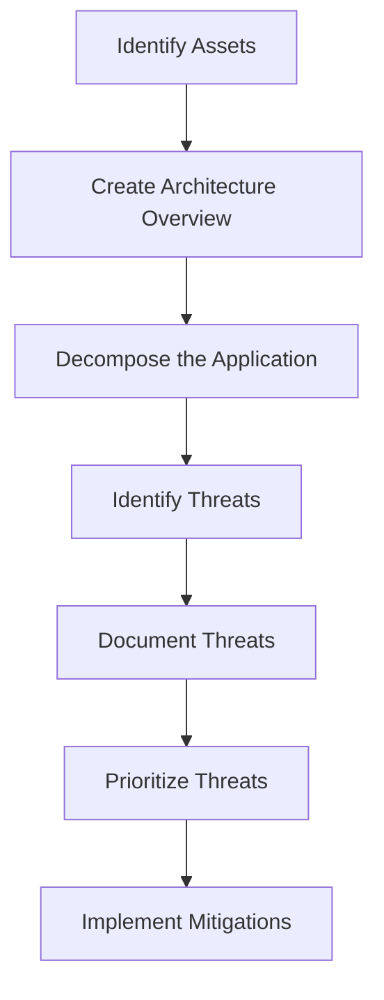

## 14.14 Threat Modeling and Security Testing

In today's digital landscape, security is paramount. As JavaScript developers, understanding and implementing robust security measures is crucial to protect applications from potential threats. This section delves into the concepts of threat modeling and security testing, providing you with the knowledge to safeguard your applications effectively.

### Understanding Threat Modeling

Threat modeling is a structured approach to identifying and evaluating potential security threats and vulnerabilities in a system. It helps developers anticipate potential attack vectors and design countermeasures to mitigate risks.

#### Importance of Threat Modeling

- **Proactive Security**: By identifying threats early, developers can implement security measures before vulnerabilities are exploited.
- **Cost-Effective**: Addressing security issues during the development phase is more cost-effective than post-deployment fixes.
- **Improved Design**: Threat modeling encourages a security-focused design, leading to more robust applications.

### Methodologies for Threat Modeling

Several methodologies exist to guide developers through the threat modeling process. Two widely used frameworks are STRIDE and DREAD.

#### STRIDE

STRIDE is a mnemonic for six categories of security threats:

- **Spoofing**: Impersonating another user or system.
- **Tampering**: Unauthorized alteration of data.
- **Repudiation**: Denying actions or transactions.
- **Information Disclosure**: Unauthorized access to data.
- **Denial of Service (DoS)**: Disrupting service availability.
- **Elevation of Privilege**: Gaining unauthorized access to higher privileges.

Using STRIDE, developers can systematically analyze each component of their application for potential threats.

#### DREAD

DREAD is a risk assessment model used to prioritize threats based on their potential impact:

- **Damage Potential**: How severe is the impact if the threat is realized?
- **Reproducibility**: How easy is it to reproduce the attack?
- **Exploitability**: How easy is it to exploit the vulnerability?
- **Affected Users**: How many users are affected?
- **Discoverability**: How easy is it to discover the threat?

By scoring each threat, developers can prioritize their efforts on the most critical vulnerabilities.

### Conducting Threat Assessments

To conduct an effective threat assessment, follow these guidelines:

1. **Identify Assets**: Determine what needs protection, such as data, services, and user credentials.
2. **Create an Architecture Overview**: Document the application's architecture, including data flow diagrams.
3. **Decompose the Application**: Break down the application into components to understand interactions and data flow.
4. **Identify Threats**: Use methodologies like STRIDE to identify potential threats for each component.
5. **Document Threats**: Record identified threats, their potential impact, and mitigation strategies.
6. **Prioritize Threats**: Use models like DREAD to prioritize threats based on their risk level.
7. **Implement Mitigations**: Develop and implement strategies to mitigate identified threats.

### Types of Security Testing

Security testing is essential to validate the effectiveness of threat mitigations and ensure the application is secure. Here are some common types of security testing:

#### Penetration Testing

Penetration testing, or pen testing, simulates real-world attacks to identify vulnerabilities. It involves:

- **Reconnaissance**: Gathering information about the target system.
- **Scanning**: Identifying open ports and services.
- **Exploitation**: Attempting to exploit vulnerabilities.
- **Reporting**: Documenting findings and recommendations.

Penetration testing helps uncover vulnerabilities that may not be apparent through other testing methods.

#### Fuzz Testing

Fuzz testing involves providing invalid or unexpected inputs to the application to identify potential vulnerabilities. It helps uncover:

- **Buffer Overflows**: When input exceeds the buffer's capacity.
- **Input Validation Issues**: When the application fails to handle unexpected input.
- **Unhandled Exceptions**: When the application crashes due to unexpected input.

Fuzz testing is effective in identifying vulnerabilities related to input handling.

#### Static and Dynamic Analysis

- **Static Analysis**: Analyzing the application's source code without executing it. Tools like ESLint and SonarQube can identify code vulnerabilities and enforce coding standards.
- **Dynamic Analysis**: Testing the application during runtime to identify vulnerabilities. Tools like OWASP ZAP and Burp Suite can simulate attacks and monitor application behavior.

Both static and dynamic analysis are crucial for comprehensive security testing.

### Role of Security Experts and Ethical Hackers

Security experts and ethical hackers play a vital role in identifying and mitigating security threats. They bring specialized knowledge and experience to:

- **Conduct Security Audits**: Assess the application's security posture.
- **Perform Penetration Testing**: Simulate attacks to identify vulnerabilities.
- **Provide Security Recommendations**: Offer guidance on best practices and mitigation strategies.

Engaging security experts ensures a thorough evaluation of the application's security.

### Integrating Security Early in the Development Lifecycle

Security should be an integral part of the development lifecycle, not an afterthought. Here are some best practices:

- **Adopt a Security-First Mindset**: Encourage developers to consider security at every stage of development.
- **Implement Secure Coding Practices**: Follow best practices for secure coding, such as input validation and error handling.
- **Conduct Regular Security Reviews**: Schedule regular security reviews and audits to identify and address vulnerabilities.
- **Use Automated Security Tools**: Integrate automated security tools into the development pipeline to catch vulnerabilities early.

By integrating security early, developers can build more secure applications and reduce the risk of security breaches.

### Code Example: Implementing Input Validation

Input validation is a crucial aspect of secure coding. Here's an example of how to implement input validation in JavaScript:

```javascript
// Function to validate user input
function validateInput(input) {
    // Regular expression for alphanumeric input
    const regex = /^[a-zA-Z0-9]+$/;

    // Check if input matches the regex
    if (regex.test(input)) {
        console.log("Valid input");
        return true;
    } else {
        console.error("Invalid input");
        return false;
    }
}

// Example usage
const userInput = "abc123";
validateInput(userInput); // Output: Valid input

const invalidInput = "<script>alert('XSS');</script>";
validateInput(invalidInput); // Output: Invalid input
```

In this example, we use a regular expression to validate that the input contains only alphanumeric characters. This helps prevent injection attacks, such as cross-site scripting (XSS).

### Visualizing the Threat Modeling Process

To better understand the threat modeling process, let's visualize it using a flowchart:



**Figure 1: Threat Modeling Process Flowchart**

This flowchart illustrates the sequential steps involved in threat modeling, from identifying assets to implementing mitigations.

### Knowledge Check

- **Question**: What is the primary goal of threat modeling?
  - [x] To identify and mitigate potential security threats
  - [ ] To improve application performance
  - [ ] To enhance user experience
  - [ ] To reduce development costs

- **Question**: Which methodology uses the mnemonic STRIDE?
  - [x] Threat modeling
  - [ ] Security testing
  - [ ] Code optimization
  - [ ] User interface design

- **Question**: What does the "E" in DREAD stand for?
  - [x] Exploitability
  - [ ] Encryption
  - [ ] Efficiency
  - [ ] Evaluation

- **Question**: Which type of testing involves simulating real-world attacks?
  - [x] Penetration testing
  - [ ] Fuzz testing
  - [ ] Static analysis
  - [ ] Dynamic analysis

- **Question**: What is the purpose of input validation?
  - [x] To prevent injection attacks
  - [ ] To improve application speed
  - [ ] To enhance user interface
  - [ ] To reduce code complexity

### Try It Yourself

Experiment with the input validation code example by modifying the regular expression to allow different types of input. For instance, try allowing special characters or restricting input to a specific length. Observe how these changes affect the validation process.

### Summary

Threat modeling and security testing are essential components of secure application development. By identifying potential threats and conducting comprehensive security testing, developers can build robust applications that withstand attacks. Remember, security is an ongoing process that requires vigilance and continuous improvement.

### Embrace the Journey

As you continue your journey in mastering JavaScript design patterns and security practices, remember that security is a shared responsibility. Stay curious, keep learning, and collaborate with your peers to create secure and resilient applications.

## Mastering Threat Modeling and Security Testing in JavaScript



### What is the primary goal of threat modeling?

- [x] To identify and mitigate potential security threats
- [ ] To improve application performance
- [ ] To enhance user experience
- [ ] To reduce development costs

> **Explanation:** Threat modeling aims to identify and mitigate potential security threats, ensuring the application is secure.

### Which methodology uses the mnemonic STRIDE?

- [x] Threat modeling
- [ ] Security testing
- [ ] Code optimization
- [ ] User interface design

> **Explanation:** STRIDE is a methodology used in threat modeling to categorize security threats.

### What does the "E" in DREAD stand for?

- [x] Exploitability
- [ ] Encryption
- [ ] Efficiency
- [ ] Evaluation

> **Explanation:** In the DREAD model, "E" stands for Exploitability, assessing how easy it is to exploit a vulnerability.

### Which type of testing involves simulating real-world attacks?

- [x] Penetration testing
- [ ] Fuzz testing
- [ ] Static analysis
- [ ] Dynamic analysis

> **Explanation:** Penetration testing simulates real-world attacks to identify vulnerabilities.

### What is the purpose of input validation?

- [x] To prevent injection attacks
- [ ] To improve application speed
- [ ] To enhance user interface
- [ ] To reduce code complexity

> **Explanation:** Input validation prevents injection attacks by ensuring only valid input is processed.

### Which of the following is a benefit of threat modeling?

- [x] Proactive security
- [ ] Increased development time
- [ ] Reduced application functionality
- [ ] Higher maintenance costs

> **Explanation:** Threat modeling provides proactive security by identifying threats early in the development process.

### What is the role of ethical hackers in security testing?

- [x] To identify and mitigate security vulnerabilities
- [ ] To develop new features
- [ ] To design user interfaces
- [ ] To manage project timelines

> **Explanation:** Ethical hackers identify and mitigate security vulnerabilities through testing and analysis.

### What is fuzz testing used for?

- [x] Identifying vulnerabilities related to input handling
- [ ] Improving application performance
- [ ] Enhancing user experience
- [ ] Reducing code complexity

> **Explanation:** Fuzz testing identifies vulnerabilities related to input handling by providing unexpected inputs.

### What is the first step in the threat modeling process?

- [x] Identify assets
- [ ] Create architecture overview
- [ ] Decompose the application
- [ ] Document threats

> **Explanation:** The first step in threat modeling is to identify assets that need protection.

### True or False: Security should be integrated early in the development lifecycle.

- [x] True
- [ ] False

> **Explanation:** Integrating security early in the development lifecycle ensures vulnerabilities are addressed before deployment.


