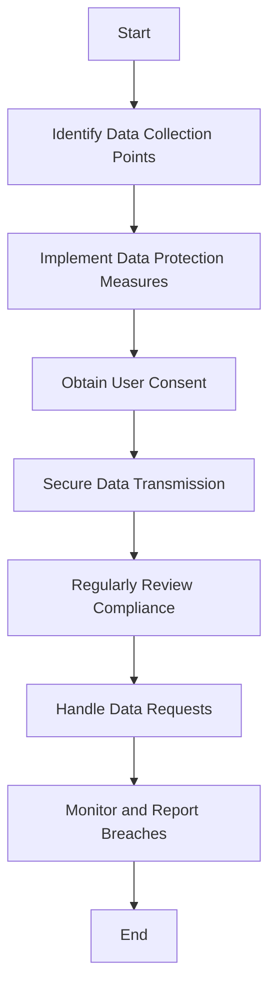

## 14.15 Compliance Standards and JavaScript

In today's digital landscape, compliance with data protection and privacy standards is crucial for any web application. JavaScript, being a dominant language for web development, plays a significant role in ensuring that applications adhere to these standards. This section delves into key compliance standards such as the General Data Protection Regulation (GDPR) and the Payment Card Industry Data Security Standard (PCI DSS), providing guidelines on how to implement compliant JavaScript code.

### Understanding Key Compliance Standards

Compliance standards are regulations and guidelines that organizations must follow to protect data and ensure privacy. For web applications, two of the most significant standards are GDPR and PCI DSS.

#### General Data Protection Regulation (GDPR)

The GDPR is a comprehensive data protection regulation enacted by the European Union (EU) to protect the privacy of EU citizens. It applies to any organization that processes the personal data of EU residents, regardless of the organization's location. Key requirements include:

- **Data Protection by Design and Default**: Ensure that data protection measures are integrated into the development process.
- **User Consent**: Obtain explicit consent from users before collecting or processing their data.
- **Right to Access and Erasure**: Allow users to access their data and request its deletion.
- **Data Breach Notification**: Notify authorities and affected individuals of data breaches within 72 hours.

#### Payment Card Industry Data Security Standard (PCI DSS)

PCI DSS is a set of security standards designed to ensure that all companies that accept, process, store, or transmit credit card information maintain a secure environment. Key requirements include:

- **Secure Network**: Implement strong access control measures and maintain a secure network.
- **Data Protection**: Protect stored cardholder data and encrypt transmission of cardholder data across open, public networks.
- **Vulnerability Management**: Maintain a vulnerability management program and regularly test security systems.

### Implementing GDPR-Compliant JavaScript Code

To ensure GDPR compliance in JavaScript applications, developers must focus on data protection, user consent, and transparency.

#### Data Protection by Design

Incorporate data protection measures from the outset of the development process. This includes minimizing data collection, using pseudonymization, and implementing robust security measures.

```javascript
// Example: Pseudonymization of user data
function pseudonymizeData(userData) {
    return {
        id: generateUniqueId(),
        data: encryptData(userData)
    };
}

// Encrypt user data before storing
function encryptData(data) {
    // Implement encryption logic here
    return encryptedData;
}
```

#### Obtaining User Consent

Ensure that users provide explicit consent before collecting or processing their data. Use clear and concise language to explain what data is being collected and for what purpose.

```javascript
// Example: Obtaining user consent
function requestUserConsent() {
    const consent = confirm("Do you agree to our data collection policy?");
    if (consent) {
        // Proceed with data collection
    } else {
        // Do not collect data
    }
}
```

#### Providing Access and Erasure Rights

Allow users to access their data and request its deletion. Implement mechanisms to handle these requests efficiently.

```javascript
// Example: Handling data access and erasure requests
function handleDataRequest(userId, action) {
    if (action === 'access') {
        return getUserData(userId);
    } else if (action === 'erase') {
        return deleteUserData(userId);
    }
}

// Fetch user data
function getUserData(userId) {
    // Retrieve user data from database
    return userData;
}

// Delete user data
function deleteUserData(userId) {
    // Remove user data from database
    return success;
}
```

### Implementing PCI DSS-Compliant JavaScript Code

For applications handling payment information, PCI DSS compliance is essential. Focus on secure data handling, encryption, and access control.

#### Secure Data Handling

Ensure that sensitive data, such as credit card information, is handled securely. Avoid storing sensitive data unless absolutely necessary.

```javascript
// Example: Secure handling of credit card information
function processPayment(cardInfo) {
    if (validateCardInfo(cardInfo)) {
        // Encrypt card information before processing
        const encryptedCardInfo = encryptData(cardInfo);
        sendPaymentRequest(encryptedCardInfo);
    } else {
        alert("Invalid card information.");
    }
}

// Validate card information
function validateCardInfo(cardInfo) {
    // Implement validation logic here
    return isValid;
}
```

#### Encryption and Secure Transmission

Encrypt sensitive data and ensure secure transmission over networks. Use HTTPS and other secure protocols.

```javascript
// Example: Encrypting and transmitting data securely
function sendPaymentRequest(encryptedCardInfo) {
    fetch('https://secure-payment-gateway.com/api/pay', {
        method: 'POST',
        headers: {
            'Content-Type': 'application/json',
            'Authorization': 'Bearer ' + getAuthToken()
        },
        body: JSON.stringify({ cardInfo: encryptedCardInfo })
    })
    .then(response => response.json())
    .then(data => {
        console.log('Payment successful:', data);
    })
    .catch(error => {
        console.error('Payment error:', error);
    });
}
```

### Importance of Data Handling Policies and User Consent

Data handling policies and user consent are critical components of compliance. They ensure transparency, build trust with users, and protect organizations from legal repercussions.

- **Data Handling Policies**: Clearly define how data is collected, used, and protected. Regularly review and update these policies to reflect changes in regulations and technology.
- **User Consent**: Obtain and document user consent for data collection and processing. Provide users with clear information about their rights and how to exercise them.

### Consequences of Non-Compliance

Non-compliance with GDPR and PCI DSS can result in severe consequences, including:

- **Fines and Penalties**: Organizations can face substantial fines for non-compliance. GDPR fines can reach up to €20 million or 4% of annual global turnover, whichever is higher.
- **Reputation Damage**: Data breaches and non-compliance can damage an organization's reputation, leading to loss of customer trust and business.
- **Legal Action**: Non-compliance can result in legal action from regulatory authorities and affected individuals.

### Visualizing Compliance Workflow

Below is a diagram illustrating the workflow for ensuring compliance with GDPR and PCI DSS in a JavaScript application.



**Diagram Description**: This flowchart outlines the steps involved in ensuring compliance with GDPR and PCI DSS, from identifying data collection points to monitoring and reporting breaches.

### Try It Yourself

Experiment with the code examples provided in this section. Try modifying the pseudonymization function to use a different encryption algorithm, or implement additional validation checks for credit card information. These exercises will help reinforce your understanding of compliance standards and how to implement them in JavaScript applications.

### Knowledge Check

To reinforce your understanding of compliance standards and their implementation in JavaScript, try answering the following questions.

## Compliance Standards and JavaScript Quiz



### What is the primary purpose of GDPR?

- [x] To protect the privacy of EU citizens
- [ ] To regulate financial transactions
- [ ] To standardize software development practices
- [ ] To enforce copyright laws

> **Explanation:** GDPR is designed to protect the privacy and personal data of EU citizens.

### Which of the following is a requirement of PCI DSS?

- [x] Encrypt transmission of cardholder data
- [ ] Obtain user consent for data collection
- [ ] Provide access to personal data
- [ ] Implement copyright protection

> **Explanation:** PCI DSS requires encryption of cardholder data during transmission.

### What is pseudonymization?

- [x] A data protection technique that replaces sensitive data with pseudonyms
- [ ] A method for encrypting data
- [ ] A process for obtaining user consent
- [ ] A technique for validating credit card information

> **Explanation:** Pseudonymization involves replacing sensitive data with pseudonyms to protect privacy.

### How soon must data breaches be reported under GDPR?

- [x] Within 72 hours
- [ ] Within 24 hours
- [ ] Within one week
- [ ] Within one month

> **Explanation:** GDPR requires data breaches to be reported within 72 hours.

### Which of the following is a consequence of non-compliance with GDPR?

- [x] Fines up to €20 million or 4% of annual global turnover
- [ ] Mandatory software updates
- [ ] Loss of copyright protection
- [ ] Increased tax rates

> **Explanation:** Non-compliance with GDPR can result in significant fines.

### What is the role of user consent in GDPR compliance?

- [x] To ensure users agree to data collection and processing
- [ ] To validate credit card information
- [ ] To encrypt sensitive data
- [ ] To monitor network traffic

> **Explanation:** User consent is crucial for GDPR compliance as it ensures users agree to data collection and processing.

### Which protocol is recommended for secure data transmission?

- [x] HTTPS
- [ ] HTTP
- [ ] FTP
- [ ] SMTP

> **Explanation:** HTTPS is recommended for secure data transmission.

### What is the purpose of data handling policies?

- [x] To define how data is collected, used, and protected
- [ ] To encrypt data
- [ ] To validate user input
- [ ] To monitor network traffic

> **Explanation:** Data handling policies define how data is collected, used, and protected.

### What is a key requirement for handling payment information under PCI DSS?

- [x] Secure storage and encryption of cardholder data
- [ ] User consent for data collection
- [ ] Access to personal data
- [ ] Implementation of copyright protection

> **Explanation:** PCI DSS requires secure storage and encryption of cardholder data.

### True or False: Non-compliance with PCI DSS can result in legal action.

- [x] True
- [ ] False

> **Explanation:** Non-compliance with PCI DSS can lead to legal action from regulatory authorities and affected individuals.



### Embrace the Journey

Remember, compliance is not just about avoiding penalties; it's about building trust with your users and ensuring their data is protected. As you continue to develop JavaScript applications, keep these compliance standards in mind and strive to create secure, user-friendly experiences. Stay curious, keep learning, and enjoy the journey of mastering JavaScript design patterns and best practices!
