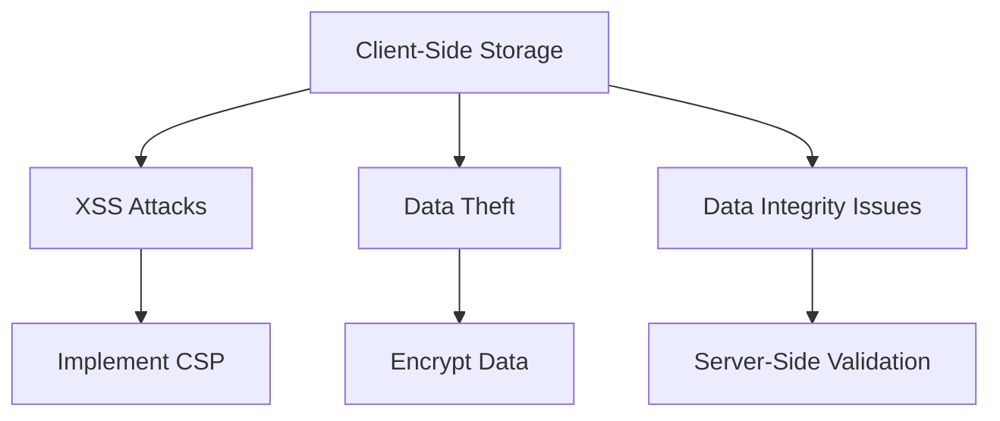

## 14.16 Secure Storage in Web Applications

In the realm of web development, secure storage of data is paramount. As developers, we must ensure that sensitive information is stored in a way that minimizes the risk of unauthorized access or data breaches. This section delves into the various client-side storage mechanisms available in web applications, their security considerations, and best practices for storing sensitive data securely.

### Understanding Client-Side Storage Options

Before we dive into the security aspects, let's explore the different client-side storage options available in web applications:

#### Cookies

Cookies are small pieces of data stored on the user's computer by the web browser. They are primarily used for session management, personalization, and tracking.

- **Security Considerations**: 
  - Cookies can be vulnerable to cross-site scripting (XSS) attacks if not properly secured.
  - Use the `HttpOnly` flag to prevent client-side scripts from accessing cookies.
  - The `Secure` flag ensures cookies are only sent over HTTPS connections.
  - Set the `SameSite` attribute to prevent cross-site request forgery (CSRF) attacks.

#### LocalStorage

LocalStorage is a web storage API that allows you to store data persistently in the browser. It is accessible via JavaScript and has no expiration time.

- **Security Considerations**:
  - Data stored in LocalStorage is accessible to any script running on the same domain, making it susceptible to XSS attacks.
  - Avoid storing sensitive information such as passwords or personal data.
  - Implement Content Security Policy (CSP) to mitigate XSS risks.

#### SessionStorage

SessionStorage is similar to LocalStorage but is limited to the duration of the page session. Data is cleared when the page session ends.

- **Security Considerations**:
  - Like LocalStorage, SessionStorage is vulnerable to XSS attacks.
  - Use it for temporary data that does not require long-term storage.

#### IndexedDB

IndexedDB is a low-level API for storing large amounts of structured data, including files and blobs. It is more complex but offers more capabilities than LocalStorage and SessionStorage.

- **Security Considerations**:
  - IndexedDB is also vulnerable to XSS attacks.
  - Use it for storing non-sensitive data that requires complex querying.

### Guidelines for Storing Sensitive Data Securely

When it comes to storing sensitive data, client-side storage should be approached with caution. Here are some guidelines to follow:

1. **Minimize Client-Side Storage**: Store only non-sensitive data on the client-side. Sensitive data should be stored on the server with secure access methods.

2. **Encrypt Data**: If you must store sensitive data on the client-side, ensure it is encrypted using strong encryption algorithms.

3. **Use Secure Cookies**: For session management, use secure cookies with the `HttpOnly`, `Secure`, and `SameSite` attributes set.

4. **Implement CSP**: Content Security Policy (CSP) helps prevent XSS attacks by restricting the sources from which scripts can be loaded.

5. **Regularly Clear Storage**: Implement mechanisms to clear client-side storage regularly to minimize the risk of data exposure.

### Risks of Client-Side Storage and Mitigation Strategies

Client-side storage comes with inherent risks, primarily due to its exposure to client-side scripts. Here are some common risks and how to mitigate them:

- **XSS Attacks**: Malicious scripts can access client-side storage. Mitigate this by implementing CSP, sanitizing user input, and using secure cookies.

- **Data Theft**: If a user's device is compromised, stored data can be accessed. Minimize data storage and encrypt sensitive information.

- **Data Integrity**: Client-side data can be tampered with. Use server-side validation to ensure data integrity.

### Secure Alternatives: Server-Side Storage

For sensitive data, server-side storage is a more secure alternative. Here are some best practices for server-side storage:

- **Use Secure Protocols**: Ensure data is transmitted over secure protocols such as HTTPS.

- **Implement Authentication and Authorization**: Use robust authentication and authorization mechanisms to control access to data.

- **Encrypt Data at Rest**: Store data in encrypted form on the server to protect it from unauthorized access.

- **Regular Security Audits**: Conduct regular security audits to identify and address vulnerabilities.

### Code Examples

Let's look at some code examples to illustrate secure storage practices.

#### Setting Secure Cookies

```javascript
// Setting a secure cookie
document.cookie = "sessionId=abc123; Secure; HttpOnly; SameSite=Strict";
```

#### Encrypting Data for LocalStorage

```javascript
// Encrypting data before storing in LocalStorage
function encryptData(data, key) {
    // Implement encryption logic here
    return encryptedData;
}

const sensitiveData = "userPassword";
const encryptedData = encryptData(sensitiveData, "encryptionKey");
localStorage.setItem("encryptedData", encryptedData);
```

#### Implementing CSP

```html
<!-- Setting Content Security Policy -->
<meta http-equiv="Content-Security-Policy" content="default-src 'self'; script-src 'self'">
```

### Visualizing Client-Side Storage Risks

Below is a diagram illustrating the risks associated with client-side storage and how to mitigate them.



### Knowledge Check

- **What are the main security considerations when using cookies for storage?**
- **How can you mitigate XSS attacks when using LocalStorage?**
- **Why is it important to encrypt data stored on the client-side?**

### Summary

In this section, we've explored the various client-side storage mechanisms available in web applications, their security considerations, and best practices for storing sensitive data securely. Remember, the key to secure storage is minimizing client-side storage of sensitive data, encrypting data when necessary, and implementing robust security measures such as CSP and secure cookies. As you continue your journey in web development, keep these principles in mind to ensure the security of your applications.

## Quiz: Secure Storage in Web Applications



### What is a primary security risk associated with using cookies for storage?

- [x] Vulnerability to XSS attacks
- [ ] Limited storage capacity
- [ ] Lack of persistence
- [ ] Complexity of implementation

> **Explanation:** Cookies can be vulnerable to XSS attacks if not properly secured with attributes like `HttpOnly` and `Secure`.

### Which client-side storage mechanism is best suited for storing large amounts of structured data?

- [ ] Cookies
- [ ] LocalStorage
- [ ] SessionStorage
- [x] IndexedDB

> **Explanation:** IndexedDB is designed for storing large amounts of structured data and offers more capabilities than LocalStorage and SessionStorage.

### What attribute should be set on cookies to prevent them from being accessed by client-side scripts?

- [ ] Secure
- [x] HttpOnly
- [ ] SameSite
- [ ] Path

> **Explanation:** The `HttpOnly` attribute prevents cookies from being accessed by client-side scripts, mitigating XSS risks.

### How can you mitigate XSS attacks when using LocalStorage?

- [x] Implement Content Security Policy (CSP)
- [ ] Use SessionStorage instead
- [ ] Store data in cookies
- [ ] Increase storage capacity

> **Explanation:** Implementing CSP helps prevent XSS attacks by restricting the sources from which scripts can be loaded.

### Why is it important to encrypt data stored on the client-side?

- [x] To protect sensitive information from unauthorized access
- [ ] To increase storage capacity
- [ ] To improve data retrieval speed
- [ ] To comply with all web standards

> **Explanation:** Encrypting data stored on the client-side protects sensitive information from unauthorized access, especially if the device is compromised.

### What is a secure alternative to client-side storage for sensitive data?

- [x] Server-side storage with secure access methods
- [ ] Using larger cookies
- [ ] Storing data in multiple locations
- [ ] Increasing LocalStorage capacity

> **Explanation:** Server-side storage with secure access methods is a more secure alternative for storing sensitive data.

### Which of the following is a guideline for storing sensitive data securely?

- [x] Minimize client-side storage
- [ ] Store all data in cookies
- [ ] Use only LocalStorage
- [ ] Avoid encryption

> **Explanation:** Minimizing client-side storage of sensitive data reduces the risk of unauthorized access and data breaches.

### What is the purpose of the `SameSite` attribute in cookies?

- [x] To prevent cross-site request forgery (CSRF) attacks
- [ ] To increase storage capacity
- [ ] To encrypt cookie data
- [ ] To allow access from any domain

> **Explanation:** The `SameSite` attribute helps prevent CSRF attacks by restricting how cookies are sent with cross-site requests.

### Which storage mechanism is cleared when the page session ends?

- [ ] LocalStorage
- [x] SessionStorage
- [ ] IndexedDB
- [ ] Cookies

> **Explanation:** SessionStorage is limited to the duration of the page session and is cleared when the session ends.

### True or False: Data stored in LocalStorage is automatically encrypted.

- [ ] True
- [x] False

> **Explanation:** Data stored in LocalStorage is not automatically encrypted and is accessible to any script running on the same domain.



Remember, this is just the beginning. As you progress, you'll build more secure and robust web applications. Keep experimenting, stay curious, and enjoy the journey!
