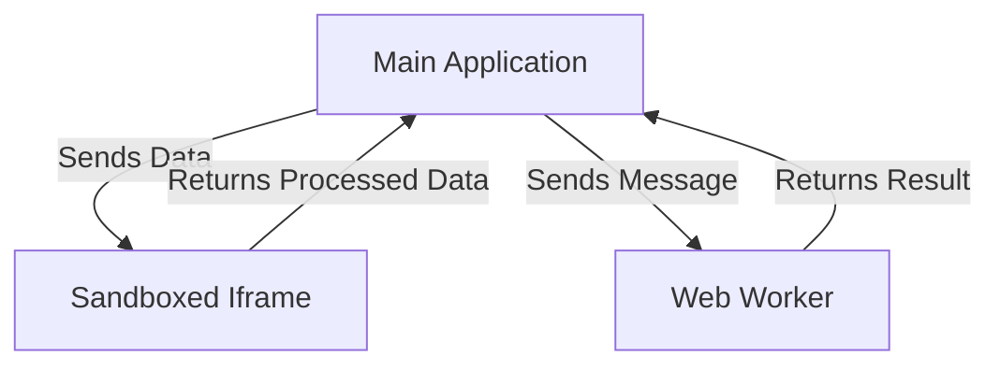

## 14.17 Sandboxing and Isolation Patterns

In the ever-evolving landscape of web development, security remains a paramount concern. One of the critical strategies to enhance security is through sandboxing and isolation patterns. These techniques are essential for preventing untrusted code from affecting the rest of your application. In this section, we will explore what sandboxing is, why it's important, and how to implement it effectively in JavaScript applications.

### What is Sandboxing?

Sandboxing is a security mechanism used to run code in a restricted environment. This environment, or "sandbox," limits the code's access to the rest of the system, thereby preventing potentially harmful operations. Sandboxing is crucial in scenarios where you need to execute untrusted code, such as third-party scripts or user-generated content.

#### Importance of Sandboxing

- **Security**: By isolating code execution, sandboxing prevents malicious code from accessing sensitive data or performing unauthorized actions.
- **Stability**: It ensures that errors or crashes in the sandboxed code do not affect the main application.
- **Control**: Developers can specify what resources and capabilities are available to the sandboxed code.

### Using Iframes and the `sandbox` Attribute

Iframes are one of the most common methods for sandboxing in web applications. By embedding content in an iframe, you can isolate it from the main document. The `sandbox` attribute of an iframe provides additional security by restricting the capabilities of the content within.

#### Example: Iframe with Sandbox Attribute

```html
<iframe src="https://example.com" sandbox="allow-scripts allow-same-origin"></iframe>
```

In this example, the `sandbox` attribute restricts the iframe's content by default. The `allow-scripts` and `allow-same-origin` tokens are used to selectively enable scripts and same-origin access.

#### Key Tokens for the `sandbox` Attribute

- **`allow-scripts`**: Enables JavaScript execution within the iframe.
- **`allow-same-origin`**: Allows the iframe content to be treated as being from the same origin.
- **`allow-forms`**: Permits form submissions.
- **`allow-popups`**: Allows popups to be opened by the iframe content.

### Running Code in Isolated Contexts with Web Workers

Web Workers provide a way to run JavaScript in the background, separate from the main execution thread. This not only improves performance by offloading tasks but also offers a degree of isolation for executing code.

#### Example: Using Web Workers

```javascript
// main.js
const worker = new Worker('worker.js');

worker.onmessage = function(event) {
  console.log('Message from worker:', event.data);
};

worker.postMessage('Hello, worker!');
```

```javascript
// worker.js
onmessage = function(event) {
  console.log('Message from main script:', event.data);
  postMessage('Hello, main script!');
};
```

In this example, `worker.js` runs in a separate thread, allowing it to perform tasks without interfering with the main script's execution.

### Libraries for Sandboxing in Node.js

For server-side JavaScript, libraries like [VM2](https://github.com/patriksimek/vm2) offer robust sandboxing capabilities. VM2 allows you to run untrusted code with limited access to the host environment.

#### Example: Using VM2

```javascript
const { VM } = require('vm2');

const vm = new VM({
  timeout: 1000,
  sandbox: { x: 2 }
});

const result = vm.run('x + 2');
console.log(result); // Outputs: 4
```

In this example, VM2 creates a virtual machine with a sandboxed environment where the code can execute safely.

### Best Practices for Securely Handling Untrusted Code

1. **Limit Capabilities**: Always restrict the capabilities of sandboxed code to the minimum necessary for its function.
2. **Validate Inputs**: Ensure that any data entering the sandbox is validated and sanitized.
3. **Monitor Performance**: Use timeouts and resource limits to prevent denial-of-service attacks.
4. **Regular Updates**: Keep your sandboxing libraries and tools up to date to protect against known vulnerabilities.
5. **Audit and Test**: Regularly audit your sandboxing implementation and test for potential security flaws.

### Visualizing Sandboxing and Isolation

To better understand how sandboxing and isolation work, let's visualize the interaction between the main application and sandboxed environments.



**Caption**: This diagram illustrates how the main application interacts with sandboxed environments like iframes and web workers, ensuring that untrusted code runs in isolation.

### Knowledge Check

- **What is the primary purpose of sandboxing in web development?**
- **How does the `sandbox` attribute enhance the security of iframes?**
- **What are the benefits of using Web Workers for code isolation?**
- **Name a library that provides sandboxing capabilities in Node.js.**

### Try It Yourself

Experiment with the examples provided by modifying the sandbox attributes in the iframe or changing the messages exchanged between the main script and the web worker. Observe how these changes affect the behavior and security of the application.

### Conclusion

Sandboxing and isolation patterns are vital tools in the JavaScript developer's arsenal for building secure and robust applications. By understanding and implementing these techniques, you can protect your applications from untrusted code and enhance their overall security.

Remember, this is just the beginning. As you progress, you'll build more complex and interactive web applications. Keep experimenting, stay curious, and enjoy the journey!

## Quiz: Mastering Sandboxing and Isolation Patterns in JavaScript



### What is the primary purpose of sandboxing in web development?

- [x] To run code in a restricted environment
- [ ] To enhance performance
- [ ] To improve user interface
- [ ] To increase code readability

> **Explanation:** Sandboxing is primarily used to run code in a restricted environment to prevent untrusted code from affecting the rest of the application.

### Which attribute is used to enhance the security of iframes?

- [x] `sandbox`
- [ ] `src`
- [ ] `allow`
- [ ] `frameborder`

> **Explanation:** The `sandbox` attribute is used to enhance the security of iframes by restricting the capabilities of the content within.

### What is a benefit of using Web Workers?

- [x] Running JavaScript in the background
- [ ] Improving CSS styling
- [ ] Enhancing HTML structure
- [ ] Increasing image resolution

> **Explanation:** Web Workers allow JavaScript to run in the background, separate from the main execution thread, which helps in isolating code and improving performance.

### Which library provides sandboxing capabilities in Node.js?

- [x] VM2
- [ ] Express
- [ ] Lodash
- [ ] React

> **Explanation:** VM2 is a library that provides sandboxing capabilities in Node.js, allowing untrusted code to run with limited access to the host environment.

### What is a key practice when handling untrusted code?

- [x] Limit capabilities
- [ ] Increase privileges
- [ ] Allow unrestricted access
- [ ] Disable security features

> **Explanation:** Limiting capabilities is a key practice when handling untrusted code to ensure it cannot perform unauthorized actions.

### How can you prevent denial-of-service attacks in sandboxed environments?

- [x] Use timeouts and resource limits
- [ ] Allow unlimited execution time
- [ ] Increase memory allocation
- [ ] Disable monitoring

> **Explanation:** Using timeouts and resource limits can prevent denial-of-service attacks by ensuring that sandboxed code does not consume excessive resources.

### What should be done to data entering a sandbox?

- [x] Validate and sanitize
- [ ] Encrypt
- [ ] Compress
- [ ] Ignore

> **Explanation:** Data entering a sandbox should be validated and sanitized to prevent malicious input from affecting the sandboxed environment.

### What is a common method for sandboxing in web applications?

- [x] Iframes
- [ ] CSS styles
- [ ] HTML tables
- [ ] JavaScript alerts

> **Explanation:** Iframes are a common method for sandboxing in web applications, allowing content to be embedded and isolated from the main document.

### What is the role of the `allow-scripts` token in the `sandbox` attribute?

- [x] Enables JavaScript execution within the iframe
- [ ] Disables JavaScript execution
- [ ] Allows form submissions
- [ ] Permits popups

> **Explanation:** The `allow-scripts` token in the `sandbox` attribute enables JavaScript execution within the iframe, allowing scripts to run.

### True or False: Sandboxing can help improve application stability.

- [x] True
- [ ] False

> **Explanation:** True. Sandboxing can help improve application stability by ensuring that errors or crashes in the sandboxed code do not affect the main application.


