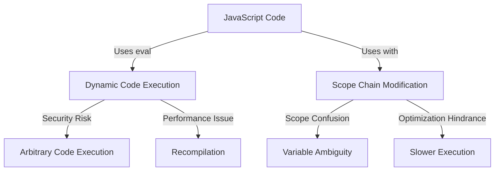

## 14.18 Avoiding `eval` and `with` Statements

JavaScript, as a versatile and dynamic language, offers various features that can be both powerful and perilous. Among these are the `eval` and `with` statements. While they might seem convenient for executing dynamic code or simplifying object property access, they introduce significant security and performance risks. In this section, we will delve into the dangers associated with `eval` and `with`, explore safer alternatives, and provide guidance on refactoring code to avoid these constructs.

### Understanding the Risks of `eval`

The `eval` function in JavaScript takes a string as an argument and executes it as code. While this might sound useful for dynamic code execution, it poses several risks:

#### Execution of Arbitrary Code

Using `eval` can lead to the execution of arbitrary code, which is a significant security vulnerability. If user input is passed to `eval`, it can be exploited to run malicious scripts. This is particularly dangerous in web applications where user input is common.

```javascript
// Dangerous use of eval
const userInput = "alert('Hacked!')";
eval(userInput); // Executes the alert function
```

#### Performance Issues

`eval` can degrade performance because it forces the JavaScript engine to recompile the code at runtime, bypassing many optimizations that are possible with static code analysis. This can lead to slower execution times and increased resource consumption.

### Problems with `with` Statements

The `with` statement extends the scope chain for a statement, allowing for shorter syntax when accessing object properties. However, it introduces several issues:

#### Scope Confusion

The `with` statement can create scope confusion, making it difficult to determine which variables are being accessed or modified. This can lead to bugs that are hard to track down and fix.

```javascript
const obj = { a: 1, b: 2 };

with (obj) {
  console.log(a); // Is 'a' from obj or a global variable?
}
```

#### Difficulties in Code Optimization

Because `with` changes the scope chain, it hinders the JavaScript engine's ability to optimize code. This can result in slower execution and increased complexity in debugging.

### Refactoring Code to Avoid `eval` and `with`

To enhance security and performance, it's crucial to refactor code to avoid using `eval` and `with`. Let's explore some strategies for achieving this.

#### Replacing `eval` with Safer Alternatives

Instead of using `eval`, consider using safer alternatives such as:

- **Function Constructors**: For creating functions dynamically, use the `Function` constructor instead of `eval`.

```javascript
// Using Function constructor instead of eval
const add = new Function('a', 'b', 'return a + b');
console.log(add(2, 3)); // Outputs: 5
```

- **JSON Parsing**: For parsing JSON data, use `JSON.parse` instead of `eval`.

```javascript
// Safe JSON parsing
const jsonString = '{"name": "John", "age": 30}';
const user = JSON.parse(jsonString);
console.log(user.name); // Outputs: John
```

- **Template Literals**: For constructing strings dynamically, use template literals.

```javascript
// Using template literals
const name = "Alice";
const greeting = `Hello, ${name}!`;
console.log(greeting); // Outputs: Hello, Alice!
```

#### Eliminating `with` Statements

To avoid `with`, explicitly reference object properties. This not only clarifies the code but also improves performance.

```javascript
// Avoiding with statement
const obj = { a: 1, b: 2 };

// Instead of using 'with'
console.log(obj.a);
console.log(obj.b);
```

### Encouraging the Use of Linters

Linters are tools that analyze code for potential errors and enforce coding standards. They can be configured to detect and prevent the use of `eval` and `with`. Popular linters like ESLint offer rules that can be enabled to flag these constructs.

```json
// ESLint configuration to disallow eval and with
{
  "rules": {
    "no-eval": "error",
    "no-with": "error"
  }
}
```

### Visualizing the Impact of `eval` and `with`

To better understand the impact of `eval` and `with`, let's visualize how they interact with the JavaScript execution environment.



**Caption**: This diagram illustrates how `eval` leads to security risks and performance issues, while `with` causes scope confusion and optimization challenges.

### Knowledge Check

To reinforce your understanding, consider the following questions:

- Why is `eval` considered a security risk?
- What are the performance implications of using `eval`?
- How does the `with` statement affect scope?
- What are some safer alternatives to `eval`?
- How can linters help in avoiding `eval` and `with`?

### Embrace the Journey

Remember, avoiding `eval` and `with` is just one step towards writing secure and efficient JavaScript code. As you continue to refine your skills, you'll discover more best practices and patterns that enhance your development process. Keep experimenting, stay curious, and enjoy the journey!

### Quiz: Mastering the Avoidance of `eval` and `with` in JavaScript



### Why is `eval` considered a security risk?

- [x] It allows execution of arbitrary code
- [ ] It improves performance
- [ ] It simplifies code
- [ ] It enhances readability

> **Explanation:** `eval` can execute arbitrary code, which poses a significant security risk, especially if user input is involved.

### What is a safer alternative to `eval` for parsing JSON?

- [x] JSON.parse
- [ ] JSON.stringify
- [ ] String.split
- [ ] Array.join

> **Explanation:** `JSON.parse` is a safer alternative to `eval` for parsing JSON strings into JavaScript objects.

### How does the `with` statement affect code optimization?

- [x] It hinders optimization
- [ ] It enhances optimization
- [ ] It has no effect
- [ ] It simplifies optimization

> **Explanation:** The `with` statement hinders optimization by altering the scope chain, making it difficult for the JavaScript engine to optimize code.

### What is a common problem caused by the `with` statement?

- [x] Scope confusion
- [ ] Improved readability
- [ ] Faster execution
- [ ] Enhanced security

> **Explanation:** The `with` statement can cause scope confusion, making it unclear which variables are being accessed or modified.

### Which linter rule can help prevent the use of `eval`?

- [x] no-eval
- [ ] no-console
- [ ] no-debugger
- [ ] no-alert

> **Explanation:** The `no-eval` rule in linters like ESLint can help prevent the use of `eval` in code.

### What is a performance issue associated with `eval`?

- [x] Recompilation of code
- [ ] Faster execution
- [ ] Reduced memory usage
- [ ] Improved readability

> **Explanation:** `eval` can lead to performance issues by forcing the JavaScript engine to recompile code at runtime.

### How can you avoid using the `with` statement?

- [x] Explicitly reference object properties
- [ ] Use `eval` instead
- [ ] Use `console.log`
- [ ] Use `alert`

> **Explanation:** Explicitly referencing object properties avoids the scope confusion caused by the `with` statement.

### What is a key benefit of using linters?

- [x] Detecting potential errors
- [ ] Slowing down development
- [ ] Increasing code size
- [ ] Reducing code readability

> **Explanation:** Linters help detect potential errors and enforce coding standards, improving code quality.

### Which of the following is a safer alternative to `eval` for dynamic function creation?

- [x] Function constructor
- [ ] String concatenation
- [ ] Array.map
- [ ] Object.assign

> **Explanation:** The `Function` constructor is a safer alternative to `eval` for creating functions dynamically.

### True or False: The `with` statement simplifies code optimization.

- [ ] True
- [x] False

> **Explanation:** False. The `with` statement complicates code optimization by altering the scope chain.



By understanding and avoiding the pitfalls of `eval` and `with`, you can write more secure, efficient, and maintainable JavaScript code. Keep these best practices in mind as you continue your journey in mastering JavaScript design patterns.
