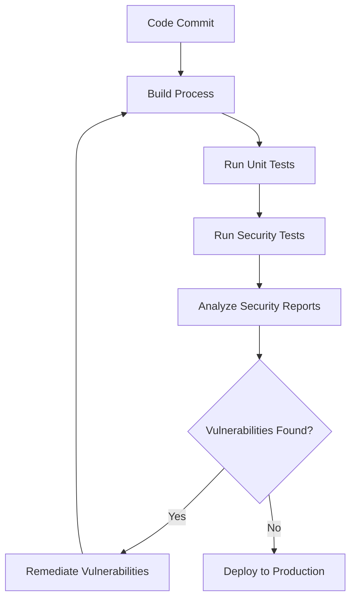

## 14.19 Automated Security Testing Tools

In the rapidly evolving landscape of web development, security remains a paramount concern. As developers, we must ensure that our applications are not only functional and performant but also secure against potential threats. Automated security testing tools play a crucial role in achieving this goal by integrating security assessments into the development lifecycle. In this section, we will explore some of the most effective automated security testing tools, including OWASP ZAP, Gauntlt, and Netsparker, and demonstrate how to incorporate them into Continuous Integration/Continuous Deployment (CI/CD) pipelines.

### Understanding Automated Security Testing

Automated security testing involves using tools to identify vulnerabilities and security flaws in applications without manual intervention. These tools can simulate attacks, scan for known vulnerabilities, and provide insights into potential security weaknesses. By integrating automated security testing into the development process, teams can detect and address security issues early, reducing the risk of breaches and ensuring compliance with security standards.

### Key Automated Security Testing Tools

#### OWASP ZAP

[OWASP ZAP (Zed Attack Proxy)](https://owasp.org/www-project-zap/) is an open-source security tool widely used for finding vulnerabilities in web applications. It is maintained by the Open Web Application Security Project (OWASP) and is known for its ease of use and comprehensive feature set.

- **Features**:
  - Active and passive scanning for vulnerabilities.
  - Support for a wide range of security testing plugins.
  - Automated and manual testing capabilities.
  - Integration with CI/CD pipelines.

- **Integration with CI/CD**:
  To integrate OWASP ZAP into a CI/CD pipeline, you can use its command-line interface to run security scans as part of your build process. Here's a basic example of how to set up OWASP ZAP in a CI/CD pipeline using a shell script:

  ```bash
  # Start ZAP in daemon mode
  zap.sh -daemon -port 8080 -config api.disablekey=true

  # Wait for ZAP to start
  sleep 10

  # Run a scan against the target application
  zap-cli quick-scan http://your-application-url

  # Generate a report
  zap-cli report -o zap-report.html -f html
  ```

  This script starts ZAP in daemon mode, performs a quick scan on the target application, and generates an HTML report of the findings.

#### Gauntlt

[Gauntlt](https://github.com/gauntlt/gauntlt) is a security testing tool that allows developers to create and run security tests using a simple, human-readable syntax. It is designed to be integrated into the development process, enabling teams to test security as part of their regular workflow.

- **Features**:
  - Supports a variety of attack tools, including OWASP ZAP, nmap, and sqlmap.
  - Uses Gherkin syntax for writing security tests.
  - Easily integrates with CI/CD pipelines.

- **Integration with CI/CD**:
  Gauntlt can be integrated into CI/CD pipelines by writing security tests in Gherkin syntax and executing them as part of the build process. Here's an example of a simple Gauntlt test:

  ```gherkin
  Feature: Security testing with Gauntlt

    Scenario: Run a basic security scan
      Given "zap" is installed
      When I launch a "zap" attack with:
        """
        -t http://your-application-url
        """
      Then the output should contain:
        """
        No vulnerabilities found
        """
  ```

  This test uses Gauntlt to run a ZAP attack against the target application and checks for the absence of vulnerabilities in the output.

#### Netsparker

[Netsparker](https://www.netsparker.com/) is a commercial web application security scanner known for its accuracy and ease of use. It can automatically identify vulnerabilities such as SQL Injection, Cross-Site Scripting (XSS), and more.

- **Features**:
  - Automated scanning with proof-based scanning technology.
  - Integration with popular CI/CD tools like Jenkins, GitLab, and Azure DevOps.
  - Detailed vulnerability reports with remediation advice.

- **Integration with CI/CD**:
  Netsparker can be integrated into CI/CD pipelines using its API or plugins for popular CI/CD tools. Here's an example of how to trigger a Netsparker scan using its API:

  ```python
  import requests

  api_url = "https://www.netsparkercloud.com/api/1.0/scans/new"
  headers = {
      "Content-Type": "application/json",
      "Authorization": "Bearer YOUR_API_TOKEN"
  }
  data = {
      "Target": {
          "Url": "http://your-application-url"
      },
      "ScanType": "Full"
  }

  response = requests.post(api_url, headers=headers, json=data)
  print(response.json())
  ```

  This script sends a request to the Netsparker API to initiate a full scan of the target application.

### Benefits of Continuous Security Assessment

Integrating automated security testing tools into CI/CD pipelines offers several benefits:

- **Early Detection of Vulnerabilities**: By running security tests as part of the build process, teams can identify and address vulnerabilities before they reach production.
- **Improved Security Posture**: Continuous security assessment helps maintain a strong security posture by regularly testing applications for vulnerabilities.
- **Reduced Risk of Breaches**: Automated security testing reduces the risk of security breaches by ensuring that vulnerabilities are detected and remediated promptly.
- **Compliance with Security Standards**: Regular security testing helps organizations comply with industry security standards and regulations.

### Setting Up Automated Security Tests

To set up automated security tests, follow these steps:

1. **Select the Appropriate Tools**: Choose security testing tools that align with your application's requirements and your team's expertise.

2. **Integrate with CI/CD Pipelines**: Use the tools' APIs or command-line interfaces to integrate them into your CI/CD pipelines. This ensures that security tests are run automatically during the build process.

3. **Write Security Tests**: Create security tests using the tools' supported syntax or interfaces. Focus on testing for common vulnerabilities such as SQL Injection, XSS, and CSRF.

4. **Review and Analyze Results**: Regularly review the results of security tests and analyze any identified vulnerabilities. Prioritize remediation based on the severity of the vulnerabilities.

5. **Iterate and Improve**: Continuously improve your security testing process by updating tests, refining configurations, and incorporating feedback from security assessments.

### Visualizing the Integration of Security Testing Tools in CI/CD Pipelines

To better understand how automated security testing tools fit into the CI/CD pipeline, let's visualize the process using a flowchart.



**Diagram Description**: This flowchart illustrates the integration of security testing tools in a CI/CD pipeline. After code is committed, the build process is initiated, followed by unit tests and security tests. If vulnerabilities are found, they are remediated before the application is deployed to production.

### Try It Yourself

To get hands-on experience with automated security testing, try setting up a simple CI/CD pipeline using one of the tools discussed. Experiment with different configurations and test scenarios to understand how these tools can enhance your application's security.

### Knowledge Check

- What are the benefits of integrating automated security testing tools into CI/CD pipelines?
- How does OWASP ZAP differ from Netsparker in terms of features and capabilities?
- Describe a scenario where Gauntlt would be particularly useful for security testing.

### Conclusion

Automated security testing tools are essential for maintaining the security and integrity of web applications. By integrating tools like OWASP ZAP, Gauntlt, and Netsparker into CI/CD pipelines, developers can ensure continuous security assessment and reduce the risk of vulnerabilities reaching production. Remember, security is an ongoing process, and regular testing is key to staying ahead of potential threats. Keep experimenting, stay vigilant, and embrace the journey of building secure applications.

## Quiz: Mastering Automated Security Testing Tools



### What is the primary purpose of automated security testing tools?

- [x] To identify vulnerabilities and security flaws in applications without manual intervention.
- [ ] To replace manual testing entirely.
- [ ] To improve application performance.
- [ ] To automate code deployment.

> **Explanation:** Automated security testing tools are designed to identify vulnerabilities and security flaws in applications without manual intervention, enhancing the security assessment process.

### Which tool is known for using Gherkin syntax for writing security tests?

- [ ] OWASP ZAP
- [x] Gauntlt
- [ ] Netsparker
- [ ] Selenium

> **Explanation:** Gauntlt uses Gherkin syntax for writing security tests, making it easy to integrate security testing into the development workflow.

### How can OWASP ZAP be integrated into a CI/CD pipeline?

- [x] By using its command-line interface to run security scans as part of the build process.
- [ ] By manually triggering scans after deployment.
- [ ] By using a graphical user interface during development.
- [ ] By integrating with a database.

> **Explanation:** OWASP ZAP can be integrated into a CI/CD pipeline by using its command-line interface to run security scans as part of the build process.

### What is a key feature of Netsparker?

- [ ] It is an open-source tool.
- [x] It uses proof-based scanning technology.
- [ ] It only supports manual testing.
- [ ] It is primarily used for performance testing.

> **Explanation:** Netsparker is known for its proof-based scanning technology, which provides accurate vulnerability detection and detailed reports.

### What is the benefit of continuous security assessment?

- [x] Early detection of vulnerabilities
- [x] Improved security posture
- [ ] Increased application size
- [ ] Slower deployment process

> **Explanation:** Continuous security assessment offers benefits such as early detection of vulnerabilities and improved security posture, helping maintain a strong security framework.

### Which tool is maintained by the Open Web Application Security Project?

- [x] OWASP ZAP
- [ ] Gauntlt
- [ ] Netsparker
- [ ] Burp Suite

> **Explanation:** OWASP ZAP is maintained by the Open Web Application Security Project (OWASP), a well-known organization focused on improving software security.

### What is the role of the CI/CD pipeline in security testing?

- [x] To automate the execution of security tests during the build process.
- [ ] To replace manual security assessments.
- [ ] To deploy code to production without testing.
- [ ] To manage application performance.

> **Explanation:** The CI/CD pipeline automates the execution of security tests during the build process, ensuring that vulnerabilities are detected early.

### What is a common vulnerability that automated security testing tools can detect?

- [x] SQL Injection
- [ ] Memory leaks
- [ ] Code formatting issues
- [ ] Network latency

> **Explanation:** Automated security testing tools can detect common vulnerabilities such as SQL Injection, which is a critical security concern for web applications.

### How does Gauntlt enhance security testing?

- [x] By allowing developers to create and run security tests using a simple, human-readable syntax.
- [ ] By providing a graphical interface for manual testing.
- [ ] By focusing solely on performance testing.
- [ ] By integrating with hardware security modules.

> **Explanation:** Gauntlt enhances security testing by allowing developers to create and run security tests using a simple, human-readable syntax, making it accessible and effective.

### True or False: Automated security testing tools can completely replace manual security assessments.

- [ ] True
- [x] False

> **Explanation:** While automated security testing tools are powerful, they cannot completely replace manual security assessments. Manual testing is still necessary for comprehensive security evaluation.


