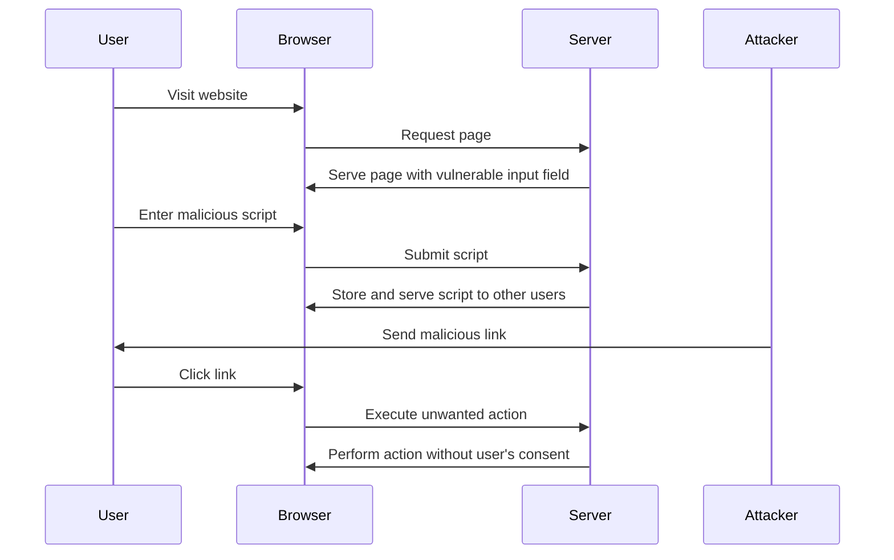

## 14.2 Protecting Against Common Vulnerabilities: XSS and CSRF

In the world of web development, security is paramount. Two of the most common vulnerabilities that developers must guard against are Cross-Site Scripting (XSS) and Cross-Site Request Forgery (CSRF). These vulnerabilities can have severe consequences, including data theft, session hijacking, and unauthorized actions on behalf of users. In this section, we will explore these vulnerabilities in detail, understand how they occur, and learn effective strategies to prevent them.

### Understanding Cross-Site Scripting (XSS)

**Cross-Site Scripting (XSS)** is a security vulnerability that allows attackers to inject malicious scripts into web pages viewed by other users. These scripts can execute in the context of the user's browser, potentially leading to data theft, session hijacking, or defacement of the website.

#### Types of XSS Attacks

1. **Stored XSS**: Malicious scripts are stored on the server and served to users. This can occur in comment sections, user profiles, or any input field that is stored and displayed to other users.

2. **Reflected XSS**: The malicious script is reflected off a web server, such as in an error message or search result, and is executed immediately without being stored.

3. **DOM-Based XSS**: The vulnerability exists in the client-side code rather than the server-side code. The attack is executed by manipulating the DOM environment in the victim's browser.

#### Example of an XSS Attack

Consider a comment section on a blog where users can post comments. If the application does not properly sanitize input, an attacker could post a comment like:

```html
<script>alert('XSS Attack!');</script>
```

When other users view the page, the script executes in their browsers, potentially stealing cookies or other sensitive information.

### Preventing XSS Attacks

To protect against XSS, developers should employ a combination of input validation, output encoding, and security policies.

#### Input Validation and Output Encoding

- **Input Validation**: Ensure that all user inputs are validated and sanitized. Use libraries like DOMPurify to sanitize HTML inputs.

- **Output Encoding**: Encode data before rendering it in the browser. Use functions like `encodeURIComponent()` for URLs and `textContent` for HTML content.

#### Content Security Policy (CSP)

A **Content Security Policy (CSP)** is an HTTP header that allows you to control resources the browser is allowed to load for a given page. By specifying a CSP, you can prevent the execution of unauthorized scripts.

Example of a CSP header:

```http
Content-Security-Policy: default-src 'self'; script-src 'self' https://trusted.cdn.com;
```

This policy allows scripts only from the same origin and a trusted CDN.

### Understanding Cross-Site Request Forgery (CSRF)

**Cross-Site Request Forgery (CSRF)** is an attack that tricks a user into executing unwanted actions on a web application in which they are authenticated. This can lead to unauthorized actions being performed on behalf of the user.

#### Example of a CSRF Attack

Imagine a banking application where users can transfer money. If the application does not protect against CSRF, an attacker could craft a malicious link that, when clicked by an authenticated user, transfers money to the attacker's account without the user's consent.

### Preventing CSRF Attacks

To mitigate CSRF attacks, developers can use anti-CSRF tokens and SameSite cookies.

#### Anti-CSRF Tokens

An **anti-CSRF token** is a unique, secret value that is included in requests to verify the legitimacy of the request. The server generates this token and includes it in forms or requests. When a request is made, the server checks the token to ensure it matches the expected value.

Example of using an anti-CSRF token:

```html
<form action="/transfer" method="POST">
  <input type="hidden" name="csrf_token" value="unique_token_value">
  <!-- Other form fields -->
</form>
```

#### SameSite Cookies

The **SameSite** attribute on cookies helps mitigate CSRF by restricting how cookies are sent with cross-site requests. Setting the SameSite attribute to `Strict` or `Lax` can prevent cookies from being sent with cross-origin requests.

Example of setting a SameSite cookie:

```http
Set-Cookie: sessionId=abc123; SameSite=Strict;
```

### Best Practices for Securing Applications

1. **Regularly Update Dependencies**: Keep all libraries and frameworks up to date to protect against known vulnerabilities.

2. **Use Security Headers**: Implement security headers like CSP, X-Content-Type-Options, and X-Frame-Options to enhance security.

3. **Conduct Security Audits**: Regularly perform security audits and penetration testing to identify and fix vulnerabilities.

4. **Educate Developers**: Ensure that developers are aware of security best practices and common vulnerabilities.

### Tools for Testing and Detecting Vulnerabilities

- **OWASP ZAP**: A popular open-source tool for finding vulnerabilities in web applications.

- **Burp Suite**: A comprehensive platform for performing security testing of web applications.

- **Netsparker**: An automated web application security scanner that identifies vulnerabilities.

### Visualizing XSS and CSRF Attacks

Below is a diagram illustrating how XSS and CSRF attacks occur and how they can be mitigated.



### Try It Yourself

Experiment with the following code snippets to understand how XSS and CSRF attacks work and how to prevent them. Modify the examples to see how different inputs and configurations affect the outcome.

### Knowledge Check

To reinforce your understanding of XSS and CSRF, try answering the following questions and challenges.

## Understanding XSS and CSRF Vulnerabilities



### What is Cross-Site Scripting (XSS)?

- [x] A vulnerability that allows attackers to inject malicious scripts into web pages.
- [ ] A method to secure web applications.
- [ ] A type of encryption algorithm.
- [ ] A server-side scripting language.

> **Explanation:** XSS is a vulnerability that allows attackers to inject malicious scripts into web pages viewed by other users.

### Which of the following is NOT a type of XSS attack?

- [ ] Stored XSS
- [ ] Reflected XSS
- [ ] DOM-Based XSS
- [x] SQL Injection

> **Explanation:** SQL Injection is a different type of attack that targets databases, not XSS.

### How can you prevent XSS attacks?

- [x] Input validation and output encoding
- [ ] Using SQL queries
- [ ] Disabling JavaScript
- [ ] Using HTTP GET requests

> **Explanation:** Input validation and output encoding are effective methods to prevent XSS attacks.

### What is the purpose of a Content Security Policy (CSP)?

- [x] To control resources the browser is allowed to load for a given page.
- [ ] To encrypt data in transit.
- [ ] To manage user sessions.
- [ ] To perform database queries.

> **Explanation:** CSP is used to control resources the browser is allowed to load, helping prevent XSS attacks.

### What is Cross-Site Request Forgery (CSRF)?

- [x] An attack that tricks a user into executing unwanted actions on a web application.
- [ ] A method to enhance web application performance.
- [ ] A type of data encryption.
- [ ] A server-side programming language.

> **Explanation:** CSRF is an attack that tricks a user into executing unwanted actions on a web application in which they are authenticated.

### How can you prevent CSRF attacks?

- [x] Use of anti-CSRF tokens
- [ ] Using SQL queries
- [ ] Disabling JavaScript
- [ ] Using HTTP GET requests

> **Explanation:** Anti-CSRF tokens are used to verify the legitimacy of requests and prevent CSRF attacks.

### What is the SameSite attribute used for?

- [x] To restrict how cookies are sent with cross-site requests.
- [ ] To encrypt cookies.
- [ ] To manage user sessions.
- [ ] To perform database queries.

> **Explanation:** The SameSite attribute is used to restrict how cookies are sent with cross-site requests, helping prevent CSRF attacks.

### Which tool is NOT used for testing web application vulnerabilities?

- [ ] OWASP ZAP
- [ ] Burp Suite
- [ ] Netsparker
- [x] Photoshop

> **Explanation:** Photoshop is an image editing tool, not a security testing tool.

### What is the role of input validation in preventing XSS?

- [x] To ensure that all user inputs are validated and sanitized.
- [ ] To encrypt data in transit.
- [ ] To manage user sessions.
- [ ] To perform database queries.

> **Explanation:** Input validation ensures that all user inputs are validated and sanitized, preventing XSS attacks.

### True or False: XSS and CSRF are the same type of vulnerability.

- [ ] True
- [x] False

> **Explanation:** XSS and CSRF are different types of vulnerabilities. XSS involves injecting scripts, while CSRF involves tricking users into executing unwanted actions.



Remember, this is just the beginning. As you progress, you'll build more secure and robust web applications. Keep experimenting, stay curious, and enjoy the journey!
