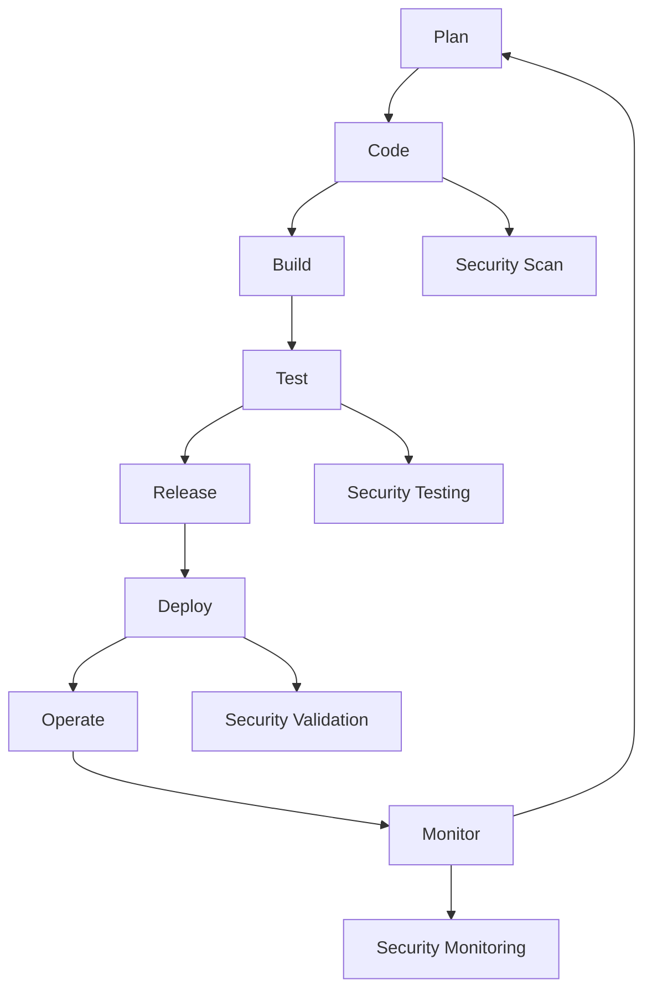

## 14.20 Continuous Security Integration in DevOps

In the rapidly evolving landscape of software development, security has become a paramount concern. As applications grow more complex and interconnected, the traditional approach of treating security as an afterthought is no longer viable. Enter DevSecOps—a cultural and technical shift that integrates security practices into every phase of the DevOps lifecycle. This approach ensures that security is a shared responsibility, enabling teams to deliver secure software faster and more efficiently.

### Understanding DevSecOps

**DevSecOps** is a philosophy that emphasizes the integration of security practices within the DevOps process. It aims to automate and embed security at every stage of the software development lifecycle (SDLC), from initial design through integration, testing, deployment, and maintenance. By shifting security "left" in the development process, DevSecOps helps identify and mitigate vulnerabilities early, reducing the risk of security breaches and the cost of remediation.

#### Key Principles of DevSecOps

1. **Security as Code**: Treat security policies and configurations as code, enabling version control, automated testing, and continuous integration.
2. **Automation**: Automate security checks and processes to ensure consistent and repeatable security practices.
3. **Collaboration**: Foster collaboration between development, operations, and security teams to break down silos and improve communication.
4. **Continuous Monitoring**: Implement continuous monitoring and feedback loops to detect and respond to security threats in real-time.
5. **Risk Management**: Prioritize security efforts based on risk assessments and threat modeling.

### Cultural and Technical Aspects of DevSecOps

Implementing DevSecOps requires both cultural and technical changes within an organization. Let's explore these aspects in detail.

#### Cultural Changes

1. **Shared Responsibility**: Security is everyone's responsibility, not just the security team's. Encourage a culture where developers, operations, and security professionals work together to identify and address security issues.
2. **Security Awareness**: Provide training and resources to help team members understand security best practices and the importance of secure coding.
3. **Collaboration and Communication**: Use tools and practices that facilitate communication and collaboration across teams, such as chat platforms, shared dashboards, and regular meetings.

#### Technical Changes

1. **Tool Integration**: Integrate security tools into the CI/CD pipeline to automate security checks and enforce policies.
2. **Infrastructure as Code (IaC)**: Use IaC tools like Terraform or AWS CloudFormation to manage infrastructure securely and consistently.
3. **Automated Testing**: Implement automated security testing, including static analysis, dynamic analysis, and penetration testing, as part of the CI/CD process.

### Strategies for Automating Security Checks and Policies

Automation is a cornerstone of DevSecOps, enabling teams to enforce security policies consistently and efficiently. Here are some strategies for automating security checks:

1. **Static Application Security Testing (SAST)**: Integrate SAST tools into the CI/CD pipeline to analyze source code for vulnerabilities before deployment.
2. **Dynamic Application Security Testing (DAST)**: Use DAST tools to test running applications for vulnerabilities, simulating real-world attacks.
3. **Software Composition Analysis (SCA)**: Automate the scanning of third-party libraries and dependencies for known vulnerabilities.
4. **Infrastructure Scanning**: Use tools like OpenSCAP or Nessus to scan infrastructure for security misconfigurations and vulnerabilities.
5. **Policy as Code**: Define security policies as code using tools like Open Policy Agent (OPA) to automate policy enforcement.

### Tools Supporting DevSecOps Practices

A variety of tools can help implement DevSecOps practices effectively. Here are some popular options:

1. **GitHub Actions**: Automate workflows, including security checks, directly in your GitHub repository.
2. **Jenkins**: Use Jenkins plugins to integrate security testing tools into your CI/CD pipeline.
3. **SonarQube**: Analyze code quality and security vulnerabilities with SonarQube's static analysis capabilities.
4. **OWASP ZAP**: Conduct dynamic security testing with OWASP ZAP, an open-source DAST tool.
5. **Snyk**: Identify and fix vulnerabilities in open-source dependencies with Snyk's SCA capabilities.
6. **HashiCorp Vault**: Manage secrets and sensitive data securely with HashiCorp Vault.

### Encouraging Collaboration Between Development, Operations, and Security Teams

Collaboration is essential for successful DevSecOps implementation. Here are some ways to encourage collaboration:

1. **Cross-Functional Teams**: Create cross-functional teams that include members from development, operations, and security to work on projects together.
2. **Shared Goals and Metrics**: Define shared goals and metrics that align with business objectives and encourage collaboration.
3. **Regular Security Reviews**: Conduct regular security reviews and threat modeling sessions with input from all teams.
4. **Feedback Loops**: Establish feedback loops to continuously improve security practices based on lessons learned and new threats.

### Measuring and Improving Security Posture Over Time

To ensure continuous improvement, it's important to measure and track your security posture. Here are some strategies:

1. **Security Metrics**: Define and track key security metrics, such as the number of vulnerabilities detected, time to remediate, and compliance with security policies.
2. **Security Audits**: Conduct regular security audits and assessments to identify gaps and areas for improvement.
3. **Continuous Improvement**: Use feedback from audits, metrics, and incident responses to continuously improve security practices and processes.
4. **Threat Intelligence**: Stay informed about emerging threats and vulnerabilities through threat intelligence feeds and security communities.

### Visualizing DevSecOps Workflow

To better understand how DevSecOps integrates into the development lifecycle, let's visualize a typical DevSecOps workflow using a flowchart.

**Figure 1**: DevSecOps Workflow - This flowchart illustrates the integration of security practices at each stage of the DevOps lifecycle, from planning to monitoring.

### Try It Yourself

To get hands-on experience with DevSecOps, try integrating a security tool into your CI/CD pipeline. For example, you can use GitHub Actions to automate security checks with a tool like OWASP ZAP. Experiment with different configurations and observe how security issues are detected and reported.

### Knowledge Check

- What is DevSecOps, and why is it important?
- How can automation improve security practices in DevOps?
- What are some tools that support DevSecOps practices?
- How can collaboration between teams enhance security?

### Summary

In this section, we've explored the concept of DevSecOps and its importance in modern web development. By integrating security practices into the DevOps lifecycle, organizations can deliver secure software faster and more efficiently. We've discussed cultural and technical aspects of DevSecOps, strategies for automating security checks, and tools that support these practices. Remember, security is a continuous journey, and by embracing DevSecOps, we can build a more secure and resilient software ecosystem.

### Embrace the Journey

Remember, this is just the beginning. As you progress, you'll build more secure and resilient applications. Keep experimenting, stay curious, and enjoy the journey!

## Test Your Knowledge on Continuous Security Integration in DevOps



### What is the primary goal of DevSecOps?

- [x] Integrating security practices into every phase of the DevOps lifecycle
- [ ] Isolating security practices from development and operations
- [ ] Eliminating the need for security teams
- [ ] Focusing solely on automation

> **Explanation:** DevSecOps aims to integrate security practices into every phase of the DevOps lifecycle, ensuring security is a shared responsibility.

### Which of the following is a key principle of DevSecOps?

- [x] Security as Code
- [ ] Security as an Afterthought
- [ ] Manual Security Checks
- [ ] Isolated Security Teams

> **Explanation:** Security as Code is a key principle of DevSecOps, emphasizing the treatment of security policies and configurations as code.

### What is the role of automation in DevSecOps?

- [x] To ensure consistent and repeatable security practices
- [ ] To replace security teams
- [ ] To eliminate the need for security policies
- [ ] To slow down the development process

> **Explanation:** Automation in DevSecOps ensures consistent and repeatable security practices, making security checks more efficient.

### Which tool is commonly used for static application security testing (SAST)?

- [x] SonarQube
- [ ] OWASP ZAP
- [ ] Snyk
- [ ] HashiCorp Vault

> **Explanation:** SonarQube is commonly used for static application security testing (SAST) to analyze code for vulnerabilities.

### How can collaboration between teams enhance security?

- [x] By breaking down silos and improving communication
- [ ] By isolating security responsibilities
- [ ] By reducing the number of security checks
- [ ] By eliminating the need for security policies

> **Explanation:** Collaboration between teams enhances security by breaking down silos and improving communication, leading to better security practices.

### What is the purpose of continuous monitoring in DevSecOps?

- [x] To detect and respond to security threats in real-time
- [ ] To slow down the deployment process
- [ ] To eliminate the need for security teams
- [ ] To focus solely on development

> **Explanation:** Continuous monitoring in DevSecOps aims to detect and respond to security threats in real-time, ensuring a proactive security posture.

### Which of the following tools is used for managing secrets and sensitive data?

- [x] HashiCorp Vault
- [ ] Jenkins
- [ ] OWASP ZAP
- [ ] GitHub Actions

> **Explanation:** HashiCorp Vault is used for managing secrets and sensitive data securely.

### What is the benefit of using Infrastructure as Code (IaC) in DevSecOps?

- [x] To manage infrastructure securely and consistently
- [ ] To eliminate the need for security policies
- [ ] To slow down the development process
- [ ] To isolate security responsibilities

> **Explanation:** Infrastructure as Code (IaC) helps manage infrastructure securely and consistently, aligning with DevSecOps practices.

### How can security metrics help improve security posture?

- [x] By tracking key security metrics and identifying areas for improvement
- [ ] By eliminating the need for security teams
- [ ] By reducing the number of security checks
- [ ] By focusing solely on automation

> **Explanation:** Security metrics help improve security posture by tracking key metrics and identifying areas for improvement.

### True or False: DevSecOps eliminates the need for security teams.

- [ ] True
- [x] False

> **Explanation:** False. DevSecOps does not eliminate the need for security teams; instead, it integrates security practices into the DevOps lifecycle, making security a shared responsibility.



