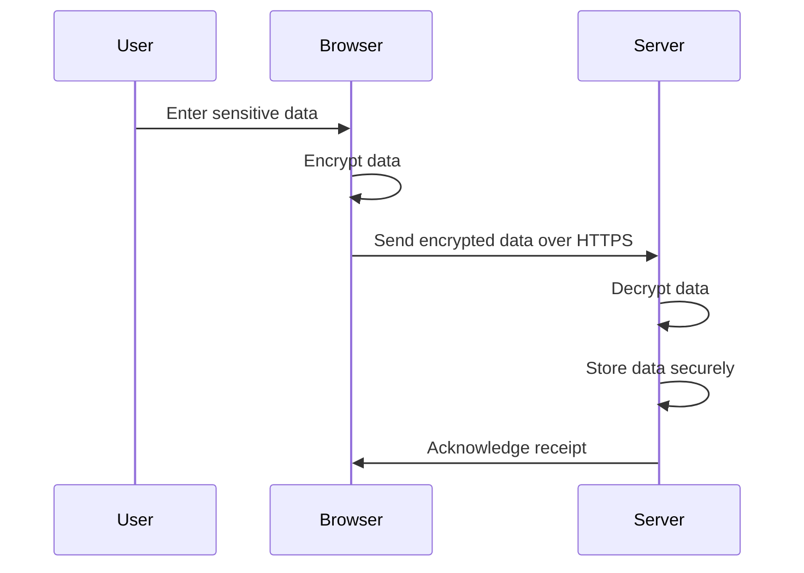

## 14.3 Handling Sensitive Data

In the digital age, handling sensitive data securely is paramount for any application, especially those built with JavaScript for the web. Sensitive data includes personally identifiable information (PII), credentials, financial information, and any other data that, if exposed, could lead to identity theft, financial loss, or reputational damage. This section will guide you through best practices for securely handling sensitive data, covering storage, transmission, and disposal, while ensuring compliance with regulations like GDPR and CCPA.

### Understanding Sensitive Data

Sensitive data refers to any information that must be protected from unauthorized access to safeguard the privacy or security of an individual or organization. Common examples include:

- **Personally Identifiable Information (PII):** Names, addresses, social security numbers, and other data that can identify an individual.
- **Credentials:** Usernames, passwords, API keys, and tokens.
- **Financial Information:** Credit card numbers, bank account details, and transaction histories.
- **Health Information:** Medical records and health insurance details.

### Secure Data Storage

Storing sensitive data securely is crucial to prevent unauthorized access and data breaches. Here are some strategies to ensure data is stored securely:

#### Encryption at Rest

Encryption at rest involves encrypting data stored on disk to protect it from unauthorized access. This ensures that even if the storage medium is compromised, the data remains unreadable without the decryption key.

- **Use Strong Encryption Algorithms:** Employ industry-standard encryption algorithms like AES-256 to encrypt sensitive data.
- **Key Management:** Securely manage encryption keys using hardware security modules (HSMs) or key management services (KMS) to prevent unauthorized access.

#### Secure Cookies and Storage Mechanisms

When storing sensitive data in cookies or local storage, ensure that these mechanisms are secure:

- **Secure Cookies:** Use the `Secure` and `HttpOnly` flags to prevent cookies from being accessed via JavaScript and to ensure they are only transmitted over HTTPS.
- **Local Storage:** Avoid storing sensitive data in local storage as it is accessible via JavaScript and lacks built-in security features. Consider using secure storage solutions like IndexedDB with encryption.

### Secure Data Transmission

Transmitting sensitive data securely is essential to prevent interception and unauthorized access during data exchange.

#### Use of HTTPS and TLS

HTTPS, which uses TLS (Transport Layer Security), encrypts data transmitted between the client and server, ensuring confidentiality and integrity.

- **Always Use HTTPS:** Ensure all data exchanges occur over HTTPS to protect against eavesdropping and man-in-the-middle attacks.
- **TLS Configuration:** Regularly update and configure TLS settings to use strong ciphers and protocols, and disable outdated versions like TLS 1.0 and 1.1.

#### Avoiding Exposure in URLs and Logs

Sensitive data should never be exposed in URLs or logs, as these can be easily accessed by unauthorized parties.

- **Avoid Query Parameters:** Do not include sensitive data in URL query parameters, as these can be logged or cached by browsers and servers.
- **Sanitize Logs:** Ensure logs do not contain sensitive information. Use logging libraries that support log redaction or masking.

### Proper Data Disposal

Properly disposing of sensitive data is crucial to prevent unauthorized recovery and misuse.

- **Data Deletion:** Implement secure deletion methods to ensure data is irrecoverable. This may involve overwriting data multiple times or using secure deletion tools.
- **Data Retention Policies:** Establish and enforce data retention policies to ensure data is only kept for as long as necessary and securely deleted thereafter.

### Compliance Requirements

Compliance with data protection regulations is essential for legal and ethical handling of sensitive data. Key regulations include:

- **GDPR (General Data Protection Regulation):** A European Union regulation that mandates strict data protection and privacy requirements for handling personal data.
- **CCPA (California Consumer Privacy Act):** A California state law that provides consumers with rights over their personal data, including the right to know, delete, and opt-out of data sales.

Ensure your application complies with these regulations by implementing necessary data protection measures and maintaining transparency with users about data handling practices.

### Code Example: Secure Data Handling in JavaScript

Below is a simple example demonstrating secure data handling practices in a JavaScript application:

```javascript
// Example: Securely storing and transmitting sensitive data

// Encrypt sensitive data before storing
const crypto = require('crypto');

function encryptData(data, key) {
  const cipher = crypto.createCipher('aes-256-cbc', key);
  let encrypted = cipher.update(data, 'utf8', 'hex');
  encrypted += cipher.final('hex');
  return encrypted;
}

function decryptData(encryptedData, key) {
  const decipher = crypto.createDecipher('aes-256-cbc', key);
  let decrypted = decipher.update(encryptedData, 'hex', 'utf8');
  decrypted += decipher.final('utf8');
  return decrypted;
}

// Example usage
const sensitiveData = 'user_password';
const encryptionKey = 'a_secure_key';
const encryptedData = encryptData(sensitiveData, encryptionKey);

console.log('Encrypted Data:', encryptedData);

// Transmit data securely using HTTPS
const https = require('https');

const options = {
  hostname: 'secure.example.com',
  port: 443,
  path: '/api/data',
  method: 'POST',
  headers: {
    'Content-Type': 'application/json',
    'Authorization': 'Bearer your_token_here'
  }
};

const req = https.request(options, (res) => {
  console.log(`Status Code: ${res.statusCode}`);
  res.on('data', (d) => {
    process.stdout.write(d);
  });
});

req.on('error', (e) => {
  console.error(e);
});

// Send encrypted data
req.write(JSON.stringify({ data: encryptedData }));
req.end();
```

### Visualizing Secure Data Handling

Below is a diagram illustrating the secure data handling process, from encryption to transmission:



### Knowledge Check

- **What is sensitive data, and why is it important to protect it?**
- **How can encryption at rest protect stored data?**
- **What are the benefits of using HTTPS for data transmission?**
- **Why should sensitive data not be included in URLs?**
- **What are some key compliance requirements for handling sensitive data?**

### Practice Problems

1. **Implement a function to securely delete sensitive data from local storage.**
2. **Configure a Node.js server to enforce HTTPS and use strong TLS settings.**
3. **Create a policy for logging sensitive data in your application.**

### Summary

Handling sensitive data securely is a critical aspect of modern web development. By implementing encryption, using secure transmission protocols, and adhering to compliance requirements, we can protect user data and maintain trust. Remember, this is just the beginning. As you progress, you'll build more secure and robust applications. Keep experimenting, stay curious, and enjoy the journey!

## Quiz: Secure Data Handling in JavaScript



### What is considered sensitive data?

- [x] Personally identifiable information (PII)
- [x] Credentials and passwords
- [x] Financial information
- [ ] Publicly available data

> **Explanation:** Sensitive data includes PII, credentials, and financial information, which require protection from unauthorized access.

### What is the purpose of encryption at rest?

- [x] To protect stored data from unauthorized access
- [ ] To speed up data retrieval
- [ ] To compress data for storage
- [ ] To format data for display

> **Explanation:** Encryption at rest ensures that stored data is unreadable without the decryption key, protecting it from unauthorized access.

### Why is HTTPS important for data transmission?

- [x] It encrypts data to prevent eavesdropping
- [ ] It speeds up data transfer
- [ ] It formats data for display
- [ ] It compresses data for transmission

> **Explanation:** HTTPS encrypts data transmitted between the client and server, ensuring confidentiality and integrity.

### What should be avoided in URLs?

- [x] Sensitive data
- [ ] Resource identifiers
- [ ] Query parameters
- [ ] Path variables

> **Explanation:** Sensitive data should not be included in URLs, as they can be logged or cached by browsers and servers.

### What is GDPR?

- [x] A European Union regulation for data protection
- [ ] A US federal law for data privacy
- [ ] A software development methodology
- [ ] A data encryption algorithm

> **Explanation:** GDPR is a European Union regulation that mandates strict data protection and privacy requirements.

### How can you securely manage encryption keys?

- [x] Using hardware security modules (HSMs)
- [x] Using key management services (KMS)
- [ ] Storing them in plain text files
- [ ] Sharing them via email

> **Explanation:** Secure key management involves using HSMs or KMS to prevent unauthorized access to encryption keys.

### What is the `Secure` flag in cookies used for?

- [x] To ensure cookies are only transmitted over HTTPS
- [ ] To encrypt cookie data
- [ ] To compress cookie data
- [ ] To format cookie data for display

> **Explanation:** The `Secure` flag ensures cookies are only transmitted over HTTPS, protecting them from interception.

### What is a key consideration for data disposal?

- [x] Ensuring data is irrecoverable
- [ ] Compressing data for storage
- [ ] Formatting data for display
- [ ] Encrypting data for transmission

> **Explanation:** Proper data disposal involves ensuring data is irrecoverable to prevent unauthorized recovery and misuse.

### What is CCPA?

- [x] A California state law for data privacy
- [ ] A European Union regulation for data protection
- [ ] A software development methodology
- [ ] A data encryption algorithm

> **Explanation:** CCPA is a California state law that provides consumers with rights over their personal data.

### True or False: Local storage is a secure place to store sensitive data.

- [ ] True
- [x] False

> **Explanation:** Local storage is accessible via JavaScript and lacks built-in security features, making it unsuitable for storing sensitive data.


