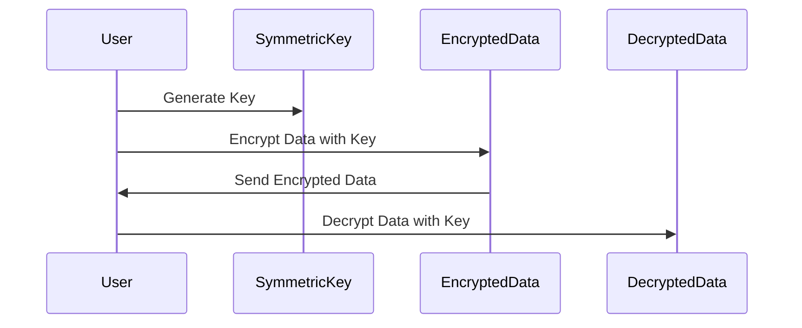
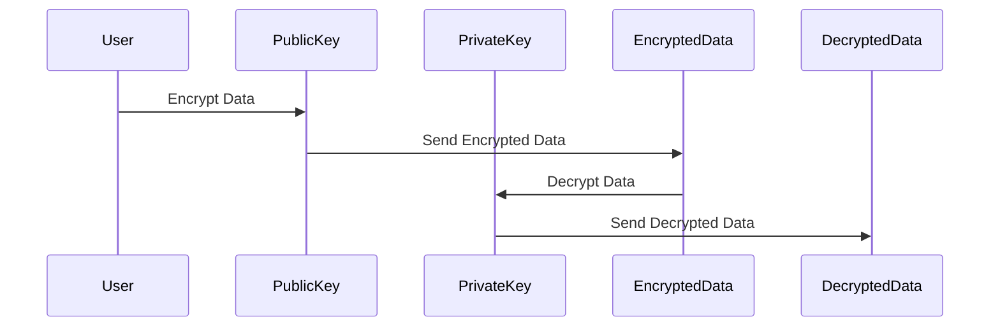

## 14.4 Data Encryption and Cryptography Libraries

In the digital age, securing data is paramount. Cryptography provides the tools and techniques to protect information from unauthorized access and tampering. This section delves into the fundamentals of cryptography, explores popular JavaScript libraries, and demonstrates how to implement secure data encryption and decryption in your applications.

### Understanding Cryptography

Cryptography is the science of securing information by transforming it into an unreadable format, only to be deciphered by those possessing the correct key. Let's explore the core concepts:

#### Symmetric vs. Asymmetric Encryption

**Symmetric Encryption**: This involves a single key for both encryption and decryption. It's fast and efficient for large data volumes but requires secure key distribution.

- **Example Algorithms**: AES (Advanced Encryption Standard), DES (Data Encryption Standard).

**Asymmetric Encryption**: Utilizes a pair of keys—public and private. The public key encrypts data, while the private key decrypts it. This method is slower but eliminates the need for key distribution.

- **Example Algorithms**: RSA (Rivest-Shamir-Adleman), ECC (Elliptic Curve Cryptography).

#### Hashing Functions

Hashing transforms data into a fixed-size string of characters, which is typically a hash code. It's a one-way function, meaning you can't reverse it to retrieve the original data. Hashing is crucial for data integrity and password storage.

- **Example Algorithms**: SHA-256 (Secure Hash Algorithm), MD5 (Message-Digest Algorithm).

#### Digital Signatures

Digital signatures verify the authenticity and integrity of a message or document. They use asymmetric encryption to create a unique signature that can be verified with the sender's public key.

### JavaScript Cryptography Libraries

JavaScript offers several libraries to implement cryptographic functions. Let's explore some of the most popular ones:

#### Node.js `crypto` Module

The `crypto` module in Node.js provides cryptographic functionality that includes a set of wrappers for OpenSSL's hash, HMAC, cipher, decipher, sign, and verify functions.

**Example: Symmetric Encryption with AES**

```javascript
const crypto = require('crypto');

// Key and IV generation
const algorithm = 'aes-256-cbc';
const key = crypto.randomBytes(32);
const iv = crypto.randomBytes(16);

// Encrypting data
function encrypt(text) {
    const cipher = crypto.createCipheriv(algorithm, Buffer.from(key), iv);
    let encrypted = cipher.update(text);
    encrypted = Buffer.concat([encrypted, cipher.final()]);
    return { iv: iv.toString('hex'), encryptedData: encrypted.toString('hex') };
}

// Decrypting data
function decrypt(text) {
    const iv = Buffer.from(text.iv, 'hex');
    const encryptedText = Buffer.from(text.encryptedData, 'hex');
    const decipher = crypto.createDecipheriv(algorithm, Buffer.from(key), iv);
    let decrypted = decipher.update(encryptedText);
    decrypted = Buffer.concat([decrypted, decipher.final()]);
    return decrypted.toString();
}

const data = "Sensitive data";
const encrypted = encrypt(data);
console.log("Encrypted:", encrypted);
console.log("Decrypted:", decrypt(encrypted));
```

#### Web Crypto API (`crypto.subtle`)

The Web Crypto API provides a standard interface for performing cryptographic operations in web applications. It supports both symmetric and asymmetric encryption.

**Example: Hashing with SHA-256**

```javascript
async function hashData(data) {
    const encoder = new TextEncoder();
    const dataBuffer = encoder.encode(data);
    const hashBuffer = await crypto.subtle.digest('SHA-256', dataBuffer);
    const hashArray = Array.from(new Uint8Array(hashBuffer));
    const hashHex = hashArray.map(b => b.toString(16).padStart(2, '0')).join('');
    return hashHex;
}

hashData("Sensitive data").then(hash => console.log("SHA-256 Hash:", hash));
```

#### `bcrypt` for Password Hashing

`bcrypt` is a popular library for hashing passwords. It incorporates a salt to protect against rainbow table attacks and allows you to adjust the computational cost.

**Example: Hashing and Verifying Passwords**

```javascript
const bcrypt = require('bcrypt');
const saltRounds = 10;
const password = 'supersecretpassword';

// Hashing a password
bcrypt.hash(password, saltRounds, function(err, hash) {
    if (err) throw err;
    console.log("Hashed Password:", hash);

    // Verifying a password
    bcrypt.compare(password, hash, function(err, result) {
        if (err) throw err;
        console.log("Password Match:", result);
    });
});
```

#### `jsrsasign` for Digital Signatures

`jsrsasign` is a comprehensive library for handling digital signatures, RSA, and X.509 certificates in JavaScript.

**Example: Creating and Verifying Digital Signatures**

```javascript
const jsrsasign = require('jsrsasign');

// Generate RSA key pair
const rsaKeypair = jsrsasign.KEYUTIL.generateKeypair('RSA', 1024);
const privateKey = rsaKeypair.prvKeyObj;
const publicKey = rsaKeypair.pubKeyObj;

// Sign data
const data = "Important message";
const signature = new jsrsasign.KJUR.crypto.Signature({alg: "SHA256withRSA"});
signature.init(privateKey);
signature.updateString(data);
const sigValueHex = signature.sign();
console.log("Signature:", sigValueHex);

// Verify signature
const isValid = new jsrsasign.KJUR.crypto.Signature({alg: "SHA256withRSA"});
isValid.init(publicKey);
isValid.updateString(data);
const isValidSignature = isValid.verify(sigValueHex);
console.log("Signature Valid:", isValidSignature);
```

### Best Practices for Cryptography in JavaScript

1. **Use Well-Established Algorithms**: Always opt for widely accepted algorithms like AES for encryption and SHA-256 for hashing.

2. **Proper Key Management**: Securely store and manage cryptographic keys. Avoid hardcoding keys in your source code.

3. **Regularly Update Libraries**: Keep cryptographic libraries up to date to protect against vulnerabilities.

4. **Use Salts for Hashing**: Incorporate salts when hashing passwords to prevent rainbow table attacks.

5. **Test for Security**: Regularly test your cryptographic implementations for security flaws.

### Visualizing Cryptographic Processes

To better understand the flow of cryptographic processes, let's visualize symmetric and asymmetric encryption.



**Figure 1**: Symmetric Encryption Process



**Figure 2**: Asymmetric Encryption Process

### Knowledge Check

- What is the difference between symmetric and asymmetric encryption?
- Why is hashing considered a one-way function?
- How does a digital signature verify the authenticity of a message?

### Exercises

1. Modify the AES encryption example to use a different algorithm, such as DES. Test the encryption and decryption process.
2. Implement a password hashing and verification system using `bcrypt` in a simple Node.js application.
3. Create a digital signature for a JSON object using `jsrsasign` and verify its authenticity.

### Conclusion

Cryptography is a cornerstone of modern web security. By understanding and implementing cryptographic techniques, you can protect sensitive data and ensure the integrity and authenticity of your applications. Remember, this is just the beginning. As you progress, you'll build more secure and robust applications. Keep experimenting, stay curious, and enjoy the journey!

## Quiz: Mastering Cryptography in JavaScript



### What is the primary difference between symmetric and asymmetric encryption?

- [x] Symmetric encryption uses one key for both encryption and decryption, while asymmetric encryption uses a pair of keys.
- [ ] Symmetric encryption is slower than asymmetric encryption.
- [ ] Asymmetric encryption uses one key for both encryption and decryption, while symmetric encryption uses a pair of keys.
- [ ] Symmetric encryption is more secure than asymmetric encryption.

> **Explanation:** Symmetric encryption uses a single key for both encryption and decryption, whereas asymmetric encryption uses a pair of keys (public and private).

### Which JavaScript library is commonly used for password hashing?

- [ ] jsrsasign
- [x] bcrypt
- [ ] crypto.subtle
- [ ] Web Crypto API

> **Explanation:** `bcrypt` is widely used for password hashing due to its ability to incorporate a salt and adjust computational cost.

### What is a digital signature used for?

- [x] Verifying the authenticity and integrity of a message.
- [ ] Encrypting data for secure transmission.
- [ ] Hashing passwords securely.
- [ ] Generating random keys for encryption.

> **Explanation:** Digital signatures verify the authenticity and integrity of a message or document using asymmetric encryption.

### Which algorithm is considered a one-way function?

- [ ] AES
- [ ] RSA
- [x] SHA-256
- [ ] ECC

> **Explanation:** SHA-256 is a hashing algorithm, which is a one-way function that cannot be reversed to retrieve the original data.

### What is the purpose of using a salt in password hashing?

- [x] To prevent rainbow table attacks.
- [ ] To speed up the hashing process.
- [ ] To make the password easier to remember.
- [ ] To encrypt the password.

> **Explanation:** A salt is used in password hashing to prevent rainbow table attacks by adding randomness to the hash.

### Which Node.js module provides cryptographic functionality?

- [x] crypto
- [ ] bcrypt
- [ ] jsrsasign
- [ ] Web Crypto API

> **Explanation:** The `crypto` module in Node.js provides cryptographic functionality, including encryption, decryption, and hashing.

### What is the role of the private key in asymmetric encryption?

- [x] Decrypting data encrypted with the public key.
- [ ] Encrypting data for secure transmission.
- [ ] Hashing data for integrity.
- [ ] Generating random keys.

> **Explanation:** In asymmetric encryption, the private key is used to decrypt data that has been encrypted with the corresponding public key.

### Which API is used for cryptographic operations in web browsers?

- [ ] bcrypt
- [ ] jsrsasign
- [ ] crypto module
- [x] Web Crypto API

> **Explanation:** The Web Crypto API provides a standard interface for performing cryptographic operations in web browsers.

### What is the main advantage of asymmetric encryption over symmetric encryption?

- [x] Eliminates the need for secure key distribution.
- [ ] Faster encryption and decryption process.
- [ ] Uses a single key for both encryption and decryption.
- [ ] More secure than symmetric encryption.

> **Explanation:** Asymmetric encryption eliminates the need for secure key distribution by using a pair of keys (public and private).

### True or False: Hashing is a reversible process.

- [ ] True
- [x] False

> **Explanation:** Hashing is a one-way process, meaning it cannot be reversed to retrieve the original data.


