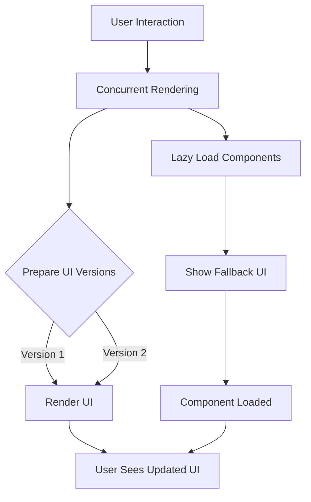

## 14.4 Suspense and Concurrent Rendering (React)

In the ever-evolving landscape of web development, React continues to push the boundaries of performance and user experience. Two pivotal features that contribute significantly to this are **Suspense** and **Concurrent Rendering**. These features allow developers to build applications that are not only performant but also provide a seamless user experience. This article delves into these concepts, providing a comprehensive guide on their implementation, use cases, and best practices.

### Understanding the Concepts

#### Suspense

**Suspense** is a React feature that allows components to "wait" for some asynchronous operation to complete before rendering. This is particularly useful for handling lazy-loaded components or data fetching, where you might want to show a loading indicator until the operation is complete.

#### Concurrent Rendering

**Concurrent Rendering** enables React to prepare multiple versions of the UI simultaneously, improving responsiveness and making the application feel faster. This is achieved by allowing React to work on rendering tasks in the background, without blocking the main thread.

### Implementation Steps

#### Use React.lazy and Suspense

One of the primary use cases for Suspense is lazy loading components. This involves dynamically importing components and wrapping them with `React.Suspense` to provide a fallback UI while the component is loading.

```jsx
import React, { Suspense } from 'react';

const LazyComponent = React.lazy(() => import('./LazyComponent'));

const App = () => (
  <Suspense fallback={<div>Loading...</div>}>
    <LazyComponent />
  </Suspense>
);

export default App;
```

#### Implement Data Fetching with Suspense

For data fetching, libraries like React Query or Relay can be used to leverage Suspense. These libraries manage data fetching and caching, allowing components to suspend rendering until data is available.

```jsx
import React, { Suspense } from 'react';
import { useQuery } from 'react-query';

const fetchData = async () => {
  const response = await fetch('/api/data');
  return response.json();
};

const DataComponent = () => {
  const { data } = useQuery('dataKey', fetchData, { suspense: true });

  return <div>{data}</div>;
};

const App = () => (
  <Suspense fallback={<div>Loading data...</div>}>
    <DataComponent />
  </Suspense>
);

export default App;
```

#### Utilize Concurrent Features

Concurrent features like `useTransition` and `useDeferredValue` help manage state transitions and defer updates to non-critical parts of the UI, respectively.

**Using `useTransition`:**

```jsx
import React, { useState, useTransition } from 'react';

const App = () => {
  const [isPending, startTransition] = useTransition();
  const [state, setState] = useState(initialState);

  const handleClick = () => {
    startTransition(() => {
      setState(newState);
    });
  };

  return (
    <div>
      <button onClick={handleClick}>Update State</button>
      {isPending ? <div>Updating...</div> : <div>{state}</div>}
    </div>
  );
};

export default App;
```

**Using `useDeferredValue`:**

```jsx
import React, { useState, useDeferredValue } from 'react';

const App = () => {
  const [input, setInput] = useState('');
  const deferredInput = useDeferredValue(input);

  return (
    <div>
      <input value={input} onChange={(e) => setInput(e.target.value)} />
      <ExpensiveComponent input={deferredInput} />
    </div>
  );
};

const ExpensiveComponent = ({ input }) => {
  // Simulate an expensive computation
  return <div>{input}</div>;
};

export default App;
```

### Use Cases

- **Improving Perceived Performance:** By showing fallback content while components or data are loading, Suspense can enhance the perceived performance of an application.
- **Preventing Unnecessary Loading:** Lazy loading components ensures that only the necessary parts of the application are loaded, reducing initial load times.

### Practice

- **Route-Based Code Splitting:** Implementing route-based code splitting in a React app can significantly reduce the bundle size and improve load times.
- **Suspense for Data Loading:** Use Suspense to manage data loading in components, providing a better user experience by displaying loading indicators.

### Considerations

- **Error Handling:** Ensure proper error handling when using Suspense, as errors in asynchronous operations can lead to unhandled rejections.
- **Experimental Features:** Some Suspense and Concurrent Rendering features are experimental and may require the latest React versions. Always check the compatibility before using them in production.

### Visual Aids

Below is a conceptual diagram illustrating how Suspense and Concurrent Rendering work together to improve application performance:



### Conclusion

React's Suspense and Concurrent Rendering are powerful tools for enhancing the performance and responsiveness of web applications. By understanding and implementing these features, developers can create applications that are not only efficient but also provide a superior user experience. As these features continue to evolve, staying updated with the latest React developments will ensure you can leverage them to their fullest potential.

## Quiz Time!



### What is the primary purpose of React's Suspense feature?

- [x] To allow components to "wait" for something before rendering
- [ ] To improve server-side rendering
- [ ] To handle state management
- [ ] To optimize CSS loading

> **Explanation:** Suspense allows components to wait for asynchronous operations, such as data fetching or lazy loading, before rendering.

### How does Concurrent Rendering improve application performance?

- [x] By preparing multiple versions of the UI simultaneously
- [ ] By reducing the size of JavaScript bundles
- [ ] By optimizing CSS animations
- [ ] By improving server-side rendering

> **Explanation:** Concurrent Rendering allows React to prepare multiple UI versions at the same time, enhancing responsiveness and performance.

### Which hook is used to manage state transitions without blocking the UI?

- [x] useTransition
- [ ] useState
- [ ] useEffect
- [ ] useReducer

> **Explanation:** The `useTransition` hook is used to manage state transitions in a way that doesn't block the UI.

### What is the role of `useDeferredValue` in React?

- [x] To defer updates to non-critical parts of the UI
- [ ] To manage global state
- [ ] To handle side effects
- [ ] To optimize CSS loading

> **Explanation:** `useDeferredValue` is used to defer updates to parts of the UI that are not critical, improving performance.

### Which library supports Suspense for data fetching?

- [x] React Query
- [ ] Redux
- [x] Relay
- [ ] Axios

> **Explanation:** Both React Query and Relay support Suspense for data fetching, allowing components to suspend rendering until data is available.

### What should you consider when using Suspense in production?

- [x] Ensure proper error handling
- [ ] Optimize CSS animations
- [ ] Use server-side rendering
- [ ] Minimize JavaScript bundle size

> **Explanation:** Proper error handling is crucial when using Suspense, as errors in asynchronous operations can lead to unhandled rejections.

### Which of the following is a use case for lazy loading components?

- [x] Reducing initial load times
- [ ] Improving CSS animations
- [x] Preventing unnecessary loading
- [ ] Enhancing server-side rendering

> **Explanation:** Lazy loading components can reduce initial load times and prevent unnecessary loading, improving application performance.

### What is a fallback UI in the context of Suspense?

- [x] A UI displayed while waiting for a component to load
- [ ] A backup server-side rendered page
- [ ] A CSS animation
- [ ] A JavaScript error handler

> **Explanation:** A fallback UI is displayed while waiting for a component to load, providing feedback to the user.

### Which React feature allows for preparing multiple UI versions simultaneously?

- [x] Concurrent Rendering
- [ ] Server-Side Rendering
- [ ] Lazy Loading
- [ ] CSS Optimization

> **Explanation:** Concurrent Rendering allows React to prepare multiple UI versions simultaneously, enhancing performance.

### True or False: Some Suspense features are experimental and may require the latest React versions.

- [x] True
- [ ] False

> **Explanation:** Some features of Suspense are experimental and may require the latest React versions, so it's important to check compatibility.


