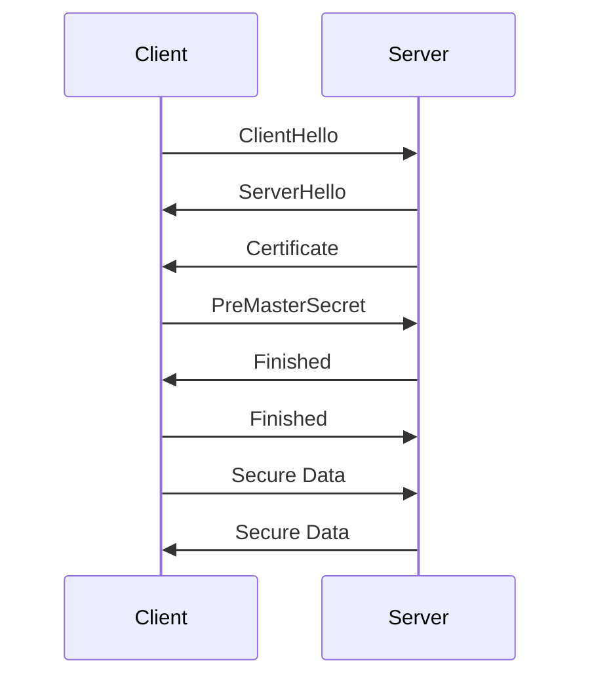

## 14.5 Secure Communication with HTTPS and SSL/TLS

In the digital age, securing communication over the internet is paramount. As developers, we must ensure that the data transmitted between clients and servers is protected from eavesdropping and tampering. This is where HTTPS and SSL/TLS come into play. In this section, we will explore how these protocols provide secure communication, how to set them up in web applications, and best practices for their configuration.

### Understanding HTTPS and SSL/TLS

**HTTPS** (Hypertext Transfer Protocol Secure) is the secure version of HTTP, the protocol over which data is sent between your browser and the website you are connected to. The 'S' at the end of HTTPS stands for 'Secure'. It means all communications between your browser and the website are encrypted.

**SSL** (Secure Sockets Layer) and **TLS** (Transport Layer Security) are cryptographic protocols designed to provide secure communication over a computer network. TLS is the successor to SSL and is more secure. When we refer to SSL/TLS, we are generally talking about the TLS protocol, as SSL is now considered obsolete.

#### How HTTPS and SSL/TLS Provide Secure Communication

1. **Encryption**: SSL/TLS encrypts the data being transmitted, ensuring that even if the data is intercepted, it cannot be read by unauthorized parties.

2. **Data Integrity**: SSL/TLS ensures that the data has not been altered during transmission. This is achieved through message authentication codes (MACs).

3. **Authentication**: SSL/TLS uses certificates to authenticate the identity of the parties involved in the communication, ensuring that you are communicating with the intended server.

4. **Forward Secrecy**: This ensures that session keys are not compromised even if the server's private key is compromised in the future.

### Setting Up HTTPS in Web Applications

To set up HTTPS for your web application, you need to obtain an SSL/TLS certificate from a trusted Certificate Authority (CA). Here’s a step-by-step guide:

1. **Choose a Certificate Authority (CA)**: There are many CAs available, such as Let's Encrypt, DigiCert, and Comodo. Let's Encrypt offers free SSL/TLS certificates.

2. **Generate a Certificate Signing Request (CSR)**: This is a block of encoded text that you send to the CA to apply for an SSL certificate. It contains your public key and your domain information.

3. **Submit the CSR to the CA**: The CA will verify your information and issue the SSL certificate.

4. **Install the SSL Certificate on Your Server**: This process varies depending on your server software (e.g., Apache, Nginx, IIS).

5. **Configure Your Web Server to Use HTTPS**: Update your server configuration to use the SSL certificate and redirect HTTP traffic to HTTPS.

#### Example: Configuring HTTPS on an Nginx Server

```nginx
server {
    listen 80;
    server_name example.com www.example.com;
    return 301 https://$server_name$request_uri;
}

server {
    listen 443 ssl;
    server_name example.com www.example.com;

    ssl_certificate /etc/ssl/certs/example.com.crt;
    ssl_certificate_key /etc/ssl/private/example.com.key;

    ssl_protocols TLSv1.2 TLSv1.3;
    ssl_ciphers 'ECDHE-ECDSA-AES256-GCM-SHA384:ECDHE-RSA-AES256-GCM-SHA384';
    ssl_prefer_server_ciphers on;

    location / {
        root /var/www/html;
        index index.html index.htm;
    }
}
```

### Guidelines for Configuring SSL/TLS Certificates

1. **Use Strong Cipher Suites**: Ensure that your server is configured to use strong cipher suites. Avoid using outdated protocols like SSLv3 and weak ciphers.

2. **Enable HTTP Strict Transport Security (HSTS)**: HSTS is a web security policy mechanism that helps to protect websites against man-in-the-middle attacks such as protocol downgrade attacks and cookie hijacking. It allows web servers to declare that web browsers should only interact with it using secure HTTPS connections.

3. **Regularly Update Your Certificates**: SSL/TLS certificates have an expiration date. Ensure that you renew them before they expire to maintain secure communication.

4. **Use Certificate Pinning**: This involves associating a host with their expected X.509 certificate or public key. This can help prevent man-in-the-middle attacks.

### Best Practices for Secure Communication

#### Using Strong Cipher Suites

Cipher suites are a combination of encryption algorithms used to secure network connections. Using strong cipher suites is crucial for maintaining the security of your communications. Here are some recommendations:

- **Use AES (Advanced Encryption Standard)**: AES is a symmetric encryption algorithm widely used across the globe.
- **Prefer ECDHE (Elliptic Curve Diffie-Hellman Ephemeral)**: ECDHE provides forward secrecy, which is a desirable property for secure communications.
- **Disable Weak Ciphers**: Ensure that your server is not using weak ciphers like RC4 or DES.

#### Enforcing HTTPS with HSTS

HSTS is a policy mechanism that helps to protect websites against man-in-the-middle attacks. It allows web servers to declare that web browsers should only interact with it using secure HTTPS connections. Here’s how to set it up:

```nginx
add_header Strict-Transport-Security "max-age=31536000; includeSubDomains" always;
```

This directive tells the browser to only use HTTPS for the next year (31,536,000 seconds) and to apply this rule to all subdomains.

#### Tools for Testing Certificate Configurations and Security

To ensure your SSL/TLS configuration is secure, you can use tools like [SSL Labs](https://www.ssllabs.com/ssltest/). This tool provides a detailed analysis of your SSL configuration, highlighting any potential vulnerabilities or misconfigurations.

### Handling Certificate Errors and Revocation

Certificate errors can occur for various reasons, such as an expired certificate, a mismatch between the certificate and the domain, or a revoked certificate. Here’s how to handle these issues:

1. **Monitor Certificate Expiry**: Regularly check the expiration date of your certificates and renew them before they expire.

2. **Check for Domain Mismatches**: Ensure that the domain name in the certificate matches the domain of your website.

3. **Handle Revoked Certificates**: If a certificate is revoked, obtain a new one from your CA. Use Online Certificate Status Protocol (OCSP) or Certificate Revocation Lists (CRLs) to check the revocation status of certificates.

### Try It Yourself

To deepen your understanding, try setting up HTTPS on a local server using a self-signed certificate. Experiment with different cipher suites and observe how they affect the security of your connection. Use tools like SSL Labs to test your configuration and identify areas for improvement.

### Visualizing the HTTPS and SSL/TLS Process

To better understand how HTTPS and SSL/TLS work together to secure communication, let's visualize the process using a sequence diagram.



**Diagram Description**: This sequence diagram illustrates the SSL/TLS handshake process. The client initiates the handshake with a `ClientHello` message, and the server responds with a `ServerHello` and its certificate. The client then sends a `PreMasterSecret`, which is used to generate session keys. Finally, both parties exchange `Finished` messages, and secure data transmission begins.

### Key Takeaways

- HTTPS and SSL/TLS are essential for securing communication over the internet.
- Setting up HTTPS involves obtaining and configuring an SSL/TLS certificate.
- Use strong cipher suites and enable HSTS to enhance security.
- Regularly test your SSL/TLS configuration using tools like SSL Labs.
- Handle certificate errors promptly to maintain secure communication.

### Embrace the Journey

Securing your web applications with HTTPS and SSL/TLS is a crucial step in protecting user data and maintaining trust. As you implement these protocols, remember that security is an ongoing process. Stay informed about the latest best practices and vulnerabilities, and continuously improve your security posture. Keep experimenting, stay curious, and enjoy the journey!

## Quiz: Mastering Secure Communication with HTTPS and SSL/TLS



### What does HTTPS stand for?

- [x] Hypertext Transfer Protocol Secure
- [ ] Hypertext Transfer Protocol Standard
- [ ] Hypertext Transfer Protocol Service
- [ ] Hypertext Transfer Protocol Simple

> **Explanation:** HTTPS stands for Hypertext Transfer Protocol Secure, which is the secure version of HTTP.

### Which protocol is the successor to SSL?

- [ ] SSH
- [ ] HTTP
- [x] TLS
- [ ] FTP

> **Explanation:** TLS (Transport Layer Security) is the successor to SSL (Secure Sockets Layer).

### What is the purpose of SSL/TLS encryption?

- [ ] To increase website speed
- [x] To protect data in transit
- [ ] To reduce server load
- [ ] To improve SEO rankings

> **Explanation:** SSL/TLS encryption is used to protect data in transit by encrypting the communication between the client and server.

### What is HSTS used for?

- [ ] To cache web pages
- [ ] To compress data
- [x] To enforce HTTPS connections
- [ ] To manage cookies

> **Explanation:** HSTS (HTTP Strict Transport Security) is used to enforce HTTPS connections, preventing protocol downgrade attacks.

### Which tool can be used to test SSL/TLS configurations?

- [ ] Google Analytics
- [ ] PageSpeed Insights
- [x] SSL Labs
- [ ] WebPageTest

> **Explanation:** SSL Labs is a tool that provides a detailed analysis of SSL/TLS configurations.

### What is a Certificate Authority (CA)?

- [x] An entity that issues digital certificates
- [ ] A server that hosts websites
- [ ] A protocol for secure communication
- [ ] A type of encryption algorithm

> **Explanation:** A Certificate Authority (CA) is an entity that issues digital certificates used to authenticate the identity of websites.

### What is forward secrecy?

- [ ] A method to speed up encryption
- [x] A property that ensures session keys are not compromised
- [ ] A technique to compress data
- [ ] A protocol for secure communication

> **Explanation:** Forward secrecy ensures that session keys are not compromised even if the server's private key is compromised in the future.

### What is the purpose of a Certificate Signing Request (CSR)?

- [ ] To encrypt data
- [ ] To compress data
- [x] To apply for an SSL certificate
- [ ] To manage cookies

> **Explanation:** A Certificate Signing Request (CSR) is used to apply for an SSL certificate from a Certificate Authority.

### What is certificate pinning?

- [ ] A method to speed up encryption
- [x] Associating a host with their expected certificate
- [ ] A technique to compress data
- [ ] A protocol for secure communication

> **Explanation:** Certificate pinning involves associating a host with their expected certificate to prevent man-in-the-middle attacks.

### True or False: SSL is more secure than TLS.

- [ ] True
- [x] False

> **Explanation:** False. TLS is more secure than SSL and is the successor to SSL.


